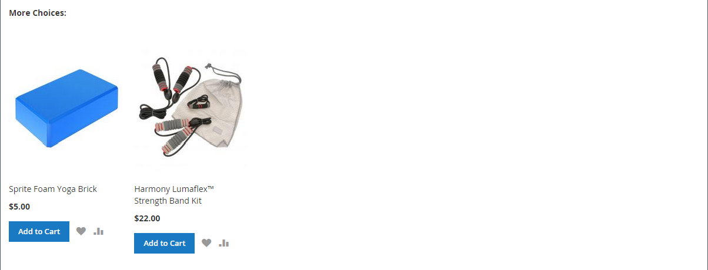
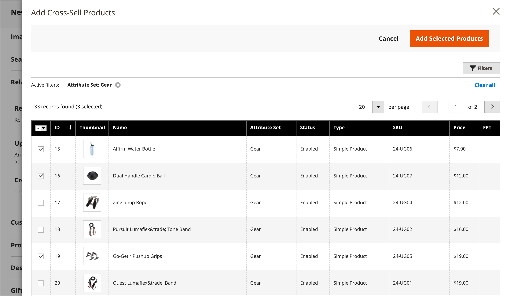

# Configuración del producto - [!UICONTROL Related Products, Up-Sells, and Cross-Sells]

Utilice la sección _[!UICONTROL Related Products, Up-Sells, and Cross-Sells]_&#x200B;para configurar bloques promocionales simples que presenten una selección de productos adicionales que puedan ser de interés para el cliente. Para obtener más información, vea [Relaciones de producto](../merchandising-promotions/product-relationships.md).

{width="600" zoomable="yes"}

Cada bloque consta de una lista de productos que pertenecen a una opción específica.

| Campo | Descripción |
|--- |--- |
| [!UICONTROL ID] | Identificador numérico único asignado a la entidad del producto. |
| [!UICONTROL Thumbnail] | Imagen en miniatura del producto. |
| [!UICONTROL Name] | El nombre del producto. |
| [!UICONTROL Status] | Indica el estado del producto. Opciones: `Enabled` / `Disabled`. Los productos deshabilitados no se muestran en los bloques del front-end. |
| [!UICONTROL Attribute Set] | El nombre del conjunto de atributos que se utiliza como plantilla para el producto. |
| [!UICONTROL SKU] | La única unidad de stock asignada al producto. |
| [!UICONTROL Price] | El precio unitario del producto. |
| [!UICONTROL Action] | Opciones: `Remove`. Elimina un producto del bloque. |

{style="table-layout:auto"}

>[!TIP]
>
> (solo Adobe Commerce) **Product Recommendations con tecnología Adobe AI** simplifica el proceso de definición de relaciones de productos mediante inteligencia artificial y algoritmos de aprendizaje automático para realizar un análisis profundo de los datos de visitantes agregados. Estos datos, cuando se combinan con su catálogo de Adobe Commerce, generan experiencias muy atractivas, relevantes y personalizadas para el comprador.
> 
>Para obtener más información acerca del uso de esta extensión desarrollada por Adobe como alternativa a las recomendaciones de productos configuradas manualmente y las ventas adicionales, consulte la _[Guía de recomendaciones de productos](https://experienceleague.adobe.com/docs/commerce/product-recommendations/guide-overview.html?lang=es)_.

## Productos relacionados

Los productos relacionados están pensados para ser comprados además del artículo que el cliente está viendo. El cliente puede colocar el artículo en el carro de compras simplemente haciendo clic en la casilla de verificación. La ubicación del bloque _Productos relacionados_ varía según el tema y el diseño de página definidos. En el ejemplo siguiente, el bloque _Productos relacionados_ aparece en la parte inferior de la página _Vista de productos_. Con un diseño de dos columnas, el bloque _Productos relacionados_ aparece a menudo en la barra lateral derecha.

{width="600" zoomable="yes"}

Para configurar productos relacionados:

1. Abra el producto en modo de edición.

1. Desplácese hacia abajo y expanda  en la sección **[!UICONTROL Related Products, Up-Sells, and Cross-Sells]**.

1. Haga clic en **[!UICONTROL Add Related Products]**.

1. Use los [controles de filtro](../getting-started/admin-grid-controls.md) para encontrar los productos que desea.

1. En la lista, seleccione la casilla de verificación de cualquier producto que desee presentar como producto relacionado.

   {width="600" zoomable="yes"}

1. Una vez finalizado, haga clic en **[!UICONTROL Add Selected Products]**.

## Aumentar ventas

Los productos de ampliación de venta son artículos que el cliente podría preferir en lugar del producto que se está considerando en ese momento. Un artículo ofrecido como venta adicional podría ser de mayor calidad, más popular o tener un mejor margen de beneficio. Los productos de ampliación de venta aparecen en la página de productos bajo un encabezado como _También puede estar interesado en los siguientes productos_.

{width="600" zoomable="yes"}

Para seleccionar productos de ampliación de venta:

1. Abra el producto en modo de edición.

1. Desplácese hacia abajo y expanda  en la sección **[!UICONTROL Related Products, Up-Sells, and Cross-Sells]**.

1. Haga clic en **[!UICONTROL Add Up-Sell Products]**.

1. Use los [controles de filtro](../getting-started/admin-grid-controls.md) para encontrar los productos que desea.

1. En la lista, marque la casilla de cualquier producto que desee presentar como producto de ampliación de venta.

   {width="600" zoomable="yes"}

1. Una vez finalizado, haga clic en **[!UICONTROL Add Selected Products]**.

>[!NOTE]
>
>El producto del paquete principal siempre se muestra como un producto de mejora de ventas para todos sus productos secundarios automáticamente.

## Venta cruzada

Los artículos de venta cruzada son similares a las compras por impulso colocadas junto a la caja registradora en la línea de pago. Los productos ofrecidos como venta cruzada aparecen en la página del carro de compras, justo antes de que el cliente inicie el proceso de cierre de compra.

>[!NOTE]
>
>Para mostrar u ocultar artículos de venta cruzada por vista de tienda, consulta la opción [Pago y envío > Carro de compras](../configuration-reference/sales/checkout.md) llamada _[!UICONTROL Show Cross-sell Items]_&#x200B;en el Carro de compras. Es posible que desee ocultar las ventas cruzadas durante ventas específicas o para pruebas A/B en una vista de tienda.

{width="600" zoomable="yes"}

**_Para seleccionar productos de venta cruzada:_**

1. Abra el producto en modo de edición.

1. Desplácese hacia abajo y expanda  en la sección **[!UICONTROL Related Products, Up-Sells, and Cross-Sells]**.

1. Haga clic en **[!UICONTROL Add Cross-Sell Products]**.

1. Use los [controles de filtro](../getting-started/admin-grid-controls.md) para encontrar los productos que desea.

1. En la lista, marque la casilla de cualquier producto que desee presentar como producto de venta cruzada.

   {width="600" zoomable="yes"}

1. Una vez finalizado, haga clic en **[!UICONTROL Add Selected Products]**.
