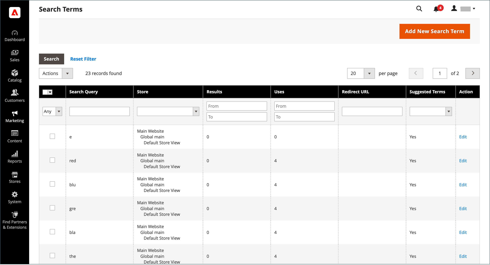
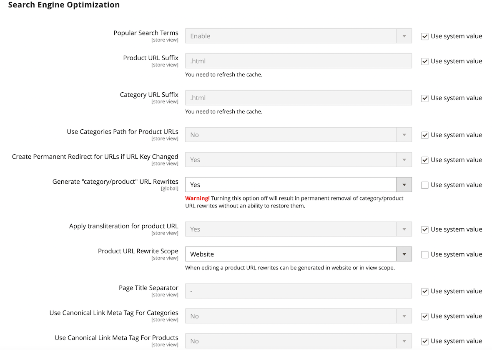
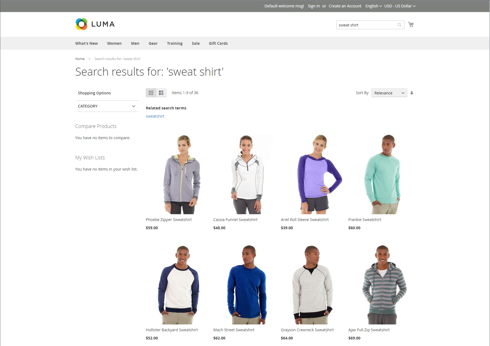

# Administrar términos de búsqueda

El [página de aterrizaje](../content-design/pages.md) para un término de búsqueda puede ser una página de contenido, una página de categoría, una página de detalles de producto o incluso una página de un sitio diferente.

Use términos de búsqueda para capturar errores ortográficos comunes y redirigirlos a la página adecuada. Por ejemplo, si vende muebles de patio de hierro forjado, sabe que mucha gente escribe mal el término como _hierro bastón_, o incluso _hierro podrido_. Puede introducir cada palabra mal escrita como término de búsqueda y convertirla en sinónimos de _hierro forjado_. Aunque la palabra esté mal escrita, la búsqueda se dirige a la página de hierro forjado.

También puede saber lo que buscan sus clientes examinando los términos de búsqueda que utilizan para encontrar productos en su tienda. Si hay suficientes personas que buscan un producto que no está en su catálogo, podría indicar una oportunidad de ventas. Mientras tanto, en lugar de dejarlas con las manos vacías, puede redirigirlas a otro producto del catálogo.

## Agregar términos de búsqueda

A medida que aprendes nuevas palabras que la gente usa para buscar en tu tienda, puedes añadirlas a tu lista de términos de búsqueda para dirigir a la gente hacia los productos más parecidos en tu catálogo.

{width="700" zoomable="yes"}

| Columna | Descripción |
|--- |--- |
| [!UICONTROL Search Query] | La consulta utilizada para realizar la búsqueda. |
| [!UICONTROL Store] | Almacén donde se aplicó la consulta de búsqueda. |
| [!UICONTROL Results] | Número de resultados encontrados por consulta. |
| [!UICONTROL Uses] | Número de usuarios. |
| [!UICONTROL Redirect URL] | Dirección URL de la página de destino a la que se redirigió al usuario después de realizar la búsqueda. |
| [!UICONTROL Suggested Terms] | Determina si el resultado de la consulta muestra términos sugeridos. |
| [!UICONTROL Actions] | Abre el producto en modo de edición. |

{style="table-layout:auto"}

>[!NOTE]
>
>El número de resultados se actualiza cada vez que un comprador ejecuta una búsqueda utilizando esta consulta de búsqueda. No se actualiza si alguno de los productos se cambia o elimina.

### Agregar un término de búsqueda

1. En el _Administrador_ barra lateral, vaya a **[!UICONTROL Marketing]** > _[!UICONTROL SEO & Search]_>**[!UICONTROL Search Terms]**.

1. Haga clic **[!UICONTROL Add New Search Term]**.

   {width="600" zoomable="yes"}

1. En _[!UICONTROL General Information]_en el **[!UICONTROL Search Query]**, escriba la palabra o frase que desee agregar como nuevo término de búsqueda.

1. Si su tienda está disponible en varios idiomas, elija la **[!UICONTROL Store]** vista.

1. Para redirigir los resultados de búsqueda a otra página de su tienda o a otro sitio web, introduzca la dirección URL completa de la página de destino en la **[!UICONTROL Redirect URL]** field.

1. Si desea que este término esté disponible para utilizarlo como sugerencia cada vez que una búsqueda no devuelva resultados, establezca **[!UICONTROL Display in Suggested Terms]** hasta `Yes`.

1. Cuando termine, haga clic en **[!UICONTROL Save Search]**.

## Editar un término de búsqueda

1. En el _[!UICONTROL Search Terms]_En la cuadrícula, haga clic en la fila de cualquier registro para abrir el término de búsqueda en el modo de edición.

1. Realice los cambios necesarios.

1. Cuando termine, haga clic en **[!UICONTROL Save Search]**.

## Eliminar un término de búsqueda

Existen dos métodos para eliminar un término de búsqueda: desde la cuadrícula y en la página de edición.

**Método 1:** En el _[!UICONTROL Search Terms]_rejilla

1. En la lista, seleccione la casilla del término que desea eliminar.

1. En la esquina superior izquierda de la lista, establezca **[!UICONTROL Actions]** hasta `Delete`.

1. Cuando termine, haga clic en **[!UICONTROL Submit]**.

**Método 2:** En el _[!UICONTROL Edit a Search Term]_página

1. En el _Administrador_ barra lateral, vaya a **[!UICONTROL Marketing]** > _[!UICONTROL SEO & Search]_>**[!UICONTROL Search Terms]**.

1. Busque el término de búsqueda que desea eliminar y ábralo en modo de edición.

1. Haga clic **[!UICONTROL Delete Search]**.

1. Para confirmar la acción, haga clic en **[!UICONTROL OK]**.

## Términos de búsqueda populares

El _Términos de búsqueda_ en el pie de página de la tienda se muestran los términos de búsqueda utilizados por los visitantes de la tienda, clasificados por popularidad. Los términos de búsqueda aparecen en una _nube de etiquetas_ formato, donde el tamaño del texto indica la popularidad del término.

De forma predeterminada, Términos de búsqueda populares está habilitado como herramienta de optimización del motor de búsqueda, pero no tiene conexión directa con el proceso de búsqueda en el catálogo. Debido a que la página Términos de búsqueda está indexada por los motores de búsqueda, cualquier término de la página puede ayudar a mejorar la clasificación del motor de búsqueda y la visibilidad de su tienda. La dirección URL de la página Términos de búsqueda populares es: `mystore.com/search/term/popular/`

{width="600" zoomable="yes"}

**_Para configurar términos de búsqueda populares:_**

1. En el _Administrador_ barra lateral, vaya a **[!UICONTROL Stores]** > _[!UICONTROL Settings]_>**[!UICONTROL Configuration]**.

1. En el panel izquierdo, expanda **[!UICONTROL Catalog]** y elija **[!UICONTROL Catalog]** debajo.

1. Expandir  el **[!UICONTROL Search Engine Optimization]** sección.

   {width="600" zoomable="yes"}

   Para ver una lista detallada de estas opciones, consulte [Optimización del motor de búsqueda](../configuration-reference/catalog/catalog.md#search-engine-optimization) en el _Referencia de configuración_.

1. Establecer **[!UICONTROL Popular Search Terms]** según sea necesario.

   Si es necesario, borre la **[!UICONTROL Use system value]** para cambiar esta configuración.

1. Cuando termine, haga clic en **[!UICONTROL Save Config]**.

>[!NOTE]
>
>Puede configurar aún más el almacenamiento en caché de elementos populares [búsquedas en catálogo](search-configuration.md).

## Buscar sinónimos

Una forma de mejorar la eficacia de [búsqueda en el catálogo](search-configuration.md) es incluir términos diferentes que las personas pueden utilizar para describir el mismo elemento. Usted no quiere perder una venta solo porque alguien está buscando un _sofá_ y su producto aparece como un _sofá_. Puede capturar un rango más amplio de términos de búsqueda introduciendo _sofá_, _davenport_, y _sofá de dos plazas_ como sinónimos de _sofá_ y dirigirlos a la misma página de aterrizaje.

Adobe Commerce admite dos soluciones de administración de sinónimos diferentes:

- Live Search [Sinónimos](https://experienceleague.adobe.com/docs/commerce-merchant-services/live-search/live-search-admin/synonyms/synonyms.html) está disponible para instalaciones de Adobe Commerce con Live Search instalado.
- La función estándar Buscar Sinónimos (descrita en esta página) está disponible de forma predeterminada para todas las instalaciones de Adobe Commerce.

>[!NOTE]
>
>La función estándar de Sinónimos de búsqueda es compatible de forma predeterminada con `name` y `sku` atributos del producto **_solamente_**.

{width="700" zoomable="yes"}

### Crear un grupo de sinónimos

1. En el _Administrador_ barra lateral, vaya a **[!UICONTROL Marketing]** > _[!UICONTROL SEO & Search]_>**[!UICONTROL Search Synonyms]**.

   El _[!UICONTROL Search Synonyms]_aparece una cuadrícula. Si es la primera vez que utiliza sinónimos de búsqueda, la cuadrícula está vacía.

   {width="700" zoomable="yes"}

1. Haga clic **[!UICONTROL New Synonym Group]**.

   {width="700" zoomable="yes"}

1. Establecer **[!UICONTROL Scope]** a las vistas de tienda donde se aplican los sinónimos.

1. Introduzca cada sinónimo en el grupo, separado por una coma. Elija palabras que las personas podrían utilizar como criterios de búsqueda. Por ejemplo:

   - `sweatshirt, sweat shirt, hoodie, fleece`
   - `cell phone, mobile phone, smart phone`
   - `couch, sofa, davenport`
   - `wrought iron, rot iron, rod iron`

1. Para combinar estos sinónimos en un grupo con otros que tengan el mismo ámbito, seleccione la opción **[!UICONTROL Merge existing synonyms]** casilla de verificación

1. Cuando termine, haga clic en **[!UICONTROL Save Synonym Group]**.

### Editar un grupo de sinónimos

1. En el _[!UICONTROL Search Synonyms]_En la cuadrícula, haga clic en la fila de cualquier registro para abrir el grupo de sinónimos en modo de edición.

1. Realice los cambios necesarios.

1. Cuando termine, haga clic en **[!UICONTROL Save Synonym Group]**.

### Eliminar un grupo de sinónimos

Existen dos métodos para eliminar un grupo de sinónimos: desde la cuadrícula y en la página de edición.

**Método 1:** En la cuadrícula Buscar sinónimos

1. En el _[!UICONTROL Search Synonyms]_, seleccione la casilla del grupo que desea eliminar.

1. En la esquina superior izquierda de la lista, establezca **[!UICONTROL Actions]** hasta `Delete`.

1. Cuando termine, haga clic en **[!UICONTROL Submit]**.

**Método 2:** En la página Editar un grupo de sinónimos

1. En la cuadrícula Buscar sinónimos, haga clic en la fila de cualquier registro para abrir el grupo de sinónimos en modo de edición.

1. Haga clic **[!UICONTROL Delete Synonym Group]**.

1. Cuando se le solicite, confirme la eliminación del grupo.

## Informe Términos de búsqueda

El informe Términos de búsqueda muestra el número de resultados de cada término y el número de veces (visitas individuales) que se utilizó el término. Los datos del informe se pueden filtrar por término, almacén, resultados y visitas, y exportar para un análisis más detallado.

### Ver el informe

1. En el _Administrador_ barra lateral, vaya a **[!UICONTROL Reports]** > _[!UICONTROL Marketing]_>**[!UICONTROL Search Terms]**.

1. Utilice los controles para filtrar el informe según sea necesario.

   {width="700" zoomable="yes"}

## Exportación del informe

1. Para **[!UICONTROL Export to]**, elija un formato de exportación:

   - `CSV` : archivo de valores separados por comas que contiene datos de texto sin formato
   - `Excel XML` : formato de datos de hoja de cálculo basado en XML

1. Haga clic **[!UICONTROL Export]**.

   El archivo generado se guarda automáticamente en la carpeta designada para las descargas.

### Columnas del informe

| Columna | Descripción |
|--- |--- |
| [!UICONTROL ID] | ID numérico único generado para la entrada del término de búsqueda |
| [!UICONTROL Search Query] | La consulta utilizada para realizar la búsqueda |
| [!UICONTROL Store] | Almacén donde se aplicó la consulta de búsqueda |
| [!UICONTROL Results] | Número de resultados |
| [!UICONTROL Hits] | Número de usuarios |

{style="table-layout:auto"}
