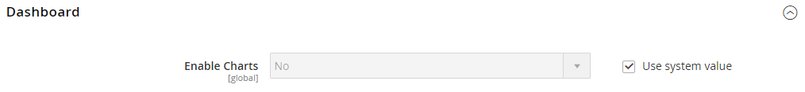

# Avanzadas > Administración

{{config}}

## [!UICONTROL Admin User Emails]

<!-- zoom -->

Para obtener más información acerca de cómo cambiar esta configuración, vea [Contraseña olvidada y restablecer correo electrónico](../../systems/permissions-users-all.md#forgotten-password-and-reset-emails).

| Campo | [Ámbito](../../getting-started/websites-stores-views.md#scope-settings) | Descripción |
|---------------------------------------------|------------------------------------------------------------------------|----------------------------------------------------------------------------------------------------------------------------------------------------------------------------------------------------------------|
| [!UICONTROL Forgot Password Email Template] | Global | Identifica la plantilla de correo electrónico que se utiliza para el mensaje que se envía cuando un usuario administrador olvida su contraseña. Plantilla predeterminada: `Forgot Admin Password` |
| [!UICONTROL Forgot and Reset Email Sender] | Global | Identifica al contacto de la tienda que aparece como remitente del correo electrónico _Olvidé la contraseña_. Remitente predeterminado: `General Contact` Otras opciones de remitente: `Sales Representative`, `Customer Support`, `Custom Email` |
| [!UICONTROL User Notification Template] | Global | Determina la plantilla de correo electrónico que se utiliza de forma predeterminada para las notificaciones a los administradores. Plantilla predeterminada: `User Notification` |

{style="table-layout:auto"}

## [!UICONTROL Startup Page]

<!-- zoom -->

Para obtener más información sobre cómo cambiar esta configuración, consulte [Cambiar la página de inicio](../../getting-started/admin-dashboard.md#change-the-startup-page) en la _Guía de introducción_.

| Campo | [Ámbito](../../getting-started/websites-stores-views.md#scope-settings) | Descripción |
|---------------------------|------------------------------------------------------------------------|------------------------------------------------------------------|
| [!UICONTROL Startup Page] | Global | Determina la página de aterrizaje de administración que aparece después de iniciar sesión. |

{style="table-layout:auto"}

### [!UICONTROL Startup Page] opciones

| Área |                                                                                                                                                                                                                                                                                                                                                                           | Opción |
|---------------------------------------------------------|---------------------------------------------------------------------------------------------------------------------------------------------------------------------------------------------------------------------------------------------------------------------------------------------------------------------------------------------------------------------------|---------------------------------------------------------------------------------------------------------------------------------------------------------------------------------------------------------------------------------------------------------------------------------------------------------------------------------------------------------------------------------------------------------------------------------------------------------------------------------------------------------------------------------------------------------------------------------------------|
| [`Dashboard`](../../getting-started/admin-dashboard.md) |                                                                                                                                                                                                                                                                                                                                                                           |                                                                                                                                                                                                                                                                                                                                                                                                                                                                                                                                                                                             |
| `Sales` | `Operations` | [`Quotes`](../../b2b/quotes.md)   [`Orders`](../../stores-purchase/orders.md) [`Invoices`](../../stores-purchase/invoices.md) [`Shipments`](../../stores-purchase/shipments.md) [`Credit Memos`](../../stores-purchase/credit-memos.md) [`Billing Agreements`](../../stores-purchase/paypal-billing-agreements.md) [`Returns`](../../stores-purchase/returns.md)   [`Transactions`](../../stores-purchase/transactions.md) `Braintree Virtual Terminal` |
| `Catalog` | [`Inventory`](../../inventory-management/introduction.md) | [`Products`](../../catalog/products-list.md) [`Categories`](../../catalog/categories.md) [`Shared Catalog`](../../b2b/catalog-shared-create.md)  |
| `Customers` | [`All Customers`](../../customers/customers-all.md) [`Now Online`](../../customers/now-online.md) [`Customer Groups`](../../customers/customer-groups.md) [`Segments`](../../customers/customer-segments.md)   [`Companies`](../../b2b/account-companies.md) |                                                                                                                                                                                                                                                                                                                                                                                                                                                                                                                                                                                             |
| `Marketing` | `Promotions` | [`Catalog Price Rule`](../../merchandising-promotions/price-rules-catalog.md)  [`Cart Price Rules`](../../merchandising-promotions/price-rules-cart.md))  [`Related Products Rules`](../../merchandising-promotions/product-related-rules.md)   [`Gift Card Accounts`](../../stores-purchase/product-gift-card-accounts.md)  |
|                                                         | [`Private Sales`](../../merchandising-promotions/events-private-sales.md)  | [`Events`](../../merchandising-promotions/event-configure.md)  [`Invitations`](../../merchandising-promotions/invitations.md) |
|                                                         | `Communications` | [`Email Templates`](../../systems/email-templates.md)  [`Newsletter Template`](../../merchandising-promotions/newsletter-template.md)  [`Newsletter Queue`](../../merchandising-promotions/newsletter-queue.md)  [`Newsletter Subscribers`](../../merchandising-promotions/newsletter-subscribers.md)  [`Email Reminders`](../../merchandising-promotions/email-reminder-rules.md)  |
|                                                         | `SEO & Search` | [`Search Terms`](../../catalog/search-terms.md)  [`Search Synonyms`](../../catalog/search-terms.md#search-synonyms)  [`URL Rewrites`](../../merchandising-promotions/url-rewrite.md)  [`Site Map`](../../merchandising-promotions/sitemap-xml.md) |
|                                                         | [`User Content`](../../catalog/settings-advanced-product-reviews.md) | [`All Reviews`](../../catalog/settings-advanced-product-reviews.md)  [`Pending Reviews`](../../merchandising-promotions/product-reviews-moderate.md)   |
| `Content` | `Elements` | [`Pages`](../../content-design/pages.md) [`Hierarchy`](../../content-design/page-hierarchy.md)  [`Blocks`](../../content-design/blocks.md) [`Dynamic Blocks`](../../content-design/dynamic-blocks.md)  [`Widgets`](../../content-design/widgets.md) [`Media Gallery`](../../content-design/media-storage.md) |
|                                                         | `Design` | [`Configuration`](../../content-design/configuration.md) [`Themes`](../../content-design/themes.md) [`Schedule`](../../content-design/schedule.md) |
|                                                         | `Content Staging`   | [Tablero](../../content-design/content-staging.md) |
| `Reports` | [`Marketing`](../../getting-started/marketing-reports.md) | `Products in Cart` `Search Terms` `Abandoned Carts` `Newsletter Problem Reports` |
|                                                         | [`Reviews`](../../getting-started/review-reports.md) | `By Customer`  `By Products`  |
|                                                         | [`Sales`](../../getting-started/sales-reports.md) | `Orders` `Tax` `Invoiced` `Shipping` `Refunds` `Coupons` `PayPal Settlement` `Braintree Settlement` |
|                                                         | `System Insights` | [`Site-Wide Analysis Tool`](https://experienceleague.adobe.com/docs/commerce-operations/tools/site-wide-analysis-tool/access.html)  |
|                                                         | [`Customers`](../../getting-started/customer-reports.md) | `Order Total` `Order Count` `New` `Wish Lists` `Segments`  |
|                                                         | [`Products`](../../getting-started/product-reports.md) | `Views` `Bestsellers` `Low Stock` `Ordered` `Downloads` |
|                                                         | [`Private Sales`](../../getting-started/private-sales-reports.md)  | `Invitations` `Invited Customers` `Conversions` |
|                                                         | `Statistics` | [`Refresh Statistics`](../../getting-started/sales-reports.md#refresh-statistics) |
|                                                         | [`Business Intelligence`](../../getting-started/business-intelligence.md) | `Advanced Reporting` `BI Essentials`  |
|                                                         | `Customer Engagement` | `Dashboard` `Importer Status` `Automation Enrollment` `Campaign Sends` `SMS Sends` `Cron Tasks` `Log Viewer` `Abandoned Carts` |
| `Stores` | `Settings` | [`All Stores`](../../stores-purchase/stores.md) [`Configuration`](../../configuration-reference/guide-overview.md) [`Terms and Conditions`](../../stores-purchase/terms-and-conditions.md) [`Order Status`](../../stores-purchase/order-status.md) |
|                                                         | [`Inventory`](../../inventory-management/introduction.md) | [`Sources`](../../inventory-management/sources-stocks.md#sources) [`Stocks`](../../inventory-management/sources-stocks.md#stocks) |
|                                                         | [`Taxes`](../../stores-purchase/taxes.md) | [`Tax Rules`](../../stores-purchase/tax-rules.md) [`Tax Zones and Rates`](../../stores-purchase/tax-zones-rates.md) |
|                                                         | [`Currency`](../../stores-purchase/currency.md) | [`Currency Rates`](../../stores-purchase/currency-configuration.md) [`Currency Symbols`](../../stores-purchase/currency-configuration.md#step-5-customize-currency-symbols-optional) |
|                                                         | `Attributes` | [`Customer`](../../systems/data-attributes-customer.md) [`Customer Address`](../../systems/data-attributes-customer.md#customer-addresses) [`Product`](../../systems/data-attributes-product.md) [`Attribute Set`](../../catalog/attribute-sets.md) [`Returns`](../../stores-purchase/attributes-returns.md) [`Ratings`](../../merchandising-promotions/product-reviews.md#create-custom-ratings) |
|                                                         | `Other Settings` | [`Reward Exchange Rates`](../../merchandising-promotions/reward-exchange-rates.md) [`Gift Wrapping`](../../stores-purchase/cart-configuration.md#gift-wrap) [`Gift Registry`](../../merchandising-promotions/gift-registry-create.md) |
| `System` | [`Data Transfer`](../../systems/data-transfer.md) | [`Import`](../../systems/data-import.md) [`Export`](../../systems/data-export.md) [`Import/Export Tax Rates`](../../systems/data-transfer-tax-rates.md) [`Import History`](../../systems/data-import.md#import-history) [`Scheduled Import/Export`](../../systems/data-scheduled-import-export.md) |
|                                                         | `Extensions` | [`Integrations`](../../systems/integrations.md) |
|                                                         | `Tools` | [`Cache Management`](../../systems/cache-management.md) [`Index Management`](../../systems/index-management.md) |
|                                                         | `Support` | [`System Report`](../../systems/support.md#system-reports) |
|                                                         | `Permissions` | [`All Users`](../../systems/permissions-users-all.md) [`Locked Users`](../../systems/permissions-users-all.md#locked-users) [`User Roles`](../../systems/permissions-user-roles.md) |
|                                                         | `Action Log`  | [`Report`](../../systems/action-log.md) [`Archive`](../../systems/action-log-archive.md) [`Bulk Actions`](../../systems/action-log-bulk-actions.md) |
|                                                         | `Other Settings` | [`Notifications`](../../systems/notifications.md) [`Custom Variables`](../../systems/variables-custom.md) [`Manage Encryption Key`](../../systems/encryption-key.md) |
| `Find Partners & Extensions` |                                                                                                                                                                                                                                                                                                                                                                           |                                                                                                                                                                                                                                                                                                                                                                                                                                                                                                                                                                                             |

{style="table-layout:auto"}

<!-- Feature still in development 
## [!UICONTROL Unified Experience]

The [!UICONTROL Unified Experience] option is available in Adobe Commerce deployments that have the Commerce Admin Unified Experience extension loaded. This extension enables integration with Experience Cloud to streamline cross-application workflows between Commerce and other Experience Cloud solutions. See [Adobe Experience Cloud Integration for Commerce Admin](../../getting-started/admin-unified-experience-integration-overview.md).

| Field        | [Scope](../../getting-started/websites-stores-views.md#scope-settings) | Description                                                                                                                                                                                                                                                                                                                                                                    |
|--------------|------------------------------------------------------------------------|--------------------------------------------------------------------------------------------------------------------------------------------------------------------------------------------------------------------------------------------------------------------------------------------------------------------------------------------------------------------------------|
| Enable       | Global                                                                 | Determines if the Commerce instance uses the Experience Cloud integration. Before enabling this feature, review the [requirements and configuration instructions](../../getting-started/admin-unified-experience-integration-overview.md). Options: Yes/No.                                                                                                                    |
| Project Name | Global                                                                 | Identifies the instance in the Experience Cloud Commerce Projects workspace when the Unified Experience is enabled. The name can contain only alphanumeric characters and spaces. Defaults to the [cloud environment name](https://experienceleague.adobe.com/docs/commerce-cloud-service/user-guide/architecture/pro-architecture.html?lang=en#pro-environment-architecture). |

{style="table-layout:auto"}

-->

## [!UICONTROL Admin Base URL]

<!-- zoom -->

Para obtener más información acerca de cómo configurar estas opciones, consulte [Configurar la dirección URL base](../../stores-purchase/store-urls.md#configure-the-base-url) en la _Guía de tiendas y compras_.

| Campo | [Ámbito](../../getting-started/websites-stores-views.md#scope-settings) | Descripción |
|------------------------------------|------------------------------------------------------------------------|-----------------------------------------------------------------------------------------------------------------------------------------------------------------------------------------------------------------------------------|
| [!UICONTROL Use Custom Admin URL] | Global | Determina si se utiliza una dirección URL personalizada para acceder al administrador. Opciones: `Yes` / `No` |
| [!UICONTROL Custom Admin URL] | Global | Especifica una dirección URL personalizada para acceder al administrador. De forma predeterminada, la URL de administración es la misma que la URL base. **Importante:** La dirección URL del administrador debe estar en la misma instalación de Commerce y tener la misma raíz de documento que la tienda. |
| [!UICONTROL Use Custom Admin Path] | Global | Determina si se utiliza una ruta personalizada para acceder al administrador. La ruta predeterminada es `admin`. Opciones: `Yes` / `No` |
| [!UICONTROL Custom Admin Path] | Global | Cambia el nombre de la ruta de administración predeterminada a algo difícil de adivinar. Escriba el nombre de la ruta personalizada en caracteres en minúsculas. Por ejemplo: `aardvark` |

{style="table-layout:auto"}

## [!UICONTROL Security]

<!-- zoom -->

Para obtener más información sobre cómo configurar estas opciones, consulte [Configurar la seguridad de administración](../../systems/security-admin.md) en la _Guía de sistemas de administración_.

| Campo | [Ámbito](../../getting-started/websites-stores-views.md#scope-settings) | Descripción |
|--------------------------------------------------------|------------------------------------------------------------------------|--------------------------------------------------------------------------------------------------------------------------------------------------------------------------------------------------------------------------------------------------------------------------------------------------------------------------------------------------------------------------------------------------------------------------------------------------------------------------------------------------------------------------------------------------------------------------------------------------------|
| [!UICONTROL Admin Account Sharing] | Vista de tienda | Determina si un usuario administrador puede iniciar sesión en la misma cuenta simultáneamente desde distintos dispositivos. Opciones:  **`Yes`**: permite varias sesiones activas desde la misma cuenta de administrador. **`No`** - Permite solamente una sesión activa por cuenta de administrador. |
| [!UICONTROL Password Reset Protection Type] | Vista de tienda | Determina el método que se utiliza para administrar las solicitudes de restablecimiento de contraseña. Opciones:  **`By IP and Email`**: la contraseña se puede restablecer en línea después de recibir una respuesta de la notificación y enviarla a la dirección de correo electrónico asociada a la cuenta de administrador. **`By IP`** - La contraseña se puede restablecer en línea sin confirmación adicional.  **`By Email`**: la contraseña solo se puede restablecer respondiendo por correo electrónico a la notificación que se envía a la dirección de correo electrónico asociada a la cuenta de administrador. **`None`**: solo el administrador del almacén puede restablecer la contraseña. |
| [!UICONTROL Recovery Link Expiration Period (hours)] | Global | Determina el número de horas que un vínculo de recuperación de contraseña sigue siendo válido. |
| [!UICONTROL Max Number of Password Reset Requests] | Vista de tienda | Determina la cantidad máxima de solicitudes de contraseña que se pueden enviar por hora. |
| [!UICONTROL Min Time Between Password Reset Requests] | Vista de tienda | Determina el número mínimo de minutos entre solicitudes de restablecimiento de contraseña. |
| [!UICONTROL Add Secret Key to URLs] | Global | Cuando está activada, añade una clave secreta a la URL del administrador como medida de precaución frente a posibles ataques. Opciones: `Yes` / `No` |
| [!UICONTROL Login Is Case Sensitive] | Global | Determina si las credenciales de inicio de sesión introducidas por un usuario deben coincidir con las mayúsculas y minúsculas de las almacenadas. Opciones: `Yes` / `No` |
| [!UICONTROL Admin Session Lifetime (seconds)] | Global | Determina la duración de una sesión de administrador en segundos. |
| [!UICONTROL Maximum Login Failures to Lockout Account] | Global | Determina la cantidad de veces que los usuarios administradores pueden intentar iniciar sesión antes de que se bloqueen sus cuentas. Si el campo está vacío, no se establece ningún mínimo. Valor predeterminado: `6` |
| [!UICONTROL Lockout Time (minutes)] | Global | Determina la cantidad de minutos que una cuenta de administrador está bloqueada antes de que el usuario pueda intentar iniciar sesión de nuevo. Valor predeterminado: `30` |
| [!UICONTROL Password Lifetime (days)] | Global | Determina el número de días antes de que caduque una contraseña de administrador. Si el campo está vacío, no se establece ningún período de duración. Valor predeterminado: `90` |
| [!UICONTROL Password Change] | Global | Determina si los usuarios administradores deben cambiar sus contraseñas. Opciones:  **`Forced`**- Requiere que los usuarios administradores cambien sus contraseñas después de configurar la cuenta. **`Recommended`** - Recomienda que los usuarios administradores cambien sus contraseñas después de configurar la cuenta. |

{style="table-layout:auto"}

## [!UICONTROL Dashboard]

<!-- zoom -->

Para obtener más información sobre cómo configurar estas opciones, consulte [Panel de administración](../../getting-started/admin-dashboard.md) en la _Guía de introducción_.

| Campo | [Ámbito](../../getting-started/websites-stores-views.md#scope-settings) | Descripción |
|----------------------------|------------------------------------------------------------------------|-------------------------------------------------------------------------------------------------------|
| [!UICONTROL Enable Charts] | Global | Determina si el tablero incluye un gráfico generado a partir de los datos de ventas actuales. Opciones: `Yes` / `No` |

{style="table-layout:auto"}

## [!UICONTROL Admin Grids]

<!-- zoom -->

Para obtener más información sobre cómo configurar estas opciones, consulte [Limitar la visualización del producto](../../catalog/products-list.md#limit-product-display) en la _Guía de administración de catálogos_.

>[!NOTE]
>
>Para mejorar el rendimiento de los catálogos grandes, se recomienda limitar el número de productos que se muestran en la cuadrícula.

| Campo | [Ámbito](../../getting-started/websites-stores-views.md#scope-settings) | Descripción |
|-----------------------------------------------|------------------------------------------------------------------------|-------------------------------------------------------------------------------------------------------------------------------------|
| [!UICONTROL Limit Number of Products in Grid] | Global | Determina si el número de productos mostrados en la cuadrícula está limitado al valor _[!UICONTROL Records Limit]_. Opciones: `Yes` / `No` |
| [!UICONTROL Records Limit] | Global | Establece el límite de número de productos en la cuadrícula de productos. El valor mínimo predeterminado es `20000`. |

## [!UICONTROL CAPTCHA]

<!-- zoom -->

Para obtener más información sobre cómo configurar estas opciones, consulte [CAPTCHA](../../systems/security-captcha.md) en la _Guía de sistemas de administración_.

| Campo | [Ámbito](../../getting-started/websites-stores-views.md#scope-settings) | Descripción |
|-------------------------------------------------------|------------------------------------------------------------------------|-------------------------------------------------------------------------------------------------------------------------------------------------------------------------------------------------------------------------------------------------------------------------------------------------------------------------------------------------------------------------------------------------------------------------------------------------------------------------------------------------------------------------------------------------------------------------------------------------------------------------------------------------------------------------------------------------------------------------------------------------------------------------------------------------|
| [!UICONTROL Enable CAPTCHA in Admin] | Global | Habilita CAPTCHA para el inicio de sesión del administrador. Opciones: `Yes` / `No` |
| [!UICONTROL Font] | Global | Determina la fuente utilizada para mostrar el CAPTCHA. Para agregar su propia fuente, coloque el archivo de fuente en el mismo directorio que la instancia de Commerce y agregue la declaración al archivo config.xml en `app/code/Magento/Captcha/etc` Fuente predeterminada: ` LinLibertine` |
| [!UICONTROL Forms] | Global | Determina los formularios donde se utiliza CAPTCHA. Opciones: `Admin Login` / `Admin Forgot Password` |
| [!UICONTROL Displaying Mode] | Global | Determina cuándo aparecerá el CAPTCHA. Opciones:  **`Always`**- siempre se requiere CAPTCHA para iniciar sesión. **`After number of attempts to login`** - Muestra el campo [!UICONTROL Number of Unsuccessful Attempts to Login]. Introduzca el número de intentos de inicio de sesión permitidos. Un valor de 0 (cero) es similar a establecer el Modo de visualización en Siempre. Esta opción no cubre los formularios Olvidé la contraseña y Crear usuario. Si CAPTCHA está habilitado y configurado para aparecer, siempre se incluye en el formulario. **Nota**: Para hacer un seguimiento del número de intentos de inicio de sesión erróneos, se cuenta cada intento de inicio de sesión en una dirección de correo electrónico y desde una dirección IP. El número máximo de intentos de inicio de sesión permitidos desde la misma dirección IP es de 1000. Esta limitación se aplica solamente cuando CAPTCHA está habilitado. |
| [!UICONTROL Number of Unsuccessful Attempts to Login] | Global | Determina la cantidad de veces que una persona puede intentar iniciar sesión antes de que se bloquee la cuenta. Para realizar un seguimiento del número de intentos de inicio de sesión erróneos, el sistema realiza un seguimiento de los intentos desde una dirección de correo electrónico desde una sola dirección IP. El número máximo de intentos permitidos desde la misma dirección IP es de 1000. Esta limitación se aplica solo si CAPTCHA está habilitado. |
| [!UICONTROL CAPTCHA Timeout (minutes)] | Global | Determina la duración del CAPTCHA actual. Cuando caduca el CAPTCHA, el usuario debe volver a cargar la página. |
| [!UICONTROL Number of Symbols] | Global | Determina el número de símbolos que se utilizan en el CAPTCHA. El valor máximo permitido es `8`. También puede especificar un rango, por ejemplo, `5-8`. |
| [!UICONTROL Symbols Used in CAPTCHA] | Global | Determina qué símbolos se utilizarán en el CAPTCHA. Solo se permiten letras (a-z y A-Z) y números (0-9). El conjunto predeterminado de símbolos sugeridos en el campo excluye los símbolos de aspecto similar como i, l o 1. La visualización de estos símbolos en CAPTCHA reduce las posibilidades de que un usuario reconozca el CAPTCHA correctamente. |
| [!UICONTROL Case Sensitive] | Global | Determina si los caracteres utilizados en el CAPTCHA distinguen entre mayúsculas y minúsculas. Opciones: `Yes` / `No` |

{style="table-layout:auto"}

## [!UICONTROL Admin Actions Logging]

{{ee-feature}}

<!-- zoom -->

Para obtener más información sobre cómo configurar estas opciones, consulte [Archivo de registro de acciones](../../systems/action-log-archive.md) en la _Guía de sistemas de administración_.

| Campo | [Ámbito](../../getting-started/websites-stores-views.md#scope-settings) | Descripción |
|-----------------------------|------------------------------------------------------------------------|-----------------------------------------------------------------------------------------------------------------------------------------------------------------------------------------------------------------------------------------------------------------------------------------------------------------------------------------------------------------------------------------------------------------------------------------------------------------------------------------------------------------------------------------------------------------------------------------------------------------------------------------------------------------------------------------------------------------------------------------------------------------------------------------------------------------------------------------------------------------------------------------------------------------------------------------------------------------------------------------------------------------------------------------------------------------------------------------------------------------------------------------------------------------------------------------------------------------------------------------------------------------------------------------------------------------------------------------------------------------------------------------------------------------------------------------------------------------------------------------------------------------------------------------------------------------------------------------------------------------------------------------------------------------------------------------------------------------------------------------------------------------------------------------------|
| [!UICONTROL Enable Actions] | Global | Activa el registro de acciones para cada una de las acciones seleccionadas:  `Admin My Account`  `Admin Permission Roles`  `Admin Permission Users`  `Admin Sign In`  `CMS Blocks`  `CMS Hierarchy`  `CMS Pages`  `Cache Management`  `Cart Price Rules`  `Catalog Attributes`  `Catalog Categories`  `Catalog Events`  `Catalog Price Rules`  `Catalog Product Tax Classes`  `Catalog Product Templates`  `Catalog Products`  `Catalog Ratings`  `Catalog Reviews`  `Catalog Search`  `Checkout Terms and Conditions`  `Companies`  `Company Credit`  `Custom Variables`  `Customer Groups`  `Customer Invitations`  `Customer Tax Classes`  `Customers`  `Design Configuration`  `Gift Card Accounts`  `Gift Registry Entity`  `Gift Registry Type`  `Index Management`  `Login as a Customer`  `Manage Currency Rates`  `Manage Customer Address Attributes`  `Manage Customer Attributes`  `Manage Design`  `Manage Dynamic Blocks`  `Manage Segments`  `Manage Store Views`  `Manage Stores`  `Manage Websites`  `Negotiable Quotes`  `Newsletter Queue`  `Newsletter Subscribers`  `Newsletter Templates`  `PayPal Settlement Reports`  `Reports`   `Reward Points Rates`  `Rule-Based Product Relations`  `Sales Archive`  `Sales Credit Memos`  `Sales Invoices`  `Sales Order Status`  `Sales Orders`  `Sales Shipments`  `Shared Catalog`  `Shopping Cart Management`  `Store Credit`  `System Backups`  `System Configuration`  `Tax Rates`  `Tax Rules`  `Transactional Emails`  `URL Rewrites`  `Widget`  `XML Sitemap` |

{style="table-layout:auto"}

## [!UICONTROL Admin Usage]

<!-- zoom -->

Para obtener más información sobre cómo configurar estas opciones, consulte [Recopilación de datos de uso](../../getting-started/admin.md#usage-data-collection) en la _Guía de introducción_.

| Campo | Ámbito | Descripción |
|------------------------------------------|--------|--------------------------------------------------------------------------------------------------------------------------------------------------------------------------------------------------------------------------------------------------------------------------------------------------------------------------------------------------------------------------------------------------------------------------------------------------------------------------------------------------------------------------------------------------------------------------------------------------------------|
| [!UICONTROL Enable Admin Usage Tracking] | Global | Concede permiso a Adobe para recopilar datos de uso del administrador con el fin de mejorar la experiencia de uso de _Admin_, y de productos y servicios relacionados. Al permitir la recopilación de datos, también se habilita la _Guía interna del producto_, que está diseñada para ofrecer contenido interactivo como ayuda, información sobre herramientas, guías de introducción, información de incorporación, anuncios de características y más al _administrador_. Los administradores individuales no se identifican en los datos de uso. Opciones: **`Yes`**- Permite la recopilación de datos y habilita la _Guía interna del producto_. **`No`** - No permite la recopilación de datos ni habilita la _Guía interna del producto_. |

{style="table-layout:auto"}
