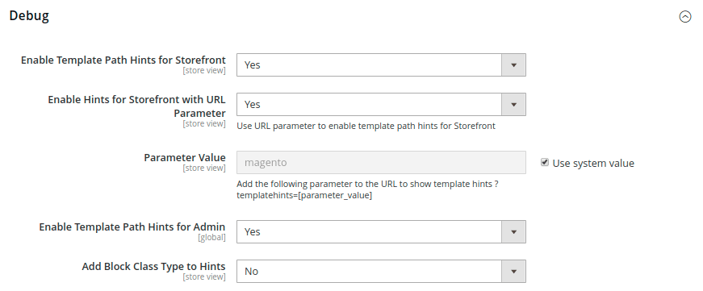

# [!UICONTROL Advanced] > [!UICONTROL Developer]

{{config}}

>[!NOTE]
>
>Estas opciones de configuración solo están disponibles en [modo para desarrolladores](../../systems/developer-tools.md#operation-modes).

## [!UICONTROL Frontend Development Workflow]

<!-- zoom -->

Para obtener más información sobre cómo cambiar esta configuración, consulte [Flujo de trabajo de desarrollo de front-end](../../systems/developer-tools.md#frontend-development-workflow) en la _Guía de sistemas de administración_.

| Campo | [Ámbito](../../getting-started/websites-stores-views.md#scope-settings) | Descripción |
|--- |--- |--- |
| [!UICONTROL Workflow Type] | Global | Determina si se produce una compilación Less en el lado del cliente o del servidor durante el desarrollo. Opciones:  **`Client side less compilation`**: la compilación se realiza en el explorador utilizando la biblioteca nativa less.js. **`Server side less compilation`**: la compilación se realiza en el servidor utilizando la biblioteca Less PHP. Este es el modo predeterminado para la producción. |

{style="table-layout:auto"}

## [!UICONTROL Developer Client Restrictions]

<!-- zoom -->

Para obtener más información acerca de cómo cambiar esta configuración, consulte [Restricciones de cliente](../../systems/developer-tools.md#client-restrictions) en la _Guía de sistemas de administración_.

| Campo | [Ámbito](../../getting-started/websites-stores-views.md#scope-settings) | Descripción |
|--- |--- |--- |
| [!UICONTROL Allow IPs (comma separated)] | Vista de tienda | Crea una lista de permitidos de direcciones IP que pueden utilizar herramientas de desarrollador en un sitio activo, sin interferir con los clientes de la tienda. Cualquier cambio en el sitio al usar una herramienta para desarrolladores como _Traducción en línea_, solo será visible desde las direcciones IP de la lista de permitidos. |

{style="table-layout:auto"}

## [!UICONTROL Template Settings]

<!-- zoom -->

Para obtener más información sobre cómo cambiar esta configuración, consulte [Optimización de archivos de recursos](../../systems/developer-tools.md#optimizing-resource-files) en la _Guía de sistemas de administración_.

| Campo | [Ámbito](../../getting-started/websites-stores-views.md#scope-settings) | Descripción |
|--- |--- |--- |
| [!UICONTROL Allow Symlinks] | Vista de tienda | Habilitar [vínculos simbólicos](https://en.wikipedia.org/wiki/Symbolic_link) puede exponer el sitio a riesgos de seguridad y no se recomienda para un almacén de producción. |
| [!UICONTROL Minify Html] | Vista de tienda | Determina si se minimiza HTML para plantillas de tienda. Opciones: `Yes` / `No` |

{style="table-layout:auto"}

## [!UICONTROL Debug]

<!-- zoom -->

Para obtener más información acerca de cómo cambiar esta configuración, consulte [Sugerencias de ruta de acceso a la plantilla](../../systems/developer-tools.md#template-path-hints) en la _Guía de sistemas de administración_.

| Campo | [Ámbito](../../getting-started/websites-stores-views.md#scope-settings) | Descripción |
|--- |--- |--- |
| [!UICONTROL Enable Template Path Hints for Storefront] | Vista de tienda | Agrega una anotación a la tienda que indica la ruta a cada plantilla que se utiliza en la página. Opciones: `Yes` / `No` |
| [!UICONTROL Enable Template Path Hints for Admin] | Global | Agrega una anotación al administrador que indica la ruta a cada plantilla que se utiliza en la página. Opciones: `Yes` / `No` |
| [!UICONTROL Add Block Class Type to Hints] | Vista de tienda | Incluye los nombres de los bloques en las sugerencias de ruta de la plantilla. Opciones: `Yes` / `No` |

{style="table-layout:auto"}

## [!UICONTROL Translate Inline]

<!-- zoom -->

Para obtener más información sobre cómo cambiar esta configuración, consulte [Traducir en línea](../../systems/developer-tools.md#translate-inline) en la _Guía de sistemas de administración_.

| Campo | [Ámbito](../../getting-started/websites-stores-views.md#scope-settings) | Descripción |
|--- |--- |--- |
| [!UICONTROL Enable for Storefront] | Vista de tienda | Activa el traductor en línea de la tienda. El texto de la interfaz se puede editar para cada vista de tienda. Para utilizar el traductor en línea sin interferir con la tienda en directo, añada su dirección IP a la lista de permitidos de restricciones del cliente para desarrolladores. |
| [!UICONTROL Enable for Admin] | Global | Activa el traductor en línea para el administrador. A diferencia de la tienda, el administrador no se puede traducir a varios idiomas. Sin embargo, se pueden cambiar las etiquetas de campo y otro texto de la interfaz. |

{style="table-layout:auto"}

## [!UICONTROL JavaScript Settings]

<!-- zoom -->

Para obtener más información sobre cómo cambiar esta configuración, consulte [Optimización de archivos de recursos](../../systems/developer-tools.md#optimizing-resource-files) en la _Guía de sistemas de administración_.

| Campo | [Ámbito](../../getting-started/websites-stores-views.md#scope-settings) | Descripción |
|--- |--- |--- |
| [!UICONTROL Merge JavaScript Files] | Vista de tienda | Combina varios archivos JavaScript en uno solo para mejorar el tiempo de carga de la página. |
| [!UICONTROL Enable JavaScript Bundling] | Vista de tienda | Determina si se pueden agrupar varios archivos JavaScript en un solo archivo. Opciones: `Yes` / `No` |
| [!UICONTROL Minify JavaScript Files] | Vista de tienda | Elimina los caracteres, espacios y sangría innecesarios para reducir el tamaño del código. |
| [!UICONTROL Move JS code to the bottom of the page] | Global | Si está activado, mueve el código JS a la parte inferior de la página. Opciones: `Yes` / `No` |
| [!UICONTROL Translation Strategy] | Global | Determina la metodología de traducción que utiliza el sistema. Opciones:  **`Dictionary`**- Traducción en la tienda. **`Embedded`** - Traducción en el lado del administrador. |
| [!UICONTROL Log JS Errors to Session Storage] | Global | Si está habilitado, las pruebas funcionales pueden utilizarlo para la creación de informes. Opciones: `Yes` / `No` |
| [!UICONTROL Log JS Errors to Session Storage Key] | Global | Identifica la clave que se utiliza para recuperar los errores de js recopilados. |

{style="table-layout:auto"}

## [!UICONTROL CSS Settings]

<!-- zoom -->

Para obtener más información sobre cómo cambiar esta configuración, consulte [Optimización de archivos de recursos](../../systems/developer-tools.md#optimizing-resource-files) en la _Guía de sistemas de administración_.

| Campo | [Ámbito](../../getting-started/websites-stores-views.md#scope-settings) | Descripción |
|--- |--- |--- |
| [!UICONTROL Merge CSS Files] | Vista de tienda | Combina varios archivos CSS en uno solo para mejorar el tiempo de carga de la página. Opciones: `Yes` / `No` |
| [!UICONTROL Minify CSS Files] | Vista de tienda | Elimina los caracteres, espacios y sangría innecesarios para reducir el tamaño del código. Opciones: `Yes` / `No` |
| [!UICONTROL Use CSS critical path] | Global | La _ruta crítica de CSS_ ofrece CSS en línea reducido en `<head>` y difiere todos los estilos no críticos que se cargan de forma asincrónica. Opciones: `Yes` / `No` |

{style="table-layout:auto"}

## [!UICONTROL Image Processing Settings]

<!-- zoom -->

| Campo | [Ámbito](../../getting-started/websites-stores-views.md#scope-settings) | Descripción |
|--- |--- |--- |
| [!UICONTROL Image Adapter] | Global | Especifica el adaptador que se utiliza para procesar imágenes. Después de cambiar la configuración del adaptador, vacíe la caché de imágenes del catálogo. Opciones: `PHP GD2` / `ImageMagick`   **_Nota:_** El tipo de archivo ICO solo es compatible con el adaptador de ImageMagik. |

{style="table-layout:auto"}

## [!UICONTROL Caching Settings]

<!-- zoom -->

| Campo | [Ámbito](../../getting-started/websites-stores-views.md#scope-settings) | Descripción |
|--- |--- |--- |
| [!UICONTROL Cache User Defined Attributes] | Global | Cuando está habilitado, almacena en caché los atributos de valor de atributo de entidad (EAV) definidos por el usuario y del sistema. Esta opción puede aumentar el rendimiento, pero también requiere espacio adicional para el almacenamiento en caché. Opciones: `Yes` / `No` |

{style="table-layout:auto"}

## [!UICONTROL Static Files Settings]

<!-- zoom -->

| Campo | [Ámbito](../../getting-started/websites-stores-views.md#scope-settings) | Descripción |
|--- |--- |--- |
| [!UICONTROL Sign Static Files] | Global | Cuando está habilitada, agrega una firma digital a la dirección URL de los archivos estáticos para que los exploradores puedan detectar cuándo está disponible una versión más reciente del archivo. Si la firma de un archivo difiere de lo que se almacena en la caché del explorador, se utiliza la versión más reciente del archivo. Los archivos estáticos que se pueden firmar incluyen JavaScript, CSS, imágenes y fuentes. Opciones: `Yes` / `No` |

{style="table-layout:auto"}

## [!UICONTROL Grid Settings]

<!-- zoom -->

| Campo | [Ámbito](../../getting-started/websites-stores-views.md#scope-settings) | Descripción |
|--- |--- |--- |
| [!UICONTROL Asynchronous Indexing|Global] | Determina cuándo se añaden a la cuadrícula y se vuelven a indexar entidades del sistema de procesamiento de pedidos, como pedidos, facturas, envíos y notas de abono. La indexación asíncrona se puede utilizar para evitar bloqueos de datos durante operaciones de guardado y para reducir el tiempo de procesamiento. Opciones:  **`Disable`**- (Predeterminado) Las entidades relacionadas con pedidos se agregan a la cuadrícula varias veces. a medida que se guardan. **`Enable`**: las entidades relacionadas con pedidos se agregan a la cuadrícula solo durante un trabajo cron programado. Cron debe configurarse para ejecutarse una vez cada minuto. |

{style="table-layout:auto"}
