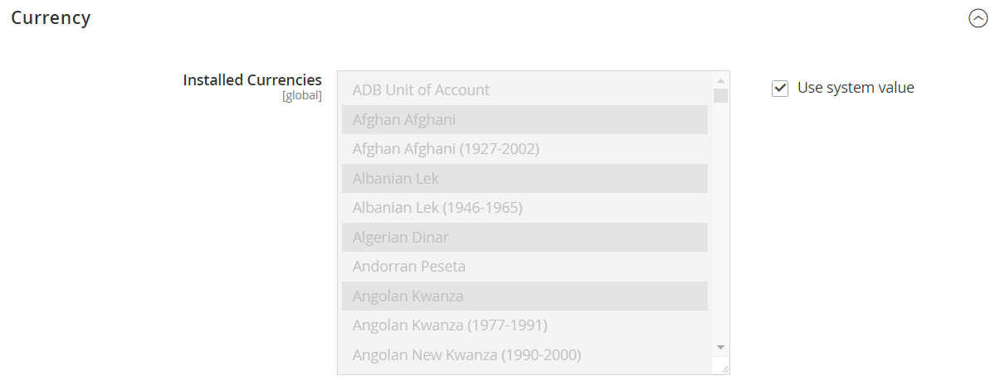
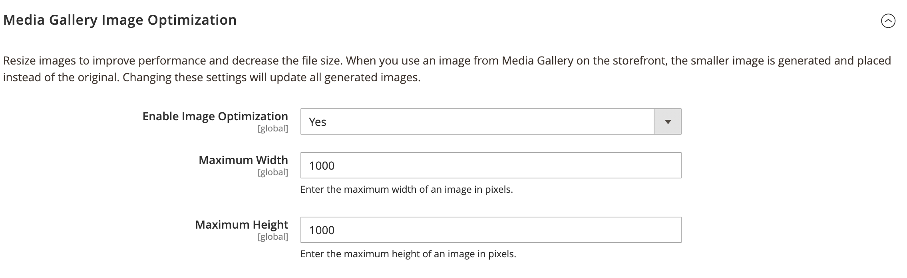

# [!UICONTROL Advanced] > [!UICONTROL System]

{{config}}

## [!UICONTROL Cron (Scheduled Tasks)]

<!-- zoom -->

Para obtener más información acerca de cómo cambiar esta configuración, vea [Cron (tareas programadas)](../../systems/cron.md).

### [!UICONTROL index]

<!-- zoom -->

| Campo | [Ámbito](../../getting-started/websites-stores-views.md#scope-settings) | Descripción |
|--- |--- |--- |
| [!UICONTROL Generate Schedules Every] | Global | Determina la frecuencia en minutos con la que se generan las programaciones. |
| [!UICONTROL Schedule Ahead for] | Global | Determina el número de minutos de antelación con los que se generan las programaciones. |
| [!UICONTROL Missed if Not Run Within] | Global | Determina el número de minutos antes de que un trabajo cron que aún no se ha ejecutado se marque como perdido. |
| [!UICONTROL History Cleanup Every] | Global | Determina la cantidad de minutos que transcurren antes de que se limpie el historial de cron. |
| [!UICONTROL Success History Lifetime] | Global | Determina el número de minutos que se mantiene en la base de datos el registro de los trabajos cron completados correctamente. |
| [!UICONTROL Failure History Lifetime] | Global | Determina el número de minutos que se mantiene en la base de datos el registro de trabajos cron fallidos. |
| [!UICONTROL Use Separate Process] | Global | Determina si los trabajos cron se ejecutan en paralelo como procesos independientes. Opciones: `Yes` / `No` |

{style="table-layout:auto"}

### [!UICONTROL default]

<!-- zoom -->

| Campo | [Ámbito](../../getting-started/websites-stores-views.md#scope-settings) | Descripción |
|--- |--- |--- |
| [!UICONTROL Generate Schedules Every] | Global | Determina la frecuencia en minutos con la que se generan las programaciones. |
| [!UICONTROL Schedule Ahead for] | Global | Determina el número de minutos de antelación con los que se generan las programaciones. |
| [!UICONTROL Missed if Not Run Within] | Global | Determina el número de minutos antes de que un trabajo cron que aún no se ha ejecutado se marque como perdido. |
| [!UICONTROL History Cleanup Every] | Global | Determina la cantidad de minutos que transcurren antes de que se limpie el historial de cron. |
| [!UICONTROL Success History Lifetime] | Global | Determina el número de minutos que se mantiene en la base de datos el registro de los trabajos cron completados correctamente. |
| [!UICONTROL Failure History Lifetime] | Global | Determina el número de minutos que se mantiene en la base de datos el registro de trabajos cron fallidos. |
| [!UICONTROL Use Separate Process] | Global | Determina si los trabajos cron se ejecutan en paralelo como procesos independientes. Opciones: `Yes` / `No` |

{style="table-layout:auto"}

## [!UICONTROL MySQL Message Queue Cleanup]

{{ee-feature}}

<!-- zoom -->

| Campo | [Ámbito](../../getting-started/websites-stores-views.md#scope-settings) | Descripción |
|--- |--- |--- |
| [!UICONTROL Successful Messages Lifetime] | Global | Determina la duración de los mensajes correctos en minutos. Escriba cero para omitir la limpieza. Predeterminado: `10080` (7 días) |
| [!UICONTROL New Messages Lifetime] | Global | Determina la duración de los nuevos mensajes en minutos. Escriba cero para omitir la limpieza. Predeterminado: `10080` (7 días) |
| [!UICONTROL Failed Messages Lifetime] | Global | Determina la duración de los mensajes fallidos en minutos. Escriba cero para omitir la limpieza. Predeterminado: `10080` (7 días) |
| [!UICONTROL Retry Messages in Progress After] | Global | Determina cuánto tiempo espera el sistema un mensaje en curso antes de volver a intentarlo. Predeterminado: `1440` (24 horas) |

{style="table-layout:auto"}

## [!UICONTROL Mail Sending Settings]

<!-- zoom -->

Para obtener más información sobre cómo cambiar esta configuración, consulte [Configurar comunicaciones por correo electrónico](../../systems/email-communications.md) en la _Guía de sistemas de administración_.

>[!IMPORTANT]
>
>**Aviso de seguridad** Recomendamos que todos los comerciantes establezcan inmediatamente su configuración de envío de correo para protegerse contra un posible ataque de ejecución de código remoto identificado recientemente. Hasta que se resuelva este problema, es muy recomendable que evite usar [!DNL Sendmail] para comunicaciones por correo electrónico. En [!UICONTROL Mail Sending Settings], asegúrese de que [!UICONTROL Set Return Path] está establecido en `No`.

| Campo | [Ámbito](../../getting-started/websites-stores-views.md#scope-settings) | Descripción |
|--- |--- |--- |
| [!UICONTROL Disable Email Communications] | Vista de tienda | Determina si las comunicaciones por correo electrónico están activadas para la tienda. Opciones: `Yes` / `No` |
| [!UICONTROL Transport] | Vista de tienda | Determina el tipo de transporte para las comunicaciones por correo electrónico desde la tienda. Opciones: `Sendmail` / `SMTP` |
| [!UICONTROL Host] | Vista de tienda | (Solo para servidores SMTP y Windows) Determina el nombre que se utiliza para hacer referencia al host. Valor predeterminado: `localhost` |
| [!UICONTROL Port (25)] | Vista de tienda | (Solo para servidores SMTP y Windows) Identifica el puerto utilizado para las comunicaciones por correo electrónico. Valor predeterminado: `25` |
| [!UICONTROL Set Return-Path] | Vista de tienda | Determina si se utiliza una dirección de enrutamiento para los correos electrónicos devueltos. Opciones: `No` / `Yes` / `Specified` |

{style="table-layout:auto"}

### Opciones de SMTP

Al seleccionar SMTP en el tipo de transporte, hay opciones adicionales disponibles para configurar la conexión del servidor SMTP.

<!-- zoom -->

| Campo | [Ámbito](../../getting-started/websites-stores-views.md#scope-settings) | Descripción |
|--- |--- |--- |
| [!UICONTROL Username] | Vista de tienda | Nombre de usuario de inicio de sesión para el servidor SMTP. |
| [!UICONTROL Password] | Vista de tienda | Contraseña para el inicio de sesión del servidor SMTP. |
| [!UICONTROL Auth] | Vista de tienda | Determina el tipo de autenticación para la conexión del servidor SMTP. Opciones: `NONE` / `PLAIN` / `LOGIN` |
| [!UICONTROL SSL] | Vista de tienda | Determina el tipo de comprobación del certificado de seguridad del host. Opciones: `SSL` / `TLS` |

{style="table-layout:auto"}

## [!UICONTROL Currency]

<!-- zoom -->

Para obtener más información acerca de cómo cambiar esta configuración, consulte [Configuración de moneda](../../stores-purchase/currency-configuration.md) en la _Guía de tiendas y experiencia de compra_.

| Campo | [Ámbito](../../getting-started/websites-stores-views.md#scope-settings) | Descripción |
|--- |--- |--- |
| [!UICONTROL Installed Currencies] | Global | Indica las divisas disponibles actualmente para la instalación de Commerce. Las opciones incluyen todas las monedas disponibles, con las monedas instaladas seleccionadas. |

{style="table-layout:auto"}

## [!UICONTROL Security]

<!-- zoom -->

Para obtener más información sobre cómo cambiar esta configuración, consulte [Administración de sesiones](../../systems/security-session-management.md) en la _Guía de sistemas de administración_.

| Campo | [Ámbito](../../getting-started/websites-stores-views.md#scope-settings) | Descripción |
|--- |--- |--- |
| [!UICONTROL Max Session Size in Admin] | Global | Limitar el tamaño máximo de la sesión en bytes. Use `0` para deshabilitar. |
| [!UICONTROL Max Session Size in Storefront] | Global | Limitar el tamaño máximo de la sesión en bytes. Use `0` para deshabilitar. |

{style="table-layout:auto"}

## [!UICONTROL Notifications]

<!-- zoom -->

Para obtener más información sobre cómo cambiar esta configuración, consulte [Notificaciones del sistema](../../systems/notifications.md) en la _Guía de sistemas de administración_.

| Campo | [Ámbito](../../getting-started/websites-stores-views.md#scope-settings) | Descripción |
|--- |--- |--- |
| [!UICONTROL Use HTTPS to Get Feed] | Global | Determina si las notificaciones de los administradores se envían a través de un canal seguro. Opciones: `Yes` / `No` |
| Frecuencia de actualización | Global | Determina la frecuencia de las actualizaciones de mensajes del administrador. Opciones: `1 Hour` / `2 Hours` / `6 Hours` / `12 Hours` / `24 Hours` |
| [!UICONTROL Last Update] | Global | Indica la fecha y la hora de la última actualización del mensaje. |

{style="table-layout:auto"}

## [!UICONTROL Backup Settings]

<!-- zoom -->

{{$include /help/_includes/backups-note.md}}

Para obtener más información acerca de cómo cambiar esta configuración, consulte [Copias de seguridad del sistema](../../systems/backups.md) en la _Guía de sistemas de administración_.

| Campo | [Ámbito](../../getting-started/websites-stores-views.md#scope-settings) | Descripción |
|--- |--- |--- |
| [!UICONTROL Enable Backup] | Global | Determina si la instancia de Commerce permite copias de seguridad. Opciones: `Yes` / `No` |
| [!UICONTROL Enable Scheduled Backup] | Global | (Se muestra cuando _[!UICONTROL Enable Backup]_&#x200B;está establecido en `Yes`.) Determina si se realiza automáticamente una copia de seguridad de la instancia de Commerce según una programación regular. Opciones: `Yes` / `No` |
| [!UICONTROL Scheduled Backup Type] | Global | (Se muestra cuando _[!UICONTROL Enable Scheduled Backup]_&#x200B;está establecido en `Yes`.) Determina los elementos de la instancia de Commerce incluidos en la copia de seguridad. Opciones: `Database` / `Database and Media` / `System` / `System (excluding Media)` |
| [!UICONTROL Start Time] | Global | (Se muestra cuando [!UICONTROL Enable Scheduled Backup] está establecido en `Yes`.) Especifica la hora, el minuto y el segundo en que comienza la copia de seguridad programada. |
| [!UICONTROL Frequency] | Global | (Se muestra cuando [!UICONTROL Enable Scheduled Backup] está establecido en `Yes`.) Determina con qué frecuencia se realiza la copia de seguridad programada. Opciones: `Daily` / `Weekly` / `Monthly` |
| [!UICONTROL Maintenance Mode] | Global | (Se muestra cuando [!UICONTROL Enable Scheduled Backup] está establecido en `Yes`.) Determina si la tienda se pone en modo de mantenimiento durante la copia de seguridad programada. Opciones: `Yes` / `No` |

{style="table-layout:auto"}

## [!UICONTROL Admin Actions Log Archiving]

{{ee-feature}}

<!-- zoom -->

Para obtener más información acerca de cómo cambiar esta configuración, consulte [Archivo de registro de acciones](../../systems/action-log-archive.md) en la _Guía de sistemas de administración_.

| Campo | [Ámbito](../../getting-started/websites-stores-views.md#scope-settings) | Descripción |
|--- |--- |--- |
| [!UICONTROL Log Entry Lifetime, Days] | Vista de tienda | Determina el número de días que se conservan las acciones de administración en el archivo de acciones de administración. Predeterminado: `60` |
| [!UICONTROL Log Archiving Frequency] | Vista de tienda | Determina la frecuencia con la que se archivan los registros de acciones de administración. Opciones: `Daily` / `Weekly` / `Monthly` |

{style="table-layout:auto"}

## [!UICONTROL Full Page Cache]

<!-- zoom -->

Para obtener más información sobre cómo cambiar esta configuración, consulte [Almacenamiento en caché de página completa](../../systems/cache-management.md#full-page-caching) en la _Guía de sistemas de administración_.

<!-- zoom -->

| Campo | [Ámbito](../../getting-started/websites-stores-views.md#scope-settings) | Descripción |
|--- |--- |--- |
| [!UICONTROL Caching Application] | Global | Determina la aplicación que se utiliza para administrar la caché de página completa. Opciones:  **`Built-in Application`**- No recomendado para el entorno de producción. **`Varnish Caching`**: recomendado para el entorno de producción. |
| [!UICONTROL TTL for public content] | Global | Determina la duración de la caché de contenido público en segundos. Valor predeterminado: `120` |
| [!UICONTROL Handles param size] | global | Especifica el número máximo de [controladores de diseño](https://developer.adobe.com/commerce/frontend-core/guide/layouts/#layout-handles) que se procesarán en el extremo HTTP [`{BASE-URL}/page_cache/block/esi`](https://experienceleague.adobe.com/docs/commerce-operations/configuration-guide/cache/use-varnish-esi.html). Restringir el tamaño puede mejorar la seguridad y el rendimiento. Valor predeterminado: `100` |
| **[!UICONTROL Varnish Configuration]** |  |  |
| [!UICONTROL Access list] | Global | Especifica las direcciones IP que pueden purgar la configuración de Barniz para generar un archivo de configuración. Separe las distintas entradas con comas. Valor predeterminado: `localhost` |
| [!UICONTROL Backend host] | Global | Especifica el host backend que genera los archivos de configuración. Valor predeterminado: `localhost` |
| [!UICONTROL Backend port] | Global | Especifica el puerto back-end que se utiliza para generar archivos de configuración. Valor predeterminado: `8080` |
| [!UICONTROL Grace period] | Global | Determina cuánto tiempo sirve Barnish al contenido obsoleto si el backend no responde. Valor predeterminado: `300` |
| **[!UICONTROL Export Configuration]** |  |  |
| [!UICONTROL Export VCL for Varnish 4] | Global | Exporta el archivo `varnish.vcl` para la versión 4. |
| [!UICONTROL Export VCL for Varnish 5] | Global | Exporta el archivo `varnish.vcl` para la versión 5. |
| [!UICONTROL Export VCL for Varnish 6] | Global | Exporta el archivo `varnish.vcl` para la versión 6. |

{style="table-layout:auto"}

## [!UICONTROL Storage Configuration for Media]

<!-- zoom -->

Para obtener más información acerca de cómo cambiar esta configuración, consulte [Usar una base de datos multimedia](../../content-design/media-storage-database.md) en la _Guía de contenido y diseño_.

| Campo | [Ámbito](../../getting-started/websites-stores-views.md#scope-settings) | Descripción |
|--- |--- |--- |
| [!UICONTROL Media Storage] | Global | Determina el método utilizado para almacenar archivos multimedia. Configuración predeterminada: `File System` |
| [!UICONTROL Environment Update Time] | Global | Determina la frecuencia de las actualizaciones del entorno de archivos multimedia en segundos. Valor predeterminado: `3600` |

{style="table-layout:auto"}

<!-- zoom -->

>[!IMPORTANT]
>
>El método de almacenamiento de medios de la base de datos ha quedado obsoleto desde Adobe Commerce y el Magento Open Source 2.4.3.

| Campo | [Ámbito](../../getting-started/websites-stores-views.md#scope-settings) | Descripción |
|--- |--- |--- |
| [!UICONTROL Media Storage] | Global | Especifica la base de datos como método utilizado para almacenar archivos multimedia. |
| [!UICONTROL Select Media Database] | Global | Identifica el nombre de la base de datos utilizada para el almacenamiento de medios. Configuración predeterminada: `default_setup` |
| [!UICONTROL Synchronize] |  | Sincroniza la transferencia de todos los medios a la ubicación de base de datos especificada. |
| Tiempo de actualización del entorno | Global | Determina la frecuencia de las actualizaciones del entorno de archivos multimedia en segundos. Valor predeterminado: `3600` |

{style="table-layout:auto"}

## [!UICONTROL Bulk Actions]

{{ee-feature}}

<!-- zoom -->

Para obtener más información sobre cómo cambiar esta configuración, consulte [Acciones masivas](../../systems/action-log-bulk-actions.md) en la _Guía de sistemas de administración_.

| Campo | [Ámbito](../../getting-started/websites-stores-views.md#scope-settings) | Descripción |
|--- |--- |--- |
| [!UICONTROL Days Saved in Log] | Global | Determina el número de días que se guardan las acciones masivas en el archivo _Registro de acciones masivas_. Predeterminado: `60` |

{style="table-layout:auto"}

## [!UICONTROL Scheduled Import/Export File History Cleaning]

{{ee-feature}}

<!-- zoom -->

Para obtener más información sobre cómo cambiar esta configuración, consulte [Importación y exportación programadas](../../systems/data-scheduled-import-export.md) en la _Guía de sistemas de administración_.

| Campo | [Ámbito](../../getting-started/websites-stores-views.md#scope-settings) | Descripción |
|--- |--- |--- |
| [!UICONTROL Save File, Days] | Global | Determina el número de días que se guardan los archivos de historial de importación/exportación. |
| [!UICONTROL Enable Scheduled File History Cleaning] | Global | Permite la limpieza programada de los archivos de importación y exportación. Opciones: `Yes` / `No` |
| [!UICONTROL Clean Now] |  | Anula la limpieza programada y limpia inmediatamente los archivos del historial de importación y exportación. |
| [!UICONTROL Start Time] | Global | Especifica la hora, el minuto y el segundo de limpieza del archivo de historial de importación o exportación. |
| [!UICONTROL Frequency] | Global | Determina la frecuencia con la que se limpian los archivos de historial de importación/exportación. Opciones: `Daily` / `Weekly` / `Monthly` |
| [!UICONTROL Error Email Recipient] | Global | La dirección de correo electrónico de la persona que recibirá la notificación si se produce un error mientras se limpia el historial de archivos de importación/exportación. Separe las direcciones con comas. |
| [!UICONTROL Error Email Sender] | Global | Identifica el contacto de tienda que aparece como remitente de la notificación. Remitente predeterminado: `General Contact` |
| [!UICONTROL Error Email Template] | Global | Identifica la plantilla de correo electrónico que se utiliza para la notificación de error de limpieza de archivos de importación/exportación. Plantilla predeterminada: `File History Clean Failed` |

{style="table-layout:auto"}

## [!UICONTROL Image Upload Configuration]

<!-- zoom -->

<!-- [Image Upload Configuration](https://experienceleague.adobe.com/en/docs/commerce-admin/systems/action-logs/action-log-bulk-actions) -->

| Campo | [Ámbito](../../getting-started/websites-stores-views.md#scope-settings) | Descripción |
|--- |--- |--- |
| [!UICONTROL Quality] | Global | JPG Determina la calidad de la imagen que se ha cambiado de tamaño en la que se ha obtenido la. Una calidad menor reduce el tamaño del archivo. Utilice del 80 al 90% para reducir el tamaño del archivo con alta calidad. Predeterminado: `80` |
| [!UICONTROL Enable Frontend Resize] | Global | Active esta configuración para permitir que Commerce cambie el tamaño de las imágenes grandes y sobredimensionadas que puede cargar para la página _Detalles del producto_. Commerce cambia el tamaño de los archivos de imagen mediante JavaScript antes de cargar el archivo. Cuando se cambia el tamaño de la imagen, se conservan las proporciones exactas para cumplir y no superar el tamaño más grande para la anchura máxima o la altura máxima. Predeterminado: `Yes` |
| [!UICONTROL Maximum Width] | Global | Determina la anchura máxima en píxeles de la imagen. Cuando se cambia el tamaño de la imagen, no se supera esta anchura. Predeterminado: `1920` |
| [!UICONTROL Maximum Height] | Global | Determina la altura máxima en píxeles de la imagen. Cuando se cambia el tamaño de la imagen, no se supera esta altura. Predeterminado: `1200` |

{style="table-layout:auto"}

## [!UICONTROL Media Gallery]

<!-- zoom -->

| Campo | [Ámbito](../../getting-started/websites-stores-views.md#scope-settings) | Descripción |
|--- |--- |--- |
| [!UICONTROL Enable Old Media Gallery] | Global | Activa o desactiva la Galería multimedia antigua. |

{style="table-layout:auto"}

## [!UICONTROL Media Gallery Image Optimization]

<!-- zoom -->

| Campo | [Ámbito](../../getting-started/websites-stores-views.md#scope-settings) | Descripción |
|--- |--- |--- |
| [!UICONTROL Enable Image Optimization] | Global | Determina si se cambia el tamaño de las imágenes para reducir el tamaño de archivo de las imágenes insertadas en el contenido. Las imágenes originales se conservan en la Galería multimedia. |
| [!UICONTROL Maximum Width] | Global | La anchura máxima (en píxeles) de las imágenes insertadas desde la Galería multimedia en el contenido. |
| [!UICONTROL Maximum Height] | Global | Altura máxima (en píxeles) de las imágenes insertadas desde la Galería multimedia en el contenido. |

{style="table-layout:auto"}

## [!UICONTROL Adobe Stock Integration]

<!-- zoom -->

Para obtener más información acerca de cómo establecer esta configuración, consulte [Integración de Adobe Stock](../../content-design/adobe-stock.md) en la _Guía de contenido y diseño_.

| Campo | [Ámbito](../../getting-started/websites-stores-views.md#scope-settings) | Descripción |
|--- |--- |--- |
| [!UICONTROL Enabled Adobe Stock] | Global | Habilita o deshabilita la integración de Adobe Stock. |
| [!UICONTROL API Key (Client ID)] | Global | Se requiere una clave API para conectar la tienda al servicio de Adobe Stock. |
| [!UICONTROL Client Secret] | Global | Se requiere el Secreto del cliente para la integración de Adobe Stock. |
| [!UICONTROL Test Connection] |  | Ejecuta una prueba para comprobar que la clave de API es válida para su uso con el servicio Adobe Stock. |

{style="table-layout:auto"}
