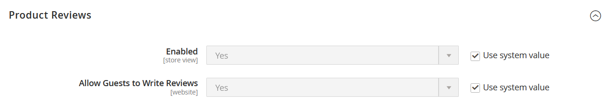

# [!UICONTROL Catalog] > [!UICONTROL Catalog]

{{config}}

## [!UICONTROL Product Fields Auto-Generation]

<!-- zoom -->

<!-- [Product Fields Auto-Generation](https://docs.magento.com/user-guide/catalog/product-fields-autogenerated.html) -->

| Campo | [Ámbito](../../getting-started/websites-stores-views.md#scope-settings) | Descripción |
|--- |--- |--- |
| [!UICONTROL Mask for SKU] | Global | Determina el valor predeterminado del campo SKU en función de los valores de marcador de posición de otros campos y cualquier texto adicional introducido. Marcador de posición predeterminado:  Nombre del producto - `{{name}}` |
| [!UICONTROL Mask for Meta Title] | Global | Determina el valor predeterminado del campo MetaTitle en función de los valores de marcador de posición de otros campos y del texto adicional que se escriba. Marcador de posición predeterminado:  Nombre del producto - `{{name}}` |
| [!UICONTROL Mask for Meta Keywords] | Global | Determina el valor predeterminado de _Palabras clave meta_ se basa en los valores de marcador de posición de otros campos y en cualquier texto adicional introducido. Marcador de posición predeterminado:  Nombre del producto - `{{name}}` |
| [!UICONTROL Mask for Meta Description] | Global | Determina el valor predeterminado del campo Meta descripción en función de los valores de marcador de posición de otros campos y cualquier texto adicional que se introduzca. Marcador de posición predeterminado:  Nombre del producto - `{{name}}`  Descripción - `{{description}}` |

{style="table-layout:auto"}

## [!UICONTROL Product Reviews]

<!-- zoom -->

<!-- [Product Reviews](https://docs.magento.com/user-guide/marketing/product-reviews.html) -->

| Campo | [Ámbito](../../getting-started/websites-stores-views.md#scope-settings) | Descripción |
|--- |--- |--- |
| [!UICONTROL Enabled] | Vista de tienda | Habilita las críticas de producto. Opciones: `Yes` / `No` |
| [!UICONTROL Allow Guests to Write Reviews] | Sitio web | Determina si los clientes deben abrir una cuenta en la tienda para poder escribir críticas de productos. |

{style="table-layout:auto"}

## [!UICONTROL Storefront]

<!-- zoom -->

<!-- [Storefront](https://docs.magento.com/user-guide/catalog/navigation-product-listings.html) -->

| Campo | [Ámbito](../../getting-started/websites-stores-views.md#scope-settings) | Descripción |
|--- |--- |--- |
| [!UICONTROL List Mode] | Vista de tienda | Determina el formato de la lista de resultados de búsqueda. Opciones:  **`Grid Only`**- Da formato a la lista como una cuadrícula de filas y columnas. Cada producto aparece en una sola celda de la cuadrícula. **`List Only`** - Da formato a la lista con cada producto en una fila independiente.  **`Grid (default / List)`**: De forma predeterminada, los productos aparecen en la vista Cuadrícula y se pueden alternar a la vista Lista. **`List (default / Grid)`** - De forma predeterminada, los productos aparecen en la vista de lista y se pueden cambiar a la vista de cuadrícula. |
| [!UICONTROL Products per Page on Grid Allowed Values] | Vista de tienda | Determina el número de productos mostrados en la vista de cuadrícula. Para proporcionar una selección de opciones, introduzca varios valores separados por comas. |
| [!UICONTROL Products per Page on Grid Default Value] | Vista de tienda | Determina el número de productos mostrados por página de forma predeterminada en la vista de cuadrícula. |
| [!UICONTROL Products per Page on List Allowed Values] | Vista de tienda | Determina el número de productos mostrados en la vista de lista. Para proporcionar una selección de opciones, introduzca varios valores separados por comas. |
| [!UICONTROL Products per Page on List Default Value] | Vista de tienda | Determina el número de productos mostrados por página de forma predeterminada en la vista de lista. |
| Lista de productos Ordenar por | Vista de tienda | Determina el criterio de ordenación de la lista de resultados de búsqueda. La selección de opciones viene determinada por la Configuración de visualización de la categoría y los atributos disponibles que se han configurado para ser `Used for Sorting in Product Listing`. El valor predeterminado es `Use All Available Attributes` y generalmente incluye Mejor valor, Nombre y Precio. Esta configuración no se aplica a [!DNL Live Search] [Widget de página de lista de productos](https://experienceleague.adobe.com/en/docs/commerce-merchant-services/live-search/live-search-storefront/plp-styling). |
| [!UICONTROL Allow All Products per Page] | Vista de tienda | Si se establece en `Yes`, incluye el `ALL` en el control &quot;Mostrar por página&quot;. |
| [!UICONTROL Remember Category Pagination] | Global | Si se establece en `Yes`, los valores de paginación de categoría actuales se guardan cuando los clientes navegan de una categoría a otra en [listados de productos](../../catalog/navigation-product-listings.md). Guardar el valor utiliza más almacenamiento en caché y puede afectar a la forma en que los motores de búsqueda indexan las páginas. Opciones: `Yes` / `No` (predeterminado) |
| [!UICONTROL Use Flat Catalog Category] | Global | Habilita el [estructura de categoría plana](../../catalog/catalog-flat.md) (no recomendado). Opciones: `Yes` / `No` |
| [!UICONTROL Use Flat Catalog Product] | Global | Habilita la estructura de producto plana. (no recomendado) Opciones: `Yes` / `No` |
| [!UICONTROL Swatches per Product] | Vista de tienda | Determina el número de muestras disponibles para cada producto. Predeterminado: `16` |
| [!UICONTROL Show Swatches in Product List] | Vista de tienda | Determina si las muestras aparecen en la lista de productos. Opciones: `Yes` / `No` |
| [!UICONTROL Show Swatch Tooltip] | Vista de tienda | Determina si aparece la información de objeto de la muestra. Opciones: `Yes` / `No` |

{style="table-layout:auto"}

## [!UICONTROL Product Alerts]

<!-- zoom -->

<!-- [Product Alerts](https://docs.magento.com/user-guide/catalog/inventory-product-alerts.html) -->

| Campo | [Ámbito](../../getting-started/websites-stores-views.md#scope-settings) | Descripción |
|--- |--- |--- |
| [!UICONTROL Allow Alerts When Product Price Changes] | Vista de tienda | Determina si hay alertas por correo electrónico disponibles para los cambios de precio del producto. Opciones: `Yes` / `No` |
| [!UICONTROL Price Alert Email Template] | Vista de tienda | Identifica la plantilla que se usa para las alertas de correo electrónico de cambio de precio de productos. Plantilla predeterminada: `Product price alert` |
| [!UICONTROL Allow Alert When Product Comes Back in Stock] | Sitio web | Determina si los clientes pueden optar por recibir una alerta cuando el producto vuelva a estar disponible. Opciones: `Yes` / `No` |
| [!UICONTROL Stock Alert Email Template] | Vista de tienda | Identifica la plantilla que se utiliza para las notificaciones por correo electrónico de alertas de stock. Plantilla predeterminada: `Product stock alert` |
| [!UICONTROL Alert Email Sender] | Vista de tienda | Determina el contacto de la tienda que aparece como el remitente del mensaje de correo electrónico de alerta del producto. Opciones: `General Contact` / `Sales Representative` / `Customer Support` / `Custom Email` |

{style="table-layout:auto"}

## [!UICONTROL Product Alerts Run Settings]

<!-- zoom -->

<!-- [Product Alerts Run Settings](https://docs.magento.com/user-guide/catalog/inventory-product-alert-run-settings.html) -->

| Campo | [Ámbito](../../getting-started/websites-stores-views.md#scope-settings) | Descripción |
|--- |--- |--- |
| [!UICONTROL Frequency] | Global | Elija la frecuencia con la que se envían las alertas de productos. Opciones: `Daily` / `Weekly` / `Monthly` |
| [!UICONTROL Start Time] | Global | Elija a qué hora del día se inicia el proceso de alerta de producto. Este tiempo debe ser posterior a cualquier actualización de precio o inventario. |
| [!UICONTROL Error Email Recipient] | Global | Identifique la dirección de correo electrónico de la persona (normalmente un administrador de tienda) que debe recibir una notificación por correo electrónico cuando se produce un error en el proceso de alerta de producto. |
| [!UICONTROL Error Email Sender] | Global | Seleccione la función a la que pertenece el correo electrónico `from`. |
| [!UICONTROL Error Email Template] | Global | Seleccione la plantilla de correo electrónico que se utilizará para las notificaciones de error de alertas de producto. |

{style="table-layout:auto"}

## [!UICONTROL Product Image Placeholders]

<!-- zoom -->

<!-- [Product Image Placeholders](https://docs.magento.com/user-guide/catalog/product-image-placeholders.html) -->

| Campo | [Ámbito](../../getting-started/websites-stores-views.md#scope-settings) | Descripción |
|--- |--- |--- |
| [!UICONTROL Base Image] | Vista de tienda | Identifica el archivo de marcador de posición elegido para la imagen base. |
| [!UICONTROL Small Image] | Vista de tienda | Identifica el archivo de marcador de posición elegido para la imagen pequeña. |
| [!UICONTROL Swatch] | Vista de tienda | Identifica el archivo de marcador de posición elegido para la muestra. |
| [!UICONTROL Thumbnail] | Vista de tienda | Identifica el archivo de marcador de posición elegido para la miniatura. |
| [!UICONTROL Choose File] |  | Se desplaza al archivo y lo sube como imagen de marcador de posición para el tipo. |

{style="table-layout:auto"}

## [!UICONTROL Recently Viewed/Compared Products]

<!-- zoom -->

<!-- Recently Viewed/Compared Products](https://docs.magento.com/user-guide/marketing/products-viewed-compared.html) -->

| Campo | [Ámbito](../../getting-started/websites-stores-views.md#scope-settings) | Descripción |
|--- |--- |--- |
| [!UICONTROL Synchronize widget products with backend storage] | Global | Determina la sincronización de la información del widget de productos, como el ID de productos, con la base de datos. Esto permite reutilizar la información en otros dispositivos. |
| [!UICONTROL Show for Current] | Sitio web | Limita los productos mostrados al sitio web actual. Opciones: `Website` / `Store` / `Store View` |
| [!UICONTROL Default Recently Viewed Products Count] | Vista de tienda | Determina el número máximo de productos visualizados recientemente que aparecen en la lista. |
| [!UICONTROL Default Recently Compared Products Count] | Vista de tienda | Determina el número máximo de productos comparados recientemente que aparecen en la lista. |
| [!UICONTROL Lifetime of products in Recently Viewed Widget] | Global | Determina cuánto tiempo, en segundos, se muestran los productos visualizados en la lista visualizada recientemente. |
| [!UICONTROL Lifetime of products in Recently Compared Widget] | Global | Determina cuánto tiempo, en segundos, se muestran los productos comparados en la lista comparados recientemente. |

{style="table-layout:auto"}

## [!UICONTROL Product Video]

<!-- zoom -->

<!-- [Product Videos](https://docs.magento.com/user-guide/catalog/product-video.html) -->

| Campo | [Ámbito](../../getting-started/websites-stores-views.md#scope-settings) | Descripción |
|--- |--- |--- |
| [!UICONTROL YouTube API key] | Vista de tienda | Especifica la clave de API necesaria para conectarse al servidor de YouTube. |
| [!UICONTROL Autostart base video] | Vista de tienda | Para iniciar automáticamente el vídeo después de que se cargue la página, establezca en `Yes`. |
| [!UICONTROL Show related video] | Vista de tienda | Para mostrar vídeos relacionados, establezca en `Yes`. |
| [!UICONTROL Auto restart video] | Vista de tienda | Para habilitar la reproducción automática de vídeo, establezca en `Yes`. |

{style="table-layout:auto"}

## [!UICONTROL Price]

<!-- zoom -->

<!--Price](https://docs.magento.com/user-guide/catalog/catalog-price-scope.html) -->

| Campo | [Ámbito](../../getting-started/websites-stores-views.md#scope-settings) | Descripción |
|--- |--- |--- |
| [!UICONTROL Catalog Price Scope] | Global | Determina el ámbito de la moneda base. Opciones: `Global` / `Website` |
| [!UICONTROL Default Product Price] | Global |  (Solo Adobe Commerce) Define el precio de producto predeterminado, si corresponde. |

{style="table-layout:auto"}

## [!UICONTROL Layered Navigation]

>[!NOTE]
>
>La configuración de búsqueda estándar descrita en esta sección difiere para [Live Search](https://experienceleague.adobe.com/docs/commerce-merchant-services/live-search/overview.html).

<!-- [Layered Navigation - Automatic (equalize price ranges)](https://docs.magento.com/user-guide/catalog/navigation-layered-configuration.html) -->

<!-- zoom -->

<!-- zoom -->

<!-- zoom -->

| Campo | [Ámbito](../../getting-started/websites-stores-views.md#scope-settings) | Descripción |
|--- |--- |--- |
| [!UICONTROL Display Product Count] | Vista de tienda | Determina si el recuento de productos aparece después de cada atributo, intervalo de precios y categoría. Opciones: `Yes` / `No` |
| [!UICONTROL Price Navigation Step Calculation] | Vista de tienda | Determina el método utilizado para determinar la variable [paso de navegación de precios](../../catalog/navigation-layered.md#configure-price-navigation)). Opciones:  `Automatic (equalize price ranges)` - Basa el cálculo en la gama de precios de los productos del grupo.  `Automatic (equalize product counts)` - Basa el cálculo en el número de productos del grupo. Establece un umbral para el número mínimo de productos en el grupo, para evitar que se dividan en grupos más pequeños.  `Manual` : Utiliza el límite de división que introduzca para los intervalos de precios. |
| [!UICONTROL Default Price Navigation Step] | Vista de tienda | Determina el número de productos que se incluyen en cada paso. |
| [!UICONTROL Maximum Number of Price Intervals] | Vista de tienda | Establece un límite para el número de intervalos de precios que aparecen en la navegación por capas. |

{style="table-layout:auto"}

## [!UICONTROL Category Permissions]

{{ee-feature}}

<!-- zoom -->

<!-- [Category Permissions](https://docs.magento.com/user-guide/catalog/category-permissions.html) -->

| Campo | [Ámbito](../../getting-started/websites-stores-views.md#scope-settings) | Descripción |
|--- |--- |--- |
| [!UICONTROL Enable] | Global | Activa las restricciones de categoría. De forma predeterminada, el uso de esta función restringe todas las categorías. Opciones: `Yes` / `No` |
| [!UICONTROL Allow Browsing Category] | Sitio web | Determina quién puede examinar las categorías. Opciones:  `Yes, for Everyone` : permite a todos los visitantes y clientes navegar por la categoría.  `Yes, for Specified Customer Groups` : permite que solo los miembros de los grupos de clientes seleccionados examinen la categoría.  `No, Redirect to Landing Page` : deniega el acceso a la categoría y redirige a la página seleccionada. |
| [!UICONTROL Display Product Prices] | Sitio web | Controla la visualización de los precios del producto para la categoría. Opciones:  `Yes, for Everyone` - Permite a todos ver el precio de los productos en la categoría.  `Yes, for Specified Customer Groups` : permite que solo los miembros de los grupos de clientes seleccionados vean el precio de los productos de la categoría.  `No` - Desactiva la visualización de los precios de los productos para la categoría. |
| [!UICONTROL Allow Adding to Cart] | Sitio web | Determina quién puede comprar productos de la categoría. Opciones:  `Yes, for Everyone` - Permite a todos colocar productos de la categoría en sus carros de compras.  `Yes, for Specified Customer Groups` : permite que solo los miembros de los grupos de clientes seleccionados coloquen productos de la categoría en sus carros de compras.  `No` - No permite que nadie coloque productos de la categoría en sus carros de compras. |
| [!UICONTROL Disallow Catalog Search by] | Sitio web | Identifica los grupos de clientes a los que no se les permite buscar productos en la categoría. |

{style="table-layout:auto"}

## [!UICONTROL Search Engine Optimization]

<!-- zoom -->

<!-- [Search Engine Optimization](https://docs.magento.com/user-guide/catalog/product-search-engine-optimization.html) -->

| Campo | [Ámbito](../../getting-started/websites-stores-views.md#scope-settings) | Descripción |
|--- |--- |----------------------------------------------------------------------------------------------------------------------------------------------------------------------------------------------------------------------------------------------------------------------------------------------------------------------------------------------------------------------------------------------------------|
| [!UICONTROL Popular Search Terms] | Vista de tienda | Determina si _Términos de búsqueda populares_ se implementa en el almacén. Esta configuración no se aplica a las tiendas que utilizan [Live Search](https://experienceleague.adobe.com/docs/commerce-merchant-services/live-search/overview.html). Opciones: `Enable` / `Disable` |
| [!UICONTROL Product URL Suffix] | Vista de tienda | Determina si se aplica un sufijo, como html o htm, a las direcciones URL del producto. Si se utiliza, no incluya un punto antes del sufijo, ya que se aplica automáticamente. |
| [!UICONTROL Category URL Suffix] | Vista de tienda | Determina si se aplica un sufijo, como html o htm, a las direcciones URL de categoría. Si se utiliza, no incluya un punto antes del sufijo, ya que se aplica automáticamente. |
| [!UICONTROL Use Categories Path for Product URLs] | Vista de tienda | Determina si las rutas de categoría se incluyen en las direcciones URL del producto. Si lo hace, varias direcciones URL apuntarán a la misma página, lo que podría afectar a la clasificación de búsqueda. Para obtener más información, consulte [Metaetiqueta canónica](../../merchandising-promotions/meta-data.md#canonical-meta-tag). |
| [!UICONTROL Create Permanent Redirect for URLs if URL Key Changed] | Vista de tienda | Determina si se crea automáticamente una redirección permanente cada vez que cambia una clave URL. Cuando se implementa, la casilla de verificación Crear redireccionamiento personalizado para la URL antigua debajo del campo Clave de URL del producto está seleccionada de forma predeterminada. Opciones: `Yes` / `No` |
| [!UICONTROL Generate "category/product" URL Rewrites] | Global | Determina si Adobe Commerce genera datos y los guarda en tablas de reescritura cuando un usuario guarda una categoría que contiene muchos productos asignados. Opciones: `Yes` / `No`   **_Importante:_**Guardar estos datos generados en una tabla de reescrituras de URL puede degradar el rendimiento. Consulte [Redirecciones automáticas de productos](../../merchandising-promotions/url-redirect-product-automatic.md) para obtener más información. |
| [!UICONTROL Apply transliteration for product URL] | Vista de tienda | Determina si se aplica la transliteración al crear o actualizar direcciones URL de productos. Opciones: `Yes` / `No`. El valor predeterminado es `Yes`.   Para determinados casos de uso, debe deshabilitar la transliteración. Por ejemplo, si tiene una tienda en línea en chino, las prácticas recomendadas de SEO recomiendan que las direcciones URL de los productos coincidan con el nombre del producto. Configuración de la opción en `No` permite el uso de caracteres chinos en las direcciones URL del producto en lugar de un equivalente ASCII. |
| [!UICONTROL Page Title Separator] | Vista de tienda | Identifica el carácter que separa el nombre de categoría y la subcategoría en la barra de título del explorador. |
| [!UICONTROL Use Canonical Link Meta Tag for Categories] | Vista de tienda | Si hay varias direcciones URL que apuntan a la misma página de categoría, esta opción utiliza una metaetiqueta canónica para identificar la dirección URL de categoría que los motores de búsqueda deben indexar. La dirección URL incluye un nombre completo para la categoría mediante la etiqueta meta. Esto reduce el contenido duplicado y mejora la SEO. Opciones: `Yes` / `No` |
| [!UICONTROL Use Canonical Link Meta Tag for Products] | Vista de tienda | Si hay varias direcciones URL que apuntan a la misma página de producto, esta opción utiliza una metaetiqueta canónica para identificar la dirección URL del producto que los motores de búsqueda deben indexar. La dirección URL incluye un nombre completo para el producto mediante la etiqueta meta. Esto reduce el contenido duplicado y mejora la SEO. Opciones: `Yes` / `No` |

{style="table-layout:auto"}

## [!UICONTROL Category Top Navigation]

<!-- zoom -->

<!-- Category Top Navigation](https://docs.magento.com/user-guide/catalog/navigation-top.html) -->

| Campo | [Ámbito](../../getting-started/websites-stores-views.md#scope-settings) | Descripción |
|--- |--- |--- |
| [!UICONTROL Maximal Depth] | Global | Determina el número de niveles de subcategoría en la navegación superior. El valor predeterminado de `0` no impone ningún límite al número de niveles. |

{style="table-layout:auto"}

## [!UICONTROL Catalog Search]

Existen dos variaciones de la configuración de Búsqueda en el catálogo: Las opciones que están disponibles cuando [[!DNL Live Search]](https://experienceleague.adobe.com/docs/commerce-merchant-services/live-search/overview.html) está instalado y los que están disponibles para Adobe Commerce nativo. Siga las instrucciones de instalación.

### Adobe Commerce con [!DNL Live Search]

Cuando Live Search está instalado, la búsqueda en el catálogo incluye las siguientes opciones de configuración:

<!-- zoom -->

<!-- [Catalog Search for Live Search](https://docs.magento.com/user-guide/catalog/search-configuration.html) -->

| Campo | [Ámbito](../../getting-started/websites-stores-views.md#scope-settings) | Descripción |
|--- |--- |--- |
| [!UICONTROL Minimal Query Length] | Vista de tienda | Número mínimo de caracteres permitidos en una búsqueda en el catálogo. El valor establecido para esta opción debe ser compatible con el rango correspondiente establecido en las configuraciones del motor de búsqueda del Elasticsearch. Por ejemplo, si establece este valor en `2` en Adobe Commerce, actualice el valor en el motor de búsqueda. |
| [!UICONTROL Maximum Query Length] | Vista de tienda | Número máximo de caracteres permitidos en una búsqueda en el catálogo. El valor establecido para esta opción debe ser compatible con el rango correspondiente establecido en las configuraciones del motor de búsqueda del Elasticsearch. Por ejemplo, si establece este valor en 300 en Adobe Commerce, actualice el valor en el motor de búsqueda. |
| [!UICONTROL Number of top search results to cache] | Vista de tienda | El número de términos de búsqueda y resultados populares que se almacenarán en caché para obtener respuestas más rápidas. Introducción de un valor de `0` almacena en caché todos los términos y resultados de búsqueda cuando se introducen por segunda vez. Valor predeterminado: `100` |
| [!UICONTROL Autocomplete Limit] | Vista de tienda | Determina el número máximo de líneas disponibles en el [ventana emergente de tienda] página. El valor predeterminado se puede cambiar cuando Live Search está instalado y actualizar más tarde cambiando esta configuración. Valor predeterminado: `8` |

{style="table-layout:auto"}

### Adobe Commerce con Elasticsearch

Adobe Commerce nativo con Elasticsearch incluye las siguientes opciones de configuración:

<!-- zoom -->

<!-- [Catalog Search](https://docs.magento.com/user-guide/catalog/search-configuration.html) -->

>[!IMPORTANT]
>
>Debido al anuncio de fin de soporte de Elasticsearch 7 para agosto de 2023, se recomienda que todos los clientes de Adobe Commerce migren al motor de búsqueda OpenSearch 2.x. Para obtener información sobre la migración del motor de búsqueda durante la actualización del producto, consulte [Migración a OpenSearch](https://experienceleague.adobe.com/docs/commerce-operations/upgrade-guide/prepare/opensearch-migration.html) en el _Guía de actualización_.

| Campo | [Ámbito](../../getting-started/websites-stores-views.md#scope-settings) | Descripción |
|--- |--- |--- |
| [!UICONTROL Minimal Query Length] | Vista de tienda | Número mínimo de caracteres permitidos en una búsqueda en el catálogo. El valor establecido para esta opción debe ser compatible con el rango correspondiente establecido en las configuraciones del motor de búsqueda del Elasticsearch. Por ejemplo, si establece este valor en `2` en Adobe Commerce, actualice el valor en el motor de búsqueda. |
| [!UICONTROL Maximum Query Length] | Vista de tienda | Número máximo de caracteres permitidos en una búsqueda en el catálogo. El valor establecido para esta opción debe ser compatible con el rango correspondiente establecido en las configuraciones del motor de búsqueda del Elasticsearch. Por ejemplo, si establece este valor en 300 en Adobe Commerce, actualice el valor en el motor de búsqueda. |
| [!UICONTROL Number of top search results to cache] | Vista de tienda | El número de términos de búsqueda y resultados populares que se almacenarán en caché para obtener respuestas más rápidas. Introducción de un valor de `0` almacena en caché todos los términos y resultados de búsqueda cuando se introducen por segunda vez. Valor predeterminado: `100` |
| [!UICONTROL Enable EAV Indexer] | Global | Determina si desea habilitar o deshabilitar el indizador EAV de productos. Esta función mejora la velocidad de indexación y restringe el uso del indexador por extensiones de terceros. Esta opción solo se muestra para motores de búsqueda de Elasticsearch o Elasticsearch 5.0+. Opción predeterminada: `Yes` para habilitado |
| [!UICONTROL Autocomplete Limit] | Vista de tienda | Número máximo de consultas de búsqueda que se mostrarán debajo del campo de búsqueda para autocompletar búsqueda. Restringir esta cantidad aumenta el rendimiento de las búsquedas y reduce el tamaño de la lista mostrada. Valor predeterminado: `8` |
| Motor de búsqueda | Global | Identifica el motor de búsqueda necesario para procesar las solicitudes de datos de catálogo. Se requiere el Elasticsearch 7.6.x para todas las instalaciones de Adobe Commerce. Opción: `Elasticsearch 7` |
| [!UICONTROL Elasticsearch Server Hostname] | Global | Especifica el nombre del servidor del Elasticsearch. Valor predeterminado: `elasticsearch.internal` |
| [!UICONTROL Elasticsearch Server Port] | Global | Especifica el número del puerto del servidor utilizado por el Elasticsearch. Valor predeterminado: `9200` |
| [!UICONTROL Elasticsearch Index Prefix] | Global | Asigna un prefijo para identificar el índice del Elasticsearch. Valor predeterminado: `magento2` |
| [!UICONTROL Enable Elasticsearch HTTP Auth] | Global | Si está habilitada, utiliza la autenticación HTTP para solicitar un nombre de usuario y una contraseña antes de acceder al servidor de Elasticsearch. Opciones: `Yes` / `No` |
| [!UICONTROL Elasticsearch HTTP Username] | Global | Cuándo _Habilitar autenticación HTTP de Elasticsearch_ se establece en `Yes`, especifica el nombre de usuario para la autenticación HTTP del Elasticsearch. |
| [!UICONTROL Elasticsearch HTTP Password] | Global | Cuándo _Habilitar autenticación HTTP de Elasticsearch_ se establece en `Yes`, especifica la contraseña para la autenticación HTTP del Elasticsearch. |
| [!UICONTROL Elasticsearch Server Timeout] | Global | Determina el número de segundos antes de que se agote el tiempo de espera del servidor. Valor predeterminado: `15` |
| [!UICONTROL Test Connection] |  | Valida la conexión del Elasticsearch. |
| [!UICONTROL Enable Search Recommendations] | Vista de tienda | Determina si se ofrecen recomendaciones de búsqueda cuando una búsqueda no devuelve resultados y aparece en `Related search terms` de la página de resultados de la búsqueda. Opciones: `Yes` / `No`  Cuando se establece en Sí, se muestran opciones adicionales para _[!UICONTROL Search Recommendations Count]_y_[!UICONTROL Shows Results Count for Each Recommendation]_. |
| [!UICONTROL Search Recommendations Count] | Vista de tienda | Especifica el número de términos de búsqueda ofrecidos como recomendaciones. De forma predeterminada, no se muestran más de cinco. |
| [!UICONTROL Show Results Count for Each Recommendation] | Vista de tienda | Cuando se establece en `Yes`, el número de productos encontrados para la recomendación de búsqueda propuesta se muestra entre corchetes. Opciones: `Yes` / `No` |
| [!UICONTROL Enable Search Suggestions] | Vista de tienda | Determina si aparecen sugerencias de búsqueda para errores ortográficos comunes. Cuando está habilitada, se ofrecen sugerencias de búsqueda para cualquier solicitud que no devuelva resultados y que aparezca en `Did you mean` en la sección **Resultados de búsqueda** página. Las sugerencias de búsqueda pueden afectar al rendimiento de la búsqueda. Cuando se establece en `Yes`, se muestran opciones adicionales para Habilitar la búsqueda en Recommendations y campos asociados. Opciones: `Yes` / `No` |
| [!UICONTROL Search Suggestions Count] | Vista de tienda | Determina el número de sugerencias de búsqueda que se ofrecen. Por ejemplo: `2` |
| [!UICONTROL Show Results Count for Each Suggestion] | Vista de tienda | Determina si se muestra el número de resultados de búsqueda para cada sugerencia. Según el tema, el número suele aparecer entre corchetes después de la sugerencia. Opciones: `Yes` / `No` |
| [!UICONTROL Minimum Terms to Match] | Vista de tienda | Especifica un valor que corresponde al número de términos de la consulta con el que deben coincidir los resultados de la búsqueda para que se devuelvan. Esto garantiza una relevancia óptima de los resultados para los compradores. Los valores porcentuales se correlacionan con un número y, si es necesario, se redondean hacia abajo y se utilizan como el número mínimo de términos que deben coincidir en la consulta. El valor puede ser un entero negativo o positivo, un porcentaje negativo o positivo, una combinación de los dos o varias combinaciones. Para obtener más información, consulte [parámetro minimum_should_match](https://www.elastic.co/guide/en/elasticsearch/reference/current/query-dsl-minimum-should-match.html) en la documentación del Elasticsearch. |

{style="table-layout:auto"}

## [!UICONTROL Downloadable Product Options]

<!-- zoom -->

<!-- [Downloadable Product Options](https://docs.magento.com/user-guide/catalog/product-download-options.html) -->

| Campo | [Ámbito](../../getting-started/websites-stores-views.md#scope-settings) | Descripción |
|--- |--- |--- |
| [!UICONTROL Order Item Status to Enable Downloads] | Sitio web | Determina el estado de un pedido antes de que las descargas estén disponibles. Opciones: `Pending` / `Invoiced` |
| [!UICONTROL Default Maximum Number of Downloads] | Sitio web | Determina el número predeterminado de descargas disponibles para un cliente. |
| [!UICONTROL Shareable] | Sitio web | Determina si los clientes deben iniciar sesión en sus cuentas para acceder al vínculo de descarga. Opciones:  **Sí** : permite enviar el vínculo por correo electrónico, que luego se puede compartir con otros usuarios.  **No** : requiere que los clientes inicien sesión en sus cuentas para acceder al vínculo de descarga. |
| [!UICONTROL Default Sample Title] | Vista de tienda | Título predeterminado para todos los archivos de ejemplo. |
| [!UICONTROL Default Link Title] | Vista de tienda | El vínculo predeterminado para todos los títulos descargables. |
| [!UICONTROL Opens Links in New Window] | Sitio web | Determina si el vínculo de descarga se abre en una nueva ventana del explorador. Opciones: `Yes` / `No` |
| [!UICONTROL Use Content Disposition] | Vista de tienda | Determina cómo se envía el vínculo al contenido descargable, como datos adjuntos de correo electrónico o como vínculo en línea en una ventana del explorador. Opciones:  **`Attachment`**: el vínculo de descarga se entrega como archivo adjunto de correo electrónico. **`Inline`** : El vínculo de descarga se entrega como un vínculo en línea en una página web. |
| [!UICONTROL Disable Guest Checkout if Cart Contains Downloadable Items] | Sitio web | Determina si los invitados que compran productos descargables deben registrarse para obtener una cuenta e iniciar sesión para completar el proceso de cierre de compra. Opciones:  **`Yes`**- Si el carrito contiene productos descargables, el invitado tiene que registrarse para obtener una cuenta o iniciar sesión en una cuenta existente para completar la compra. **`No`** : el vínculo de descarga se entrega como un vínculo en línea en el cuerpo del mensaje de correo electrónico.    _**Nota:**_ El cierre de compra de invitado solo está disponible para productos de descarga si Compartir está establecido en `Yes`. |

{style="table-layout:auto"}

## [!UICONTROL Date & Time Custom Options]

<!-- zoom -->

<!-- Date & Time Custom Options](https://docs.magento.com/user-guide/stores/attribute-date-time-options.html) -->

| Campo | [Ámbito](../../getting-started/websites-stores-views.md#scope-settings) | Descripción |
|--- |--- |--- |
| [!UICONTROL Use JavaScript Calendar] | Vista de tienda | Determina si el calendario JavaScript se utiliza como control de entrada para los campos de fecha. Opciones: `Yes` / `No`  Si se establece en `No`, aparecerá un menú desplegable independiente para cada parte del campo de fecha. |
| [!UICONTROL Date Fields Order] | Vista de tienda | Establece el orden de los tres campos de fecha. Opciones: `Day` / `Month` / `Year` |
| [!UICONTROL Time Format] | Vista de tienda | Establece el formato de hora en un reloj de 12 o 24 horas. Opciones: `12h AM/PM` / `24h` |
| [!UICONTROL Year Range] | Vista de tienda | Define el intervalo de años inicial y final que aparecen en la variable _Año_ field. El valor debe introducirse en formato AAAA. |

{style="table-layout:auto"}

## [!UICONTROL Catalog Events]

{{ee-feature}}

<!-- zoom -->

<!-- [Catalog Events](https://docs.magento.com/user-guide/marketing/events-private-sales.html) -->

| Campo | [Ámbito](../../getting-started/websites-stores-views.md#scope-settings) | Descripción |
|--- |--- |--- |
| [!UICONTROL Enable Catalog Events Functionality] | Sitio web | Determina si el módulo Eventos está habilitado. |
| [!UICONTROL Enable Catalog Event Widget on Frontend] | Vista de tienda | Determina si el widget de evento está disponible en la tienda. Este es un bloque estático con información sobre los eventos del sitio. |
| [!UICONTROL Number of Events to be Displayed in the Event Slider Widget] | Vista de tienda | Determina el número de eventos que aparecen en el widget de deslizador de eventos de las páginas de categorías. Para anular la, utilice el `limit="x"` variable. |
| [!UICONTROL Events to Scroll per Click in Event Slider Widget] | Vista de tienda | Determina el número de eventos que aparecen en el widget de deslizador de eventos en páginas de CMS, como la página principal. Para anular la, utilice el `scroll="x"` variable. |

{style="table-layout:auto"}

## [!UICONTROL Rule-Based Product Relations]

{{ee-feature}}

<!-- zoom -->

<!-- [Rule-Based Product Relations](https://docs.magento.com/user-guide/marketing/product-related-rules.html) -->

| Campo | [Ámbito](../../getting-started/websites-stores-views.md#scope-settings) | Descripción |
|--- |--- |--- |
| [!UICONTROL Maximum Number of Products in Related Products List] | Global | Determina el número máximo de productos que pueden aparecer en la _Productos relacionados_ lista. |
| [!UICONTROL Show Related Products] | Global | Determina qué lista de productos relacionados aparece en la tienda. Puede ser la lista seleccionada manualmente en Información del producto, la lista generada en respuesta a una regla de relación de productos o una combinación de ambas. Opciones: `Both Selected and Rule-Based` / `Selected Only` / `Rule-Based Only` |
| [!UICONTROL Rotation Mode for Products in Related Products List] | Global | Determina el orden en que aparecen los productos en la _Productos relacionados_ lista aparecerán. Opciones: `Do not rotate` / `Shuffle` |
| [!UICONTROL Maximum Number of Products in Cross-Sell Product List] | Global | Determina el número máximo de productos que pueden aparecer en la lista de venta cruzada. |
| [!UICONTROL Show Cross-Sell Products] | Global | Determina qué lista de productos de venta cruzada aparece en la tienda. Puede ser la lista seleccionada manualmente en Información del producto, la lista generada en respuesta a una regla de relación de productos o una combinación de ambas. Opciones: `Both Selected and Rule-Based` / `Selected Only` / `Rule-Based Only` |
| [!UICONTROL Rotation Mode for Products in Cross-Sell Products List] | Global | Determina el orden en que aparecen los productos en la lista Productos de venta cruzada. Opciones: no girar / mezclar |
| [!UICONTROL Maximum Number of Products in Upsell Product List] | Global | Determina el número máximo de productos que pueden aparecer en la _Productos de promoción de ventas_ lista. |
| [!UICONTROL Show Upsell Products] | Global | Determina qué lista de productos de mejora de ventas aparece en la tienda. Puede ser la lista seleccionada manualmente en Información del producto, la lista generada en respuesta a una regla de relación de productos o una combinación de ambas. Opciones: `Both Selected and Rule-Based` / `Selected Only` / `Rule-Based Only` |
| [!UICONTROL Rotation Mode for Products in Upsell Product List] | Global | Determina el orden en que aparecen los productos en la lista Ampliar venta de productos. Opciones: `Do not rotate` / `Shuffle` |

{style="table-layout:auto"}
