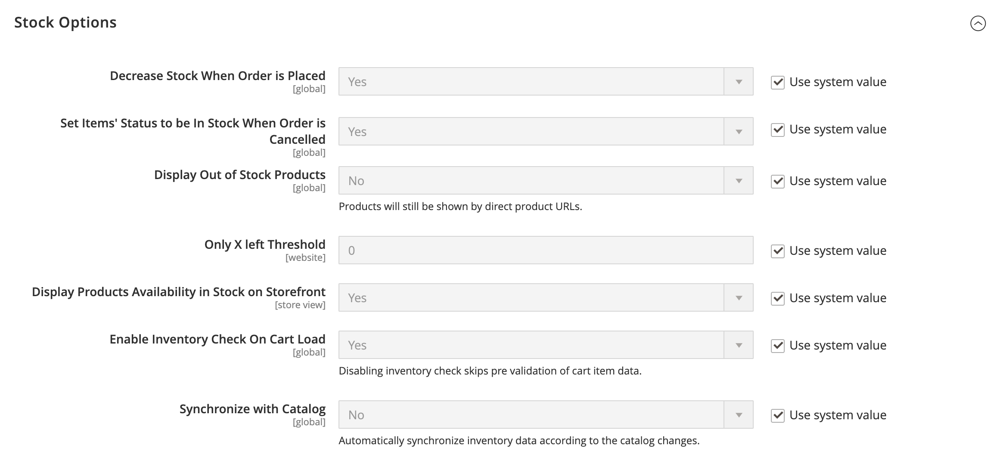

# [!UICONTROL Catalog] > [!UICONTROL Inventory]

{{config}}

>[!NOTE]
>
>[!DNL Inventory Management] para Adobe Commerce y Magento Open Source le proporciona las herramientas para administrar el inventario de productos. Los comerciantes con una sola tienda en varios almacenes, tiendas, ubicaciones de recogida, distribuidores directos entre otros pueden utilizar estas funciones para mantener las cantidades de ventas y gestionar los envíos para completar pedidos. Para obtener más información sobre estas características y cómo puede utilizarlas para administrar existencias en varias ubicaciones, consulte la [_[!DNL Inventory Management] Guía del usuario _](https://experienceleague.adobe.com/docs/commerce-admin/inventory/introduction.html).

## [!UICONTROL Stock Options]

<!-- zoom -->

<!-- [Stock Options](https://docs.magento.com/user-guide/catalog/inventory-options-global.html) -->

| Campo | [Ámbito](../../getting-started/websites-stores-views.md#scope-settings) | Descripción |
|--- |--- |--- |
| [!UICONTROL Decrease Stock When Order is Placed] | Global | Si se establece en `Yes`, disminuye la cantidad disponible cuando se realiza el pedido. Con _Administrar existencias_ habilitado, se escriben reservas para los productos y las cantidades pedidos. Opciones: `Yes` / `No` |
| [!UICONTROL Set Items' Status to be in Stock When Order is Cancelled] | Vista de tienda | Si se establece en `Yes`, devuelve el artículo a stock cuando se cancela el pedido. Con _Administrar existencias_ habilitado, se borra la reserva de los productos y las cantidades cancelados. Opciones: `Yes` / `No` |
| [!UICONTROL Display Out of Stock Products] | Global | Si se establece en `Yes`, muestra los productos sin existencias. Si las alertas de productos también están habilitadas, los clientes pueden registrarse para recibir una notificación cuando el producto esté disponible. Opciones: `Yes` / `No` |
| [!UICONTROL Only X left Threshold] | Sitio web | Establece el umbral para el mensaje `Only x left`. Por ejemplo, si se establece en 3, el mensaje aparece cuando hay tres o menos artículos en stock. El mensaje no aparece si el valor está establecido en `0`. |
| [!UICONTROL Display products availability in Stock on Storefront] | Vista de tienda | Si se establece en `Yes`, muestra un mensaje `In Stock` o `Out of Stock` en la página del producto. Opciones: `Yes` / `No` |
| [!UICONTROL Enable Inventory Check On Cart Load] | Global | Determina si se realiza una comprobación de inventario al cargar un producto en el carro de compras. Deshabilitar esta comprobación de inventario puede mejorar el rendimiento de los pasos de cierre de compra, especialmente cuando hay muchos artículos en el carro de compras. Sin embargo, si omite la prevalidación, los clientes podrían ver _errores de falta de existencias_ más adelante en el proceso de cierre de compra. Opciones: `Yes` / `No` |
| [!UICONTROL Synchronize with Catalog] | Global | Cuando se establece en `Yes`, los datos de inventario se ajustan según los cambios de catálogo (como eliminaciones de productos, cambios de SKU de productos y cambios de tipo de producto) y mantienen la coherencia entre el inventario y el catálogo. Opciones: `Yes` / `No` |

{style="table-layout:auto"}

## [!UICONTROL Product Stock Options]

<!-- zoom -->

<!-- [Product Stock Options](https://docs.magento.com/user-guide/catalog/inventory-options-global.html) -->

| Campo | [Ámbito](../../getting-started/websites-stores-views.md#scope-settings) | Descripción |
|--- |--- |----------------------------------------------------------------------------------------------------------------------------------------------------------------------------------------------------------------------------------------------------------------------------------------------------------------------------------------------------------------------------------------------------------------------------------------------------------------------------------------------------------------------------------------------------------------------------------------------------------------------------------------------------------------------------------------------------------------------------------------------------------------------------------|
| [!UICONTROL Manage Stock] | Global | Determina si utiliza el control de inventario completo para administrar los artículos del catálogo. Opciones:  **Sí**: activa el control de inventario completo para realizar un seguimiento del número de artículos que están actualmente en existencias.  **No**: no realiza el seguimiento del número de elementos que están actualmente en existencias. |
| [!UICONTROL Backorders] | Global | Determina la forma en que la tienda administra los pedidos pendientes. Un pedido pendiente no cambia el estado de procesamiento del pedido. Los fondos se siguen autorizando o capturando inmediatamente cuando se realiza el pedido, independientemente de si el producto está en stock. Cuando el producto está disponible, se envía. Opciones:  **Sin pedidos pendientes**: no acepta pedidos pendientes cuando el producto está agotado.  **Permitir cantidad inferior a 0** - Acepta pedidos pendientes cuando la cantidad es inferior a cero.  **Permitir cantidad inferior a 0 y Notificar al cliente**: acepta pedidos pendientes cuando la cantidad es inferior a cero, pero notifica a los clientes que aún se pueden realizar pedidos. |
| [!UICONTROL Use deferred Stock update] | Global |  (solo Adobe Commerce) Determina si se aplaza la actualización de existencias si se permiten los pedidos no satisfechos (la opción _Pedidos no satisfechos_ está establecida en cualquier valor que no sea el valor predeterminado de `No backorders`). Funciona para un solo producto o para un sitio web completo y usa el mecanismo _Cola de trabajos_ para permitir que los indicadores de cantidad de inventario se actualicen asincrónicamente después de realizar los pedidos. Esta opción también funciona con [ubicación asincrónica de pedidos](https://experienceleague.adobe.com/docs/commerce-operations/performance-best-practices/high-throughput-order-processing.html#asynchronous-order-placement) en combinación con [Inventory management](../../inventory-management/introduction.md). |
| Cantidad máxima permitida en el carro de compras | Global | Determina la cantidad máxima de un producto que se puede comprar en un único pedido. De forma predeterminada, la cantidad máxima está establecida en 10 000. |
| [!UICONTROL Out-of-Stock Threshold] | Global | Determina el nivel de existencias en el que se considera que un producto está agotado. Opciones:  **Importe positivo** - Con _Pedidos pendientes_ deshabilitados, escriba un importe positivo. Si la opción Pedidos no satisfechos está activada, se ignorará esta cantidad.  **Cero** - Con _Pedidos no satisfechos_ habilitados, ingresar `0` permite infinitos pedidos no satisfechos.  **Importe negativo** - Con _Pedidos no satisfechos_ habilitados, se recomienda especificar un importe negativo. El importe se añade a la cantidad vendible. Por ejemplo, introduzca -50 para permitir pedidos de hasta esta cantidad. |
| [!UICONTROL Minimum Qty Allowed in Shopping Cart] | Global | Determina la cantidad mínima de un artículo disponible para la compra según el grupo de clientes. De forma predeterminada, la cantidad mínima se establece en 1. Haga clic en **[!UICONTROL Add Minimum Qty]** para escribir un valor diferente para un grupo de clientes específico. |
| [!UICONTROL Notify for Quantity Below] | Global | Determina el nivel de stock al que se envía la notificación de que el inventario ha caído por debajo del umbral. |
| [!UICONTROL Enable Qty Increments] | Global | Determina si los artículos se pueden vender en incrementos de cantidad. Opciones: `Yes` / `No` |
| [!UICONTROL Qty Increments] | Global | Establece el número de productos que componen un incremento de cantidad. |
| [!UICONTROL Automatically Return Credit Memo Item to Stock] | Global | Determina si los artículos incluidos en las notas de abono se devuelven automáticamente al inventario. Opciones: `Yes` / `No` |

{style="table-layout:auto"}

## [!UICONTROL Admin Bulk Operations]

<!-- zoom -->

<!-- [Admin Bulk Operations](https://docs.magento.com/user-guide/catalog/inventory-options-global.html) -->

>[!NOTE]
>
>Para configurar y admitir **administradores de cola asincrónicos**, debe utilizar la línea de comandos. Esto puede requerir la asistencia del desarrollador. Consulte [Iniciar consumidores de cola de mensajes](https://experienceleague.adobe.com/docs/commerce-operations/configuration-guide/cli/start-message-queues.html) en la _Guía de configuración_.

| Campo | [Ámbito](../../getting-started/websites-stores-views.md#scope-settings) | Descripción |
|--- |--- |--- |
| [!UICONTROL Run asynchronously] | Global | Determina si ejecuta operaciones masivas de forma asincrónica para acciones de productos masivas, entre las que se incluyen [bulk](../../inventory-management/bulk-assignment.md) asignar orígenes, anular la asignación de orígenes y [transferir inventario a origen](../../inventory-management/inventory-transfer.md). Recopila acciones masivas hasta _[!UICONTROL Asynchronous batch size]_y luego ejecuta esas acciones. Esta función está desactivada de forma predeterminada. Se recomienda revisar el rendimiento con acciones masivas antes de habilitar. Opciones: **`Yes`**- Ejecuta todas las operaciones masivas de [!DNL Inventory Management] de forma asincrónica. Para habilitarlo, debe configurar un administrador de colas asincrónico. **`No`**- Predeterminado. No ejecuta operaciones masivas de forma asincrónica. |
| [!UICONTROL Asynchronous batch size] | Global | Establezca **[!UICONTROL Run asynchronously]** en `Yes` para introducir un valor para el campo _[!UICONTROL Asynchronous batch size]_.  El tamaño predeterminado del lote es 100. Cuando los procesos masivos alcanzan esta cantidad, se ejecutan. |

{style="table-layout:auto"}

## [!UICONTROL Inventory Indexer Settings]

| Campo | [Ámbito](../../getting-started/websites-stores-views.md#scope-settings) | Descripción |
|--- |--- |--- |
| [!UICONTROL Stock/Source reindex strategy] | Global | Determina la estrategia utilizada para la reindexación de stock/origen. Opciones: `Synchronous` / `Asynchronous` (se debe configurar un administrador de colas asincrónico para el modo asincrónico) |

{style="table-layout:auto"}

>[!NOTE]
>
> Debido a las dependencias de las actualizaciones de inventario para las actividades relacionadas con pedidos, el indizador de inventario también se activa al guardar el producto, independientemente de la configuración de `Synchronous` o `Asynchronous`.

## [!UICONTROL Distance Provider for Distance Based SSA]

<!-- zoom -->

<!-- [Distance Providers for Distance Based SSA](https://docs.magento.com/user-guide/catalog/inventory-configure-distance-priority.html) -->

| Campo | [Ámbito](../../getting-started/websites-stores-views.md#scope-settings) | Descripción |
|--- |--- |--- |
| [!UICONTROL Provider] | Global | Determina el proveedor que se utilizará para el algoritmo de selección Source de prioridad de distancia. Esta función está habilitada de forma predeterminada. Opciones:  **`Google MAP`**: utiliza los servicios de Google para calcular la distancia y el tiempo entre la dirección de destino de envío y las ubicaciones de origen (dirección y coordenadas GPS). Esta opción requiere una clave de API de Google y puede conllevar gastos a través de Google. **`Offline Calculation`**: calcula la distancia mediante una base de datos incrustada para determinar el origen más cercano a la dirección de destino de envío. Para utilizar esta opción, es posible que necesite asistencia para desarrolladores para descargar inicialmente el contenido de ubicación de la base de datos de todos los países a los que realiza envíos mediante una línea de comandos. |

{style="table-layout:auto"}

## [!UICONTROL Google Distance Provider]

<!-- zoom -->

<!-- [Google Distance Provider](https://docs.magento.com/user-guide/catalog/inventory-configure-distance-priority.html) -->

| Campo | [Ámbito](../../getting-started/websites-stores-views.md#scope-settings) | Descripción |
|--- |--- |--- |
| [!UICONTROL Google API key] | Global | Introduzca la clave de API de Google para el proveedor de Google MAP. La clave es del [!DNL Google Maps Platform] y debe tener [!DNL Geocoding API] y [!DNL Distance Matrix API] habilitados. Para obtener más información, consulte [Configurar el algoritmo de prioridad de distancia](../../inventory-management/distance-priority-algorithm.md#configure-the-distance-priority-algorithm) en la _Guía de Inventory management_. |
| [!UICONTROL Computation mode] | Global | Determina las direcciones y rutas para calcular la distancia desde la dirección de envío y todos los orígenes asignados al stock. De forma predeterminada, los cálculos utilizan el modo de conducción. Opciones:  **`Driving`**: configuración predeterminada, solicita instrucciones de conducción estándar mediante la red de carreteras. **`Walking`** - Solicita direcciones de caminata usando senderos peatonales y aceras (donde estén disponibles).  **`Bicycling`**- Solicita direcciones de ciclismo usando rutas de bicicleta y calles preferidas (actualmente solo disponible en los Estados Unidos y algunas ciudades canadienses). |
| [!UICONTROL Value] | Global | Indica lo que se debe calcular y devolver para la distancia y el tiempo de las ubicaciones de origen a la dirección de destino de envío. El algoritmo de prioridad de distancia recomienda el origen con la distancia o el tiempo más corto a la dirección de destino de envío, lo que ofrece envíos más rápidos y posiblemente más baratos. Opciones:  **`Distance`**- Devuelve la distancia entre puntos en métricas (kilómetros y metros) o imperiales (millas y pies). **`Time to Destination`**: devuelve el tiempo necesario para viajar desde las ubicaciones de origen a la dirección de envío en horas y minutos. |

{style="table-layout:auto"}
