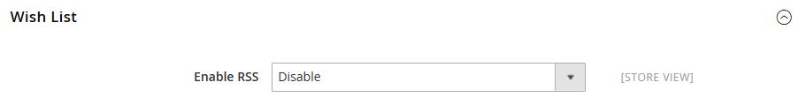

# [!UICONTROL Catalog] > [!UICONTROL RSS Feeds]

{{config}}

## [!UICONTROL Rss Config]

<!-- zoom -->

<!-- [Rss Config](https://experienceleague.adobe.com/es/docs/commerce-admin/marketing/communications/social-rss) -->

| Campo | [Ámbito](../../getting-started/websites-stores-views.md#scope-settings) | Descripción |
|--- |--- |--- |
| [!UICONTROL Enable RSS] | Vista de tienda | Permite a los clientes recibir fuentes RSS de la tienda. |

{style="table-layout:auto"}

Para obtener más información sobre cómo usar las fuentes RSS una vez habilitadas, consulte [Medios sociales y fuentes RSS](../../merchandising-promotions/social-rss.md).

## [!UICONTROL Wish List]

<!-- zoom -->

<!-- [Wish List](https://experienceleague.adobe.com/es/docs/commerce-admin/stores-sales/shopper-tools/wish-lists/wishlists) -->

| Campo | [Ámbito](../../getting-started/websites-stores-views.md#scope-settings) | Descripción |
|--- |--- |--- |
| [!UICONTROL Enable RSS] | Vista de tienda | Cuando se habilita, aparece un vínculo de fuente RSS en la parte superior de las páginas de la lista de artículos deseados. La página para compartir listas de deseos incluye una casilla de verificación que el cliente puede seleccionar para vincular a la fuente desde listas de deseos compartidas. |

{style="table-layout:auto"}

## [!UICONTROL Catalog]

<!-- zoom -->

<!-- [Catalog](https://experienceleague.adobe.com/es/docs/commerce-admin/catalog/catalog-menu) -->

| Campo | [Ámbito](../../getting-started/websites-stores-views.md#scope-settings) | Descripción |
|--- |--- |--- |
| [!UICONTROL New Products] | Vista de tienda | Cuando está activada, publica la notificación de los nuevos productos añadidos al catálogo de la tienda. |
| [!UICONTROL Special Products] | Vista de tienda | Cuando está activada, publica la notificación de cualquier producto con precios especiales. |
| [!UICONTROL Coupons/Discounts] | Vista de tienda | Cuando está activada, publica la notificación de cualquier cupón o descuento. |
| [!UICONTROL Top Level Category] | Vista de tienda | Publica una notificación de cualquier cambio realizado en la estructura de categorías de nivel superior del catálogo, que se refleja en el menú principal. |

{style="table-layout:auto"}

## [!UICONTROL Order]

<!-- zoom -->

<!-- [Order](https://experienceleague.adobe.com/es/docs/commerce-admin/stores-sales/order-management/orders/order-status#notification) -->

| Campo | [Ámbito](../../getting-started/websites-stores-views.md#scope-settings) | Descripción |
|--- |--- |--- |
| [!UICONTROL Customer Order Status Notification] | Vista de tienda | Permite a los clientes realizar un seguimiento del estado de sus pedidos por fuente RSS. Cuando se habilita, aparece un vínculo de fuente RSS en el pedido |

{style="table-layout:auto"}
