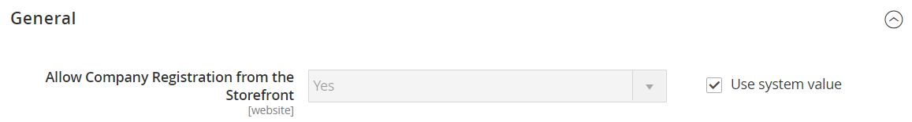

# [!UICONTROL Customers] > [!UICONTROL Company Configuration]

{{b2b-feature}}

{{config}}

>[!TIP]
>
>Con la instalación y activación de Adobe Commerce B2B, la experiencia de compra se puede personalizar con funciones específicas de la empresa. Adobe Commerce B2B es una solución integrada que admite modelos B2B y B2C. Para obtener más información sobre las características de B2B, consulte la [Guía del usuario de Adobe Commerce B2B](https://experienceleague.adobe.com/docs/commerce-admin/b2b/introduction.html).

>[!NOTE]
>
>El acceso a estas opciones de configuración para características B2B está controlado por los [recursos de rol](../../systems/permissions-user-roles.md#role-resources). Estos recursos de rol deben configurarse para la función de usuario asignada al usuario Administrador.

Para obtener más información acerca de cómo establecer esta configuración, consulte [Habilitar características básicas de B2B](../../b2b/enable-basic-features.md) en la _Guía del usuario de Adobe Commerce B2B_.

## [!UICONTROL General]

<!-- zoom -->

| Campo | [Ámbito](../../getting-started/websites-stores-views.md#scope-settings) | Descripción |
|--- |--- |--- |
| [!UICONTROL Allow Company Registration from the Storefront] | Sitio web | Determina si los visitantes de tu tienda tienen la opción de [registrar](../../customers/customer-sign-in.md) una cuenta de empresa o una cuenta individual. Opciones: `Yes` / `No` |

{style="table-layout:auto"}

## [!UICONTROL Email Options - Company Registration]

<!-- zoom -->

| Campo | [Ámbito](../../getting-started/websites-stores-views.md#scope-settings) | Descripción |
|--- |--- |--- |
| [!UICONTROL Company Registration Email Recipient] | Vista de tienda | El contacto de tienda que recibe una notificación cuando se envía una solicitud de registro de empresa desde la tienda. Opciones: `General Contact` / `Sales Representative` / `Customer Support` / `Custom Email 1` / `Custom Email 2` |
| [!UICONTROL Send Company Registration Email Copy To] | Vista de tienda | La dirección de correo electrónico de cada persona que va a recibir una copia de la notificación de registro. Separe varias direcciones de correo electrónico con una coma. |
| [!UICONTROL Send Email Copy Method] | Vista de tienda | El método de correo electrónico que se utiliza para enviar la copia del correo electrónico de registro. Opciones: `Bcc` / `Separate Email` |
| [!UICONTROL Default Company Registration Email] | Vista de tienda | La plantilla de correo electrónico que se utiliza de forma predeterminada para la notificación de registro de la empresa. Plantilla predeterminada: `Company Registration Request` |

{style="table-layout:auto"}

## [!UICONTROL Customer-Related Emails]

<!-- zoom -->

| Campo | [Ámbito](../../getting-started/websites-stores-views.md#scope-settings) | Descripción |
|--- |--- |--- |
| [!UICONTROL Default 'Sales Rep Assigned' Email] | Vista de tienda | Plantilla de correo electrónico que se utiliza de forma predeterminada cuando se asigna un representante de ventas a una cuenta de empresa. Este correo electrónico se envía al representante de ventas y al administrador de la empresa. Plantilla predeterminada: `Sales Representative Assigned to Company` |
| [!UICONTROL Default 'Assign Company to Customer' Email] | Vista de tienda | Plantilla de correo electrónico que se utiliza de forma predeterminada cuando se asigna una cuenta de cliente individual a una cuenta de compañía. Este correo electrónico solo se envía al cliente. Plantilla predeterminada: `Assign Company to Customer` |
| [!UICONTROL Default 'Assign Company Admin' Email] | Vista de tienda | Plantilla de correo electrónico que se utiliza cuando se asigna un administrador de empresa a una empresa. Este correo electrónico se envía al representante de ventas y al administrador de la empresa. Plantilla predeterminada: `Assign Company Admin` |
| [!UICONTROL Default 'Company Admin Inactive' Email] | Vista de tienda | La plantilla de correo electrónico que se utiliza de forma predeterminada cuando el estado de la persona que actúa como administrador de la empresa se cambia a &quot;Inactivo&quot;. El sistema envía una notificación por correo electrónico del cambio a los administradores nuevos y anteriores de la empresa. Plantilla predeterminada: `Company Admin Set Inactive` |
| [!UICONTROL Default 'Company Admin Changed to Member' Email] | Vista de tienda | Plantilla de correo electrónico que se utiliza de forma predeterminada cuando el administrador anterior de la empresa se convierte en miembro de la empresa. El correo electrónico se envía únicamente al miembro de la empresa. Plantilla predeterminada: `Company Admin Changed to Member` |
| [!UICONTROL Default 'Customer Status Active' Email] | Vista de tienda | La plantilla de correo electrónico que se utiliza de forma predeterminada cuando el estado de un cliente se activa. Este correo electrónico solo se envía al cliente. Plantilla predeterminada: `Customer Status Active` |
| [!UICONTROL Default 'Customer Status Inactive' Email] | Vista de tienda | La plantilla de correo electrónico que se utiliza de forma predeterminada cuando el estado de un cliente se vuelve inactivo. Este correo electrónico solo se envía al cliente. Plantilla predeterminada: `Customer Status Inactive` |

{style="table-layout:auto"}

## [!UICONTROL Company Status Change]

<!-- zoom -->

| Campo | [Ámbito](../../getting-started/websites-stores-views.md#scope-settings) | Descripción |
|--- |--- |--- |
| [!UICONTROL Company Status Change Email Recipient] | Vista de tienda | El contacto de tienda al que se notifica cada vez que cambia el estado de una compañía. Opciones: `General Contact` / `Sales Representative` / `Customer Support` / `Custom Email 1` / `Custom Email 2` |
| [!UICONTROL Send Company Status Change Email Copy To] | Vista de tienda | La dirección de correo electrónico de cada persona que va a recibir una copia de la notificación de cambio de estado de la compañía. Separe varias direcciones de correo electrónico con una coma. |
| [!UICONTROL Send Email Copy Method] | Vista de tienda | El método de correo electrónico que se utiliza para enviar la copia de la notificación de cambio de estado. Opciones: `Bcc` / `Separate Email` |
| [!UICONTROL Default "Company Status Change to Active 1' Email] | Vista de tienda | Plantilla de correo electrónico que se usa cuando el estado de una compañía cambia de _Aprobación pendiente_ a _Activo_. Plantilla predeterminada: `Company Status Active 1` |
| [!UICONTROL Default 'Company Status Change to Active 2' Email] | Vista de tienda | Plantilla de correo electrónico que se usa de forma predeterminada cuando el estado de una compañía cambia de _Rechazado_ o _Bloqueado_ a _Activo_. Plantilla predeterminada: `Company Status Active 2` |
| [!UICONTROL Default 'Company Status Change to Rejected' Email] | Vista de tienda | Plantilla de correo electrónico que se usa de forma predeterminada cuando el estado de una compañía cambia a _Rechazado_. Plantilla predeterminada: `Company Status Rejected` |
| [!UICONTROL Default 'Company Status Change to Blocked' Email] | Vista de tienda | Plantilla de correo electrónico que se usa de forma predeterminada cuando el estado de una compañía cambia a _Bloqueado_. Plantilla predeterminada: `Company Status Blocked` |
| [!UICONTROL Default 'Company Status Change to Pending Approval' Email] | Vista de tienda | Plantilla de correo electrónico que se usa de forma predeterminada cuando el estado de una compañía cambia a _Aprobación pendiente_. Plantilla predeterminada: `Company Status Pending Approval` |

{style="table-layout:auto"}

## [!UICONTROL Company Credit]

<!-- zoom -->

| Campo | [Ámbito](../../getting-started/websites-stores-views.md#scope-settings) | Descripción |
|--- |--- |--- |
| [!UICONTROL Company Credit Change Email Sender] | Vista de tienda | El contacto de tienda al que se notifica cada vez que se produce un cambio en el crédito de una empresa. Opciones: `General Contact` / `Sales Representative` / `Customer Support` / `Custom Email 1` / `Custom Email 2` |
| [!UICONTROL Send Company Credit Change Email Copy To] | Vista de tienda | La dirección de correo electrónico de cada persona que va a recibir una copia de la notificación de cambio de crédito de la compañía. Separe varias direcciones de correo electrónico con una coma. |
| [!UICONTROL Send Email Copy Method] | Vista de tienda | El método de correo electrónico que se utiliza para enviar la copia de la notificación de cambio de crédito. Opciones: `Bcc` / `Separate Email` |
| [!UICONTROL Allocated Email Template] | Vista de tienda | Plantilla de correo electrónico que se utiliza de forma predeterminada cuando se asigna crédito de compañía. Este correo electrónico se envía al administrador de la empresa. Plantilla predeterminada: `Credit Limit Allocated` |
| [!UICONTROL Updated Email Template] | Vista de tienda | Plantilla de correo electrónico que se utiliza de forma predeterminada cuando se actualiza el límite de crédito de una empresa. Este correo electrónico se envía al administrador de la empresa. Plantilla predeterminada: `Credit Limit Updated` |
| [!UICONTROL Reimbursed Email Template] | Vista de tienda | La plantilla de correo electrónico que se usa de manera predeterminada cuando se hace un [reembolso](../../b2b/credit-company.md#apply-a-payment-to-a-company-account) al crédito de la compañía. Este correo electrónico se envía al administrador de la empresa. Plantilla predeterminada: `Credit Reimbursed` |
| [!UICONTROL Refunded Email Template] | Vista de tienda | La plantilla de correo electrónico que se utiliza de forma predeterminada cuando se devuelve una cantidad de un pedido al crédito de la empresa. Este correo electrónico se envía al administrador de la empresa. Plantilla predeterminada: `Order Refunded to Company Credit` |
| [!UICONTROL Reverted Email Template] | Vista de tienda | Plantilla de correo electrónico que se utiliza de forma predeterminada cuando se revierte un pedido a crédito de la compañía. Este correo electrónico se envía al administrador de la empresa. Plantilla predeterminada: `Order Reverted to Company Credit` |

{style="table-layout:auto"}
