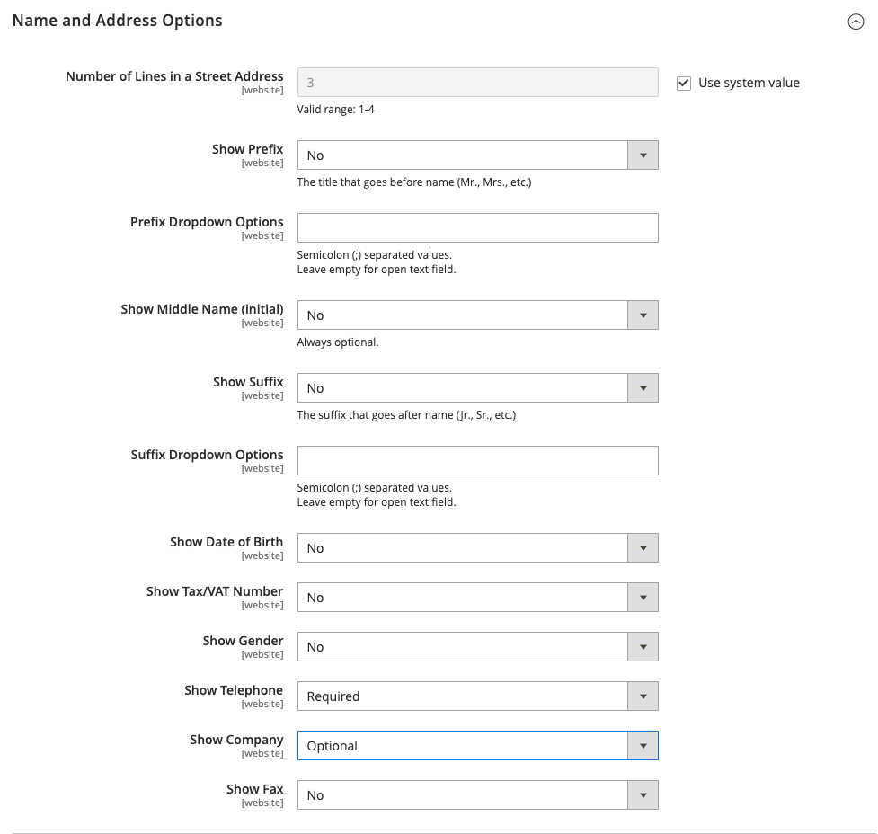

# [!UICONTROL Customers] > [!UICONTROL Customer Configuration]

{{config}}

## [!UICONTROL Account Sharing Options]

<!-- zoom -->

<!-- [Account Sharing Options](https://experienceleague.adobe.com/en/docs/commerce-admin/customers/customer-accounts/customer-account-scope) -->

| Campo | [Ámbito](../../getting-started/websites-stores-views.md#scope-settings) | Descripción |
|--- |--- |--- |
| [!UICONTROL Share Customer Accounts] | Global | Determina el ámbito de las cuentas de cliente en la jerarquía de almacén. Opciones:  **`Global`**: la información de la cuenta del cliente se comparte con cada sitio web y almacén en la instalación de Commerce. **`Per Website`**: la información de la cuenta del cliente se limita al sitio web donde se creó la cuenta. |

{style="table-layout:auto"}

## [!UICONTROL Online Customers Options]

<!-- zoom -->

<!-- [Online Customers Options](https://experienceleague.adobe.com/en/docs/commerce-admin/customers/customers-menu/now-online) -->

| Campo | [Ámbito](../../getting-started/websites-stores-views.md#scope-settings) | Descripción |
|--- |--- |--- |
| [!UICONTROL Online Minutes Interval] | Global | Determina durante cuánto tiempo se puede acceder a la actividad en línea de un cliente desde el administrador. Dejar vacío durante un intervalo predeterminado de 15 minutos. |
| [!UICONTROL Customer Data Lifetime] | Global | Determina el número de minutos antes de que caduquen los datos sin guardar introducidos por el cliente. De forma predeterminada, los datos sin guardar caducan al cabo de 60 minutos. |

{style="table-layout:auto"}

## [!UICONTROL Create New Account Options]

<!-- zoom -->

<!-- zoom -->

<!-- [Create New Account Options (VAT Fields)](https://experienceleague.adobe.com/en/docs/commerce-admin/customers/customer-accounts/configure/login-landing-page) -->

| Campo | [Ámbito](../../getting-started/websites-stores-views.md#scope-settings) | Descripción |
|--- |--- |--- |
| [!UICONTROL Enable Automatic Assignment to Customer Group] | Vista de tienda | Determina si los clientes se asignan automáticamente al grupo de clientes predeterminado. Para mostrar el número de IVA en la tienda, establece Mostrar número de IVA en la tienda y selecciona `Yes`. Opciones:  **`Yes`**: el sistema no valida automáticamente los ID de IVA de clientes ni cambia los grupos de clientes. **`No`**: el comportamiento del sistema es el habitual y el grupo de clientes predeterminado se puede establecer en el campo Grupo predeterminado. |
| [!UICONTROL Default Group] | Vista de tienda | Identifica el grupo de clientes inicial asignado cuando se crea una cuenta. |
| [!UICONTROL Default Value for Disable Automatic Group Changes Based on VAT ID] | Global | (Disponible sólo si el ámbito de configuración actual está establecido en `Default Group`.) Elija si el cambio automático del grupo de clientes basado en el ID de IVA está activado o desactivado de forma predeterminada. La configuración se puede sobrescribir en el nivel de producto. La configuración influye en el comportamiento del sistema en las siguientes situaciones:   - El Id. de IVA de la dirección predeterminada del cliente o todos los cambios de dirección predeterminada.  : el cambio de grupo de clientes se emuló durante el cierre de compra para un cliente registrado que no tenía una dirección guardada anteriormente o para un cliente que se registró durante el cierre de compra.  Si el cambio de grupo automático está habilitado, en el primer caso el grupo de clientes cambia automáticamente y en el segundo caso el grupo de clientes emulado temporalmente se asigna al cliente. Si el cambio de grupo automático está desactivado, el grupo de clientes asignado no cambia nunca, a menos que un administrador lo cambie manualmente. |
| [!UICONTROL Show VAT Number on Storefront] | Sitio web | Determina si el número de IVA es visible para los clientes de la tienda. Opciones: `Yes` / `No`   Afecta solo a las cuentas de cliente normales que no son B2B. Las cuentas de empresa tienen su propio campo de número de IVA independiente. |
| [!UICONTROL Default Email Domain] | Vista de tienda | Identifica el dominio de correo electrónico predeterminado para la tienda. Por ejemplo: `mystore.com` |
| [!UICONTROL Default Welcome Email] | Vista de tienda | Identifica la plantilla de correo electrónico usada para el correo electrónico predeterminado _Bienvenido_. |
| [!UICONTROL Default Welcome Email Without Password] | Vista de tienda | Plantilla de correo electrónico de bienvenida alternativa que se utiliza para las cuentas de cliente nuevas creadas por el administrador que aún no tienen asignada una contraseña. |
| [!UICONTROL Email Sender] | Vista de tienda | Identifica el contacto de tienda que aparece como remitente del correo electrónico de bienvenida. |
| [!UICONTROL Require Emails Confirmation] | Sitio web | Determina si una solicitud para crear una cuenta requiere la confirmación del cliente. Opciones: `Yes` / `No`.    _**Nota:**_ A partir de la versión 2.4.7, los clientes deben volver a escribir su correo electrónico y contraseña para iniciar sesión en su cuenta después de la confirmación del correo electrónico, independientemente del explorador. |
| [!UICONTROL Confirmation Link Email] | Vista de tienda | Identifica la plantilla de correo electrónico que se utiliza para el correo electrónico de confirmación. Plantilla predeterminada: `New account confirmation key` |
| [!UICONTROL Welcome Email] | Vista de tienda | Identifica la plantilla de correo electrónico que se utiliza para el mensaje de bienvenida que se envía después de que se confirme la cuenta. |
| [!UICONTROL Generate Human-Friendly Customer ID] | Global | Determina si el campo que se utiliza para introducir y almacenar el número de identificación fiscal es visible desde la tienda. Opciones: `Yes` / `No` |

{style="table-layout:auto"}

## [!UICONTROL Password Options]

<!-- zoom -->

<!-- [Password Options](https://experienceleague.adobe.com/en/docs/commerce-admin/customers/customer-accounts/configure/password-options) -->

| Campo | [Ámbito](../../getting-started/websites-stores-views.md#scope-settings) | Descripción |
|--- |--- |--- |
| [!UICONTROL Password Reset Protection Type] | Vista de tienda | Determina el método utilizado para restablecer la contraseña de una cuenta de cliente. Opciones:  **`By IP and Email`**: la contraseña se puede restablecer en línea después de recibir una respuesta de una notificación de restablecimiento que se envía a la dirección de correo electrónico asociada a la cuenta de administrador. **`By IP`** - La contraseña se puede restablecer en línea.  **`By Email`**: la contraseña se puede restablecer respondiendo a una notificación por correo electrónico que se envía a la dirección de correo electrónico asociada a la cuenta de administrador. **`None`**: solo el administrador del almacén puede restablecer la contraseña. |
| [!UICONTROL Max Number of Password Reset Requests] | Vista de tienda | Limita el número de solicitudes de restablecimiento de contraseña por hora. Para solicitudes ilimitadas, escriba cero (0). |
| [!UICONTROL Min Time Between Password Reset Requests] | Vista de tienda | Determina el número de minutos entre las solicitudes de restablecimiento de contraseña. Para que no haya retraso entre solicitudes, escriba cero (0). |
| [!UICONTROL Forgot Email Template] | Vista de tienda | Identifica la plantilla de correo electrónico que se utiliza cuando los clientes olvidan sus contraseñas. Plantilla predeterminada: `Forgot Password` |
| [!UICONTROL Remind Email Template] | Vista de tienda | Identifica la plantilla de correo electrónico que se utiliza cuando los clientes reciben un recordatorio de contraseña o una sugerencia. Plantilla predeterminada: `Remind Password` |
| [!UICONTROL Reset Password Template] | Vista de tienda | Determina la plantilla de correo electrónico que se utiliza cuando los clientes restablecen sus contraseñas. |
| [!UICONTROL Password Template Email Sender] | Vista de tienda | Determina el contacto de la tienda que aparece como remitente de los correos electrónicos relacionados con la contraseña. |
| [!UICONTROL Recovery Link Expiration Period (hours)] | Global | Especifica el número de horas antes de que caduque un vínculo de recuperación de contraseña. |
| [!UICONTROL Enable Autocomplete on login/forgot password forms] | Sitio web | Determina si el completado automático está habilitado en los formularios de inicio de sesión con contraseña olvidada. Opciones: `Yes` / `No` |
| [!UICONTROL Number of Required Character Classes] | Global | Determina el número de diferentes clases de caracteres (minúsculas, mayúsculas, numéricos y caracteres especiales) que deben incluirse en una contraseña. |
| [!UICONTROL Maximum Login Failures to Lockout Account] | Global | Determina el número de intentos de inicio de sesión erróneos hasta que se bloquee la cuenta del cliente. Para intentos ilimitados, escriba cero (`0`). |
| [!UICONTROL Minimum Password Length] | Global | Determina el número mínimo de caracteres permitidos en una contraseña. El número debe ser mayor que cero (`0`). |
| [!UICONTROL Lockout Time (minutes)] | Global | Determina la cantidad de minutos que una cuenta de cliente está bloqueada después de demasiados intentos fallidos de iniciar sesión. |

{style="table-layout:auto"}

## [!UICONTROL Account Information Options]

<!-- zoom -->

| Campo | [Ámbito](../../getting-started/websites-stores-views.md#scope-settings) | Descripción |
|--- |--- |--- |
| [!UICONTROL Change Email Template] | Vista de tienda | Identifica la plantilla de correo electrónico predeterminada que se utiliza cuando un cliente cambia su dirección de correo electrónico. |
| [!UICONTROL Change Email and Password Template] | Vista de tienda | Identifica la plantilla de correo electrónico predeterminada que se utiliza cuando un cliente cambia su dirección de correo electrónico y contraseña. |

{style="table-layout:auto"}

## [!UICONTROL Name and Address Options]

### Opciones del Magento Open Source

{{ce-feature}}

<!-- zoom -->

<!-- [Name and Address Options - Open Source](https://experienceleague.adobe.com/en/docs/commerce-admin/customers/customer-accounts/configure/name-address-options) -->

| Campo | [Ámbito](../../getting-started/websites-stores-views.md#scope-settings) | Descripción |
|--- |--- |--- |
| [!UICONTROL Number of Lines in a Street Address] | Sitio web | Determina el número de líneas de la dirección. La dirección de la calle consta de `1` a `4` líneas. Si el campo está en blanco, se usa la dirección de calle predeterminada de tres (`3`) líneas. |
| [!UICONTROL Show Prefix] | Sitio web | Determina si el nombre del cliente incluye un prefijo al principio, como las opciones Sr. y Sra.: `No` / `Optional` / `Required` |
| [!UICONTROL Prefix Dropdown Options] | Sitio web | Define la lista de opciones de prefijo. Separe los valores con punto y coma. Coloque un punto y coma antes del primer valor para mostrar un valor vacío en la parte superior de la lista. |
| [!UICONTROL Show Middle Name (initial)] | Sitio web | Determina si la inicial del segundo nombre se incluye como parte del nombre del cliente. Si se utiliza, la inicial central es un campo opcional. Opciones: `Yes` / `No` |
| [!UICONTROL Show Suffix] | Sitio web | Determina si el nombre del cliente incluye un sufijo al final, como Jr., Sr. y III. Opciones: `No` / `Optional` / `Required` |
| [!UICONTROL Suffix Dropdown Options] | Sitio web | Define la lista de opciones de sufijos. Separe los valores con punto y coma. Coloque un punto y coma antes del primer valor para mostrar un valor vacío en la parte superior de la lista. |
| [!UICONTROL Show Date of Birth] | Sitio web | Determina si la fecha de nacimiento del cliente se incluye en el formulario de nombre y dirección. Opciones: `No` / `Optional` / `Required`   **_Importante:_**De acuerdo con las prácticas recomendadas actuales de seguridad y privacidad, tenga en cuenta cualquier posible riesgo legal y de seguridad asociado con el almacenamiento de la fecha de nacimiento completa de los clientes (mes, día, año) con otros identificadores personales. Se recomienda limitar el almacenamiento de las fechas de nacimiento completas de los clientes y sugerir el uso del año de nacimiento del cliente como alternativa. |
| [!UICONTROL Show Tax/VAT Number] | Sitio web | Determina si el número de IVA [o de impuesto](../../stores-purchase/vat.md) está incluido en el formulario de nombre y dirección. Opciones: `No` / `Optional` / `Required` |
| [!UICONTROL Show Gender] | Sitio web | Determina si se incluye el sexo en el formulario de nombre y dirección. Opciones: `No` / `Optional` / `Required` |
| [!UICONTROL Show Telephone] | Sitio web | Determina si el número de teléfono del cliente está incluido en el formulario de nombre y dirección. Opciones: `No` / `Optional` / `Required` |
| [!UICONTROL Show Company] | Sitio web | Determina si la empresa del cliente está incluida en el formulario de nombre y dirección. Opciones: `No` / `Optional` / `Required` |
| [!UICONTROL Show Fax] | Sitio web | Determina si el número de fax del cliente está incluido en el formulario de nombre y dirección. Opciones: `No` / `Optional` / `Required` |

{style="table-layout:auto"}

### Opciones de Adobe Commerce

{{ee-feature}}

<!-- zoom -->

<!-- [Name and Address Options - Commerce](https://experienceleague.adobe.com/en/docs/commerce-admin/customers/customer-accounts/configure/name-address-options) -->

| Campo | [Ámbito](../../getting-started/websites-stores-views.md#scope-settings) | Descripción |
|--- |--- |--- |
| [!UICONTROL Prefix Dropdown Options] | Sitio web | Define la lista de opciones de prefijo. Separe los valores con punto y coma. Coloque un punto y coma antes del primer valor para mostrar un valor vacío en la parte superior de la lista. |
| [!UICONTROL Suffix Dropdown Options] | Sitio web | Define la lista de opciones de sufijos. Separe los valores con punto y coma. Coloque un punto y coma antes del primer valor para mostrar un valor vacío en la parte superior de la lista. |
| [!UICONTROL Show Telephone] | Sitio web | Determina si el número de teléfono del cliente está incluido en el formulario de nombre y dirección. Opciones: `No` / `Optional` / `Required` |
| [!UICONTROL Show Company] | Sitio web | Determina si la empresa del cliente está incluida en el formulario de nombre y dirección. Opciones: `No` / `Optional` / `Required` |
| [!UICONTROL Show Fax] | Sitio web | Determina si el número de fax del cliente está incluido en el formulario de nombre y dirección. Opciones: `No` / `Optional` / `Required` |

{style="table-layout:auto"}

## [!UICONTROL Store Credit Options]

{{ee-feature}}

<!-- zoom -->

<!-- [Store Credit Options](https://experienceleague.adobe.com/en/docs/commerce-admin/customers/customer-accounts/store-credit/credit-configure) -->

| Campo | [Ámbito](../../getting-started/websites-stores-views.md#scope-settings) | Descripción |
|--- |--- |--- |
| [!UICONTROL Enable Store Credit Functionality] | Global | Determina si el crédito de tienda está habilitado. Si lo desactiva, se eliminará el crédito de tienda de las cuentas de cliente y de la página Administrar clientes. Opciones: `Yes` / `No`. |
| [!UICONTROL Show Store Credit History to Customers] | Sitio web | Determina si el historial de saldos es visible en las cuentas de cliente. Opciones: `Yes` / `No`. |
| [!UICONTROL Refund Store Credit Automatically] | Global | Determina si el reembolso de la tienda se emite automáticamente. Opciones: `Yes` / `No` |
| [!UICONTROL Store Credit Update Email Sender] | Vista de tienda | Determina la identidad del almacén que aparece como remitente de las notificaciones de actualización de crédito enviadas a los clientes. |
| [!UICONTROL Store Credit Update Email Template] | Vista de tienda | Determina la plantilla de correo electrónico utilizada para las actualizaciones de crédito. |

{style="table-layout:auto"}

## [!UICONTROL Login Options]

<!-- zoom -->

<!-- [Login Options](https://experienceleague.adobe.com/en/docs/commerce-admin/customers/customer-accounts/configure/login-landing-page) -->

| Campo | [Ámbito](../../getting-started/websites-stores-views.md#scope-settings) | Descripción |
|--- |--- |--- |
| [!UICONTROL Redirect Customer to Account Dashboard after Logging in] | Sitio web | Determina lo que sucede después de que los clientes inicien sesión en sus cuentas. Para redirigir a los clientes a su panel de cuentas, seleccione `Yes`. Opciones:  **`Yes`**: el panel de cuentas aparece cuando los clientes inician sesión en sus cuentas. **`No`**: los clientes pueden seguir comprando después de iniciar sesión en sus cuentas. |

{style="table-layout:auto"}

## [!UICONTROL Address Templates]

<!-- zoom -->

<!-- [Address Templates](https://experienceleague.adobe.com/en/docs/commerce-admin/customers/customer-accounts/attributes/address-templates) -->

| Plantilla | [Ámbito](../../getting-started/websites-stores-views.md#scope-settings) | Descripción |
|--- |--- |--- |
| [!UICONTROL Text] | Vista de tienda | La plantilla se utiliza para todas las direcciones que se imprimen. |
| [!UICONTROL Text One Line] | Vista de tienda | Esta plantilla define el orden de las entidades de dirección en la lista de la libreta de direcciones del carro de compras del cliente. Progreso durante el cierre de compra. |
| [!UICONTROL HTML] | Vista de tienda | Esta plantilla define el orden de los campos de dirección ubicados en el área _Direcciones de clientes_ del panel de administración ([!UICONTROL Customers] > [!UICONTROL Manage Customers]). Esto también afecta a los que se encuentran en la página _Agregar nueva dirección_ cuando un cliente crea una dirección de facturación o envío en su página de cuenta. |
| [!UICONTROL PDF] | Vista de tienda | La plantilla define la visualización de las direcciones de facturación y envío en las facturas impresas, los envíos y las notas de abono. |

{style="table-layout:auto"}

## [!UICONTROL Customer Segments]

{{ee-feature}}

<!-- zoom -->

<!-- [Customer Segments](https://experienceleague.adobe.com/en/docs/commerce-admin/customers/segments/customer-segments) -->

| Plantilla | [Ámbito](../../getting-started/websites-stores-views.md#scope-settings) | Descripción |
|--- |--- |--- |
| [!UICONTROL Enable Customer Segment Functionality] | Global | Determina si se pueden utilizar segmentos de clientes para crear promociones segmentadas. Opciones: `Yes` / `No` |
| [!UICONTROL Real-time Check if Customer is Matched by Segment] | Global | Determina si los segmentos del cliente se validan en tiempo real. Opciones:  **[!UICONTROL Yes]**: los segmentos de cliente se validan en tiempo real (valor predeterminado). **[!UICONTROL No]**: los segmentos del cliente se validan mediante una única consulta SQL de condición combinada. Esto mejora el rendimiento de la validación de segmentos si hay muchos segmentos de clientes en el sistema. Sin embargo, la validación no funciona con una base de datos dividida o cuando no hay clientes registrados. |

{style="table-layout:auto"}

## [!UICONTROL CAPTCHA]

<!-- zoom -->

<!-- [CAPTCHA](https://experienceleague.adobe.com/en/docs/commerce-admin/systems/security/captcha/security-captcha) -->

| Campo | [Ámbito](../../getting-started/websites-stores-views.md#scope-settings) | Descripción |
|--- |--- |--- |
| [!UICONTROL Enable CAPTCHA on Storefront] | Sitio web | Habilita CAPTCHA en las tiendas asociadas con el sitio web de Commerce. Opciones: `Yes` / `No` |
| [!UICONTROL Font] | Sitio web | Determina la fuente utilizada para mostrar el CAPTCHA. Para agregar su propia fuente, coloque el archivo de fuente en el mismo directorio que la instalación de Commerce y agregue la declaración al archivo `config.xml` en `app/code/Magento/Captcha/etc`. |
| [!UICONTROL Forms] | Sitio web | Determina los formularios donde se utiliza CAPTCHA. Opciones:  `Applying Coupon Code`  `Checkout/Placing Order` `Create user`  `Login`  `Forgot password`  `Contact Us`  `Change password`  `Share Wishlist Form`  `Send to Friend Form`  `Payflow Pro` (ver [parche de seguridad](https://experienceleague.adobe.com/docs/commerce-knowledge-base/kb/troubleshooting/payments/paypal-payflow-pro-active-carding-activity.html))  `Add Gift Card Code`   `Create company`    _**Nota:**_ Los formularios Crear usuario, Olvidé la contraseña y Flujo de trabajo Pro siempre están habilitados cuando se seleccionan. |
| [!UICONTROL Displaying Mode] | Sitio web | Determina cuándo aparecerá el CAPTCHA. Opciones:  **`Always`**- siempre se requiere CAPTCHA para iniciar sesión. **`After number of attempts to login`**: esta opción solo se aplica al formulario de inicio de sesión de administrador. Cuando se selecciona, aparece el campo _[!UICONTROL Number of Unsuccessful Attempts to Login]_. Introduzca el número de intentos de inicio de sesión que desea permitir. Un valor de `0` (cero) es similar a establecer [!UICONTROL Displaying Mode] en `Always`. _**Nota:**_Para hacer un seguimiento del número de intentos de inicio de sesión erróneos, se cuenta cada intento de inicio de sesión en una dirección de correo electrónico y desde una dirección IP. El número máximo de intentos de inicio de sesión permitidos desde la misma dirección IP es de 1000. Esta limitación se aplica solamente cuando CAPTCHA está habilitado. |
| [!UICONTROL Number of Unsuccessful Attempts to Login] | Sitio web | Especifica el número de veces que un cliente puede intentar iniciar sesión antes de que se bloquee la cuenta. |
| [!UICONTROL CAPTCHA Timeout (minutes)] | Sitio web | Determina la duración del CAPTCHA actual. Cuando caduca el CAPTCHA, el usuario debe volver a cargar la página. |
| [!UICONTROL Number of Symbols] | Sitio web | Determina el número de símbolos que aparecen en el CAPTCHA, con un máximo de 8. También puede especificar un rango, por ejemplo, 5-8. |
| [!UICONTROL Symbols Used in CAPTCHA] | Sitio web | Determina las letras (a-z y A-Z) y los números (0-9) que aparecen en el CAPTCHA. Los símbolos que son difíciles de distinguir de otros símbolos, como `i`, `l` o `1`, no se incluyen en el conjunto predeterminado de símbolos CAPTCHA. |
| [!UICONTROL Case Sensitive] | Sitio web | Determina si los caracteres CAPTCHA distinguen entre mayúsculas y minúsculas. Opciones: `Yes` / `No` |

{style="table-layout:auto"}
