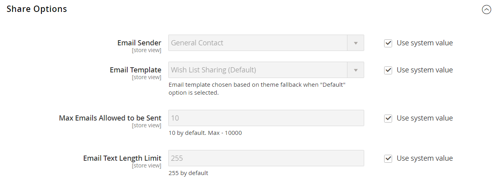

# [!UICONTROL Customers] > [!UICONTROL Wish List]

{{config}}

>[!NOTE]
>
>Una lista de deseos permite a los clientes registrados crear sus propias colecciones de productos que deseen comprar en el futuro. Las listas de deseos se pueden compartir entre clientes.

## [!UICONTROL General Options]

<!-- zoom -->

<!--[General Options](https://docs.magento.com/user-guide/marketing/wishlist-configuration.html) -->

| Campo | [Ámbito](../../getting-started/websites-stores-views.md#scope-settings) | Descripción |
|--- |--- |--- |
| [!UICONTROL Enabled] | Vista de tienda | Activa el módulo de la lista de artículos deseados de la tienda. Opciones: `Yes` / `No` |
| [!UICONTROL Show in Sidebar] | Vista de tienda | Especifica la visibilidad de las listas de deseos en la barra lateral.  Opciones: `Yes` / `No` |
| [!UICONTROL Enable Multiple Wish Lists] | Vista de tienda |  (Solo Adobe Commerce) Cuando se establece en `Yes`, permite a los clientes crear y mantener varias listas de deseos. Opciones: `Yes` / `No` |
| [!UICONTROL Number of Multiple Wish Lists] | Vista de tienda |  (Solo Adobe Commerce) Si se habilitan varias listas de deseos, determina el número máximo de listas de deseos que los clientes pueden tener asociadas a su cuenta. |

{style="table-layout:auto"}

## [!UICONTROL Share Options]

<!-- zoom -->

<!-- [Share Options](https://docs.magento.com/user-guide/marketing/wishlist-configuration.html) -->

| Campo | [Ámbito](../../getting-started/websites-stores-views.md#scope-settings) | Descripción |
|--- |--- |--- |
| [!UICONTROL Email Sender] | Vista de tienda | Determina el contacto de la tienda que aparece como el remitente del mensaje enviado cuando se comparte una lista de deseos. Contacto predeterminado: `General Contact` |
| [!UICONTROL Email Template] | Vista de tienda | Determina la plantilla de correo electrónico que se utiliza para el mensaje enviado cuando se comparte una lista de deseos. Plantilla predeterminada: `Share Wishlist` |
| [!UICONTROL Max Emails Allowed to be Sent] | Vista de tienda | Determina el número máximo de correos electrónicos que se pueden enviar en un lote. Establecer un límite máximo puede ayudar a reducir la carga en el servidor. El número máximo permitido es de 10 000. Valor predeterminado: `10` |
| [!UICONTROL Email Text Length Limit] | Vista de tienda | Determina el número máximo de caracteres que se pueden incluir en el mensaje. El número máximo permitido es de 10 000. Valor predeterminado: `255` |

{style="table-layout:auto"}

## [!UICONTROL My Wish List Link]

<!-- zoom -->

<!--[My Wish List Link](https://docs.magento.com/user-guide/marketing/wishlist-configuration.html) -->

| Campo | [Ámbito](../../getting-started/websites-stores-views.md#scope-settings) | Descripción |
|--- |--- |--- |
| [!UICONTROL Display Wish List Summary] | Sitio web | Configura la visualización del resumen de la lista de deseos en el panel de control de la cuenta del cliente. Opciones: `Display number of items in wish list` / `Display item quantities` |

{style="table-layout:auto"}
