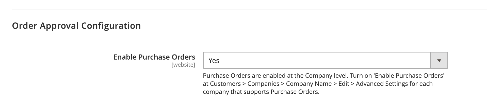

# [!UICONTROL General] > [!UICONTROL B2B Features]

{{b2b-feature}}

{{config}}

>[!TIP]
>
>Con la instalación y activación de Adobe Commerce B2B, la experiencia de compra se puede personalizar con funciones específicas de la empresa. Adobe Commerce B2B es una solución integrada que admite modelos B2B y B2C. Para obtener más información acerca de las características de B2B, consulte la [_Guía del usuario de Adobe Commerce B2B_](https://experienceleague.adobe.com/docs/commerce-admin/b2b/introduction.html?lang=es).

## [!UICONTROL B2B Features]

<!-- zoom -->

| Campo | [Ámbito](../../getting-started/websites-stores-views.md#scope-settings) | Descripción |
|------- |----------------------------------------------------------------------- |------------ |
| [[!UICONTROL Enable Company]](../../b2b/account-companies.md) | Sitio web | Cuando está habilitada, permite a los clientes administrar la asignación de su compañía desde su panel de cuentas y también habilita las funciones de Catálogo compartido y Oferta B2B de forma predeterminada. Opciones: `Yes` / `No` |
| [[!UICONTROL Enable Quick Order]](../../b2b/quick-order.md) | Sitio web | Cuando está activada, permite a clientes e invitados realizar pedidos rápidamente en función del SKU o el nombre del producto. Opciones: `Yes` / `No` |
| [[!UICONTROL Enable Requisition List]](../../b2b/configure-requisition-lists.md) | Sitio web | Cuando está activada, permite a los clientes crear y gestionar listas de solicitudes desde su panel de control de cuentas. |

{style="table-layout:auto"}

<!-- zoom -->

Cuando la función Compañía está activada, hay campos adicionales disponibles para Catálogo compartido y Cotización B2B.

| Campo | [Ámbito](../../getting-started/websites-stores-views.md#scope-settings) | Descripción |
|------- |----------------------------------------------------------------------- |------------ |
| [[!UICONTROL Enable Shared Catalog]](../../b2b/catalog-shared.md) | Sitio web | Cuando se habilita, permite crear catálogos depurados con precios personalizados disponibles globalmente o limitados a empresas específicas. Opciones: `Yes` / `No` |
| [!UICONTROL Enable Shared Catalog direct products price assigning] | Sitio web | Cuando el campo _[!UICONTROL Enable Shared Catalog]_&#x200B;está establecido en `Yes`, esta opción está disponible. Cuando está activada, solo los productos asignados a un catálogo compartido se almacenan en el índice de precios. Los productos que no están asignados al catálogo compartido no se muestran en la tienda. Opciones: `Yes` / `No` |
| [[!UICONTROL Enable B2B Quote]](../../b2b/configure-quotes.md) | Sitio web | Cuando está activada, permite a los compradores de la empresa enviar una solicitud de presupuesto desde el carro de compras. Opciones: `Yes` / `No` |

{style="table-layout:auto"}

### [!UICONTROL Default B2B Payment Methods]

<!-- zoom -->

| Campo | [Ámbito](../../getting-started/websites-stores-views.md#scope-settings) | Descripción |
|------- |----------------------------------------------------------------------- |------------ |
| [!UICONTROL Applicable Payment Methods] | Global | Determina la selección de formas de pago disponibles para los compradores B2B. Opciones: `All Payment Methods` / `Specific Payment Methods` |
| [!UICONTROL Payment Methods] | Global | Especifica todos los métodos de pago disponibles para los compradores B2B. |

{style="table-layout:auto"}

### [!UICONTROL Default B2B Shipping Methods]

<!-- zoom -->

| Campo | [Ámbito](../../getting-started/websites-stores-views.md#scope-settings) | Descripción |
|------- |----------------------------------------------------------------------- |------------ |
| [!UICONTROL Applicable Shipping Methods] | Global | Determina la selección de los métodos de envío que están disponibles de forma predeterminada para los compradores B2B. Opciones: `All Shipping Methods` / `Specific Shipping Methods` |
| [!UICONTROL Shipping Methods] | Global | Especifica todos los métodos de envío que están disponibles de forma predeterminada para los compradores B2B.  **_Nota:_**&#x200B;También puedes limitar los métodos de envío para una [cuenta de compañía](../../b2b/account-companies.md) específica. |

{style="table-layout:auto"}

## [!UICONTROL Order Approval Configuration]

<!-- zoom -->

| Campo | [Ámbito](../../getting-started/websites-stores-views.md#scope-settings) | Descripción |
|------- |----------------------------------------------------------------------- |------------ |
| [[!UICONTROL Enable Purchase Orders]](../../stores-purchase/purchase-order.md) | Sitio web | Cuando está activada, permite a las empresas crear pedidos de compra. Opciones: `Yes` / `No` |

{style="table-layout:auto"}

