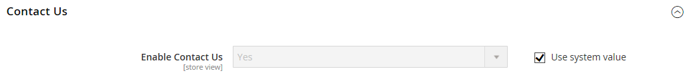

# [!UICONTROL General] > [!UICONTROL Contacts]

{{config}}

## [!UICONTROL Contact Us]

<!-- zoom -->

<!-- [Contact Us](https://experienceleague.adobe.com/en/docs/commerce-admin/start/setup/store-details#contact-us-form) -->

| Campo | [Ámbito](../../getting-started/websites-stores-views.md#scope-settings) | Descripción |
|--- |--- |--- |
| [!UICONTROL Enable Contact Us] | Vista de tienda | Habilita la página [_Contáctenos_](../../getting-started/store-details.md#contact-us-form) y coloca un vínculo en el pie de página. |

{style="table-layout:auto"}

## [!UICONTROL Email Options]

<!-- zoom -->

<!-- [Email Options](https://experienceleague.adobe.com/en/docs/commerce-admin/start/setup/store-details#contact-us-form) -->

| Campo | [Ámbito](../../getting-started/websites-stores-views.md#scope-settings) | Descripción |
|--- |--- |--- |
| [!UICONTROL Send Emails To] | Vista de tienda | Identifica la dirección de correo electrónico que recibe todas las respuestas de la página _Contáctenos_ |
| [!UICONTROL Email Sender] | Vista de tienda | Identifica el contacto de tienda que se usa para todas las respuestas a consultas por correo electrónico de la página _Contáctenos_. Remitente predeterminado: `Custom Email 2` |
| [!UICONTROL Email Template] | Vista de tienda | Especifica la plantilla que se utilizará como base para todas las respuestas a consultas por correo electrónico desde la página _Contáctenos_. Plantilla predeterminada: `Contact Form` |

{style="table-layout:auto"}
