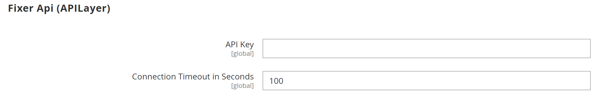

# [!UICONTROL General] > [!UICONTROL Currency Setup]

{{config}}

>[!NOTE]
>
>Consulte [Configuración de moneda](../../stores-purchase/currency-configuration.md) para obtener más información sobre estas configuraciones.

## [!UICONTROL Currency Options]

<!-- zoom -->

| Campo | [Ámbito](../../getting-started/websites-stores-views.md#scope-settings) | Descripción |
|--- |--- |--- |
| [!UICONTROL Base Currency] | Sitio web | La divisa principal utilizada para todas las transacciones de pago en línea. Para varias vistas de tienda, el ámbito del precio debe establecerse en la configuración de [Catalog](../catalog/catalog.md). |
| [!UICONTROL Default Display Currency] | Vista de tienda | La divisa principal utilizada para mostrar los precios. |
| [!UICONTROL Allowed Currencies] | Vista de tienda | Las divisas aceptadas por su tienda para el pago. |

{style="table-layout:auto"}

## [!UICONTROL Fixer.io (legacy)]

>[!IMPORTANT]
>
>A partir de la versión 2.4.6, el servicio [[!DNL Fixer.io]](https://fixer.io/) queda obsoleto y se ha sustituido por el servicio [[!DNL Fixer API] (APILayer)](https://apilayer.com/marketplace/fixer-api). Se recomienda encarecidamente que utilice una cuenta APILayer en lugar de una cuenta [!DNL Fixer.io] obsoleta.

<!-- zoom -->

| Campo | [Ámbito](../../getting-started/websites-stores-views.md#scope-settings) | Descripción |
|--- |--- |--- |
| [!UICONTROL API key] | Global | Clave utilizada para obtener acceso al servicio de conversión a través de su cuenta de [!DNL fixer.io]. Para obtener más información, vea [[!DNL fixer.io]](https://fixer.io/). |
| [!UICONTROL Connection Timeout in Seconds] | Global | Determina el número de segundos de inactividad antes de que se agote el tiempo de espera de una sesión de Fixer.io. Valor predeterminado: `100` |

{style="table-layout:auto"}

## [!UICONTROL Fixer Api (APILayer)]

<!-- zoom -->

| Campo | [Ámbito](../../getting-started/websites-stores-views.md#scope-settings) | Descripción |
|--- |--- |--- |
| [!UICONTROL API key] | Global | Clave utilizada para obtener acceso al servicio de conversión a través de su cuenta de [!DNL APILayer]. Para obtener más información, vea [[!DNL APILayer]](https://apilayer.com/). |
| [!UICONTROL Connection Timeout in Seconds] | Global | Determina el número de segundos de inactividad antes de que se agote el tiempo de espera de una sesión [!DNL APILayer]. El valor predeterminado es `100`. |

{style="table-layout:auto"}

## [!UICONTROL Currency Converter API]

<!-- zoom -->

| Campo | [Ámbito](../../getting-started/websites-stores-views.md#scope-settings) | Descripción |
|--- |--- |--- |
| [!UICONTROL API key] | Global | La clave utilizada para acceder al servicio de conversión. Para obtener más información, consulte [[!DNL Currency Convertor] API](https://free.currencyconverterapi.com/). |
| [!UICONTROL Connection Timeout in Seconds] | Global | Determina el número de segundos de inactividad antes de que se agote el tiempo de espera de una sesión de [!DNL Currency Converter]. Valor predeterminado:`100` |

{style="table-layout:auto"}

## [!UICONTROL Scheduled Import Settings]

<!-- zoom -->

| Campo | [Ámbito](../../getting-started/websites-stores-views.md#scope-settings) | Descripción |
|--- |--- |--- |
| [!UICONTROL Enabled] | Vista de tienda | Determina si la importación programada está habilitada para las tasas de cambio. Opciones: `Yes` / `No` |
| [!UICONTROL Service] | Vista de tienda | Especifica el servicio que proporciona los datos para la importación programada. El valor predeterminado es `fixer.io` |
| [!UICONTROL Start Time] | Vista de tienda | Indica la hora de inicio por hora, minuto y segundo, en función de un reloj de 24 horas. |
| [!UICONTROL Frequency] | Vista de tienda | Determina la frecuencia con la que se realiza la importación programada. Opciones: `Daily` / `Weekly` / `Monthly` |
| [!UICONTROL Error Email Recipient] | Vista de tienda | Identifica la dirección de correo electrónico de cada persona a la que se notifica por correo electrónico sobre errores de importación programados. Para varios destinatarios, separe cada entrada con una coma. |
| [!UICONTROL Error Email Sender] | Sitio web | Identifica el contacto de tienda que aparece como remitente de la notificación de error por correo electrónico. Remitente predeterminado: `General Contact` |
| [!UICONTROL Error Email Template] | Sitio web | Especifica la plantilla que se utiliza como base para la notificación de error por correo electrónico. Plantilla predeterminada: `Currency Update Warnings` |

{style="table-layout:auto"}
