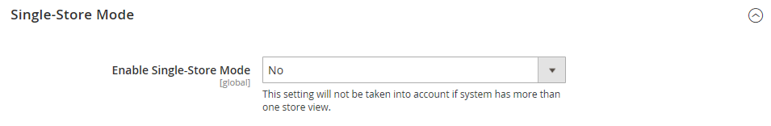

# [!UICONTROL General] > [!UICONTROL General]

{{config}}

## [!UICONTROL Country Options]

Consulte [Opciones de país](../../getting-started/store-details.md#country-options) para obtener más información sobre estos campos y opciones de configuración.

<!-- zoom -->

| Campo | [Ámbito](../../getting-started/websites-stores-views.md#scope-settings) | Descripción |
|--- |--- |--- |
| [!UICONTROL Default Country] | Vista de tienda | El país donde se encuentra su tienda. |
| [!UICONTROL Allow Countries] | Sitio web | Los países en los que acepta pedidos. |
| [!UICONTROL Zip/Postal Code is Optional for] | Global | Países que no requieren un código postal en la dirección de envío. |
| [!UICONTROL European Union Countries] | Global | Países miembros de la Unión Europea. |
| [!UICONTROL Top Destinations] | Vista de tienda | Los países principales a los que se dirigen las ventas. |

{style="table-layout:auto"}

## [!UICONTROL State Options]

Consulte [Opciones de estado](../../getting-started/store-details.md#state-options) para obtener más información sobre estos campos y opciones de configuración.

<!-- zoom -->

| Campo | [Ámbito](../../getting-started/websites-stores-views.md#scope-settings) | Descripción |
|--- |--- |--- |
| [!UICONTROL State is required for] | Global | Los países (donde realiza negocios) que requieren que se incluya una región o un estado en la dirección postal. |
| [!UICONTROL Allow to Choose State if It is Optional for Country] | Global | En el caso de los países donde no es obligatorio, determina si el campo _Región/Estado_ se incluye en la dirección postal del cliente.   **`Yes`**: incluye el campo _Región/Estado_ en la dirección del cliente, aunque el país no lo requiera. **`No`** - Omite el campo Región/Estado de la dirección del cliente si el país no lo requiere. |

{style="table-layout:auto"}

## [!UICONTROL Locale Options]

Consulte [Opciones de configuración regional](../../getting-started/store-details.md#locale-options) para obtener más información sobre estos campos y opciones de configuración.

<!-- zoom -->

| Campo | [Ámbito](../../getting-started/websites-stores-views.md#scope-settings) | Descripción |
|--- |--- |--- |
| [!UICONTROL Timezone] | Sitio web | Zona horaria del mercado primario que sirve el sitio web. Por lo general, la zona horaria es la misma que se utiliza en la ubicación física de su empresa. |
| [!UICONTROL Locale] | Vista de tienda | El idioma, la moneda y el sistema de medición que se utiliza en el mercado servido por la vista de la tienda. |
| [!UICONTROL Weight Unit] | Vista de tienda | La unidad de medida que se suele utilizar para envíos desde la configuración regional. Opciones: `lbs` / `kgs` |
| [!UICONTROL First Day of Week] | Vista de tienda | El día que se considera el primer día de la semana en el mercado servido por la vista de la tienda. |
| [!UICONTROL Weekend Days] | Vista de tienda | Los días que caen en el fin de semana en el mercado servido por la vista de la tienda. |

{style="table-layout:auto"}

## [!UICONTROL Website Restrictions]

{{ee-feature}}

<!-- zoom -->

Para obtener más información acerca de cómo cambiar esta configuración, consulte [Restricciones de acceso](../../merchandising-promotions/event-configure.md#access-restrictions) en la _Guía de promociones y comercialización_.

| Campo | [Ámbito](../../getting-started/websites-stores-views.md#scope-settings) | Descripción |
|--- |--- |--- |
| [!UICONTROL Access Restriction] | Sitio web | Determina si el sitio web funciona en modo restringido.   **`Yes`**: el acceso al sitio web está restringido de la manera establecida en los campos siguientes. **`No`**: las restricciones están deshabilitadas y la siguiente configuración no tiene ningún efecto. |
| [!UICONTROL Restriction Mode] | Sitio web | Determina el tipo de restricción de acceso que se aplica al sitio web.   **`Website Closed`**: todo acceso a la tienda está restringido y las direcciones URL de la tienda se redirigen temporalmente a la página de aterrizaje. Esta configuración puede resultar útil durante el mantenimiento del sitio o antes del lanzamiento. **`Private Sales: Login Only`**: solo los clientes registrados pueden iniciar sesión para acceder a la tienda. Todas las URL de la tienda se redirigen temporalmente a la página de aterrizaje especificada o al formulario de inicio de sesión. Los usuarios no pueden crear una cuenta en este modo. **`Private Sales: Login and Register`**: los usuarios deben iniciar sesión para tener acceso a la tienda. Todas las URL de tienda se redirigen temporalmente al formulario de inicio de sesión hasta que el usuario inicia sesión. Los usuarios pueden registrarse para obtener una cuenta mientras el sitio se encuentra en este modo. |
| [!UICONTROL Startup Page] | Vista de tienda | Cuando el sitio web se encuentra en modo de ventas privadas, esta configuración determina la página que aparece hasta que el cliente inicia sesión.    **`To login form`**: se redirige a los usuarios al formulario de inicio de sesión hasta que inicien sesión. **`To landing page`**: se redirigirá a los usuarios a la página estática especificada a continuación hasta que inicien sesión.   **_¡Importante!_**&#x200B;Asegúrese de incluir un vínculo a la página de inicio de sesión desde la página de aterrizaje especificada para que los clientes puedan iniciar sesión y acceder al sitio completo. |
| [!UICONTROL Landing Page] | Vista de tienda | Determina la primera página que aparece cuando el sitio web se encuentra en modo Ventas privadas. |
| [!UICONTROL HTTP Response] | Sitio web | Determina la respuesta HTTP que se envía cuando se cierra el sitio web y un bot, rastreador o araña intenta establecer una conexión.   **`503 Service unavailable`**: la página no está disponible, pero la araña no debe actualizar el índice. **`200 OK`**: la página de aterrizaje es correcta y la araña debe tratarla como la única página del sitio. |
| [!UICONTROL Enable Autocomplete on login/forgot password forms] | Sitio web | Determina si los campos de los formularios _Iniciar sesión_ y _Olvidé la contraseña_ se rellenan automáticamente a partir de las entradas anteriores. Opciones: `Yes` / `No` |

{style="table-layout:auto"}

## [!UICONTROL Store Information]

<!-- zoom -->

Para obtener más información acerca de cómo cambiar esta configuración, consulte [Información de la tienda](../../getting-started/store-details.md) en la _Guía de introducción_.

| Campo | [Ámbito](../../getting-started/websites-stores-views.md#scope-settings) | Descripción |
|--- |--- |--- |
| [!UICONTROL Store Name] | Vista de tienda | El nombre de la tienda asociada con la vista de la tienda. |
| [!UICONTROL Store Phone Number] | Vista de tienda | El número de teléfono principal de la tienda (asociado a la vista de la tienda) está abierto para las empresas. Por ejemplo: Lun - Vie, 9-5, Sáb 9-mediodía PST |
| País | Sitio web | El país de la empresa que administra el sitio web. |
| [!UICONTROL Region/State] | Sitio web | La región o el estado de la empresa que administra el sitio web. |
| [!UICONTROL ZIP/Postal Code] | Sitio web | El código postal de la empresa que administra el sitio web. |
| [!UICONTROL City] | Sitio web | La ubicación de la ciudad de la empresa que administra el sitio web. |
| [!UICONTROL Street Address] | Sitio web | La dirección postal de la empresa que administra el sitio web. |
| [!UICONTROL Street Address Line 2|]Sitio web | La segunda línea de la dirección de la calle comercial, si es necesario. |
| [!UICONTROL VAT Number] | Sitio web | El número de IVA de la empresa propietaria de la instalación de Commerce, si corresponde. |
| [!UICONTROL Validate VAT Number] |  | Comprueba el número de identificación del impuesto sobre el valor añadido. |

{style="table-layout:auto"}

## [!UICONTROL Single-Store Mode]

<!-- zoom -->

Para obtener más información sobre cómo cambiar esta configuración, consulte [Modo de tienda única](../../getting-started/websites-stores-views.md#single-store-mode) en la _Guía de introducción_.

| Campo | [Ámbito](../../getting-started/websites-stores-views.md#scope-settings) | Descripción |
|--- |--- |--- |
| [!UICONTROL Enable Single-Store Mode] | Global | Cuando se habilita para instalaciones de una sola tienda, oculta el cuadro Ámbito de configuración y las etiquetas de campo relacionadas Opciones: `Yes` / `No`  **_Nota:_**&#x200B;El modo de una sola tienda se omite para tiendas con más de una vista.  Al habilitar el modo de un solo almacén, se copiarán todos los datos específicos del catálogo y del almacén de productos de la vista de almacén predeterminada en todo el ámbito de la vista de almacén. Solo copiará los datos de catálogo y producto si la tienda solo tiene una vista de tienda. Si la tienda tiene una vista de tienda deshabilitada y una vista de tienda habilitada, no se copiarán los datos del catálogo y del producto.  Al habilitar el modo de tienda única se omiten las opciones de configuración específicas de la vista de tienda para los datos específicos del contenido. En su lugar, utiliza ajustes de configuración definidos en el ámbito de nivel global para garantizar la coherencia entre la IU de administración y la tienda. |

{style="table-layout:auto"}

## [!UICONTROL Data Services]

<!-- zoom -->

| Campo | [Ámbito](../../getting-started/websites-stores-views.md#scope-settings) | Descripción |
|--- |--- |--- |
| [!UICONTROL Commerce Events Enabled] | Global | Esta configuración está desactivada de forma predeterminada si es cliente de atención médica y ha instalado la extensión [Data Services HIPAA](https://experienceleague.adobe.com/es/docs/commerce/data-connection/hipaa-readiness). Como resultado, los datos de evento de tienda que usan Live Search y Recomendaciones de productos ya no se capturan. Esto se debe a que los datos de evento de tienda se generan en el lado del cliente. Para seguir capturando y enviando datos de evento de tienda para su uso por los servicios [Live Search](https://experienceleague.adobe.com/es/docs/commerce/live-search/overview) y [Product Recommendations](https://experienceleague.adobe.com/es/docs/commerce/product-recommendations/guide-overview), establezca **Eventos de Commerce habilitados** en `Yes`. |

{style="table-layout:auto"}
