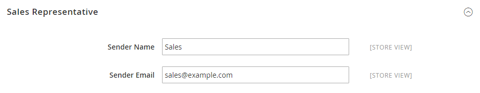

# [!UICONTROL General] > [!UICONTROL Store Email Addresses]

{{config}}

Consulte [Almacenar direcciones de correo electrónico](../../getting-started/store-details.md#store-email-addresses) para obtener información detallada sobre estos campos y opciones de configuración.

## [!UICONTROL General]

[!BADGE Solo SaaS]{type=Positive url="https://experienceleague.adobe.com/es/docs/commerce/user-guides/product-solutions" tooltip="Solo se aplica a proyectos de Adobe Commerce as a Cloud Service (infraestructura de SaaS administrada por Adobe)."}

<!-- zoom -->

| Campo | [Ámbito](../../getting-started/websites-stores-views.md#scope-settings) | Descripción |
|--- |--- |--- |
| [!UICONTROL Storefront Base URL] | Vista de tienda | La dirección URL base que se utilizará para construir los vínculos incluidos en los correos electrónicos de cara al cliente. La dirección URL debe finalizar con una barra diagonal. Por ejemplo, `https://www.example.com/`. |

{style="table-layout:auto"}

## [!UICONTROL General Contact]

<!-- zoom -->

| Campo | [Ámbito](../../getting-started/websites-stores-views.md#scope-settings) | Descripción |
|--- |--- |--- |
| [!UICONTROL Sender Name] | Vista de tienda | Nombre que aparece como remitente del correo electrónico enviado por la identidad `General Contact`. |
| [!UICONTROL Sender Email] | Vista de tienda | La dirección de correo electrónico asociada con la identidad `General Contact`. En Adobe Commerce as a Cloud Service, cree un ticket de asistencia para cambiar la dirección de correo electrónico. |

{style="table-layout:auto"}

## [!UICONTROL Sales Representative]

<!-- zoom -->

| Campo | [Ámbito](../../getting-started/websites-stores-views.md#scope-settings) | Descripción |
|--- |--- |--- |
| [!UICONTROL Sender Name] | Vista de tienda | Nombre que aparece como remitente del correo electrónico enviado por la identidad `Sales Representative`. |
| [!UICONTROL Sender Email] | Vista de tienda | La dirección de correo electrónico asociada con la identidad `Sales Representative`.  En Adobe Commerce as a Cloud Service, cree un ticket de asistencia para cambiar la dirección de correo electrónico. |

{style="table-layout:auto"}

## [!UICONTROL Customer Support]

<!-- zoom -->

| Campo | [Ámbito](../../getting-started/websites-stores-views.md#scope-settings) | Descripción |
|--- |--- |--- |
| [!UICONTROL Sender Name] | Vista de tienda | Nombre que aparece como remitente del correo electrónico enviado por la identidad `Customer Support`. |
| [!UICONTROL Sender Email] | Vista de tienda | La dirección de correo electrónico asociada con la identidad `Customer Support`.  En Adobe Commerce as a Cloud Service, cree un ticket de asistencia para cambiar la dirección de correo electrónico. |

{style="table-layout:auto"}

## Correo electrónico personalizado 1

<!-- zoom -->

| Campo | [Ámbito](../../getting-started/websites-stores-views.md#scope-settings) | Descripción |
|--- |--- |--- |
| [!UICONTROL Sender Name] | Vista de tienda | Nombre que aparece como remitente del correo electrónico enviado por la identidad `Custom 1`. |
| [!UICONTROL Sender Email] | Vista de tienda | La dirección de correo electrónico asociada con la identidad `Custom 1`.  En Adobe Commerce as a Cloud Service, cree un ticket de asistencia para cambiar la dirección de correo electrónico. |

{style="table-layout:auto"}

## Correo electrónico personalizado 2

<!-- zoom -->

| Campo | [Ámbito](../../getting-started/websites-stores-views.md#scope-settings) | Descripción |
|--- |--- |--- |
| [!UICONTROL Sender Name] | Vista de tienda | Nombre que aparece como remitente del correo electrónico enviado por la identidad `Custom 2`. |
| [!UICONTROL Sender Email] | Vista de tienda | La dirección de correo electrónico asociada con la identidad `Custom 2`.  En Adobe Commerce as a Cloud Service, cree un ticket de asistencia para cambiar la dirección de correo electrónico. |

{style="table-layout:auto"}
