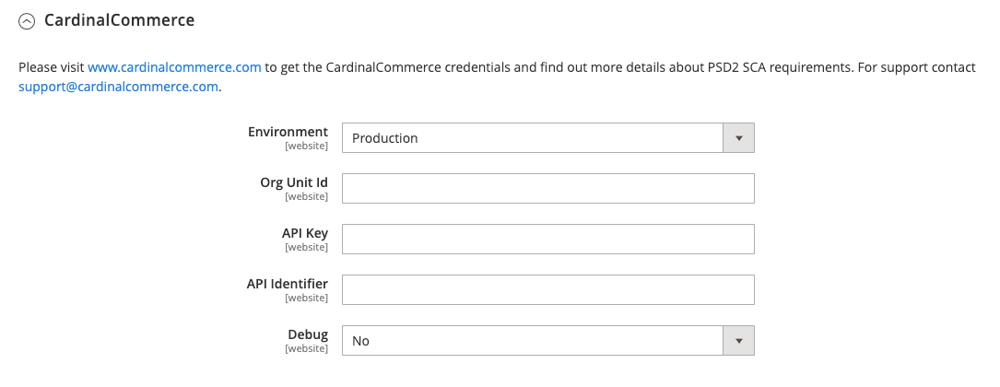

# [!UICONTROL Sales] > [!UICONTROL 3D Secure]

[!DNL 3-D Secure] fue desarrollado por [!DNL Visa] para promover transacciones seguras en línea. Ejemplos de [!DNL 3-D Secure] las soluciones creadas por redes de tarjetas están verificadas por [!DNL Visa], [!DNL Mastercard SecureCode], [!DNL American Express SafeKey], y [!DNL CardinalCommerce Consumer Authentication]. [!DNL CardinalCommerce] es líder mundial en autenticación de transacciones digitales y es una filial de propiedad total de [!DNL Visa].

[!DNL 3-D Secure] la versión 2.0 admite numerosas mejoras, incluidos métodos de autenticación avanzados y flujo de autenticación, así como un mejor uso compartido de datos entre comerciante y emisor.

>[!NOTE]
>
>El [Braintree](../../stores-purchase/braintree.md) la pasarela de pago también admite [!DNL 3-D Secure] verificación.

{{config}}

## [!UICONTROL CardinalCommerce]

<!-- zoom -->

| Campo | [Ámbito](../../getting-started/websites-stores-views.md#scope-settings) | Descripción |
|--- |--- |--- |
| [!UICONTROL Environment] | Sitio web | Indica el modo de funcionamiento de su [!DNL CardinalCommerce] cuenta. Si está ejecutando en un entorno de prueba, elija &quot;Zona protegida&quot;. Opciones: Zona protegida/Producción (predeterminada) |
| [!UICONTROL Org Unit ID] | Sitio web | El identificador de la unidad organizativa de su [!DNL CardinalCommerce] cuenta de comerciante. |
| [!UICONTROL API Key] | Sitio web | La clave API de su [!DNL CardinalCommerce] cuenta de comerciante. |
| [!UICONTROL API Identifier] | Sitio web | El identificador de API de su [!DNL CardinalCommerce] cuenta de comerciante. |
| [!UICONTROL Debug] | Sitio web | Opciones: `Yes` / `No` |

{style="table-layout:auto"}
