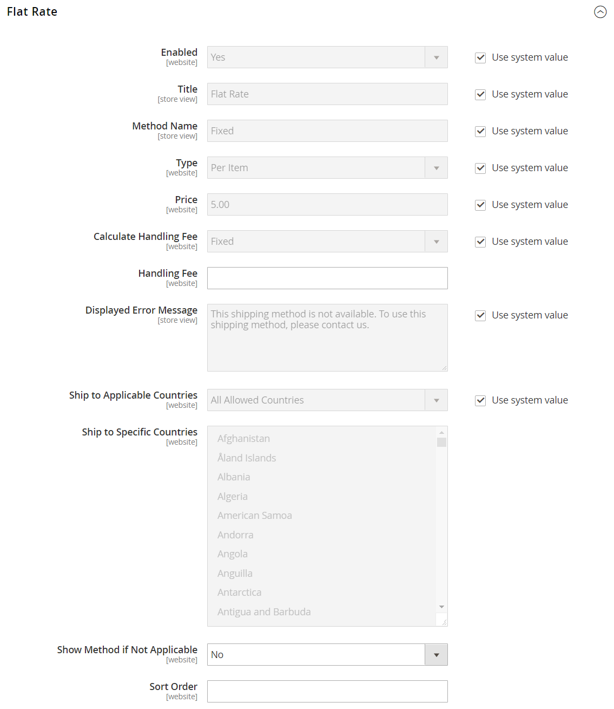

# [!UICONTROL Sales] > [!UICONTROL Delivery Methods]

{{config}}

## [!UICONTROL Basic Delivery Methods]

### [!UICONTROL Flat Rate]

<!-- zoom -->

<!-- [Flat Rate](https://experienceleague.adobe.com/es/docs/commerce-admin/stores-sales/delivery/basic-methods/shipping-flat-rate) -->

| Campo | [Ámbito](../../getting-started/websites-stores-views.md#scope-settings) | Descripción |
|--- |--- |--- |
| [!UICONTROL Enabled] | Sitio web | Cuando está habilitada, la tarifa fija aparece como una opción en la sección _Estimar envío e impuestos_ del carro de compras y en la sección _Envío_ durante el cierre de compra. Opciones: `Yes` / `No` |
| [!UICONTROL Title] | Vista de tienda | El nombre que se usa para este método de envío durante el cierre de compra. |
| [!UICONTROL Method Name] | Vista de tienda | Nombre que describe el método de cálculo que se utiliza para generar una estimación de envío. El nombre del método aparece junto a la tasa estimada calculada en el carro de compras. El valor predeterminado es `Fixed`. |
| [!UICONTROL Type] | Sitio web | Describe el tipo de cálculo utilizado para determinar la tarifa plana. Opciones:  **`None`**- No se usa ningún cálculo. Establece la tarifa plana en cero, que equivale al envío gratuito. **`Per Order`** - Carga una sola tarifa plana por todo el pedido.  **`Per Item`**- Carga una tarifa plana por separado por cada artículo del carro de compras. La tasa se multiplica por el número de artículos del carro de compras, incluso si la cantidad total incluye una combinación de diferentes artículos. |
| [!UICONTROL Price] | Sitio web | El precio que cobras al cliente por el envío a tarifa plana. |
| [!UICONTROL Calculate Handling Fee] | Sitio web | Determina cómo se calcula la tarifa de manipulación, si se incluye. Opciones: `Fixed` / `Percent` |
| [!UICONTROL Handling Fee] | Sitio web | Introduzca el importe que se va a cargar por una tarifa de manipulación, según el método que haya elegido para calcular la cantidad. Por ejemplo, si el cargo se basa en una tarifa fija, introduzca la cantidad como decimal; por ejemplo, 4,90. Sin embargo, si la tarifa de manipulación se basa en un porcentaje del pedido, introduzca la cantidad como porcentaje. Por ejemplo, si está cargando el seis por ciento del pedido, introduzca el valor como `.06`. |
| [!UICONTROL Displayed Error Message] | Vista de tienda | Mensaje que aparece si un cliente elige una tarifa única, pero por algún motivo el método no está disponible. |
| [!UICONTROL Ship to Applicable Countries] | Sitio web | Identifica los países en los que ofrece el envío con tarifa única. Opciones:  **`All Allowed Countries`**: los clientes de cualquier país especificado en la configuración de la tienda pueden utilizar el envío con tarifa única. **`Specific Countries`**: los clientes solo de países específicos pueden utilizar el envío con tarifa única. |
| [!UICONTROL Ship to Specific Countries] | Sitio web | Identifica cada país donde los clientes pueden utilizar el envío con tarifa única. |
| [!UICONTROL Show Method if Not Applicable] | Sitio web | Determina si Tasa fija aparece como una opción durante el cierre de compra si el método no se aplica a la compra. Opciones: `Yes` / `No` |
| [!UICONTROL Sort Order] | Sitio web | Un número que determina el orden en el que aparece la tarifa plana al enumerarla con otros métodos de envío durante el cierre de compra. |

{style="table-layout:auto"}

### [!UICONTROL Free Shipping]

<!-- zoom -->

<!-- [Free Shipping](https://experienceleague.adobe.com/es/docs/commerce-admin/stores-sales/delivery/basic-methods/shipping-free) -->

| Campo | [Ámbito](../../getting-started/websites-stores-views.md#scope-settings) | Descripción |
|--- |--- |--- |
| [!UICONTROL Enabled] | Sitio web | Cuando está activada, la opción Envío gratuito aparece como una opción en la sección Envío durante el cierre de compra. Opciones: `Yes` / `No` |
| [!UICONTROL Title] | Vista de tienda | El nombre que se usa para este método de envío durante el cierre de compra. |
| Nombre del método | Vista de tienda | Nombre que describe el método de cálculo que se utiliza para generar una estimación de envío. El nombre del método aparece junto a la tasa estimada calculada en el carro de compras. El valor predeterminado es `Free`. |
| Cantidad mínima del pedido | Sitio web | La compra mínima requerida para aplicar el envío gratuito a un pedido. |
| Incluir impuesto al importe | Sitio web | Determina si se incluye el impuesto en el cálculo del importe mínimo de pedido. Opciones:  **Sí**: el impuesto se incluye al calcular el importe mínimo del pedido (subtotal + impuesto - descuento). **No** - Impuesto no incluido al calcular el importe mínimo del pedido (Subtotal - Descuento). |
| Mensaje de error mostrado | Vista de tienda | Mensaje que aparece si un cliente elige Envío gratuito, pero por algún motivo el método no está disponible. |
| Enviar a los países aplicables | Sitio web | Identifica los países en los que ofrece envío gratuito. Opciones:  **Todos los países permitidos** - Los clientes de cualquier país especificado en la configuración de la tienda pueden usar el envío gratuito.  **Países específicos**: los clientes que solo procedan de países específicos pueden utilizar el envío gratuito. |
| Enviar a países específicos | Sitio web | Identifica cada país donde los clientes pueden utilizar el envío gratuito. |
| Mostrar método si no es aplicable | Sitio web | Determina si Envío gratuito aparece como una opción durante el cierre de compra si el método no se aplica a la compra. Opciones: `Yes` / `No` |
| [!UICONTROL Sort Order] | Sitio web | Un número que determina el pedido en el que aparece Envío gratuito cuando se enumera con otros métodos de envío durante el cierre de compra. |

{style="table-layout:auto"}

### [!UICONTROL Table Rates]

<!-- zoom -->

<!-- [Table Rates](https://experienceleague.adobe.com/es/docs/commerce-admin/stores-sales/delivery/basic-methods/shipping-table-rate) -->

| Campo | [Ámbito](../../getting-started/websites-stores-views.md#scope-settings) | Descripción |
|--- |--- |--- |
| [!UICONTROL Enabled] | Sitio web | Cuando está activada, la opción Tarifas de tabla aparece en la sección Estimar envío e impuestos del carro de compras y en la sección Envío durante el cierre de compra. Opciones: `Yes` / `No` |
| [!UICONTROL Title] | Vista de tienda | El nombre que se usa para este método de envío durante el cierre de compra. |
| Nombre del método | Vista de tienda | Nombre que describe el método de cálculo que se utiliza para generar una estimación de envío. El nombre del método aparece junto a la tasa estimada calculada en el carro de compras. El valor predeterminado es `Table Rate`. |
| [!UICONTROL Condition] | Sitio web | Determina la condición en la que se basa el cálculo. El formato del archivo CSV cargado es específico para cada condición. Opciones: `Weight vs. Destination` / `Price vs. Destination` / `# of Items vs. Destination` |
| [!UICONTROL Include Virtual Products in Price Calculation] | Sitio web | Determina si los productos virtuales, que no requieren envío, se incluyen en los cálculos de precio de tarifa de tabla. |
| [!UICONTROL Calculate Handling Fee] | Sitio web | Determina cómo se calcula la tarifa de manipulación, si se incluye. Opciones: `Fixed` / `Percent` |
| [!UICONTROL Handling Fee] | Sitio web | El importe de cualquier tarifa que se añada al cargo de envío para cubrir los gastos de manipulación del envío. Introduzca el valor como decimal. Por ejemplo, si la tarifa se basa en un porcentaje, escriba 0,06 en lugar de 6 %. Para una cantidad fija, ingrese `6.00`. |
| [!UICONTROL Displayed Error Message] | Vista de tienda | Mensaje que aparece si un cliente elige Tarifas de Tabla, pero por alguna razón el método no está disponible. |
| [!UICONTROL Ship to Applicable Countries] | Sitio web | Identifica los países en los que ofrece envíos de tarifa de tabla. Opciones:  **`All Allowed Countries`**: los clientes de cualquier país especificado en la configuración de la tienda pueden usar el envío Tarifa de tabla. **`Specific Countries`**: los clientes solo de países específicos pueden utilizar el envío de tarifa de tabla. |
| [!UICONTROL Ship to Specific Countries] | Sitio web | Identifica cada país en el que los clientes pueden utilizar el envío de tarifa de tabla. |
| [!UICONTROL Show Method if Not Applicable] | Sitio web | Determina si Tarifas de tabla aparece como una opción durante el cierre de compra si el método no se aplica a la compra. Opciones: `Yes` / `No` |
| [!UICONTROL Sort Order] | Sitio web | Un número que determina el orden en que aparece Tasas de tabla cuando se enumera con otros métodos de envío durante la desprotección. |

{style="table-layout:auto"}

### [!UICONTROL In-Store Delivery]

<!-- zoom -->

<!-- [In-Store Delivery](https://experienceleague.adobe.com/es/docs/commerce-admin/stores-sales/delivery/basic-methods/shipping-in-store-delivery) -->

| Campo | [Ámbito](../../getting-started/websites-stores-views.md#scope-settings) | Descripción |
|--- |--- |--- |
| [!UICONTROL Enabled] | Sitio web | Cuando está habilitada, la entrega en la tienda puede aparecer como una opción en la sección _Estimar envío e impuestos_ del carro de compras y en la sección _Envío_ durante el cierre de compra. Opciones: `Yes` / `No` |
| [!UICONTROL Method Name] | Vista de tienda | Nombre que identifica la función de recogida en tienda como método de envío. Este valor se muestra como la etiqueta de una pestaña en la parte superior de la página Pago y envío y en la tabla de métodos de envío disponibles en la parte inferior de la misma página. El valor predeterminado es `In-store Delivery`. |
| [!UICONTROL Title] | Vista de tienda | El nombre que se usa para este método de envío durante el cierre de compra. |
| [!UICONTROL Price] | Sitio web | El precio que cobra al cliente por una recogida en la tienda. |
| [!UICONTROL Search Radius] | Sitio web | El radio, en km, que se utilizará al buscar ubicaciones de recogida. |
| [!UICONTROL Displayed Error Message] | Vista de tienda | Mensaje que se muestra cuando un cliente selecciona la recogida en la tienda, pero el método de entrega no está disponible. |

{style="table-layout:auto"}

## [!UICONTROL Carriers]

### [!UICONTROL UPS]

{{ups-api}}

<!-- zoom -->

<!-- zoom -->

<!-- [UPS REST Account Settings]https://experienceleague.adobe.com/es/docs/commerce-admin/stores-sales/delivery/shipping-carriers/ups) -->

| Campo | [Ámbito](../../getting-started/websites-stores-views.md#scope-settings) | Descripción |
|--- |--- |--- |
| [!UICONTROL Enabled for Checkout] | Sitio web | Determina si UPS está disponible para los clientes como método de envío durante el cierre de compra. Opciones: `Yes` / `No` |
| [!UICONTROL Enabled for RMA] | Sitio web | Determina si UPS está disponible para los clientes como método de envío para una RMA. Opciones: `Yes` / `No` |
| _[!UICONTROL UPS Account Settings]_ |  |  |
| [!UICONTROL Live Account] | Vista de tienda | Especifica que la cuenta de United Parcel Service está activa. Opciones: `Yes` / `No` |
| [!UICONTROL Title] | Vista de tienda | El nombre que se usa para este método de envío durante el cierre de compra. |
| _[!UICONTROL UPS REST Account Settings]_ |  |  |
| [!UICONTROL Gateway URL] | Sitio web | Para el servicio REST de UPS, muestra las siguientes direcciones URL que son necesarias para transmitir datos JSON: URL de puerta de enlace, URL de seguimiento, URL de envío. Utilice los extremos de zona protegida o producción según la configuración de la cuenta Live. |
| [!UICONTROL Mode] | Sitio web | Determina el modo de transmisión utilizado para los datos enviados al sistema UPS. Opciones:  **`Development`**- UPS no verifica que los datos recibidos del servidor de Commerce se envíen a través de SSL. **`Live`**: UPS verifica que los datos recibidos del servidor de Commerce se envíen a través de una capa de sockets seguros (SSL). |
| ID de usuario | Sitio web | Su ID de cliente de la cuenta de envío de UPS. |
| [!UICONTROL Origin of the Shipment] | Sitio web | (Solo UPS REST) El país o región donde se origina el envío del producto. |
| [!UICONTROL Password] | Vista de tienda | Secreto de cliente de su cuenta de transportista de UPS. |

{style="table-layout:auto"}

<!-- zoom -->

<!-- [UPS Package Information]https://experienceleague.adobe.com/es/docs/commerce-admin/stores-sales/delivery/shipping-carriers/ups) -->

| Campo | [Ámbito](../../getting-started/websites-stores-views.md#scope-settings) | Descripción |
|--- |--- |--- |
| _[!UICONTROL UPS Negotiated Rate Settings]_ |  |  |
| [!UICONTROL Enable Negotiated Rates] | Sitio web | (Solo UPS REST) Activa/desactiva las tarifas especiales, según su acuerdo con UPS. Opciones: `Yes` / `No` |
| [!UICONTROL Packages Request Type] | Sitio web | Determina cómo se calcula el peso para los envíos con varios paquetes. Opciones: `Divide to equal weight (one request)` / `Use origin weight (multiple requests)` |
| [!UICONTROL Shipper Number] | Sitio web | (Solo UPS REST) El número de envío de seis caracteres de UPS es necesario para que la referencia utilice las tarifas negociadas. |
| [!UICONTROL Container] | Sitio web | Establece el tipo de contenedor utilizado para empaquetar envíos. Opciones: `Customer Packaging` / `UPS Letter Envelope` / `Customer Packaging` / `UPS Letter Envelope` / `UPS Tube` / `UPS Express Box` / `UPS Worldwide 25 kilo` / `UPS Worldwide 10 kilo` |
| [!UICONTROL Weight Unit] | Sitio web | Establece la unidad de medida predeterminada para el peso del producto en su tienda. Consulte [Peso dimensional](../../stores-purchase/carriers.md#dimensional-weight) para obtener más información. |
| [!UICONTROL Tracking URL] | Sitio web | (Solo REST de UPS) La URL de UPS que se utiliza para rastrear paquetes. Use `https://onlinetools.ups.com/api/track` para la producción O `https://wwwcie.ups.com/api/track` para la configuración de la zona protegida. |
| [!UICONTROL Destination Type] | Sitio web | Define el tipo de destino de envío por defecto. Opciones: `Business` / `Residential` |
| [!UICONTROL Maximum Package Weight] | Sitio web | Establece el peso máximo que puede tener un paquete según lo especificado por UPS. Si los productos solicitados superan el peso máximo del paquete, esta opción de envío no está disponible. Según [UPS.com](https://www.ups.com/us/en/global.page), los paquetes no pueden exceder los 70 kg (150 libras). Compruébalo con tu transportista para verificar el peso máximo. |
| [!UICONTROL Pickup Method] | Sitio web | Establece el método de recogida UPS. Opciones: `Regular Daily Pickup` / `On Call Air` / `One Time Pickup` / `Letter Center` / `Customer Counter` |
| [!UICONTROL Minimum Package Weight] | Sitio web | Establece el peso mínimo que puede tener un paquete según lo especificado por UPS. Si los productos pedidos pesan menos que el peso mínimo del paquete, esta opción de envío no está disponible. Para verificar el peso mínimo, consulte con su transportista. |
| [!UICONTROL Calculate Handling Fee] | Sitio web | Establece el método de cálculo de gastos de manipulación para el envío de tarifas de tabla. Opciones:  **`Fixed`**- La tarifa de manejo es una tarifa fija. **`Percent`** - La tarifa de manejo se aplica como porcentaje del importe del pedido. |
| [!UICONTROL Handling Applied] | Sitio web | Especifica si se aplican gastos de manipulación a cada pedido o a cada paquete de un pedido. |
| [!UICONTROL Handling Fee] | Sitio web | Establece la manipulación que se incluye con el precio de tarifa de envío. La tarifa de manejo puede establecerse como una cantidad fija o un porcentaje.   **_Nota:_** Si escribe una cantidad porcentual, use el formato decimal `0.25` para el 25%. |

{style="table-layout:auto"}

<!-- zoom -->

<!-- [UPS Allowed Methods]https://experienceleague.adobe.com/es/docs/commerce-admin/stores-sales/delivery/shipping-carriers/ups) -->

| Campo | [Ámbito](../../getting-started/websites-stores-views.md#scope-settings) | Descripción |
|--- |--- |--- |
| _[!UICONTROL UPS allowed methods]_ |  |  |
| [!UICONTROL Allowed Methods] | Sitio web | Especifica los métodos de envío de UPS permitidos que se ofrecen a los clientes. Las tarifas de envío se calculan según el método de envío seleccionado. |
| [!UICONTROL Free Method] | Sitio web | Identifica el método que se utiliza para el método de envío gratuito a través de UPS. Para desactivar el envío gratuito, selecciona &quot;Ninguno&quot;.   **_Note:_** Este método es similar al [Envío gratuito](../../stores-purchase/shipping-free.md) básico; sin embargo, aparece como una opción de envío UPS durante el cierre de compra. |
| [!UICONTROL Free Shipping Amount Threshold] | Sitio web | Determina si se aplica el envío gratuito cuando el importe del pedido cumple el umbral de envío gratuito. Opciones: `Enable` / `Disable` |
| [!UICONTROL Free Shipping Amount Threshold] | Sitio web | Establece la cantidad total mínima que debe alcanzar un pedido para calificar para el envío gratuito. |
| [!UICONTROL Displayed Error Message] | Vista de tienda | El mensaje de error que se muestra cuando este método de envío no está disponible por algún motivo. |

{style="table-layout:auto"}

<!-- zoom -->

<!-- [UPS Applicable Countries and Other Settings]https://experienceleague.adobe.com/es/docs/commerce-admin/stores-sales/delivery/shipping-carriers/ups) -->

| Campo | [Ámbito](../../getting-started/websites-stores-views.md#scope-settings) | Descripción |
|--- |--- |--- |
| _[!UICONTROL UPS Applicable countries and other Settings]_ |  |  |
| [!UICONTROL Ship to Applicable Countries] | Sitio web | Especifica el país en el que los clientes pueden utilizar este método de envío. Opciones:  **`All Allowed Countries`**- Los clientes de todos los [países](../../getting-started/store-details.md#country-options) especificados en la configuración de su tienda pueden usar este método de envío. **`Specific Countries`** - Después de elegir esta opción, aparece la lista [!UICONTROL Ship to Specific Countries]. Selecciona cada país de la lista donde se pueda usar este método de envío. |
| [!UICONTROL Show Method if Not Applicable] | Sitio web | Determina si UPS siempre aparece como una opción de envío durante el cierre de compra. Opciones:  **`Yes`**- UPS siempre aparece como una opción de envío durante el cierre de compra, aunque no sea aplicable al pedido. **`No`**: UPS aparece como una opción de envío durante el cierre de compra solo si corresponde al pedido. (Por ejemplo, si el peso del pedido supera la cantidad de peso máxima). |
| [!UICONTROL Debug] | Sitio web | Especifica si las transmisiones de datos entre el almacén y UPS están registradas en el sistema para la depuración. A menos que haya un problema que se deba rastrear y registrar, esta opción debe establecerse en `No`. |
| [!UICONTROL Sort Order] | Sitio web | Un número que determina el orden en que aparece UPS cuando se enumera con otros métodos de envío durante el cierre de compra. Escriba `0` al principio de la lista. |

{style="table-layout:auto"}

### [!UICONTROL USPS]

| Campo | [Ámbito](../../getting-started/websites-stores-views.md#scope-settings) | Descripción |
|--- |--- |--- |
| Activado para cierre de compra | Sitio web | Determina si USPS está disponible para los clientes como método de envío durante el cierre de compra. Opciones: `Yes` / `No` |
| _[!UICONTROL USPS Account Settings]_ |  |  |
| [!UICONTROL Gateway URL] | Sitio web | Dirección URL que se utiliza para conectarse al sistema USPS y recuperar dinámicamente las tarifas de envío. |
| [!UICONTROL Secure Gateway URL] | Sitio web | La URL segura que se utiliza para conectarse al sistema USPS a través de una capa de socket seguro (SSL) para recuperar dinámicamente las tarifas de envío. |
| [!UICONTROL Title] | Vista de tienda | El título de esta opción de envío tal como aparece en el cierre de compra del carro de compras. |
| [!UICONTROL User ID] | Sitio web | Su ID de usuario de cuenta de transportista de USPS. |
| [!UICONTROL Password] | Sitio web | Contraseña de su cuenta de transportista de USPS. |
| [!UICONTROL Mode] | Sitio web | Determina el modo de transmisión utilizado para los datos enviados al sistema USPS. Las opciones incluyen:  **`Development`**- USPS no verifica que los datos recibidos del servidor de Commerce se envíen a través de SSL. **`Live`**: USPS verifica que los datos recibidos del servidor de Commerce se envían a través de una capa de socket seguro (SSL). |

{style="table-layout:auto"}

Los campos siguientes solo están disponibles si ha aplicado el [parche de calidad de migración de la API REST de USPS](https://experienceleague.adobe.com/docs/commerce-knowledge-base/kb/troubleshooting/known-issues-patches-attached/usps-rest-api-migration-patch.html)&#x200B;(AC-1520). Este parche permite la compatibilidad con las API de USPS, una plataforma basada en REST que reemplaza a las API de Web Tools. Para obtener más información, consulte [Desaprobación de la API de herramientas web de USPS](../../stores-purchase/carriers.md).

| Campo | [Ámbito](../../getting-started/websites-stores-views.md#scope-settings) | Descripción |
|--- |--- |--- |
| [!UICONTROL USPS Type] | Sitio web | Elija **API de REST de USPS** o **API de herramientas web de USPS** en función de cuál usará. |
| [!UICONTROL Consumer Key] | Sitio web | Su ID de cliente de la cuenta de transportista de USPS para la API de REST. |
| [!UICONTROL Consumer Secret] | Sitio web | La clave secreta del cliente de la cuenta del transportista de USPS para la API de REST. |
| [!UICONTROL Account Type] | Sitio web | Tipo de cuenta de pago USPS. Opciones: `"EPS"` (sistema de pago empresarial) o `"PERMIT"` (permitir impresión) para la API de REST.   **_Nota:_** Este campo es opcional; sin embargo, es necesario para habilitar la creación de etiquetas de envío. |
| [!UICONTROL Pricing Options] | Sitio web | Opciones de precios de USPS: **comercial** o **comercial**. Afecta a la tasa de envío aplicada. El valor predeterminado es **Comercial** para la API de REST. |
| [!UICONTROL Account Number] | Sitio web | Tu **número de cuenta** de USPS usado para pagar la API de REST.    **_Nota:_** Este campo es opcional; sin embargo, es necesario para habilitar la creación de etiquetas de envío. |
| [!UICONTROL Customer Registration Identifier(CRID)] | Sitio web | Un número de identificación de registro de cliente (CRID) es un código numérico generado por USPS que identifica de forma exclusiva una empresa en una ubicación para la API de REST.    **_Nota:_** Este campo es opcional; sin embargo, es necesario para habilitar la creación de etiquetas de envío. |
| [!UICONTROL Mailer Identifier(MID)] | Sitio web | El identificador de correo (MID) es un campo del código de barras de correo inteligente que se utiliza para identificar a los remitentes de correo. El USPS asigna los MID a un Propietario de correo, Agente de correo u otro proveedor de servicios que los solicite para la API de REST.    **_Nota:_** Este campo es opcional; sin embargo, es necesario para habilitar la creación de etiquetas de envío. |
| [!UICONTROL Manifest MID] | Sitio web | El identificador único del distribuidor de correo designado para el manifiesto de la API de REST.    **_Nota:_** Este campo es opcional; sin embargo, es necesario para habilitar la creación de etiquetas de envío. |
| [!UICONTROL AES/ITN] | Sitio web | USPS AES - Automated Export System / ITN - Número de transacción interna para API REST.   **_Nota:_** Este campo suele ser opcional, pero es necesario para habilitar la creación de etiquetas de envío si: <ul><li>Cada tipo de mercancía del envío (según se define en el Anexo B Códigos de exportación en <a href="https://www.census.gov/foreign-trade/schedules/b" target="_blank">www.census.gov/foreign-trade/schedules/b</a>) tiene un valor de $2,500 o menos y no requiere una licencia de exportación; o</li><li>El envío, independientemente de su valor, se envía a Canadá y no requiere una licencia de exportación.</li></ul> |

{style="table-layout:auto"}

<!-- zoom -->

<!-- [USPS Packaging Settings](https://experienceleague.adobe.com/es/docs/commerce-admin/stores-sales/delivery/shipping-carriers/usps) -->

| Campo | [Ámbito](../../getting-started/websites-stores-views.md#scope-settings) | Descripción |
|--- |--- |--- |
| _[!UICONTROL USPS packaging Settings]_ |  |  |
| [!UICONTROL Packages Request Type] | Sitio web | Determina cómo se calcula el peso para los envíos con varios paquetes. Opciones: `Divide to equal weight (one request)` / `Use origin weight (multiple requests)` |
| [!UICONTROL Container] | Sitio web | Establece el tipo de contenedor utilizado para empaquetar envíos. Opciones: `Variable` / `Flat Rate Box` / `Flat Rate Envelope` / `Rectangular` / No rectangulares |
| [!UICONTROL Size] | Sitio web | Establece la opción Tamaño en el tamaño típico del paquete de envío. Esta opción afecta al cálculo de la tarifa de envío. Opciones: `Regular` / `Large` / `Oversize` |
| [!UICONTROL Machinable] | Sitio web | Especifica si el paquete se puede procesar por equipo. Esta opción afecta al cálculo de la tarifa de envío. |
| [!UICONTROL Maximum Package Weight] | Sitio web | Establece el peso máximo que puede tener un paquete según lo especificado por USPS. Si los productos solicitados superan el peso máximo del paquete, esta opción de envío no está disponible. |

{style="table-layout:auto"}

<!-- zoom -->

<!-- [USPS Handling Fee Settings](https://experienceleague.adobe.com/es/docs/commerce-admin/stores-sales/delivery/shipping-carriers/usps) -->

| Campo | [Ámbito](../../getting-started/websites-stores-views.md#scope-settings) | Descripción |
|--- |--- |--- |
| _[!UICONTROL USPS Handling Fee settings]_ |  |  |
| [!UICONTROL Calculate Handling Fee] | Sitio web | Establece el método de cálculo de gastos de manipulación para el envío de tarifas de tabla. Opciones:  **`Fixed`**- La tarifa de manejo es una tarifa fija. **`Percent`** - La tarifa de manejo se aplica como porcentaje del importe del pedido. |
| [!UICONTROL Handling Applied] | Sitio web | Especifica si se aplican gastos de manipulación a cada pedido o a cada paquete de un pedido. |
| [!UICONTROL Handling Fee] | Sitio web | Establece la manipulación que se incluye con el precio de tarifa de envío. La tarifa de manejo puede establecerse como una cantidad fija o un porcentaje.   **_Nota:_** Al escribir una cantidad porcentual, use el formato decimal `0.25` para el 25%. |

{style="table-layout:auto"}

<!-- zoom -->

<!-- [USPS Allowed Methods](https://experienceleague.adobe.com/es/docs/commerce-admin/stores-sales/delivery/shipping-carriers/usps) -->

| Campo | [Ámbito](../../getting-started/websites-stores-views.md#scope-settings) | Descripción |
|--- |--- |--- |
| _[!UICONTROL USPS Allowed Methods]_ |  |  |
| [!UICONTROL Allowed Methods] | Sitio web | Especifica los métodos permitidos de envío de USPS que se ofrecen a los clientes. Las tarifas de envío se calculan según el método de envío seleccionado. |
| [!UICONTROL Free Method] | Sitio web | Establece el método de envío gratuito a través de USPS o se puede deshabilitar seleccionando `None`.   **_Nota:_** Este método de envío es similar al método de envío gratuito de tu tienda, sin embargo, aparece como una opción de envío USPS y se identifica como envío USPS. |
| [!UICONTROL Minimum Order Amount for Free Shipping] | Sitio web | Establece la cantidad mínima del pedido que debe satisfacerse para calificar para el envío gratuito. |
| [!UICONTROL Displayed Error Message] | Vista de tienda | El mensaje de error que aparece cuando USPS no está disponible por algún motivo. |

{style="table-layout:auto"}

<!-- zoom -->

<!-- [USPS Applicable Countries](https://experienceleague.adobe.com/es/docs/commerce-admin/stores-sales/delivery/shipping-carriers/usps) -->

| Campo | [Ámbito](../../getting-started/websites-stores-views.md#scope-settings) | Descripción |
|--- |--- |--- |
| _[!UICONTROL USPS Applicable Countries]_ |  |  |
| [!UICONTROL Ship to Applicable Countries] | Sitio web | Especifica los países a los que se pueden enviar los pedidos. Opciones:  **`All Allowed Countries`**- Los clientes de todos los [países](../../getting-started/store-details.md#country-options) especificados en la configuración de su tienda pueden usar este método de envío. **`Specific Countries`** - Después de elegir esta opción, aparece la lista [!UICONTROL Ship to Specific Countries]. Selecciona cada país de la lista donde se pueda usar este método de envío. |
| [!UICONTROL Show Method if Not Applicable] | Sitio web | Controla la visualización del envío de USPS durante el cierre de compra. Opciones:  **`Yes`**- USPS siempre aparece como una opción de envío durante el cierre de compra, aunque no sea aplicable al pedido. **`No`** - USPS aparece como una opción de envío durante el cierre de compra solo si se aplica al pedido (es decir, el peso del pedido supera la cantidad de peso máximo). |
| [!UICONTROL Debug] | Sitio web | Determina si el sistema mantiene un registro de transmisiones de datos entre el almacén y USPS para la depuración. A menos que haya un problema que se deba rastrear y registrar, esta opción debe establecerse en `No`. |
| [!UICONTROL Sort Order] | Sitio web | Un número que determina el orden en que aparece USPS cuando se enumera con otros métodos de envío durante el cierre de compra. Escriba `0` al principio de la lista. |

{style="table-layout:auto"}

### [!UICONTROL FedEx]

<!-- [FedEx Account Settings](https://experienceleague.adobe.com/es/docs/commerce-admin/stores-sales/delivery/shipping-carriers/fedex) -->

#### Configuración de cuenta de FedEx

{width="600" zoomable="yes"}

| Campo | [Ámbito](../../getting-started/websites-stores-views.md#scope-settings) | Descripción |
|-------|------ |-----------------------------------------------------------------------------|
| [!UICONTROL Enabled for Checkout] | Sitio web | Determina si FedEx está disponible para los clientes como un método de envío durante el cierre de compra. Opciones: `Yes` / `No` |
| [!UICONTROL Title] | Vista de tienda | El título de esta opción de envío tal como aparece en el cierre de compra del carro de compras. |
| [!UICONTROL Account ID] | Sitio web | Su ID de cuenta de FedEx. |
| [!UICONTROL Api Key] | Sitio web | Su clave de API de cuenta de FedEx. |
| [!UICONTROL Secret Key] | Sitio web | La clave secreta de la API de su cuenta de FedEx. |
| [!UICONTROL Sandbox Mode] | Sitio web | Para ejecutar transacciones de FedEx en un entorno de prueba, establezca el modo de espacio aislado en `Yes`. Opciones: `Yes` / `No`. |
| [!UICONTROL Web-Services URL] | Sitio web | La dirección URL requerida depende de la configuración del modo de entorno limitado. Opciones:  **`Production`**: la URL para acceder a los servicios web de FedEx cuando la tienda esté activa. **`Sandbox`**: URL para acceder al entorno de prueba para los servicios web de FedEx. |

{style="table-layout:auto"}

#### Configuración de paquetes de FedEx

{width="600" zoomable="yes"}

| Campo | [Ámbito](../../getting-started/websites-stores-views.md#scope-settings) | Descripción |
|--- |--- |--- |
| [!UICONTROL Pickup Type] | Sitio web | En la lista, seleccione el método de recogida:  **`DropOff at Fedex Location`**- (Predeterminado) Indica que entrega los envíos en su estación FedEx local. **`Contact Fedex to Schedule`**: indica que se ha puesto en contacto con FedEx para solicitar una recogida.  **`Use Scheduled Pickup`**- Indica que el envío se recoge como parte de una recogida programada normal. **`On Call`**: indica que la recogida está programada llamando a FedEx.  **`Package Return Program`**- Indica que el programa FedEx Ground Package Devuelve el envío. **`Regular Stop`** - Indica que el envío se recoge en el horario de recogida habitual.  **`Tag`**- Indica que la recogida del envío es específica de una solicitud de recogida de etiqueta Express o Ground call. Esto solo es aplicable a una etiqueta de envío de devolución. |
| [!UICONTROL Packages Request Type] | Sitio web | Determina cómo se calcula el peso para los envíos con varios paquetes. Opciones: `Divide to equal weight (one request)` / `Use origin weight (multiple requests)` |
| [!UICONTROL Packaging] | Sitio web | En la lista, seleccione el tipo de contenedor que suele utilizar para empaquetar productos pedidos desde su tienda. |
| [!UICONTROL Weight Unit] | Sitio web | La unidad utilizada para el peso del paquete. Opciones: `Pounds` (predeterminado) / `Kilograms` |
| [!UICONTROL Maximum Package Weight] | Sitio web | El valor predeterminado de FedEx es de 150 libras. Consulte a su transportista para obtener el peso máximo admitido. Se recomienda utilizar el valor predeterminado a menos que tenga acuerdos especiales con FedEx. |

{style="table-layout:auto"}

#### Configuración de tarifas de manejo de FedEx

{width="600" zoomable="yes"}

| Campo | [Ámbito](../../getting-started/websites-stores-views.md#scope-settings) | Descripción |
|--- |--- |--- |
| [!UICONTROL Calculate Handling Fee] | Sitio web | Determina el método utilizado para calcular las tarifas de manipulación. Opciones: `Fixed Fee` / `Percentage`   **_Nota:_** La tarifa de manipulación es opcional y aparece como un cargo adicional que se agrega al costo de envío de FedEx. |
| [!UICONTROL Handling Applied] | Sitio web | Determina cómo se aplican las tarifas de manipulación. Opciones: `Per Order` / `Per Package` |
| [!UICONTROL Handling Fee] | Sitio web | Especifica el importe cobrado como gastos de manipulación, según el método utilizado para calcular el importe. Si el cargo se basa en una tarifa fija, ingrese la cantidad como decimal, como `4.90`. Si la tarifa de manipulación se basa en un porcentaje del pedido, introduzca la cantidad como porcentaje. Por ejemplo, para cargar el seis por ciento del pedido, escriba el valor como `.06`. |

{style="table-layout:auto"}

#### Métodos de envío de FedEx

{width="600" zoomable="yes"}

| Campo | [Ámbito](../../getting-started/websites-stores-views.md#scope-settings) | Descripción |
|--- |--- |--- |
| [!UICONTROL Residential Delivery] | Sitio web | Establezca uno de los siguientes valores, en función de si vende de empresa a consumidor (B2C) o de empresa a empresa (B2B):  **`Yes`**- Para entregas B2C **`No`** - Para entregas B2B |
| [!UICONTROL Allowed Methods] | Sitio web | En la lista, seleccione los métodos de envío compatibles. Los métodos dependen de su cuenta de FedEx, la frecuencia y el tamaño de sus envíos y si permite envíos internacionales. Como comerciante, es posible que decida ofrecer solo envío terrestre. |
| [!UICONTROL Hub ID] | Sitio web | Identificador proporcionado por FedEx que se usa con el método [!DNL Smart Post]. |
| [!UICONTROL Free Method] | Sitio web | En la lista, seleccione el método de envío que prefiera utilizar para las ofertas de envío gratuito.   **_Nota:_** Este método de envío es similar al método de envío gratuito normal, sin embargo, se enumera dentro de las opciones de envío de FedEx y se identifica como envío de FedEx. |
| [!UICONTROL Free Shipping Amount Threshold] | Sitio web | Determina si se requiere una cantidad mínima del pedido para el envío gratuito. Opciones:  **`Enable`**- Habilita el envío gratuito de FedEx para pedidos que alcancen la cantidad mínima. **`Disable`**: deshabilita el envío gratuito de FedEx con un pedido mínimo. |
| [!UICONTROL Free Shipping Amount Threshold] | Sitio web | Especifica el importe mínimo del pedido que se requiere para el envío gratuito. |
| [!UICONTROL Displayed Error Message] | Vista de tienda | El mensaje que aparece cuando FedEx no está disponible por algún motivo. Puede utilizar el mensaje predeterminado o escribir otro. |

{style="table-layout:auto"}

#### Configuración de país aplicable de FedEx

{width="600" zoomable="yes"}

| Campo | [Ámbito](../../getting-started/websites-stores-views.md#scope-settings) | Descripción |
|--- |--- |--- |
| [!UICONTROL Ship to Applicable Countries] | Sitio web | Indica los países a los que sus clientes pueden enviar por FedEx. Opciones:  **`All Allowed Countries`**- Los clientes de todos los [países](../../getting-started/store-details.md#country-options) especificados en la configuración de su tienda pueden usar este método de envío. **`Specific Countries`** - Después de elegir esta opción, aparece la lista [!UICONTROL Ship to Specific Countries]. Selecciona cada país de la lista donde se pueda usar este método de envío. |
| [!UICONTROL Ship to Specific Countries] | Sitio web | Indica los países específicos a los que los clientes pueden enviar por FedEx. |
| [!UICONTROL Debug] | Sitio web | Determina si el sistema mantiene un registro de transmisiones de datos entre su tienda y FedEx para la depuración. A menos que haya un problema que se deba rastrear y registrar, esta opción debe establecerse en `No`. |
| [!UICONTROL Show Method if Not Applicable] | Sitio web | Determina cuándo FedEx aparece como un método de envío durante el cierre de compra. Opciones:  **`Yes`**: la opción de envío de FedEx se muestra en la lista de métodos de envío, independientemente de si el pedido cumple los requisitos para usarla. **`No`**: la opción de envío de FedEx no se muestra en la lista de métodos de envío si no es aplicable al pedido (por ejemplo, si el peso del pedido supera la cantidad de peso máxima). |
| [!UICONTROL Sort Order] | Sitio web | Un número que determina el orden en que aparece FedEx cuando se enumera con otros métodos de envío durante el cierre de compra. Escriba `0` al principio de la lista. |

{style="table-layout:auto"}

### [!UICONTROL DHL]

<!-- zoom -->

<!-- [DHL Account Settings](https://experienceleague.adobe.com/es/docs/commerce-admin/stores-sales/delivery/shipping-carriers/dhl) -->

| Campo | [Ámbito](../../getting-started/websites-stores-views.md#scope-settings) | Descripción |
|--- |--- |--- |
| _[!UICONTROL DHL Account Settings]_ |  |  |
| [!UICONTROL Enabled for Checkout] | Sitio web | Determina si DHL está disponible para los clientes como método de envío durante el pago. Opciones: `Yes` / `No` |
| [!UICONTROL Title] | Vista de tienda | El título de este método de envío tal como aparece durante el cierre de compra. |
| [!UICONTROL Gateway URL] | Sitio web | Normalmente, puede aceptar la dirección URL de puerta de enlace predeterminada. Sin embargo, si DHL le ha proporcionado una URL alternativa, introduzca el valor en este campo. |
| [!UICONTROL Access ID] | Sitio web | Su ID de acceso a la cuenta de transportista de DHL. |
| [!UICONTROL Password] | Sitio web | Contraseña de su cuenta de DHL. |
| [!UICONTROL Account Number] | Sitio web | Su número de cuenta de DHL. |

{style="table-layout:auto"}

<!-- zoom -->

<!-- [DHL Package Settings](https://experienceleague.adobe.com/es/docs/commerce-admin/stores-sales/delivery/shipping-carriers/dhl) -->

| Campo | [Ámbito](../../getting-started/websites-stores-views.md#scope-settings) | Descripción |
|--- |--- |--- |
| _[!UICONTROL DHL Package Settings]_ |  |  |
| [!UICONTROL Calculate Handling Fee] | Sitio web | La tarifa de manipulación es opcional y aparece como un cargo adicional añadido al coste de envío de DHL. En la lista, seleccione el método que desee utilizar para calcular las tarifas de manipulación. Opciones: Tarifa/Porcentaje Fijo. |
| [!UICONTROL Handling Applied] | Sitio web | En la lista, seleccione cómo desea aplicar las tarifas de manipulación. Opciones: `Per Order` / `Per Package` |
| Tarifa de manipulación | Sitio web | Introduzca el importe que se va a cargar por una tarifa de manipulación, según el método que haya elegido para calcular la cantidad. Por ejemplo, si el cargo se basa en una tarifa fija, introduzca la cantidad como decimal; por ejemplo, `4.90`. Sin embargo, si la tarifa de manipulación se basa en un porcentaje del pedido, introduzca la cantidad como porcentaje. Por ejemplo, si está cargando el seis por ciento del pedido, introduzca el valor como `.06`. |
| [!UICONTROL Divide Order Weight] | Vista de tienda | Determina si el peso de un pedido de más de 70 kg se puede dividir en unidades más pequeñas para garantizar un cargo de envío preciso. Opciones: `Yes` / `No` |
| [!UICONTROL Weight Unit] | Vista de tienda | Determina la unidad de medida del peso que se utiliza en los cálculos de envío. Opciones: `Pounds` / `Kilograms` |
| [!UICONTROL Size] | Vista de tienda | Determina el tamaño del paquete. Opciones:  **`Regular`**: los paquetes enviados cumplen con los métodos de empaquetado estándar de DHL. En la lista [!UICONTROL Allowed Methods], seleccione cada método de empaquetado utilizado para enviar productos desde su tienda. **`Specific`** - Si los paquetes enviados tienen dimensiones personalizadas, complete lo siguiente: [!UICONTROL Height (cm)] / [!UICONTROL Depth (cm)] / [!UICONTROL Width (cm)] |

{style="table-layout:auto"}

<!-- zoom -->

<!-- DHL Allowed Methods](https://experienceleague.adobe.com/es/docs/commerce-admin/stores-sales/delivery/shipping-carriers/dhl) -->

| Campo | [Ámbito](../../getting-started/websites-stores-views.md#scope-settings) | Descripción |
|--- |--- |--- |
| _[!UICONTROL DHL allowed methods]_ |  |  |
| [!UICONTROL Allowed Methods] | Sitio web | En la lista, seleccione cada método de envío compatible. |
| [!UICONTROL Ready Time] | Sitio web | Especifica cuándo el paquete estará listo para recogerse (en horas) después de enviar un pedido. |
| [!UICONTROL Displayed Error Message] | Vista de tienda | Este mensaje aparece cuando DHL deja de estar disponible por cualquier motivo. Puede utilizar el mensaje predeterminado o escribir un mensaje propio. |
| [!UICONTROL Free Method] |  | Este método de envío es similar al método de envío gratuito normal, sin embargo, se enumera dentro de las opciones de envío DHL y se identifica como envío DHL. En la lista, seleccione el método de envío que prefiera utilizar para las ofertas de envío gratuito. |
| [!UICONTROL Free Shipping with Minimum Order Amount] | Sitio web | Establezca una de las siguientes opciones:  **`Enable`**- Para permitir el envío gratuito de DHL para pedidos que cumplan la cantidad mínima. **`Disable`** - No ofrecer envío DHL gratuito con pedido mínimo. |
| [!UICONTROL Minimum Order Amount for Free Shipping] | Sitio web | Si habilita [!UICONTROL Free Shipping with Minimum Order], escriba el valor de cantidad mínima del pedido en el campo. |

{style="table-layout:auto"}

<!-- zoom -->

<!-- [DHL Applicable Countries](https://experienceleague.adobe.com/es/docs/commerce-admin/stores-sales/delivery/shipping-carriers/dhl) -->

| Campo | [Ámbito](../../getting-started/websites-stores-views.md#scope-settings) | Descripción |
|--- |--- |--- |
| _[!UICONTROL DHL applicable countries]_ |  |  |
| [!UICONTROL Ship to Applicable Countries] | Sitio web | Especifica el país en el que los clientes pueden utilizar este método de envío. Opciones:  **Todos los países permitidos** - Todos los países permitidos son aplicables para utilizar el método de envío gratuito. Los países permitidos se especifican en la página de configuración [!UICONTROL General].  **Países específicos**: limita esta opción de envío a los países especificados en la lista Enviar a países específicos. |
| [!UICONTROL Ship to Specific Countries] | Sitio web | Especifica los países a los que se pueden enviar los envíos de DHL. Esta lista de países seleccionados se usa si `Specific Countries` está seleccionado en la opción [!UICONTROL Ship to Applicable Countries]. |
| [!UICONTROL Show Method if Not Applicable] | Sitio web | Determina cuándo DHL aparece como un método de envío durante el cierre de compra. Opciones:  **`Yes`**- DHL siempre aparece como una opción de envío durante el cierre de compra, aunque no sea aplicable al pedido. **`No`** - DHL aparece como una opción de envío durante el cierre de compra solo si se aplica al pedido (es decir, el peso del pedido supera la cantidad de peso máximo). |
| [!UICONTROL Debug] | Sitio web | Crea un archivo de registro con información de error. |
| [!UICONTROL Sort Order] | Sitio web | Un número que determina el orden en el que aparece DHL cuando aparece junto con otros métodos de envío durante el cierre de compra. Para colocarlo en la parte superior de la lista, escriba `0`. |

{style="table-layout:auto"}
