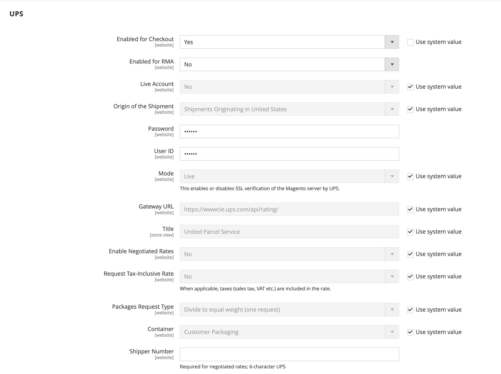

# [!UICONTROL Sales] > [!UICONTROL Delivery Methods]

{{config}}

## [!UICONTROL Basic Delivery Methods]

### [!UICONTROL Flat Rate]

<!-- zoom -->

<!-- [Flat Rate](https://docs.magento.com/user-guide/shipping/shipping-flat-rate.html) -->

| Campo | [Ámbito](../../getting-started/websites-stores-views.md#scope-settings) | Descripción |
|--- |--- |--- |
| [!UICONTROL Enabled] | Sitio web | Cuando está activada, la tarifa plana aparece como una opción en la _Estimar envíos e impuestos_ del carro de compras y en la sección _Envío_ durante el cierre de compra. Opciones: `Yes` / `No` |
| [!UICONTROL Title] | Vista de tienda | El nombre que se usa para este método de envío durante el cierre de compra. |
| [!UICONTROL Method Name] | Vista de tienda | Nombre que describe el método de cálculo que se utiliza para generar una estimación de envío. El nombre del método aparece junto a la tasa estimada calculada en el carro de compras. El valor predeterminado es `Fixed`. |
| [!UICONTROL Type] | Sitio web | Describe el tipo de cálculo utilizado para determinar la tarifa plana. Opciones:  **`None`**- No se utiliza ningún cálculo. Establece la tarifa plana en cero, que equivale al envío gratuito. **`Per Order`** - Se cobra una única tarifa plana por todo el pedido.  **`Per Item`**- Cobra una tarifa plana por cada artículo del carro de compras. La tasa se multiplica por el número de artículos del carro de compras, incluso si la cantidad total incluye una combinación de diferentes artículos. |
| [!UICONTROL Price] | Sitio web | El precio que cobras al cliente por el envío a tarifa plana. |
| [!UICONTROL Calculate Handling Fee] | Sitio web | Determina cómo se calcula la tarifa de manipulación, si se incluye. Opciones: `Fixed` / `Percent` |
| [!UICONTROL Handling Fee] | Sitio web | Introduzca el importe que se va a cargar por una tarifa de manipulación, según el método que haya elegido para calcular la cantidad. Por ejemplo, si el cargo se basa en una tarifa fija, introduzca la cantidad como decimal; por ejemplo, 4,90. Sin embargo, si la tarifa de manipulación se basa en un porcentaje del pedido, introduzca la cantidad como porcentaje. Por ejemplo, si va a cargar el seis por ciento del pedido, introduzca el valor como `.06`. |
| [!UICONTROL Displayed Error Message] | Vista de tienda | Mensaje que aparece si un cliente elige una tarifa única, pero por algún motivo el método no está disponible. |
| [!UICONTROL Ship to Applicable Countries] | Sitio web | Identifica los países en los que ofrece el envío con tarifa única. Opciones:  **`All Allowed Countries`**- Los clientes de cualquier país especificado en la configuración de la tienda pueden utilizar el envío con tarifa plana. **`Specific Countries`** - Los clientes solo de países específicos pueden utilizar el envío con tarifa única. |
| [!UICONTROL Ship to Specific Countries] | Sitio web | Identifica cada país donde los clientes pueden utilizar el envío con tarifa única. |
| [!UICONTROL Show Method if Not Applicable] | Sitio web | Determina si Tasa fija aparece como una opción durante el cierre de compra si el método no se aplica a la compra. Opciones: `Yes` / `No` |
| [!UICONTROL Sort Order] | Sitio web | Un número que determina el orden en el que aparece la tarifa plana al enumerarla con otros métodos de envío durante el cierre de compra. |

{:style=&quot;table-layout:auto&quot;}

### [!UICONTROL Free Shipping]

<!-- zoom -->

<!-- [Free Shipping](https://docs.magento.com/user-guide/shipping/shipping-free.html) -->

| Campo | [Ámbito](../../getting-started/websites-stores-views.md#scope-settings) | Descripción |
|--- |--- |--- |
| [!UICONTROL Enabled] | Sitio web | Cuando está activada, la opción Envío gratuito aparece como una opción en la sección Envío durante el cierre de compra. Opciones: `Yes` / `No` |
| [!UICONTROL Title] | Vista de tienda | El nombre que se usa para este método de envío durante el cierre de compra. |
| Nombre del método | Vista de tienda | Nombre que describe el método de cálculo que se utiliza para generar una estimación de envío. El nombre del método aparece junto a la tasa estimada calculada en el carro de compras. El valor predeterminado es `Free`. |
| Cantidad mínima del pedido | Sitio web | La compra mínima requerida para aplicar el envío gratuito a un pedido. |
| Incluir impuesto al importe | Sitio web | Determina si se incluye el impuesto en el cálculo del importe mínimo de pedido. Opciones:  **Sí** - El impuesto se incluye al calcular el importe mínimo del pedido (subtotal + impuesto - descuento). **No** - El impuesto no está incluido cuando se calcula el importe mínimo del pedido (subtotal - descuento). |
| Mensaje de error mostrado | Vista de tienda | Mensaje que aparece si un cliente elige Envío gratuito, pero por algún motivo el método no está disponible. |
| Enviar a los países aplicables | Sitio web | Identifica los países en los que ofrece envío gratuito. Opciones:  **Todos los países permitidos** - Los clientes de cualquier país especificado en la configuración de la tienda pueden utilizar el envío gratuito.  **Países específicos** - Los clientes solo de países específicos pueden utilizar el envío gratuito. |
| Enviar a países específicos | Sitio web | Identifica cada país donde los clientes pueden utilizar el envío gratuito. |
| Mostrar método si no es aplicable | Sitio web | Determina si Envío gratuito aparece como una opción durante el cierre de compra si el método no se aplica a la compra. Opciones: `Yes` / `No` |
| [!UICONTROL Sort Order] | Sitio web | Un número que determina el pedido en el que aparece Envío gratuito cuando se enumera con otros métodos de envío durante el cierre de compra. |

{:style=&quot;table-layout:auto&quot;}

### [!UICONTROL Table Rates]

<!-- zoom -->

<!-- [Table Rates](https://docs.magento.com/user-guide/shipping/shipping-table-rate.html) -->

| Campo | [Ámbito](../../getting-started/websites-stores-views.md#scope-settings) | Descripción |
|--- |--- |--- |
| [!UICONTROL Enabled] | Sitio web | Cuando está activada, la opción Tarifas de tabla aparece en la sección Estimar envío e impuestos del carro de compras y en la sección Envío durante el cierre de compra. Opciones: `Yes` / `No` |
| [!UICONTROL Title] | Vista de tienda | El nombre que se usa para este método de envío durante el cierre de compra. |
| Nombre del método | Vista de tienda | Nombre que describe el método de cálculo que se utiliza para generar una estimación de envío. El nombre del método aparece junto a la tasa estimada calculada en el carro de compras. El valor predeterminado es `Table Rate`. |
| [!UICONTROL Condition] | Sitio web | Determina la condición en la que se basa el cálculo. El formato del archivo CSV cargado es específico para cada condición. Opciones: `Weight vs. Destination` / `Price vs. Destination` / `# of Items vs. Destination` |
| [!UICONTROL Include Virtual Products in Price Calculation] | Sitio web | Determina si los productos virtuales, que no requieren envío, se incluyen en los cálculos de precio de tarifa de tabla. |
| [!UICONTROL Calculate Handling Fee] | Sitio web | Determina cómo se calcula la tarifa de manipulación, si se incluye. Opciones: `Fixed` / `Percent` |
| [!UICONTROL Handling Fee] | Sitio web | El importe de cualquier tarifa que se añada al cargo de envío para cubrir los gastos de manipulación del envío. Introduzca el valor como decimal. Por ejemplo, si la tarifa se basa en un porcentaje, escriba 0,06 en lugar de 6 %. Para una cantidad fija, introduzca `6.00`. |
| [!UICONTROL Displayed Error Message] | Vista de tienda | Mensaje que aparece si un cliente elige Tarifas de Tabla, pero por alguna razón el método no está disponible. |
| [!UICONTROL Ship to Applicable Countries] | Sitio web | Identifica los países en los que ofrece envíos de tarifa de tabla. Opciones:  **`All Allowed Countries`**- Los clientes de cualquier país especificado en la configuración de la tienda pueden utilizar el envío de tarifa de tabla. **`Specific Countries`** - Los clientes solo de países específicos pueden utilizar el envío de tarifa de tabla. |
| [!UICONTROL Ship to Specific Countries] | Sitio web | Identifica cada país en el que los clientes pueden utilizar el envío de tarifa de tabla. |
| [!UICONTROL Show Method if Not Applicable] | Sitio web | Determina si Tarifas de tabla aparece como una opción durante el cierre de compra si el método no se aplica a la compra. Opciones: `Yes` / `No` |
| [!UICONTROL Sort Order] | Sitio web | Un número que determina el orden en que aparece Tasas de tabla cuando se enumera con otros métodos de envío durante la desprotección. |

{:style=&quot;table-layout:auto&quot;}

### [!UICONTROL In-Store Delivery]

<!-- zoom -->

<!-- [In-Store Delivery](https://docs.magento.com/user-guide/shipping/shipping-in-store-delivery.html) -->

| Campo | [Ámbito](../../getting-started/websites-stores-views.md#scope-settings) | Descripción |
|--- |--- |--- |
| [!UICONTROL Enabled] | Sitio web | Cuando está activada, la entrega en tienda puede aparecer como una opción en la _Estimar envíos e impuestos_ del carro de compras y en la sección _Envío_ durante el cierre de compra. Opciones: `Yes` / `No` |
| [!UICONTROL Method Name] | Vista de tienda | Nombre que identifica la función de recogida en tienda como método de envío. Este valor se muestra como la etiqueta de una pestaña en la parte superior de la página Pago y envío y en la tabla de métodos de envío disponibles en la parte inferior de la misma página. El valor predeterminado es `In-store Delivery`. |
| [!UICONTROL Title] | Vista de tienda | El nombre que se usa para este método de envío durante el cierre de compra. |
| [!UICONTROL Price] | Sitio web | El precio que cobra al cliente por una recogida en la tienda. |
| [!UICONTROL Search Radius] | Sitio web | El radio, en km, que se utilizará al buscar ubicaciones de recogida. |
| [!UICONTROL Displayed Error Message] | Vista de tienda | Mensaje que se muestra cuando un cliente selecciona la recogida en la tienda, pero el método de entrega no está disponible. |

{:style=&quot;table-layout:auto&quot;}

## [!UICONTROL Carriers]

### [!UICONTROL UPS]

{{ups-api}}

{{beta2-updates}}

<!-- zoom -->

<!-- [UPS XML Account Settings](https://docs.magento.com/user-guide/shipping/ups.html) -->

| Campo | [Ámbito](../../getting-started/websites-stores-views.md#scope-settings) | Descripción |
|--- |--- |--- |
| [!UICONTROL Enabled for Checkout] | Sitio web | Determina si UPS está disponible para los clientes como método de envío durante el cierre de compra. Opciones: `Yes` / `No` |
| [!UICONTROL Enabled for RMA] | Sitio web | Determina si UPS está disponible para los clientes como método de envío para una RMA. Opciones: `Yes` / `No` |
| [!UICONTROL UPS Type] | Vista de tienda | Especifica el método utilizado para conectarse al sistema de envío UPS. Opciones:  **`United Parcel Service XML`**- (Predeterminado) Su tienda envía un archivo XML con datos a UPS como solicitud. **`United Parcel Service`** - Su tienda envía pares clave-valor a UPS como una solicitud.   **_Nota:_**El tipo estándar de United Parcel Service está programado para su desuso en Commerce. Para nuevas configuraciones, debe utilizar el [!UICONTROL United Parcel Service XML] escriba. |
| _[!UICONTROL UPS Account Settings]_ |  |  |
| [!UICONTROL Live Account] | Vista de tienda | Especifica que la cuenta de United Parcel Service está activa. Opciones: `Yes` / `No` |
| [!UICONTROL Gateway URL] | Sitio web | La URL que se conecta al sistema UPS para recuperar las tarifas de envío dinámicas. UPS está suspendiendo la compatibilidad con HTTP. Valor predeterminado: `https://www.ups.com/using/services/rave/qcostcgi.cgi` |
| [!UICONTROL Title] | Vista de tienda | El nombre que se usa para este método de envío durante el cierre de compra. |
| _[!UICONTROL UPS XML Account Settings]_ |  |  |
| [!UICONTROL Access License Number] | Sitio web | Su número de licencia de acceso a la cuenta de envío de UPS. |
| [!UICONTROL Gateway XML URL] | Sitio web | Para el servicio XML de UPS, muestra las siguientes direcciones URL necesarias para transmitir datos XML: URL XML de puerta de enlace, URL XML de seguimiento, URL XML de confirmación de envío, URL XML de aceptación de envío |
| [!UICONTROL Mode] | Sitio web | Determina el modo de transmisión utilizado para los datos enviados al sistema UPS. Opciones:  **`Development`**- UPS no verifica que los datos recibidos del servidor de Commerce se envíen a través de SSL. **`Live`** - UPS verifica que los datos recibidos del servidor de Commerce se envíen a través de una capa de socket segura (SSL). |
| ID de usuario | Sitio web | Su ID de usuario de cuenta de transportista de UPS. |
| [!UICONTROL Origin of the Shipment] | Sitio web | (Solo XML de UPS) El país o región donde se origina el envío del producto. |
| [!UICONTROL Password] | Vista de tienda | Contraseña de la cuenta de envío de UPS. |

{:style=&quot;table-layout:auto&quot;}

<!-- zoom -->

<!-- [UPS Package Information](https://docs.magento.com/user-guide/shipping/ups.html) -->

| Campo | [Ámbito](../../getting-started/websites-stores-views.md#scope-settings) | Descripción |
|--- |--- |--- |
| _[!UICONTROL UPS Negotiated Rate Settings]_ |  |  |
| [!UICONTROL Enable Negotiated Rates] | Sitio web | (Solo UPS XML) Activa/desactiva las tarifas especiales, según su acuerdo con UPS. Opciones: `Yes` / `No` |
| [!UICONTROL Packages Request Type] | Sitio web | Determina cómo se calcula el peso para los envíos con varios paquetes. Opciones: `Divide to equal weight (one request)` / `Use origin weight (multiple requests)` |
| [!UICONTROL Shipper Number] | Sitio web | (Solo XML de UPS) El número de envío de seis caracteres de UPS es necesario para que la referencia utilice las tarifas negociadas. |
| [!UICONTROL Container] | Sitio web | Establece el tipo de contenedor utilizado para empaquetar envíos de pedidos. Opciones: `Customer Packaging` / `UPS Letter Envelope` / `Customer Packaging` / `UPS Letter Envelope` / `UPS Tube` / `UPS Express Box` / `UPS Worldwide 25 kilo` / `UPS Worldwide 10 kilo` |
| [!UICONTROL Weight Unit] | Sitio web | Establece la unidad de medida predeterminada para el peso del producto en su tienda. Consulte [Peso dimensional](../../stores-purchase/carriers.md#dimensional-weight) para obtener más información. |
| [!UICONTROL Tracking XML URL] | Sitio web | (Solo XML de UPS) La URL de UPS que se utiliza para rastrear paquetes. |
| [!UICONTROL Destination Type] | Sitio web | Define el tipo de destino de envío por defecto. Opciones: `Business` / `Residential` |
| [!UICONTROL Maximum Package Weight] | Sitio web | Establece el peso máximo que puede tener un paquete según lo especificado por UPS. Si los productos solicitados superan el peso máximo del paquete, esta opción de envío no está disponible. Según [UPS.com](https://www.ups.com/us/en/global.page), los paquetes no pueden exceder los 70 kg (150 libras) Consulte con su transportista para verificar el peso máximo. |
| [!UICONTROL Pickup Method] | Sitio web | Establece el método de recogida UPS. Opciones: `Regular Daily Pickup` / `On Call Air` / `One Time Pickup` / `Letter Center` / `Customer Counter` |
| [!UICONTROL Minimum Package Weight] | Sitio web | Establece el peso mínimo que puede tener un paquete según lo especificado por UPS. Si los productos pedidos pesan menos que el peso mínimo del paquete, esta opción de envío no está disponible. Para verificar el peso mínimo, consulte con su transportista. |
| [!UICONTROL Calculate Handling Fee] | Sitio web | Establece el método de cálculo de gastos de manipulación para el envío de tarifas de tabla. Opciones:  **`Fixed`**- Tarifa de manejo es una tasa fija. **`Percent`** - La tarifa de manipulación se aplica como porcentaje del importe del pedido. |
| [!UICONTROL Handling Applied] | Sitio web | Especifica si se aplican gastos de manipulación a cada pedido o a cada paquete de un pedido. |
| [!UICONTROL Handling Fee] | Sitio web | Establece la manipulación que se incluye con el precio de tarifa de envío. La tarifa de manejo puede establecerse como una cantidad fija o un porcentaje.   **_Nota:_**Si escribe una cantidad porcentual, utilice el formato decimal `0.25` por 25%. |

{:style=&quot;table-layout:auto&quot;}

<!-- zoom -->

<!-- [UPS Allowed Methods](https://docs.magento.com/user-guide/shipping/ups.html) -->

| Campo | [Ámbito](../../getting-started/websites-stores-views.md#scope-settings) | Descripción |
|--- |--- |--- |
| _[!UICONTROL UPS allowed methods]_ |  |  |
| [!UICONTROL Allowed Methods] | Sitio web | Especifica los métodos de envío de UPS permitidos que se ofrecen a los clientes. Las tarifas de envío se calculan según el método de envío seleccionado. |
| [!UICONTROL Free Method] | Sitio web | Identifica el método que se utiliza para el método de envío gratuito a través de UPS. Para desactivar el envío gratuito, selecciona &quot;Ninguno&quot;.   **_Nota:_**Este método es similar al básico [Envío gratuito](../../stores-purchase/shipping-free.md), sin embargo, aparece como una opción de envío UPS durante el cierre de compra. |
| [!UICONTROL Free Shipping Amount Threshold] | Sitio web | Determina si se aplica el envío gratuito cuando el importe del pedido cumple el umbral de envío gratuito. Opciones: `Enable` / `Disable` |
| [!UICONTROL Free Shipping Amount Threshold] | Sitio web | Establece la cantidad total mínima que debe alcanzar un pedido para calificar para el envío gratuito. |
| [!UICONTROL Displayed Error Message] | Vista de tienda | El mensaje de error que se muestra cuando este método de envío no está disponible por algún motivo. |

{:style=&quot;table-layout:auto&quot;}

<!-- zoom -->

<!-- [UPS Applicable Countries and Other Settings](https://docs.magento.com/user-guide/shipping/ups.html) -->

| Campo | [Ámbito](../../getting-started/websites-stores-views.md#scope-settings) | Descripción |
|--- |--- |--- |
| _[!UICONTROL UPS Applicable countries and other Settings]_ |  |  |
| [!UICONTROL Ship to Applicable Countries] | Sitio web | Especifica el país en el que los clientes pueden utilizar este método de envío. Opciones:  **`All Allowed Countries`**- Clientes de todos [países](../../getting-started/store-details.md#country-options) especificado en la configuración de la tienda puede utilizar este método de envío. **`Specific Countries`** : Después de elegir esta opción, el [!UICONTROL Ship to Specific Countries] aparece una lista. Selecciona cada país de la lista donde se pueda usar este método de envío. |
| [!UICONTROL Show Method if Not Applicable] | Sitio web | Determina si UPS siempre aparece como una opción de envío durante el cierre de compra. Opciones:  **`Yes`**- UPS siempre aparece como una opción de envío durante el pago, incluso si no es aplicable al pedido. **`No`** - UPS aparece como una opción de envío durante el cierre de compra solo si corresponde al pedido. (Por ejemplo, si el peso del pedido supera la cantidad de peso máxima). |
| [!UICONTROL Debug] | Sitio web | Especifica si las transmisiones de datos entre el almacén y UPS están registradas en el sistema para la depuración. A menos que haya un problema que se deba rastrear y registrar, esta opción debe configurarse como `No`. |
| [!UICONTROL Sort Order] | Sitio web | Un número que determina el orden en que aparece UPS cuando se enumera con otros métodos de envío durante el cierre de compra. Entrar `0` en la parte superior de la lista. |

{:style=&quot;table-layout:auto&quot;}

### [!UICONTROL USPS]

{{beta2-updates}}

| Campo | [Ámbito](../../getting-started/websites-stores-views.md#scope-settings) | Descripción |
|--- |--- |--- |
| Activado para cierre de compra | Sitio web | Determina si USPS está disponible para los clientes como método de envío durante el cierre de compra. Opciones: `Yes` / `No` |
| _[!UICONTROL USPS Account Settings]_ |  |  |
| [!UICONTROL Gateway URL] | Sitio web | Dirección URL que se utiliza para conectarse al sistema USPS y recuperar dinámicamente las tarifas de envío. |
| [!UICONTROL Secure Gateway URL] | Sitio web | La URL segura que se utiliza para conectarse al sistema USPS a través de una capa de socket seguro (SSL) para recuperar dinámicamente las tarifas de envío. |
| [!UICONTROL Title] | Vista de tienda | El título de esta opción de envío tal como aparece en el cierre de compra del carro de compras. |
| [!UICONTROL User ID] | Sitio web | Su ID de usuario de cuenta de transportista de USPS. |
| [!UICONTROL Password] | Sitio web | Contraseña de su cuenta de transportista de USPS. |
| [!UICONTROL Mode] | Sitio web | Determina el modo de transmisión utilizado para los datos enviados al sistema USPS. Las opciones incluyen:  **`Development`**: USPS no verifica que los datos recibidos del servidor de Commerce se envíen a través de SSL. **`Live`** : USPS verifica que los datos recibidos del servidor de Commerce se envíen a través de una capa de socket segura (SSL). |

{:style=&quot;table-layout:auto&quot;}

<!-- zoom -->

<!-- [USPS Packaging Settings](https://docs.magento.com/user-guide/shipping/usps.html) -->

| Campo | [Ámbito](../../getting-started/websites-stores-views.md#scope-settings) | Descripción |
|--- |--- |--- |
| _[!UICONTROL USPS packaging Settings]_ |  |  |
| [!UICONTROL Packages Request Type] | Sitio web | Determina cómo se calcula el peso para los envíos con varios paquetes. Opciones: `Divide to equal weight (one request)` / `Use origin weight (multiple requests)` |
| [!UICONTROL Container] | Sitio web | Establece el tipo de contenedor utilizado para empaquetar envíos de pedidos. Opciones: `Variable` / `Flat Rate Box` / `Flat Rate Envelope` / `Rectangular` / No rectangular |
| [!UICONTROL Size] | Sitio web | Establece la opción Tamaño en el tamaño típico del paquete de envío. Esta opción afecta al cálculo de la tarifa de envío. Opciones: `Regular` / `Large` / `Oversize` |
| [!UICONTROL Machinable] | Sitio web | Especifica si el paquete se puede procesar por equipo. Esta opción afecta al cálculo de la tarifa de envío. |
| [!UICONTROL Maximum Package Weight] | Sitio web | Establece el peso máximo que puede tener un paquete según lo especificado por USPS. Si los productos solicitados superan el peso máximo del paquete, esta opción de envío no está disponible. |

{:style=&quot;table-layout:auto&quot;}

<!-- zoom -->

<!-- [USPS Handling Fee Settings](https://docs.magento.com/user-guide/shipping/usps.html) -->

| Campo | [Ámbito](../../getting-started/websites-stores-views.md#scope-settings) | Descripción |
|--- |--- |--- |
| _[!UICONTROL USPS Handling Fee settings]_ |  |  |
| [!UICONTROL Calculate Handling Fee] | Sitio web | Establece el método de cálculo de gastos de manipulación para el envío de tarifas de tabla. Opciones:  **`Fixed`**- Tarifa de manejo es una tasa fija. **`Percent`** - La tarifa de manipulación se aplica como porcentaje del importe del pedido. |
| [!UICONTROL Handling Applied] | Sitio web | Especifica si se aplican gastos de manipulación a cada pedido o a cada paquete de un pedido. |
| [!UICONTROL Handling Fee] | Sitio web | Establece la manipulación que se incluye con el precio de tarifa de envío. La tarifa de manejo puede establecerse como una cantidad fija o un porcentaje.   **_Nota:_**Al escribir una cantidad porcentual, utilice el formato decimal `0.25` por 25%. |

{:style=&quot;table-layout:auto&quot;}

<!-- zoom -->

<!-- [USPS Allowed Methods](https://docs.magento.com/user-guide/shipping/usps.html) -->

| Campo | [Ámbito](../../getting-started/websites-stores-views.md#scope-settings) | Descripción |
|--- |--- |--- |
| _[!UICONTROL USPS Allowed Methods]_ |  |  |
| [!UICONTROL Allowed Methods] | Sitio web | Especifica los métodos permitidos de envío de USPS que se ofrecen a los clientes. Las tarifas de envío se calculan según el método de envío seleccionado. |
| [!UICONTROL Free Method] | Sitio web | Establece el método de envío gratuito a través de USPS, o se puede deshabilitar seleccionando `None`.   **_Nota:_**Este método de envío es similar al método de envío gratuito de su tienda, sin embargo, se enumera como una opción de envío USPS y se identifica como envío USPS. |
| [!UICONTROL Minimum Order Amount for Free Shipping] | Sitio web | Establece la cantidad mínima del pedido que debe satisfacerse para calificar para el envío gratuito. |
| [!UICONTROL Displayed Error Message] | Vista de tienda | El mensaje de error que aparece cuando USPS no está disponible por algún motivo. |

{:style=&quot;table-layout:auto&quot;}

<!-- zoom -->

<!-- [USPS Applicable Countries](https://docs.magento.com/user-guide/shipping/usps.html) -->

| Campo | [Ámbito](../../getting-started/websites-stores-views.md#scope-settings) | Descripción |
|--- |--- |--- |
| _[!UICONTROL USPS Applicable Countries]_ |  |  |
| [!UICONTROL Ship to Applicable Countries] | Sitio web | Especifica los países a los que se pueden enviar los pedidos. Opciones:  **`All Allowed Countries`**- Clientes de todos [países](../../getting-started/store-details.md#country-options) especificado en la configuración de la tienda puede utilizar este método de envío. **`Specific Countries`** : Después de elegir esta opción, el [!UICONTROL Ship to Specific Countries] aparece una lista. Selecciona cada país de la lista donde se pueda usar este método de envío. |
| [!UICONTROL Show Method if Not Applicable] | Sitio web | Controla la visualización del envío de USPS durante el cierre de compra. Opciones:  **`Yes`**- USPS siempre aparece como una opción de envío durante el pago, incluso si no es aplicable al pedido. **`No`** - USPS aparece como una opción de envío durante el cierre de compra solo si se aplica al pedido (es decir, el peso del pedido supera la cantidad de peso máximo). |
| [!UICONTROL Debug] | Sitio web | Determina si el sistema mantiene un registro de transmisiones de datos entre el almacén y USPS para la depuración. A menos que haya un problema que se deba rastrear y registrar, esta opción debe configurarse como `No`. |
| [!UICONTROL Sort Order] | Sitio web | Un número que determina el orden en que aparece USPS cuando se enumera con otros métodos de envío durante el cierre de compra. Entrar `0` en la parte superior de la lista. |

{:style=&quot;table-layout:auto&quot;}

### [!UICONTROL FedEx]

{{beta2-updates}}

<!-- zoom -->

<!-- [FedEx Account Settings](https://docs.magento.com/user-guide/shipping/fedex.html) -->

| Campo | [Ámbito](../../getting-started/websites-stores-views.md#scope-settings) | Descripción |
|--- |--- |--- |
| _[!UICONTROL FedEx Account Settings]_ |  |  |
| [!UICONTROL Enabled for Checkout] | Sitio web | Determina si FedEx está disponible para los clientes como un método de envío durante el cierre de compra. Opciones: `Yes` / `No` |
| [!UICONTROL Title] | Vista de tienda | El título de esta opción de envío tal como aparece en el cierre de compra del carro de compras. |
| [!UICONTROL Account ID] | Sitio web | Su ID de cuenta de FedEx. |
| [!UICONTROL Meter Number] | Sitio web | Su número de medidor de FedEx. |
| [!UICONTROL Key] | Sitio web | Su clave de cuenta de FedEx. |
| [!UICONTROL Password] | Sitio web | Contraseña de su cuenta de FedEx. |
| [!UICONTROL Sandbox Mode] | Sitio web | Para ejecutar transacciones de FedEx en un entorno de prueba, establezca el Modo de espacio aislado en `Yes`. Opciones: `Yes` / `No`. |
| [!UICONTROL Web-Services URL] | Sitio web | La dirección URL requerida depende de la configuración del modo de entorno limitado. Opciones:  **`Production`**: URL para acceder a los servicios web de FedEx cuando la tienda esté activa. **`Sandbox`** : URL para acceder al entorno de prueba de los servicios web de FedEx. |

{:style=&quot;table-layout:auto&quot;}

<!-- zoom -->

<!-- [FedEx Packaging](https://docs.magento.com/user-guide/shipping/fedex.html) -->

| Campo | [Ámbito](../../getting-started/websites-stores-views.md#scope-settings) | Descripción |
|--- |--- |--- |
| _[!UICONTROL FedEx Packaging Settings]_ |  |  |
| [!UICONTROL Packages Request Type] | Sitio web | Determina cómo se calcula el peso para los envíos con varios paquetes. Opciones: `Divide to equal weight (one request)` / `Use origin weight (multiple requests)` |
| [!UICONTROL Packaging] | Sitio web | En la lista, seleccione el tipo de contenedor que suele utilizar para empaquetar productos pedidos desde su tienda. |
| [!UICONTROL Dropoff] | Sitio web | En la lista, seleccione el método de recogida:  **`Regular Pickup`**- (Predeterminado) Si tiene un gran volumen de envíos, puede ser rentable organizar recogidas regulares. **`Request Courier`** - Debe llamar y solicitar a un mensajero de FedEx que recoja los envíos.  **`Drop Box`**- Debe entregar los envíos en su buzón local de FedEx. **`Business Service Center`** - Debe entregar los envíos en su centro de servicio comercial local de FedEx.  **`Station`**- Debe entregar los envíos en su estación local de FedEx. |
| [!UICONTROL Maximum Package Weight] | Sitio web | El valor predeterminado de FedEx es de 150 libras. Consulte a su transportista para obtener el peso máximo admitido. Se recomienda utilizar el valor predeterminado a menos que tenga acuerdos especiales con FedEx. |

{:style=&quot;table-layout:auto&quot;}

<!-- zoom -->

<!-- [FedEx Handling Fee](https://docs.magento.com/user-guide/shipping/fedex.html) -->

| Campo | [Ámbito](../../getting-started/websites-stores-views.md#scope-settings) | Descripción |
|--- |--- |--- |
| _[!UICONTROL FedEx Handling Fee Settings]_ |  |  |
| [!UICONTROL Calculate Handling Fee] | Sitio web | Determina el método utilizado para calcular las tarifas de manipulación. Opciones: `Fixed Fee` / `Percentage`   **_Nota:_**El cargo por manejo es opcional y aparece como un cargo adicional que se agrega al costo de envío de FedEx. |
| [!UICONTROL Handling Applied] | Sitio web | Determina cómo se aplican las tarifas de manipulación. Opciones: `Per Order` / `Per Package` |
| [!UICONTROL Handling Fee] | Sitio web | Especifica el importe cobrado como gastos de manipulación, según el método utilizado para calcular el importe. Si el cargo se basa en una tarifa fija, introduzca la cantidad como decimal, por ejemplo `4.90`. Si la tarifa de manipulación se basa en un porcentaje del pedido, introduzca la cantidad como porcentaje. Por ejemplo, para cargar el seis por ciento del pedido, introduzca el valor como `.06`. |

{:style=&quot;table-layout:auto&quot;}

<!-- zoom -->

<!-- [FedEx Delivery Methods](https://docs.magento.com/user-guide/shipping/fedex.html) -->

| Campo | [Ámbito](../../getting-started/websites-stores-views.md#scope-settings) | Descripción |
|--- |--- |--- |
| _[!UICONTROL FedEx delivery methods]_ |  |  |
| [!UICONTROL Residential Delivery] | Sitio web | Establezca uno de los siguientes valores, en función de si vende de empresa a consumidor (B2C) o de empresa a empresa (B2B):  **`Yes`**- Para entregas B2C **`No`** - Para entregas B2B |
| [!UICONTROL Allowed Methods] | Sitio web | En la lista, seleccione los métodos de envío compatibles. Los métodos dependen de su cuenta de FedEx, la frecuencia y el tamaño de sus envíos y si permite envíos internacionales. Como comerciante, es posible que decida ofrecer solo envío terrestre. |
| [!UICONTROL Hub ID] | Sitio web | Un ID proporcionado por FedEx que se utiliza con la variable [!DNL Smart Post] método. |
| [!UICONTROL Free Method] | Sitio web | En la lista, seleccione el método de envío que prefiera utilizar para las ofertas de envío gratuito.   **_Nota:_**Este método de envío es similar al método de envío gratuito normal, pero se enumera dentro de las opciones de envío de FedEx y se identifica como envío de FedEx. |
| [!UICONTROL Free Shipping Amount Threshold] | Sitio web | Determina si se requiere una cantidad mínima del pedido para el envío gratuito. Opciones:  **`Enable`**- Permite el envío gratuito de FedEx para pedidos que alcancen la cantidad mínima. **`Disable`** - Deshabilita el envío gratuito de FedEx con un pedido mínimo. |
| [!UICONTROL Free Shipping Amount Threshold] | Sitio web | Especifica el importe mínimo del pedido que se requiere para el envío gratuito. |
| [!UICONTROL Displayed Error Message] | Vista de tienda | El mensaje que aparece cuando FedEx no está disponible por algún motivo. Puede utilizar el mensaje predeterminado o escribir otro. |

{:style=&quot;table-layout:auto&quot;}

<!-- zoom -->

<!-- [FedEx Applicable Countries](https://docs.magento.com/user-guide/shipping/fedex.html) -->

| Campo | [Ámbito](../../getting-started/websites-stores-views.md#scope-settings) | Descripción |
|--- |--- |--- |
| _[!UICONTROL FedEx Applicable Countries]_ |  |  |
| [!UICONTROL Ship to Applicable Countries] | Sitio web | Indica los países a los que sus clientes pueden enviar por FedEx. Opciones:  **`All Allowed Countries`**- Clientes de todos [países](../../getting-started/store-details.md#country-options) especificado en la configuración de la tienda puede utilizar este método de envío. **`Specific Countries`** : Después de elegir esta opción, el [!UICONTROL Ship to Specific Countries] aparece una lista. Selecciona cada país de la lista donde se pueda usar este método de envío. |
| [!UICONTROL Ship to Specific Countries] | Sitio web | Indica los países específicos a los que los clientes pueden enviar por FedEx. |
| [!UICONTROL Debug] | Sitio web | Determina si el sistema mantiene un registro de transmisiones de datos entre su tienda y FedEx para la depuración. A menos que haya un problema que se deba rastrear y registrar, esta opción debe configurarse como `No`. |
| [!UICONTROL Show Method if Not Applicable] | Sitio web | Determina cuándo FedEx aparece como un método de envío durante el cierre de compra. Opciones:  **`Yes`**- La opción de envío de FedEx se muestra en la lista de métodos de envío, independientemente de si el pedido cumple los requisitos para usarlo. **`No`** : la opción de envío de FedEx no se muestra en la lista de métodos de envío si no es aplicable al pedido (por ejemplo, si el peso del pedido supera la cantidad de peso máxima). |
| [!UICONTROL Sort Order] | Sitio web | Un número que determina el orden en que aparece FedEx cuando se enumera con otros métodos de envío durante el cierre de compra. Entrar `0` en la parte superior de la lista. |

{:style=&quot;table-layout:auto&quot;}

### [!UICONTROL DHL]

<!-- zoom -->

<!-- [DHL Account Settings](https://docs.magento.com/user-guide/shipping/dhl.html) -->

| Campo | [Ámbito](../../getting-started/websites-stores-views.md#scope-settings) | Descripción |
|--- |--- |--- |
| _[!UICONTROL DHL Account Settings]_ |  |  |
| [!UICONTROL Enabled for Checkout] | Sitio web | Determina si DHL está disponible para los clientes como método de envío durante el pago. Opciones: `Yes` / `No` |
| [!UICONTROL Title] | Vista de tienda | El título de este método de envío tal como aparece durante el cierre de compra. |
| [!UICONTROL Gateway URL] | Sitio web | Normalmente, puede aceptar la dirección URL de puerta de enlace predeterminada. Sin embargo, si DHL le ha proporcionado una URL alternativa, introduzca el valor en este campo. |
| [!UICONTROL Access ID] | Sitio web | Su ID de acceso a la cuenta de transportista de DHL. |
| [!UICONTROL Password] | Sitio web | Contraseña de su cuenta de DHL. |
| [!UICONTROL Account Number] | Sitio web | Su número de cuenta de DHL. |

{:style=&quot;table-layout:auto&quot;}

<!-- zoom -->

<!-- [DHL Package Settings](https://docs.magento.com/user-guide/shipping/dhl.html) -->

| Campo | [Ámbito](../../getting-started/websites-stores-views.md#scope-settings) | Descripción |
|--- |--- |--- |
| _[!UICONTROL DHL Package Settings]_ |  |  |
| [!UICONTROL Calculate Handling Fee] | Sitio web | La tarifa de manipulación es opcional y aparece como un cargo adicional añadido al coste de envío de DHL. En la lista, seleccione el método que desee utilizar para calcular las tarifas de manipulación. Opciones: Tarifa/Porcentaje Fijo. |
| [!UICONTROL Handling Applied] | Sitio web | En la lista, seleccione cómo desea aplicar las tarifas de manipulación. Opciones: `Per Order` / `Per Package` |
| Tarifa de manipulación | Sitio web | Introduzca el importe que se va a cargar por una tarifa de manipulación, según el método que haya elegido para calcular la cantidad. Por ejemplo, si el cargo se basa en una tarifa fija, introduzca la cantidad como decimal, por ejemplo `4.90`. Sin embargo, si la tarifa de manipulación se basa en un porcentaje del pedido, introduzca la cantidad como porcentaje. Por ejemplo, si va a cargar el seis por ciento del pedido, introduzca el valor como `.06`. |
| [!UICONTROL Divide Order Weight] | Vista de tienda | Determina si el peso de un pedido de más de 70 kg se puede dividir en unidades más pequeñas para garantizar un cargo de envío preciso. Opciones: `Yes` / `No` |
| [!UICONTROL Weight Unit] | Vista de tienda | Determina la unidad de medida del peso que se utiliza en los cálculos de envío. Opciones: `Pounds` / `Kilograms` |
| [!UICONTROL Size] | Vista de tienda | Determina el tamaño del paquete. Opciones:  **`Regular`**- Los paquetes enviados cumplen con los métodos de embalaje estándar de DHL. En el [!UICONTROL Allowed Methods] Seleccione cada método de embalaje utilizado para enviar los productos de su tienda. **`Specific`** - Si los paquetes enviados tienen dimensiones personalizadas, complete lo siguiente: [!UICONTROL Height (cm)] / [!UICONTROL Depth (cm)] / [!UICONTROL Width (cm)] |

{:style=&quot;table-layout:auto&quot;}

<!-- zoom -->

<!-- DHL Allowed Methods](https://docs.magento.com/user-guide/shipping/dhl.html) -->

| Campo | [Ámbito](../../getting-started/websites-stores-views.md#scope-settings) | Descripción |
|--- |--- |--- |
| _[!UICONTROL DHL allowed methods]_ |  |  |
| [!UICONTROL Allowed Methods] | Sitio web | En la lista, seleccione cada método de envío compatible. |
| [!UICONTROL Ready Time] | Sitio web | Especifica cuándo el paquete estará listo para recogerse, en horas, después de enviar un pedido. |
| [!UICONTROL Displayed Error Message] | Vista de tienda | Este mensaje aparece cuando DHL deja de estar disponible por cualquier motivo. Puede utilizar el mensaje predeterminado o escribir un mensaje propio. |
| [!UICONTROL Free Method] |  | Este método de envío es similar al método de envío gratuito normal, sin embargo, se enumera dentro de las opciones de envío DHL y se identifica como envío DHL. En la lista, seleccione el método de envío que prefiera utilizar para las ofertas de envío gratuito. |
| [!UICONTROL Free Shipping with Minimum Order Amount] | Sitio web | Establezca uno de los siguientes valores:  **`Enable`**- Permitir el envío gratuito de DHL para pedidos que alcancen la cantidad mínima. **`Disable`** - No ofrecer envío DHL gratuito con pedido mínimo. |
| [!UICONTROL Minimum Order Amount for Free Shipping] | Sitio web | Si activa [!UICONTROL Free Shipping with Minimum Order], introduzca el valor del importe mínimo del pedido en el campo. |

{:style=&quot;table-layout:auto&quot;}

<!-- zoom -->

<!-- [DHL Applicable Countries](https://docs.magento.com/user-guide/shipping/dhl.html) -->

| Campo | [Ámbito](../../getting-started/websites-stores-views.md#scope-settings) | Descripción |
|--- |--- |--- |
| _[!UICONTROL DHL applicable countries]_ |  |  |
| [!UICONTROL Ship to Applicable Countries] | Sitio web | Especifica el país en el que los clientes pueden utilizar este método de envío. Opciones:  **Todos los países permitidos** - Todos los países permitidos son aplicables para utilizar el método de envío gratuito. Los países permitidos se especifican en la variable [!UICONTROL General] página de configuración de.  **Países específicos** - Limita esta opción de envío a los países especificados en la lista Enviar a países específicos. |
| [!UICONTROL Ship to Specific Countries] | Sitio web | Especifica los países a los que se pueden enviar los envíos de DHL. Esta lista de países seleccionados se utiliza si `Specific Countries` está seleccionado en la [!UICONTROL Ship to Applicable Countries] opción. |
| [!UICONTROL Show Method if Not Applicable] | Sitio web | Determina cuándo DHL aparece como un método de envío durante el cierre de compra. Opciones:  **`Yes`**- DHL siempre aparece como una opción de envío durante el pago, incluso si no es aplicable al pedido. **`No`** - DHL aparece como una opción de envío durante el cierre de compra solo si se aplica al pedido (es decir, el peso del pedido supera la cantidad de peso máximo). |
| [!UICONTROL Debug] | Sitio web | Crea un archivo de registro con información de error. |
| [!UICONTROL Sort Order] | Sitio web | Un número que determina el orden en el que aparece DHL cuando aparece junto con otros métodos de envío durante el cierre de compra. Para colocarlo en la parte superior de la lista, escriba `0`. |

{:style=&quot;table-layout:auto&quot;}
