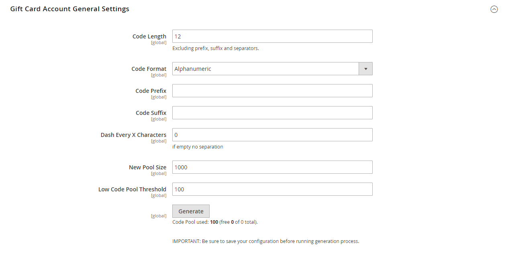

# [!UICONTROL Sales] > [!UICONTROL Gift Cards]

{{ee-feature}}

{{config}}

## [!UICONTROL Gift Card Email Settings]

<!-- zoom -->

<!-- [Gift Card Email Settings](https://docs.magento.com/user-guide/catalog/product-gift-card-account-configuration.html) -->

| Campo | [Ámbito](../../getting-started/websites-stores-views.md#scope-settings) | Descripción |
|--- |--- |--- |
| [!UICONTROL Gift Card Notification Email Sender] | Vista de tienda | Identifica el [contacto de tienda](../../getting-started/store-details.md#store-email-addresses) que aparece como el remitente del correo electrónico de notificación de la tarjeta de regalo. Valor predeterminado: `General Contact` |
| [!UICONTROL Gift Card Notification Email Template] | Vista de tienda | Determina el [plantilla](../../systems/email-templates.md) que se utiliza para el correo electrónico de notificación de la tarjeta regalo. |

{:style=&quot;table-layout:auto&quot;}

## [!UICONTROL Gift Card General Settings]

<!-- zoom -->

<!-- [Gift Card General Settings](https://docs.magento.com/user-guide/catalog/product-gift-card-account-configuration.html) -->

| Campo | [Ámbito](../../getting-started/websites-stores-views.md#scope-settings) | Descripción |
|--- |--- |--- |
| [!UICONTROL Redeemable] | Global | Determina si el titular de la tarjeta de regalo puede canjear su valor por dinero en efectivo. Opciones: `Yes` / `No`. |
| [!UICONTROL Lifetime (days)] | Global | Determina el número de días que la tarjeta es válida. Si se deja en blanco, la tarjeta no caduca.   **_Importante:_**En algunos lugares, es ilegal establecer una caducidad de datos en tarjetas de regalo. Compruebe las leyes locales antes de establecer una duración para sus tarjetas de regalo. |
| [!UICONTROL Allow Gift Message] | Vista de tienda | Determina si la opción de incluir un mensaje de regalo está disponible para los clientes que compran una tarjeta regalo. Opciones: `Yes` / `No`. |
| [!UICONTROL Gift Message Maximum Length] | Vista de tienda | Determina el número máximo de caracteres permitidos en un mensaje de tarjeta regalo. Valor predeterminado: 255 |
| [!UICONTROL Generate Gift Card Account when Order Item is] | Global | Determina si se genera una cuenta de tarjeta regalo cuando un cliente realiza un pedido o cuando se factura el pedido. Opciones: `Ordered` / `Invoiced` |

{:style=&quot;table-layout:auto&quot;}

## [!UICONTROL Email Sent from Gift Card Account Management]

<!-- zoom -->

<!-- [Email Sent from Gift Card Account Management](https://docs.magento.com/user-guide/catalog/product-gift-card-account-configuration.html) -->

| Campo | [Ámbito](../../getting-started/websites-stores-views.md#scope-settings) | Descripción |
|--- |--- |--- |
| [!UICONTROL Gift Card Email Sender] | Vista de tienda | Identifica el [contacto de tienda](../../getting-started/store-details.md#store-email-addresses) que aparece como el remitente del correo electrónico de la tarjeta regalo. Valor predeterminado: `General Contact` |
| [!UICONTROL Gift Card Template] | Vista de tienda | Determina el [plantilla](../../systems/email-templates.md) que se utiliza para el correo electrónico de la tarjeta de regalo. |

{:style=&quot;table-layout:auto&quot;}

## [!UICONTROL Gift Card Account General Settings]

<!-- zoom -->

<!-- [Gift Card Account General Settings](https://docs.magento.com/user-guide/catalog/product-gift-card-account-configuration.html) -->

| Campo | [Ámbito](../../getting-started/websites-stores-views.md#scope-settings) | Descripción |
|--- |--- |--- |
| [!UICONTROL Code Length] | Global | Determina la longitud del código de la tarjeta regalo. |
| [!UICONTROL Code Format] | Global | Determina el formato del código de la tarjeta regalo. Opciones: `Alphanumeric` / `Numeric` |
| [!UICONTROL Code Prefix] | Global | Define cualquier prefijo agregado al principio del código. |
| [!UICONTROL Code Suffix] | Global | Define cualquier sufijo agregado al final del código. |
| [!UICONTROL Dash Every X Characters] | Global | Si desea incluir guiones en el código, determina el número de caracteres entre cada guión. |
| [!UICONTROL New Pool Size] | Global | Determina el tamaño del nuevo grupo de código que se va a generar. |
| [!UICONTROL Low Code Pool Threshold] | Global | Déclencheur Determina el número de registros del grupo de código que avisa de que es necesario reabastecer el grupo. |
| [!UICONTROL Generate] | Global | Haga clic en para generar la lista de códigos de tarjeta regalo. |

{:style=&quot;table-layout:auto&quot;}
