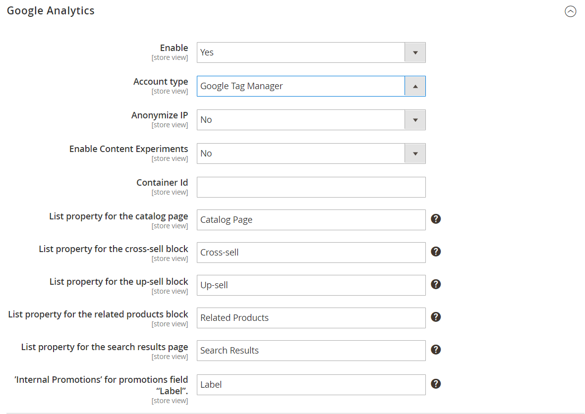

# [!UICONTROL Sales] > [!UICONTROL Google API]

{{config}}

## [!UICONTROL Google Analytics]

<!-- zoom -->

<!-- [Google Analytics](https://docs.magento.com/user-guide/marketing/google-universal-analytics.html) -->

| Campo | [Ámbito](../../getting-started/websites-stores-views.md#scope-settings) | Descripción |
| ----- | ------------------------------------------ | ----------- |
| [!UICONTROL Enable] | Vista de tienda | Habilita [!DNL Google Analytics] para su tienda. Opciones: `Yes` / `No` |
| [!UICONTROL Account Type] | Vista de tienda |  (Solo Adobe Commerce) Determina las opciones de configuración según el tipo de cuenta de Google Analytics. Opciones: Universal Analytics (predeterminado) / Google Tag Manager |
| [!UICONTROL Account Number] | Vista de tienda | El número de cuenta, o código de seguimiento, que se asignó al crear su [!DNL Google Analytics] cuenta. |
| [!UICONTROL Anonymize IP] | Vista de tienda | Determina si se elimina la información de identificación de las direcciones IP que aparecen en [!DNL Google Analytics] resultados. |
| [!UICONTROL Enable Content Experiments] | Vista de tienda | Activa [Experimentos de contenido de Google](https://support.google.com/analytics/answer/9366791?hl=en&amp;ref_topic=1745207), que se puede utilizar para probar hasta diez versiones diferentes de la misma página. Opciones: `Yes` / `No` |

{:style=&quot;table-layout:auto&quot;}

## [!UICONTROL Google Analytics - Google Tag Manager]

{{ee-feature}}

<!-- zoom -->

Cuándo **[!UICONTROL Account Type]** se establece en `Google Tag Manager`, se muestran campos adicionales.

| Campo | [Ámbito](../../getting-started/websites-stores-views.md#scope-settings) | Descripción |
| ----- | ------------------------------------------ | ----------- |
| [!UICONTROL Container ID] | Vista de tienda | El ID único del [!DNL Google Tag Manager] contenedor. Este valor suele comenzar por `GTM-`. Este ID se encuentra en su [!DNL Google Tag Manager] cuenta. If [!DNL Google Tag Manager] ya está instalado y configurado para su tienda, el ID de contenedor aparece automáticamente en este campo. |
| [!UICONTROL List property for the catalog page] | Vista de tienda | Identifica el [!DNL Google Tag Manager] propiedad asociada a la página del catálogo. Valor predeterminado: `Catalog Page` |
| [!UICONTROL List property for the cross-sell block] | Vista de tienda | Identifica el [!DNL Google Tag Manager] propiedad asociada al bloque de venta cruzada. Valor predeterminado: `Cross-sell` |
| [!UICONTROL List property for the up-sell block] | Vista de tienda | Identifica el [!DNL Google Tag Manager] propiedad asociada al bloque de ampliación de venta. Valor predeterminado: `Up-sell` |
| [!UICONTROL List property for the related products block] | Vista de tienda | Identifica el [!DNL Google Tag Manager] propiedad asociada al bloque de productos relacionado. Valor predeterminado: `Related Products` |
| [!UICONTROL List property for the search results page] | Vista de tienda | Identifica el [!DNL Google Tag Manager] propiedad asociada a la página de resultados de búsqueda. Valor predeterminado: `Search Results` |
| [!UICONTROL 'Internal Promotions' for promotions field "Label"] | Vista de tienda | Identifica el [!DNL Google Tag Manager] propiedad asociada con las etiquetas para promociones internas. Valor predeterminado: `Label` |

{:style=&quot;table-layout:auto&quot;}

## [!UICONTROL Google AdWords]

<!-- zoom -->

<!-- [Google AdWords](https://docs.magento.com/user-guide/marketing/google-adwords.html) -->

| Campo | [Ámbito](../../getting-started/websites-stores-views.md#scope-settings) | Descripción |
| ----- | ------------------------------------------ | ----------- |
| [!UICONTROL Enable] | Vista de tienda | Habilita Google AdWords para la tienda. Opciones: `Yes` / `No` |
| [!UICONTROL Conversion ID] | Vista de tienda | El ID de su cuenta de Google AdWords. |
| [!UICONTROL Conversion Language] | Vista de tienda | El idioma que se usa para las conversiones de AdWords. Opciones: `All available languages` |
| [!UICONTROL Conversion Format] | Vista de tienda | Determina el formato del [!DNL Google Site Stats] que aparece en la página de conversión. La notificación establece un vínculo a una página que informa a los visitantes sobre las cookies que se utilizan para realizar un seguimiento de sus visitas. Este valor numérico se asigna al `google_conversion_format` en el script de AdWords. Para obtener más información, consulte [Acerca del seguimiento de conversión](https://support.google.com/google-ads/answer/1722022?hl=en) en el sitio web de Google. Opciones:  **`1`**- Muestra una notificación de una línea. **`2`** : (Predeterminado) Muestra una notificación de dos líneas.  **`3`**- No muestra ninguna notificación al cliente. |
| [!UICONTROL Conversion Color] | Vista de tienda | Determina el color de la etiqueta de conversión. Utilice un [selector de color](https://www.w3schools.com/colors/colors_picker.asp) para elegir el valor hexadecimal. Este valor hexadecimal se asigna a `google_conversion_color` en el script de AdWords. Por ejemplo: ffffff  `var google_conversion_color = "ffffff";` |
| [!UICONTROL Conversion Label] | Vista de tienda | Una etiqueta de texto que aparece con la etiqueta [!DNL Google Site Stats] notificación. Esta cadena de texto se asigna al `~` en el script de AdWords. Por ejemplo: &quot;¡Gracias por comprar!&quot; |
| [!UICONTROL Conversion Value Type] | Vista de tienda | Especifica el tipo de valor que se utiliza para determinar cuándo se produce una conversión. Opciones:  **`Dynamic`**: Determina que se ha producido una conversión en función del importe del pedido dinámico. **`Constant`** : Determina que se ha producido una conversión en función del valor introducido. |
| [!UICONTROL Conversion Value] | Vista de tienda | Especifica el valor que se usa para una _[!UICONTROL Constant]_tipo de valor de conversión. |
| [!UICONTROL Send Order Currency] | Vista de tienda | Permite valores de conversión de moneda específicos de la transacción en AdWords (para sitios web con diferentes monedas base). |

{:style=&quot;table-layout:auto&quot;}

## [!UICONTROL Google GTag]

{{gtag-api-note}}

### [!UICONTROL Google Analytics4]

<!-- zoom -->

<!-- [Google Analytics4](https://docs.magento.com/user-guide/marketing/google-universal-analytics.html) -->

| Campo | [Ámbito](../../getting-started/websites-stores-views.md#scope-settings) | Descripción |
| ----- | ------------------------------------------ | ----------- |
| [!UICONTROL Enable] | Vista de tienda | Activa Google Analytics 4 para tu tienda. Opciones: `Yes` / `No` |
| [!UICONTROL Account Type] | Vista de tienda |  (Solo Adobe Commerce) Determina las opciones de configuración según el tipo de cuenta de Google Analytics. Opciones: `Google Analytics4` (predeterminado) / `Google Tag Manager` |
| [!UICONTROL Measurement ID] | Vista de tienda | El número de cuenta, o código de seguimiento, que se asignó al crear la cuenta de Google Analytics. |
| [!UICONTROL Anonymize IP] | Vista de tienda | Determina si se elimina la información de identificación de las direcciones IP que aparecen en los resultados de Google Analytics. |
| [!UICONTROL Enable Content Experiments] | Vista de tienda | Activa [Experimentos de contenido de Google](https://support.google.com/analytics/answer/9366791?hl=en&amp;ref_topic=1745207), que se puede utilizar para probar hasta diez versiones diferentes de la misma página. Opciones: `Yes` / `No` |

{:style=&quot;table-layout:auto&quot;}

### [!UICONTROL Google Analytics4 - Google Tag Manager]

{{ee-feature}}

<!-- zoom -->

Cuándo **[!UICONTROL Account Type]** se establece en `Google Tag Manager`, se muestran campos adicionales.

| Campo | [Ámbito](../../getting-started/websites-stores-views.md#scope-settings) | Descripción |
| ----- | ------------------------------------------ | ----------- |
| [!UICONTROL Container Id] | Vista de tienda | El ID único del [!DNL Google Tag Manager] contenedor. Este valor suele comenzar por `GTM-`. Este ID se encuentra en su cuenta de Google Tab Manager. If [!DNL Google Tag Manager] ya está instalado y configurado para su tienda, el ID de contenedor aparece automáticamente en este campo. |
| [!UICONTROL List property for the catalog page] | Vista de tienda | Identifica el [!DNL Google Tag Manager] propiedad asociada a la página del catálogo. Valor predeterminado: `Catalog Page` |
| [!UICONTROL List property for the cross-sell block] | Vista de tienda | Identifica el [!DNL Google Tag Manager] propiedad asociada al bloque de venta cruzada. Valor predeterminado: `Cross-sell` |
| [!UICONTROL List property for the up-sell block] | Vista de tienda | Identifica el [!DNL Google Tag Manager] propiedad asociada al bloque de ampliación de venta. Valor predeterminado: `Up-sell` |
| [!UICONTROL List property for the related products block] | Vista de tienda | Identifica el [!DNL Google Tag Manager] propiedad asociada al bloque de productos relacionado. Valor predeterminado: `Related Products` |
| [!UICONTROL List property for the search results page] | Vista de tienda | Identifica el [!DNL Google Tag Manager] propiedad asociada a la página de resultados de búsqueda. Valor predeterminado: `Search Results` |
| [!UICONTROL 'Internal Promotions' for promotions field "Label"] | Vista de tienda | Identifica el [!DNL Google Tag Manager] propiedad asociada con las etiquetas para promociones internas. Valor predeterminado: `Label` |

{:style=&quot;table-layout:auto&quot;}

### [!UICONTROL Google AdWords]

<!-- zoom -->

<!-- -- Google AdWords](https://docs.magento.com/user-guide/marketing/google-adwords.html) -->

| Campo | [Ámbito](../../getting-started/websites-stores-views.md#scope-settings) | Descripción |
| ----- | ------------------------------------------ | ----------- |
| [!UICONTROL Enable] | Vista de tienda | Habilita Google AdWords para la tienda. Opciones: `Yes` / `No` |
| [!UICONTROL Conversion ID] | Vista de tienda | El ID de su cuenta de Google AdWords. |
| [!UICONTROL Conversion Language] | Vista de tienda | El idioma que se usa para las conversiones de AdWords. Opciones: todos los idiomas disponibles |
| [!UICONTROL Conversion Format] | Vista de tienda | Determina el formato de la notificación de estadísticas del sitio de Google que aparece en la página de conversión. La notificación establece un vínculo a una página que informa a los visitantes sobre las cookies que se utilizan para realizar un seguimiento de sus visitas. Este valor numérico se asigna al `google_conversion_format` en el script de AdWords. Para obtener más información, consulte [Acerca del seguimiento de conversión](https://support.google.com/google-ads/answer/1722022?hl=en) en el sitio web de Google. Opciones:  **`1`**- Muestra una notificación de una línea. **`2`** : (Predeterminado) Muestra una notificación de dos líneas.  **`3`**- No muestra ninguna notificación al cliente. |
| [!UICONTROL Conversion Color] | Vista de tienda | Determina el color de la etiqueta de conversión. Utilice un [selector de color](https://www.w3schools.com/colors/colors_picker.asp) para elegir el valor hexadecimal. Este valor hexadecimal se asigna a `google_conversion_color` en el script de AdWords. Por ejemplo: ffffff  `var google_conversion_color = "ffffff";` |
| [!UICONTROL Conversion Label] | Vista de tienda | Etiqueta de texto que aparece con la notificación de Google Sites Stats. Esta cadena de texto se asigna al `~` en el script de AdWords. Por ejemplo: &quot;¡Gracias por comprar!&quot; |
| [!UICONTROL Conversion Value Type] | Vista de tienda | Especifica el tipo de valor que se utiliza para determinar cuándo se produce una conversión. Opciones:  **`Dynamic`**: Determina que se ha producido una conversión en función del importe del pedido dinámico. **`Constant`** : Determina que se ha producido una conversión en función del valor introducido. |
| [!UICONTROL Conversion Value] | Vista de tienda | Especifica el valor que se usa para una _[!UICONTROL Constant]_tipo de valor de conversión. |
| [!UICONTROL Send Order Currency] | Vista de tienda | Permite valores de conversión de moneda específicos de la transacción en AdWords (para sitios web con diferentes monedas base). |

{:style=&quot;table-layout:auto&quot;}
