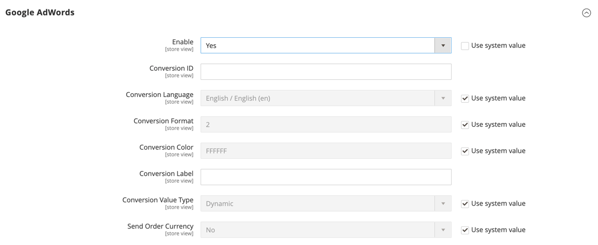

# [!UICONTROL Sales] > [!UICONTROL Google API]

{{config}}

## [!UICONTROL Google Analytics]

<!-- zoom -->

<!-- [Google Analytics](https://experienceleague.adobe.com/en/docs/commerce-admin/marketing/google-tools/google-analytics) -->

| Campo | [Ámbito](../../getting-started/websites-stores-views.md#scope-settings) | Descripción |
| ----- | ------------------------------------------ | ----------- |
| [!UICONTROL Enable] | Vista de tienda | Habilita [!DNL Google Analytics] para su tienda. Opciones: `Yes` / `No` |
| [!UICONTROL Account Type] | Vista de tienda |  (solo Adobe Commerce) Determina las opciones de configuración según el tipo de cuenta de Google Analytics. Opciones: Universal Analytics (predeterminado) / Google Tag Manager |
| [!UICONTROL Account Number] | Vista de tienda | El número de cuenta o código de seguimiento que se asignó al crear su cuenta de [!DNL Google Analytics]. |
| [!UICONTROL Anonymize IP] | Vista de tienda | Determina si se quita la información de identificación de las direcciones IP que aparecen en [!DNL Google Analytics] resultados. |

{style="table-layout:auto"}

## [!UICONTROL Google Analytics - Google Tag Manager]

{{ee-feature}}

<!-- zoom -->

Cuando **[!UICONTROL Account Type]** se establece en `Google Tag Manager`, hay campos adicionales mostrados.

| Campo | [Ámbito](../../getting-started/websites-stores-views.md#scope-settings) | Descripción |
| ----- | ------------------------------------------ | ----------- |
| [!UICONTROL Container ID] | Vista de tienda | Identificador exclusivo del contenedor [!DNL Google Tag Manager]. Este valor generalmente comienza con `GTM-`. Este identificador se encuentra en su cuenta de [!DNL Google Tag Manager]. Si [!DNL Google Tag Manager] ya está instalado y configurado para su tienda, el ID de contenedor aparecerá automáticamente en este campo. |
| [!UICONTROL List property for the catalog page] | Vista de tienda | Identifica la propiedad [!DNL Google Tag Manager] asociada con la página del catálogo. Valor predeterminado: `Catalog Page` |
| [!UICONTROL List property for the cross-sell block] | Vista de tienda | Identifica la propiedad [!DNL Google Tag Manager] asociada con el bloque de venta cruzada. Valor predeterminado: `Cross-sell` |
| [!UICONTROL List property for the up-sell block] | Vista de tienda | Identifica la propiedad [!DNL Google Tag Manager] asociada con el bloque de ampliación de venta. Valor predeterminado: `Up-sell` |
| [!UICONTROL List property for the related products block] | Vista de tienda | Identifica la propiedad [!DNL Google Tag Manager] asociada con el bloque de productos relacionado. Valor predeterminado: `Related Products` |
| [!UICONTROL List property for the search results page] | Vista de tienda | Identifica la propiedad [!DNL Google Tag Manager] asociada con la página de resultados de búsqueda. Valor predeterminado: `Search Results` |
| [!UICONTROL 'Internal Promotions' for promotions field "Label"] | Vista de tienda | Identifica la propiedad [!DNL Google Tag Manager] asociada con las etiquetas para las promociones internas. Valor predeterminado: `Label` |

{style="table-layout:auto"}

## [!UICONTROL Google AdWords]

<!-- zoom -->

<!-- [Google AdWords](https://experienceleague.adobe.com/en/docs/commerce-admin/marketing/google-tools/google-adwords) -->

| Campo | [Ámbito](../../getting-started/websites-stores-views.md#scope-settings) | Descripción |
| ----- | ------------------------------------------ | ----------- |
| [!UICONTROL Enable] | Vista de tienda | Habilita Google AdWords para la tienda. Opciones: `Yes` / `No` |
| [!UICONTROL Conversion ID] | Vista de tienda | El ID de su cuenta de Google AdWords. |
| [!UICONTROL Conversion Language] | Vista de tienda | El idioma que se usa para las conversiones de AdWords. Opciones: `All available languages` |
| [!UICONTROL Conversion Format] | Vista de tienda | Determina el formato de la notificación [!DNL Google Site Stats] que aparece en la página de conversión. La notificación establece un vínculo a una página que informa a los visitantes sobre las cookies que se utilizan para realizar un seguimiento de sus visitas. Este valor numérico se asigna a la variable `google_conversion_format` en el script de AdWords. Para obtener más información, consulta [Acerca del seguimiento de conversión](https://support.google.com/google-ads/answer/1722022?hl=en) en el sitio web de Google. Opciones:  **`1`**- Muestra una notificación de una línea. **`2`** - (Predeterminado) Muestra una notificación de dos líneas.  **`3`**- No muestra ninguna notificación al cliente. |
| [!UICONTROL Conversion Color] | Vista de tienda | Determina el color de la etiqueta de conversión. Use un [selector de color](https://www.w3schools.com/colors/colors_picker.asp) para elegir el valor hexadecimal. Este valor hexadecimal se asigna a la variable `google_conversion_color` en el script de AdWords. Por ejemplo: ffffff `var google_conversion_color = "ffffff";` |
| [!UICONTROL Conversion Label] | Vista de tienda | Etiqueta de texto que aparece con la notificación [!DNL Google Site Stats]. Esta cadena de texto se ha asignado a la variable `~` en el script de AdWords. Por ejemplo: &quot;¡Gracias por comprar!&quot; |
| [!UICONTROL Conversion Value Type] | Vista de tienda | Especifica el tipo de valor que se utiliza para determinar cuándo se produce una conversión. Opciones:  **`Dynamic`**- Determina que se ha producido una conversión basada en el importe de pedido dinámico. **`Constant`** - Determina que se ha producido una conversión en función del valor ingresado. |
| [!UICONTROL Conversion Value] | Vista de tienda | Especifica el valor utilizado para un tipo de valor de conversión _[!UICONTROL Constant]_. |
| [!UICONTROL Send Order Currency] | Vista de tienda | Permite valores de conversión de moneda específicos de la transacción en AdWords (para sitios web con diferentes monedas base). |

{style="table-layout:auto"}

## [!UICONTROL Google GTag]

{{gtag-api-note}}

### [!UICONTROL Google Analytics4]

<!-- zoom -->

<!-- [Google Analytics4](https://experienceleague.adobe.com/en/docs/commerce-admin/marketing/google-tools/google-analytics) -->

| Campo | [Ámbito](../../getting-started/websites-stores-views.md#scope-settings) | Descripción |
| ----- | ------------------------------------------ | ----------- |
| [!UICONTROL Enable] | Vista de tienda | Habilita Google Analytics 4 para tu tienda. Opciones: `Yes` / `No` |
| [!UICONTROL Account Type] | Vista de tienda |  (solo Adobe Commerce) Determina las opciones de configuración según el tipo de cuenta de Google Analytics. Opciones: `Google Analytics4` (predeterminado) / `Google Tag Manager` |
| [!UICONTROL Measurement ID] | Vista de tienda | El número de cuenta, o código de seguimiento, que se asignó al crear su cuenta de Google Analytics. |
| [!UICONTROL Anonymize IP] | Vista de tienda | Determina si se elimina la información de identificación de las direcciones IP que aparecen en los resultados de Google Analytics. |

{style="table-layout:auto"}

### [!UICONTROL Google Analytics4 - Google Tag Manager]

{{ee-feature}}

<!-- zoom -->

Cuando **[!UICONTROL Account Type]** se establece en `Google Tag Manager`, hay campos adicionales mostrados.

| Campo | [Ámbito](../../getting-started/websites-stores-views.md#scope-settings) | Descripción |
| ----- | ------------------------------------------ | ----------- |
| [!UICONTROL Container Id] | Vista de tienda | Identificador exclusivo del contenedor [!DNL Google Tag Manager]. Este valor generalmente comienza con `GTM-`. Este ID se encuentra en su cuenta de Google Tab Manager. Si [!DNL Google Tag Manager] ya está instalado y configurado para su tienda, el ID de contenedor aparecerá automáticamente en este campo. |
| [!UICONTROL List property for the catalog page] | Vista de tienda | Identifica la propiedad [!DNL Google Tag Manager] asociada con la página del catálogo. Valor predeterminado: `Catalog Page` |
| [!UICONTROL List property for the cross-sell block] | Vista de tienda | Identifica la propiedad [!DNL Google Tag Manager] asociada con el bloque de venta cruzada. Valor predeterminado: `Cross-sell` |
| [!UICONTROL List property for the up-sell block] | Vista de tienda | Identifica la propiedad [!DNL Google Tag Manager] asociada con el bloque de ampliación de venta. Valor predeterminado: `Up-sell` |
| [!UICONTROL List property for the related products block] | Vista de tienda | Identifica la propiedad [!DNL Google Tag Manager] asociada con el bloque de productos relacionado. Valor predeterminado: `Related Products` |
| [!UICONTROL List property for the search results page] | Vista de tienda | Identifica la propiedad [!DNL Google Tag Manager] asociada con la página de resultados de búsqueda. Valor predeterminado: `Search Results` |
| [!UICONTROL 'Internal Promotions' for promotions field "Label"] | Vista de tienda | Identifica la propiedad [!DNL Google Tag Manager] asociada con las etiquetas para las promociones internas. Valor predeterminado: `Label` |

{style="table-layout:auto"}

### [!UICONTROL Google AdWords]

<!-- zoom -->

<!-- -- Google AdWords](https://experienceleague.adobe.com/en/docs/commerce-admin/marketing/google-tools/google-adwords) -->

| Campo | [Ámbito](../../getting-started/websites-stores-views.md#scope-settings) | Descripción |
| ----- | ------------------------------------------ | ----------- |
| [!UICONTROL Enable] | Vista de tienda | Habilita Google AdWords para la tienda. Opciones: `Yes` / `No` |
| [!UICONTROL Conversion ID] | Vista de tienda | El ID de su cuenta de Google AdWords. |
| [!UICONTROL Conversion Language] | Vista de tienda | El idioma que se usa para las conversiones de AdWords. Opciones: todos los idiomas disponibles |
| [!UICONTROL Conversion Format] | Vista de tienda | Determina el formato de la notificación de estadísticas del sitio de Google que aparece en la página de conversión. La notificación establece un vínculo a una página que informa a los visitantes sobre las cookies que se utilizan para realizar un seguimiento de sus visitas. Este valor numérico se asigna a la variable `google_conversion_format` en el script de AdWords. Para obtener más información, consulta [Acerca del seguimiento de conversión](https://support.google.com/google-ads/answer/1722022?hl=en) en el sitio web de Google. Opciones:  **`1`**- Muestra una notificación de una línea. **`2`** - (Predeterminado) Muestra una notificación de dos líneas.  **`3`**- No muestra ninguna notificación al cliente. |
| [!UICONTROL Conversion Color] | Vista de tienda | Determina el color de la etiqueta de conversión. Use un [selector de color](https://www.w3schools.com/colors/colors_picker.asp) para elegir el valor hexadecimal. Este valor hexadecimal se asigna a la variable `google_conversion_color` en el script de AdWords. Por ejemplo: ffffff `var google_conversion_color = "ffffff";` |
| [!UICONTROL Conversion Label] | Vista de tienda | Etiqueta de texto que aparece con la notificación de Google Sites Stats. Esta cadena de texto se ha asignado a la variable `~` en el script de AdWords. Por ejemplo: &quot;¡Gracias por comprar!&quot; |
| [!UICONTROL Conversion Value Type] | Vista de tienda | Especifica el tipo de valor que se utiliza para determinar cuándo se produce una conversión. Opciones:  **`Dynamic`**- Determina que se ha producido una conversión basada en el importe de pedido dinámico. **`Constant`** - Determina que se ha producido una conversión en función del valor ingresado. |
| [!UICONTROL Conversion Value] | Vista de tienda | Especifica el valor utilizado para un tipo de valor de conversión _[!UICONTROL Constant]_. |
| [!UICONTROL Send Order Currency] | Vista de tienda | Permite valores de conversión de moneda específicos de la transacción en AdWords (para sitios web con diferentes monedas base). |

{style="table-layout:auto"}
