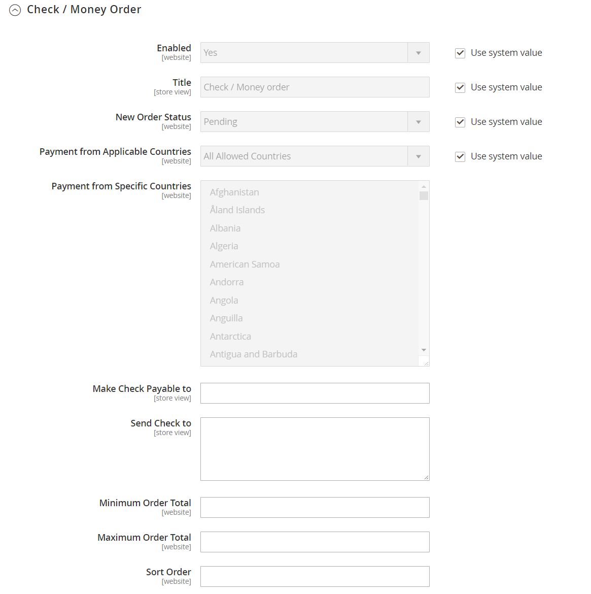
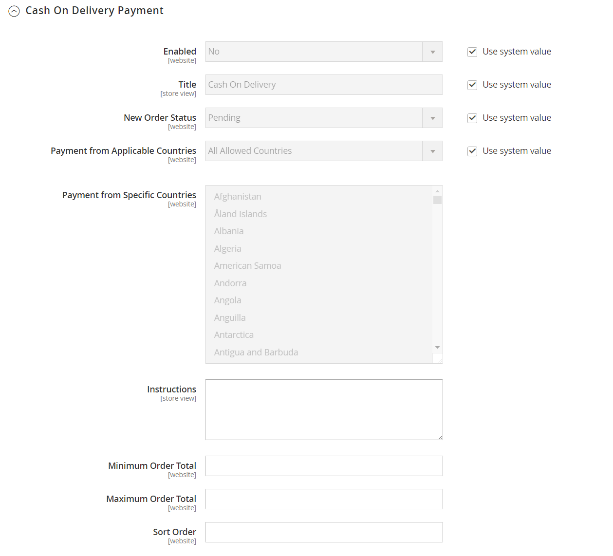

# [!UICONTROL Sales] > [!UICONTROL Payment Methods]

>[!TIP]
>
>Payment Services for Adobe Commerce and Magento Open Source ofrece una solución de autoservicio llave en mano que incluye pruebas de zona protegida y una configuración sencilla para proporcionar un procesamiento de pagos sólido y seguro. Para obtener más información sobre este potente conjunto de herramientas y cómo puede proporcionarte la perspectiva y el control que necesitas para crear la mejor experiencia para tus compradores, consulta la [_Guía del usuario de servicios de pago_](https://experienceleague.adobe.com/docs/commerce-merchant-services/payment-services/guide-overview.html).

{{config}}

## [!UICONTROL Merchant Location]

<!-- zoom -->

<!-- [Merchant Location](https://experienceleague.adobe.com/en/docs/commerce-admin/start/setup/store-details#merchant-location) -->

| Campo | [Ámbito](../../getting-started/websites-stores-views.md#scope-settings) | Descripción |
|--- |--- |--- |
| [!UICONTROL Merchant Country] | Sitio web | Identifica el país en el que el comerciante está registrado para realizar negocios. |

{style="table-layout:auto"}

## Soluciones recomendadas

Las siguientes soluciones de pago se recomiendan como una manera fácil para los comerciantes que están empezando a aceptar pagos en línea por cuenta PayPal o tarjeta de crédito. A medida que tu negocio crezca, puedes combinarlo con soluciones de pago adicionales de PayPal.

- [Pago y envío con PayPal Express](paypal-express-checkout.md)
- [Braintree](braintree.md)
- [Servicios de pago](payment-services.md)

>[!NOTE]
>
>Algunas integraciones de pago y extensiones agrupadas se han eliminado en las versiones 2.4.x y se han trasladado al Commerce Marketplace. Puede encontrar las extensiones de integración de pagos oficiales más recientes en [Commerce Marketplace](https://marketplace.magento.com/extensions/payments-security.html){:target="_blank"}.
> 
>**Amazon Pay** y **Klarna**: Adobe Commerce y Magento Open Source versiones 2.4.0 a 2.4.3 incluían estas extensiones desarrolladas por el proveedor. A partir de la versión 2.4.4, estas extensiones ya no se incluyen en la versión principal y deben instalarse y actualizarse desde el Commerce Marketplace. Marketplace también proporciona acceso a la documentación actual proporcionada por el desarrollador de extensiones.
> 
>Si tiene alguna de estas extensiones agrupadas habilitada y configurada, debe actualizar el archivo `composer.json` como parte del proceso de actualización de la versión 2.4.4 y administrar las actualizaciones de extensión que se realicen. Consulte [Módulos de actualización](https://experienceleague.adobe.com/docs/commerce-operations/upgrade-guide/modules/upgrade.html) en la _Guía de actualización_ para obtener más información. 
> 
>**Worldpay**, **Eway**, **CyberSource** y **Authorize.Net**: Para obtener más información sobre cómo realizar una transición segura a partir de estas integraciones de pago, consulta [DevBlog](https://community.magento.com/t5/Magento-DevBlog/Deprecation-of-Magento-core-payment-integrations/ba-p/426445){:target="_blank"}.

## Otros métodos de PayPal

PayPal ofrece varias soluciones de pago que satisfacen las necesidades de las empresas de todos los tamaños, y que se dedican a los negocios en todo el mundo. PayPal te permite aceptar pagos de todas las principales tarjetas de débito y crédito. PayPal ofrece comodidad adicional sin esfuerzo adicional, porque incluso los clientes que no tienen una cuenta PayPal pueden pagar sus compras con PayPal.

### Métodos todo en uno de PayPal

- [Pago mediante PayPal avanzado](paypal-payments-advanced.md)
- [PayPal Payments Pro](paypal-payments-pro.md)
- [PayPal Payments Standard](paypal-payments-standard.md)

### Puertas de pago PayPal

- [PayPal Payflow Pro](paypal-payflow-pro.md) (incluye Pago y envío exprés)
- [Vínculo de flujo de pago de PayPal](paypal-payflow-link.md) (incluye Pago y envío exprés)

## Métodos de pago básicos

Los siguientes métodos de pago están incorporados en Commerce y no utilizan un proveedor de pagos de terceros para procesar la transacción. Muchos de los métodos de pago básicos se gestionan sin conexión, en lugar de en línea.

### [!UICONTROL Check / Money Order]

<!-- zoom -->

<!-- [Check / Money Order](https://experienceleague.adobe.com/en/docs/commerce-admin/stores-sales/payments/offline/check-money-order) -->

| Campo | [Ámbito](../../getting-started/websites-stores-views.md#scope-settings) | Descripción |
|--- |--- |--- |
| [!UICONTROL Enabled] | Sitio web | Determina si los clientes pueden pagar mediante cheque o giro postal. Opciones: `Yes` / `No` |
| [!UICONTROL Title] | Vista de tienda | El nombre de esta forma de pago que aparece a los clientes durante el cierre de compra. |
| [!UICONTROL New Order Status] | Sitio web | Determina el [estado de pedido](../../stores-purchase/order-status.md) inicial asignado a pedidos pagados por un cheque o giro postal. Valor predeterminado: `Pending` |
| [!UICONTROL Payment from Applicable Countries] | Sitio web | Determina los países desde los que se acepta el pago mediante cheque o giro postal. Opciones: `All Allowed Countries` / `Specific Countries` |
| [!UICONTROL Payment from Specific Countries] | Sitio web | Identifica los países específicos desde los que acepta el pago mediante cheque o giro postal. |
| [!UICONTROL Make Check Payable to] | Vista de tienda | El nombre de la entidad a la que deben hacerse pagaderos los cheques y las órdenes de pago. |
| [!UICONTROL Send Check to] | Vista de tienda | La dirección postal a la que deben enviarse los cheques y giros postales. |
| [!UICONTROL Minimum Order Total] | Sitio web | La cantidad de pedido más pequeña que se puede pagar por cheque o giro postal. |
| [!UICONTROL Maximum Order Total] | Sitio web | La mayor cantidad de pedido que se puede pagar por cheque o giro postal.   **_Nota:_**Un pedido califica si el total está entre el total de pedido mínimo o máximo, o si coincide con él. |
| [!UICONTROL Sort Order] | Sitio web | Un número que determina el orden en que aparece el pago mediante cheque o giro postal cuando se enumera con otros métodos de pago durante el pago. Escriba `0` para colocarlo al principio de la lista. |

{style="table-layout:auto"}

### [!UICONTROL Bank Transfer Payment]

<!-- zoom -->

<!-- [Bank Transfer Payment](https://experienceleague.adobe.com/en/docs/commerce-admin/stores-sales/payments/offline/bank-transfer) -->

| Campo | [Ámbito](../../getting-started/websites-stores-views.md#scope-settings) | Descripción |
|--- |--- |--- |
| [!UICONTROL Enabled] | Sitio web | Determina si los clientes pueden pagar transfiriendo el pago directamente desde su banco a su cuenta de comerciante. Opciones: `Yes` / `No` |
| [!UICONTROL Title] | Vista de tienda | El nombre de esta forma de pago que aparece a los clientes durante el cierre de compra. |
| [!UICONTROL New Order Status] | Sitio web | Determina el estado de pedido inicial asignado a pedidos pagados por transferencia bancaria. Valor predeterminado: `Pending` |
| [!UICONTROL Payment from Applicable Countries] | Sitio web | Determina los países desde los que se acepta el pago mediante transferencia bancaria. Opciones: `All Allowed Countries` / `Specific Countries` |
| [!UICONTROL Payment from Specific Countries] | Sitio web | Identifica los países específicos desde los que se acepta el pago mediante transferencia bancaria. |
| [!UICONTROL Minimum Order Total] | Sitio web | El importe de pedido más pequeño que se puede pagar por transferencia bancaria. |
| [!UICONTROL Maximum Order Total] | Sitio web | La mayor cantidad de pedido que se puede pagar por transferencia bancaria.   **_Nota:_**Un pedido califica si el total está entre el total de pedido mínimo o máximo, o si coincide con él. |
| [!UICONTROL Sort Order] | Sitio web | Un número que determina el orden en que aparece el pago por transferencia bancaria cuando se enumera con otros métodos de pago durante el cierre de compra. Escriba `0` para colocarlo al principio de la lista. |

{style="table-layout:auto"}

### [!UICONTROL Payment on Account]

{{b2b-feature}}

<!-- zoom -->

<!-- [Payment on Account](https://experienceleague.adobe.com/en/docs/commerce-admin/b2b/enable-basic-features#configure-payment-on-account) -->

| Campo | [Ámbito](../../getting-started/websites-stores-views.md#scope-settings) | Descripción |
|--- |--- |--- |
| [!UICONTROL Enabled] | Sitio web | Determina si las empresas pueden utilizar el crédito de la empresa para realizar compras. Opciones: `Yes` / `No` |
| [!UICONTROL Title] | Vista de tienda | El nombre de esta forma de pago que aparece a los clientes durante el cierre de compra. |
| [!UICONTROL New Order Status] | Sitio web | Determina el estado de los nuevos pedidos cargados a una cuenta de empresa. Opciones: `Pending (default)` / `Processing` / `Suspected Fraud` |
| [!UICONTROL Payment from Applicable Countries] | Sitio web | Determina los países en los que se permite a las compañías cargar compras en sus cuentas. Opciones: `All Allowed Countries` / `Specific Countries` |
| [!UICONTROL Payment from Specific Countries] | Sitio web | Identifica los países específicos en los que las empresas pueden cargar compras a sus cuentas. |
| [!UICONTROL Minimum Order Total] | Sitio web | Especifica el importe de pedido más pequeño que se puede cargar a una cuenta de empresa. |
| [!UICONTROL Maximum Order Total] | Sitio web | El mayor importe de pedido que se puede cargar a una cuenta de empresa.   **_Nota:_**Un pedido califica si el total está entre el total de pedido mínimo o máximo, o si coincide con él. |
| [!UICONTROL Sort Order] | Sitio web | Un número que determina el orden en que aparece el pago a cuenta cuando se enumera con otros métodos de pago durante el cierre de compra. Escriba `0` para colocarlo al principio de la lista. |

{style="table-layout:auto"}

>[!NOTE]
>
>Pago a cuenta no es compatible con pedidos con [varias direcciones de envío](../../stores-purchase/shipping-settings.md#multiple-addresses) y no aparece entre las opciones de pago.

### [!UICONTROL Cash On Delivery Payment]

<!-- zoom -->

<!-- [Cash On Delivery Payment](../../stores-purchase/cash-on-delivery.html) -->

| Campo | [Ámbito](../../getting-started/websites-stores-views.md#scope-settings) | Descripción |
|--- |--- |--- |
| [!UICONTROL Enabled] | Sitio web | Determina si los clientes pueden pagar transfiriendo el pago directamente desde su banco a su cuenta de comerciante. Opciones: `Yes` / `No` |
| [!UICONTROL Title] | Vista de tienda | El nombre de esta forma de pago que aparece a los clientes durante el cierre de compra. |
| [!UICONTROL New Order Status] | Sitio web | Determina el estado de pedido inicial asignado a pedidos pagados por transferencia bancaria. Valor predeterminado: `Pending` |
| [!UICONTROL Payment from Applicable Countries] | Sitio web | Determina los países desde los que se acepta el pago mediante transferencia bancaria. Opciones: `All Allowed Countries` / `Specific Countries` |
| [!UICONTROL Payment from Specific Countries] | Sitio web | Identifica los países específicos desde los que se acepta el pago mediante transferencia bancaria. |
| [!UICONTROL Minimum Order Total] | Sitio web | Especifica el importe de pedido más pequeño que se puede pagar mediante transferencia bancaria. |
| [!UICONTROL Maximum Order Total] | Sitio web | La mayor cantidad de pedido que se puede pagar por transferencia bancaria.   **_Nota:_**Un pedido califica si el total está entre el total de pedido mínimo o máximo, o si coincide con él. |
| [!UICONTROL Sort Order] | Sitio web | Un número que determina el orden en que aparece el pago por transferencia bancaria cuando se enumera con otros métodos de pago durante el cierre de compra. Escriba `0` para colocarlo al principio de la lista. |

{style="table-layout:auto"}

### [!UICONTROL Zero Subtotal Checkout]

<!-- zoom -->

<!-- [Zero Subtotal Checkout](../../stores-purchase/zero-subtotal-checkout.html) -->

| Campo | [Ámbito](../../getting-started/websites-stores-views.md#scope-settings) | Descripción |
|--- |--- |--- |
| [!UICONTROL Title] | Vista de tienda | El nombre que se usa para este método de pago durante el cierre de compra. Valor predeterminado: no se requiere información de pago |
| [!UICONTROL Enabled] | Sitio web | Determina si el administrador de la tienda puede gestionar pedidos que tienen un subtotal de cero, como uno que se ha gravado, pero un descuento ha reducido el importe a cero. Opciones: `Yes` / `No` |
| [!UICONTROL New Order Status] | Sitio web | Determina el estado de pedido inicial asignado a pedidos procesados como Cierre de Subtotal Cero. Valor predeterminado: `Pending` |
| [!UICONTROL Payment from Applicable Countries] | Sitio web | Determina los países desde los que se puede aplicar el cierre de compra de subtotal cero. Opciones: `All Allowed Countries` / `Specific Countries` |
| [!UICONTROL Payment from Specific Countries] | Sitio web | Identifica los países específicos a los que se puede aplicar el cierre de compra con subtotal cero. |
| [!UICONTROL Sort Order] | Sitio web | Un número que determina el orden en el que aparece el título, como &quot;No se requiere información de pago&quot;, al ponerse en venta con otros métodos de pago durante el cierre de compra. Escriba `0` para colocarlo al principio de la lista. |

{style="table-layout:auto"}

## [!UICONTROL Payment actions]

Las acciones de pago están configuradas _por método de pago_. La acción de pago determina cuándo se capturan los fondos y cuándo se crean facturas para los pedidos de venta.

Consulte la sección Configuración básica de cada método de pago individual para obtener una lista completa de las opciones de configuración individuales.

| Acción de pago | Descripción |
|--- |---|
| [!UICONTROL Authorization] | Aprueba la compra, pero retiene los fondos. El importe no se retira hasta que el comerciante lo capture. |
| [!UICONTROL Authorize] | Autoriza la cuenta del comprador para el total del pedido, pero no registra el pago. Capture el pago creando una factura. Los pedidos autorizados se pueden anular o cancelar. |
| [!UICONTROL Authorize and Capture] | Autoriza la cuenta del comprador para el total del pedido y captura el pago. Se crea automáticamente una factura. Puede reembolsar los fondos capturados a través de la nota de crédito. No puede cancelar un pedido una vez registrado el pago. |
| [!UICONTROL Charge on shipment] | Amazon recibe una solicitud de captura y carga al cliente cuando se crea una factura en Commerce. |
| [!UICONTROL Charge on order] | Amazon crea la factura y carga al cliente cuando se realiza el pedido. |
| [!UICONTROL Not Capture] | Cuando se envía la factura, el sistema no registra el pago. Se da por hecho que el pago se registra más adelante a través de Commerce. Hay un botón Capturar en la factura completada. Antes de capturar, puede cancelar la factura. Después de la captura, puede crear una nota de abono y anular la factura. |
| [!UICONTROL Order] | Representa un acuerdo con PayPal que permite al comerciante capturar una o más cantidades hasta el total del pedido desde la cuenta de comprador del cliente, en un período de tiempo definido (hasta 29 días). |
| [!UICONTROL Sale] | El importe de la compra se autoriza y se retira inmediatamente de la cuenta del cliente. |

{style="table-layout:auto"}

>[!NOTE]
>
>No seleccione la opción _[!UICONTROL Not Capture]_a menos que esté seguro de que va a capturar el pago mediante Commerce más adelante. No puede crear una nota de abono hasta que el pago se haya capturado con el botón Capturar.

## [!UICONTROL Purchase Order]

<!-- zoom -->

<!-- [Purchase Order](../../stores-purchase/purchase-order.html) -->

| Campo | [Ámbito](../../getting-started/websites-stores-views.md#scope-settings) | Descripción |
|--- |--- |--- |
| [!UICONTROL Enabled] | Sitio web | Determina si los clientes pueden pagar por pedido de compra. Opciones: `Yes` / `No` |
| [!UICONTROL Title] | Vista de tienda | El nombre de esta forma de pago que aparece a los clientes durante el cierre de compra. |
| [!UICONTROL New Order Status] | Sitio web | Determina el [estado de pedido](../../stores-purchase/order-status.md) inicial asignado a pedidos pagados por PC. Valor predeterminado: Pendiente |
| [!UICONTROL Payment from Applicable Countries] | Sitio web | Determina los países desde los que se acepta el pago por OC. Opciones: `All Allowed Countries` / `Specific Countries` |
| [!UICONTROL Payment from Specific Countries] | Sitio web | Identifica los países específicos desde los que acepta el pago por OC. |
| [!UICONTROL Minimum Order Total] | Sitio web | El importe de pedido más pequeño que se puede pagar por pedido. |
| [!UICONTROL Maximum Order Total] | Sitio web | El importe de pedido más grande que puede pagar la OC.   **_Nota:_**Un pedido califica si el total está entre el total de pedido mínimo o máximo, o si coincide con él. |
| [!UICONTROL Sort Order] | Sitio web | Número que determina el orden en el que aparece el pago por pedido cuando se enumera con otros métodos de pago durante el cierre de compra. Escriba `0` para colocarlo al principio de la lista. |

{style="table-layout:auto"}
