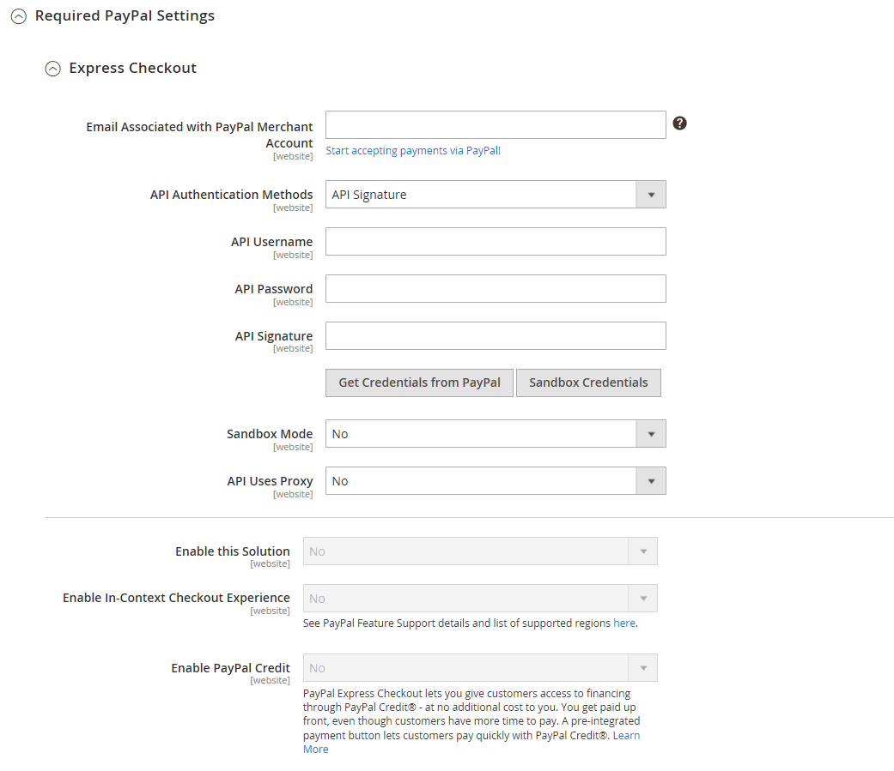

# [!UICONTROL Sales] > [!UICONTROL Payment Methods] > [!UICONTROL PayPal Express Checkout]

>[!IMPORTANT]
>
>**Requisitos de PSD2:**  
>A partir del 14 de septiembre de 2019, los bancos europeos podrían rechazar los pagos que no cumplan [PSD 2](../../getting-started/compliance-payment-services-directive.md) requisitos. PayPal Express Checkout no necesita realizar ninguna acción para cumplir con PSD2 porque PayPal gestiona todos los requisitos.

{{config}}

## [!UICONTROL Required PayPal Settings]

<!-- zoom -->

<!-- [PayPal Express Checkout Required Settings](../../stores-purchase/paypal-express-checkout.html) -->

| Campo | [Ámbito](../../getting-started/websites-stores-views.md#scope-settings) | Descripción |
|--- |--- |--- |
| [!UICONTROL Enable this Solution] | Sitio web | Activa [!DNL PayPal Express Checkout] como una forma de pago disponible para sus clientes. Opciones: `Yes` / `No` |
| [!UICONTROL Enable In-Context Checkout Experience] | Sitio web | Activa el Pago y envío en contexto optimizado de PayPal como una forma de pago disponible para sus clientes. Opciones: `Yes` / `No` |
| [!UICONTROL Enable PayPal Credit] | Sitio web | Activa el crédito de PayPal para permitir a los clientes comprar ahora, pero pagar más tarde. Te pagan por adelantado, pero los clientes tienen más tiempo para pagar. Opciones: `Yes` / `No` |

{style="table-layout:auto"}

### [!UICONTROL Express Checkout]

| Campo | [Ámbito](../../getting-started/websites-stores-views.md#scope-settings) | Descripción |
|--- |--- |--- |
| [!UICONTROL Email Associated with PayPal Merchant Account] | Sitio web | Especifica la dirección de correo electrónico que especificó al establecer la cuenta de comerciante de PayPal. La dirección de correo electrónico distingue entre mayúsculas y minúsculas y debe coincidir exactamente con la dirección de correo electrónico del sistema PayPal. |
| [!UICONTROL API Authentication Methods] | Sitio web | Determina el método utilizado para la autenticación de API. Opciones:  **`API Signature`**- Muestra el _[!UICONTROL API Signature]_en el formulario. **`API Certificate`**- Muestra el_[!UICONTROL API Certificate]_ en el formulario. |
| [!UICONTROL API Username] | Sitio web | El nombre de usuario de la API asociado a su cuenta comercial de PayPal. |
| [!UICONTROL API Password] | Sitio web | La contraseña de API asociada a su cuenta de comerciante de PayPal. |
| [!UICONTROL API Signature] | Sitio web | La firma de API asociada a su cuenta de comerciante de PayPal. |
| [!UICONTROL API Certificate] | Sitio web | Examine para cargar el certificado de API. |
| [!UICONTROL Get Credentials from PayPal] |  | Obtiene tus credenciales de API de PayPal. |
| [!UICONTROL Sandbox Credentials] |  | Obtiene las credenciales de la zona protegida de PayPal. |
| [!UICONTROL Sandbox Mode] | Sitio web | Para ejecutar el proceso de pago y envío de PayPal Express en un entorno de prueba, introduce las credenciales de la API de tu zona protegida y configúrelo en `Yes`. Opciones: `Yes` / `No` |
| [!UICONTROL API Uses Proxy] | Sitio web | Si su sistema utiliza un servidor proxy para establecer la conexión entre Commerce y el sistema PayPal, configúrelo en `Yes`. Opciones: `Yes` / `No` |
| [!UICONTROL Proxy Host] | Sitio web | Si la API utiliza proxy, especifica la dirección IP del host proxy. |
| [!UICONTROL Proxy Port] | Sitio web | Si la API utiliza proxy, especifica el puerto que utiliza el host proxy. |

{style="table-layout:auto"}

### [!UICONTROL Advertise PayPal Credit]

<!-- zoom -->

| Campo | [Ámbito](../../getting-started/websites-stores-views.md#scope-settings) | Descripción |
|--- |--- |--- |
| [!UICONTROL Publisher ID] | Sitio web | El identificador de publicador asociado a tu cuenta de crédito de PayPal. |
| [!UICONTROL Get Publisher ID from PayPal] |  | Obtiene tu identificador de publicador de PayPal. |
| [!UICONTROL Home Page] | Sitio web | Determina la posición y el tamaño del [!DNL PayPal Credit] titular de la página principal. Opciones:  **Mostrar** - Muestra un[!DNL PayPal Credit] titular en la página de inicio de la tienda. Opciones: `Yes` / `No`  **Posición** - Determina la posición del [!DNL PayPal Credit] titular de la página principal. Opciones: Encabezado (centro) / Barra lateral (derecha)  **Tamaño** - Determina el tamaño del [!DNL PayPal Credit] titular de la página principal. Opciones: `190 x 100` / `234 x 60` / `300 x 50` / `468 x 60` / `728 x 90` /` 800 x 66` |
| [!UICONTROL Catalog Category Page] | Sitio web | Determina la posición y el tamaño del [!DNL PayPal Credit] titular en páginas de categoría. Opciones: (igual que para [!UICONTROL Home Page]) |
| [!UICONTROL Catalog Product Page] | Sitio web | Determina la posición y el tamaño del [!DNL PayPal Credit] titular en páginas de producto. Opciones: (igual que para [!UICONTROL Home Page]) |
| [!UICONTROL Checkout Cart Page] | Sitio web | Determina la posición y el tamaño del [!DNL PayPal Credit] titular de la página del carro de compras. Opciones: (igual que para [!UICONTROL Home Page]) |

{style="table-layout:auto"}

## [!UICONTROL Basic Settings]

<!-- zoom -->

| Campo | [Ámbito](../../getting-started/websites-stores-views.md#scope-settings) | Descripción |
|--- |--- |--- |
| [!UICONTROL Title] | Vista de tienda | Un nombre que identifica el método de pago Pago y envío de PayPal Express durante el pago y envío. |
| [!UICONTROL Sort Order] | Vista de tienda | Un número que determina el pedido que PayPal Express Checkout aparece cuando aparece con otros métodos de pago durante el proceso de pago. Entrar `0` en la parte superior de la lista. |
| [!UICONTROL Payment Action] | Sitio web | Determina la acción realizada por PayPal cuando recibe un pedido. Opciones:  **`Authorization`**- Aprueba la compra, pero suspende los fondos. La cantidad no se retira hasta que sea &quot;capturada&quot; por el comerciante. **`Sale`** - El importe de la compra se autoriza y se retira inmediatamente de la cuenta del cliente.  **`Order`**- Representa un acuerdo con PayPal que permite al comerciante capturar una o más cantidades hasta el total pedido desde la cuenta de comprador del cliente, en un período de tiempo definido. Esto puede tardar hasta 29 días. Se deben generar una o más facturas desde el administrador de Commerce para capturar los fondos. |
| [!UICONTROL Display on Product Details Page] | Vista de tienda | Determina si aparece el botón &quot;Finalizar compra con PayPal&quot; en las páginas de productos. Las opciones incluyen: `Yes` / `No` |

{style="table-layout:auto"}

## [!UICONTROL Advanced Settings]

<!-- zoom -->

| Campo | [Ámbito](../../getting-started/websites-stores-views.md#scope-settings) | Descripción |
|--- |--- |--- |
| [!UICONTROL Display on Shopping Cart] | Vista de tienda | Determina si Pago y envío mediante PayPal Express aparece como una opción de pago en el carro de compras. Opciones: `Yes` (PayPal recomendado) / `No` |
| [!UICONTROL Payment Action Applicable From] | Sitio web | Determina el intervalo de la selección de país aplicable. Opciones: `All Allowed Countries` / `Specific Countries` |
| [!UICONTROL Countries Payment Applicable From] | Sitio web | Identifica cada país desde el que se acepta el pago. Solo los clientes con una dirección de facturación en un país seleccionado pueden realizar compras con esta forma de pago. |
| [!UICONTROL Debug Mode] | Sitio web | Registra los mensajes enviados entre su tienda y el sistema de pago en un archivo de registro. Opciones: `Yes` / `No`   **_Nota:_**El archivo de registro se almacena en el servidor y solo pueden acceder a él los desarrolladores. De acuerdo con las normas de seguridad de datos PCI, la información de la tarjeta de crédito no se registra en el archivo de registro. |
| [!UICONTROL Enable SSL Verification] | Sitio web | Habilita la verificación del certificado de seguridad del host. Opciones: `Yes` / `No` |
| [!UICONTROL Transfer Cart Line Items] | Sitio web | Muestra un resumen completo de los artículos de línea del carro de compras del cliente en el sitio de PayPal. Opciones: `Yes` / `No` |
| [!UICONTROL Transfer Shipping Options] | Sitio web | Incluye hasta diez opciones de envío en el sitio de PayPal. Opciones: `Yes` / `No` |
| [!UICONTROL Shortcut Buttons Flavor] | Vista de tienda | Determina el tipo de imagen utilizada para el botón de aceptación de PayPal. Opciones:  **`Dynamic`**- (Recomendado) Muestra una imagen que se puede cambiar dinámicamente desde el servidor de PayPal. **`Static`** - Muestra una imagen estática que no se puede cambiar dinámicamente. |
| [!UICONTROL Enable PayPal Guest Checkout] | Sitio web | Permite a los clientes que no tengan cuentas de PayPal realizar compras con el Pago y envío de PayPal Express. Opciones: `Yes` / `No` |
| [!UICONTROL Require Customer's Billing Address] | Sitio web | Determina si se requiere la dirección de facturación del cliente. Opciones: `Yes` / `No` / `For Virtual Quotes Only` |
| [!UICONTROL Billing Agreement Signup] | Sitio web | Determina si los clientes pueden entrar en una [contrato facturación](../../stores-purchase/paypal-billing-agreements.md) con tu tienda. Opciones:  **`Auto`**- El cliente puede suscribirse a un contrato de facturación durante el Pago y envío exprés. **`Ask Customer`** - Se pregunta al cliente si desea suscribirse a un acuerdo de facturación.  **`Never`**- Los clientes no tienen la opción de suscribirse a un acuerdo de facturación. |
| [!UICONTROL Skip Order Review Step] | Sitio web | Determina si los clientes pueden completar la transacción desde el sitio de PayPal o si deben regresar a su tienda y completar el paso de revisión de pedidos antes de enviar el pedido. Opciones: `Yes` / `No` |

{style="table-layout:auto"}

### [!UICONTROL Billing Agreement Settings]

<!-- zoom -->

| Campo | [Ámbito](../../getting-started/websites-stores-views.md#scope-settings) | Descripción |
|--- |--- |--- |
| [!UICONTROL Enabled] | Sitio web | Cuando se habilita, los acuerdos de facturación aparecen a los clientes como una opción de pago durante el cierre de compra. Opciones: `Yes` / `No` |
| [!UICONTROL Title] | Vista de tienda | La etiqueta de la opción de acuerdo de facturación de PayPal que aparece como una opción de pago durante el cierre de compra. |
| [!UICONTROL Sort Order] | Vista de tienda | Determina el orden en que se enumeran los acuerdos de facturación con otros métodos de pago durante el cierre de compra. |
| [!UICONTROL Payment Action] | Sitio web | Determina cómo gestiona PayPal la transacción: Opciones:  **Autorización** - Aprueba la compra, pero suspende los fondos. La cantidad no se retira hasta que sea &quot;capturada&quot; por el comerciante.  **Venta** - El importe de la compra se autoriza y se retira inmediatamente de la cuenta del cliente. |
| [!UICONTROL Payment Applicable From] | Sitio web | Determina el intervalo de la selección de país aplicable. Opciones: Todos los países permitidos / Países específicos |
| [!UICONTROL Countries Payment Applicable From] | Sitio web | Identifica cada país desde el que se acepta el pago. Solo los clientes con una dirección de facturación en un país seleccionado pueden realizar compras con esta forma de pago. |
| [!UICONTROL Debug Mode] | Sitio web | Registra la comunicación con el sistema de pago en un archivo de registro. Opciones: `Yes` / `No`   **_Nota:_**El archivo de registro se almacena en el servidor y solo pueden acceder a él los desarrolladores. De acuerdo con las normas de seguridad de datos PCI, la información de la tarjeta de crédito no se registra en el archivo de registro. |
| [!UICONTROL Enable SSL Verification] | Sitio web | Habilita un paso de verificación para que garantice que la transacción se realice a través de un canal SSL cifrado. Opciones: `Yes` / `No` |
| [!UICONTROL Transfer Cart Line Items] | Sitio web | Cuando está activada, muestra un resumen de los artículos de línea del carro de compras en la página de pagos de PayPal. Opciones: `Yes` / `No` |
| [!UICONTROL Allow in Billing Agreement Wizard] | Sitio web | Cuando está activada, los clientes pueden iniciar un acuerdo de facturación desde el panel de su cuenta de cliente. |

{style="table-layout:auto"}

### [!UICONTROL Settlement Report Settings]

<!-- zoom -->

| Campo | [Ámbito](../../getting-started/websites-stores-views.md#scope-settings) | Descripción |
|--- |--- |--- |
| **[!UICONTROL SFTP Credentials]** |  |  |
| [!UICONTROL Login] | Sitio web | Nombre de usuario necesario para iniciar sesión en el servidor FTP seguro de PayPal. |
| [!UICONTROL Password] | Sitio web | La contraseña necesaria para iniciar sesión en el servidor FTP seguro de PayPal. |
| [!UICONTROL Sandbox Mode] | Sitio web | Cuando está habilitado, ejecuta informes en un entorno de prueba antes de &quot;activarse&quot; en el entorno de producción. Opciones: `Yes` / `No` |
| [!UICONTROL Custom Endpoint Hostname or IP-Address] | Sitio web | Dirección URL donde se administran los informes de liquidación. Valor predeterminado: `reports.paypal.com` |
| [!UICONTROL Custom Path] | Sitio web | La ruta en la que se guardan los informes de liquidación en el servidor. Valor predeterminado: `/ppreports/outgoing` |
| **[!UICONTROL Scheduled Fetching]** |  |  |
| [!UICONTROL Enable Automatic Fetching] | Sitio web | Cuando está activado, obtiene los informes de liquidación automáticamente según lo programado. Opciones: `Yes` / `No` |
| [!UICONTROL Schedule] | Sitio web | Determina la frecuencia con la que PayPal genera los informes de liquidación. Opciones: `Daily` / `Every 3 days` / `Every 7 days` / `Every 10 days` / `Every 14 days` / `Every 30 days` / `Every 40 days` |
| [!UICONTROL Time of Day] | Sitio web | Determina la hora, los minutos y el segundo en que se generan los informes de liquidación. |

{style="table-layout:auto"}

### [!UICONTROL Frontend Experience Settings]

<!-- zoom -->

| Campo | [Ámbito](../../getting-started/websites-stores-views.md#scope-settings) | Descripción |
|--- |--- |--- |
| [!UICONTROL PayPal Product Logo] | Vista de tienda | Determina el logotipo de PayPal que aparecerá en tu tienda. Hay cuatro estilos básicos en dos tamaños. Opciones: `No Logo` / `We prefer PayPal (150 x 60)` / `We prefer PayPal (150 x 40)` / `Now accepting PayPal (150 x 60)` / `Now accepting PayPal (150 x 40)` / `Payments by PayPal (150 x 60)` / `Payments by PayPal (150 x 40)` / `Shop now using (150 x 60)` / `Shop now using (150 x 40)` |
| **[!UICONTROL PayPal Merchant Pages Style]** |  |  |
| [!UICONTROL Page Style] | Vista de tienda | Determina el aspecto de la página de comerciante de PayPal. Valores permitidos: **`paypal`** - Utiliza el estilo de página PayPal.  **`primary`**: Utiliza el estilo de página que identificó como el estilo &quot;principal&quot; en el perfil de la cuenta. **`your_custom_value`** : Utiliza un estilo de página de pago personalizado, que se especifica en el perfil de la cuenta. |
| [!UICONTROL Header Image URL] | Vista de tienda | Dirección URL de la imagen que aparece en la esquina superior izquierda de la página de cierre de compra. El tamaño máximo es de 750 x 90 píxeles.   **_Nota:_**PayPal recomienda que la imagen se almacene en un servidor seguro (https). De lo contrario, el navegador del cliente puede advertir que &quot;la página contiene elementos seguros y no seguros&quot;. |
| [!UICONTROL Header Image Background Color] | Vista de tienda | Los seis caracteres [color hexadecimal](https://en.wikipedia.org/wiki/Web_colors) código para el color de fondo del encabezado en la página de cierre de compra. Puede escribir el código en mayúsculas y minúsculas. |
| [!UICONTROL Header Image Border Color] | Vista de tienda | Los seis caracteres [color hexadecimal](https://en.wikipedia.org/wiki/Web_colors) código para el borde de dos píxeles alrededor del encabezado. |
| [!UICONTROL Page Background Color] | Vista de tienda | Los seis caracteres [color hexadecimal](https://en.wikipedia.org/wiki/Web_colors) código para el color de fondo de la página de pago que aparece detrás del encabezado y del formulario de pago. |

{style="table-layout:auto"}

#### [!UICONTROL Customize Smart Buttons (Basic)]

<!-- zoom -->

| Campo | [Ámbito](../../getting-started/websites-stores-views.md#scope-settings) | Descripción |
|--- |--- |--- |
| [!UICONTROL Customize Button] | Vista de tienda | Determina si los botones inteligentes de PayPal se pueden personalizar para que coincidan con el diseño y la temática de la tienda. Puede aplicar estos cambios de forma independiente en la página Cierre de compra, en las páginas de Productos, en la página Carro de compras y en el minicarrito. |
| [!UICONTROL Label] | Vista de tienda | El texto que PayPal muestra en el botón Pago inteligente. Opciones:  **`Checkout`**(se muestra como &quot;Pago y envío mediante PayPal&quot;) **`Pay`** (se muestra como &quot;Pagar con PayPal&quot;)  **`Buy Now`**(se muestra como &quot;Comprar ahora con PayPal&quot;) **`PayPal`** (se muestra como &quot;PayPal&quot;)  **`Installment`**(se muestra como &quot;PayPal&quot;) **`Credit`** (se muestra como &quot;CRÉDITO DE PayPal&quot;) |
| [!UICONTROL Layout] | Vista de tienda | Determina si se deben mostrar los botones inteligentes de PayPal vertical u horizontalmente. Opciones:  **`Vertical`**- El comprador debe iniciar sesión en PayPal o crear una cuenta PayPal independientemente de si la opción &quot;Activar Pago y envío para invitados&quot; está seleccionada. **`Horizontal`** - Cuando &quot;Habilitar cierre de compra de invitados&quot; está seleccionado, muestra el **`Pay with Debit Card or Credit Card`** en la ventana emergente de PayPal. En caso contrario, el comprador debe iniciar sesión en PayPal o crear una cuenta PayPal. |
| [!UICONTROL Size] | Vista de tienda | Establece el tamaño del botón Pago inteligente. Opciones:  **`Medium`**- 250 por 35 píxeles **`Large`** - 350 por 40 píxeles  **`Responsive`**- (Predeterminado) Se ajusta a la anchura del contenedor. La anchura mínima es de 100 píxeles y la anchura máxima es de 500 píxeles. La altura se ajusta dinámicamente en función de la anchura. |
| [!UICONTROL Shape] | Vista de tienda | Establece la forma del botón Pago inteligente. Opciones: `Pill` (predeterminado) / `Rectangle` |
| [!UICONTROL Color] | Vista de tienda | Establece el color del botón Pago inteligente. Opciones: `Gold` (predeterminado) / `Blue` / `Silver` / `Black` |

{style="table-layout:auto"}

#### [!UICONTROL Customize Smart Buttons (Features)]

<!-- zoom -->

| Campo | [Ámbito](../../getting-started/websites-stores-views.md#scope-settings) | Descripción |
|--- |--- |--- |
| [!UICONTROL Disable Funding Options] | Vista de tienda | Determina qué otras opciones de financiación de PayPal se muestran en la página Pago y envío. Las opciones seleccionadas nunca se muestran en la página Cierre de compra. Las opciones no seleccionadas se muestran únicamente si PayPal admite la divisa de la tienda y la ubicación del comprador. Opciones: `PayPal Credit` / `PayPal Guest Checkout` `Credit Card Icons` / `Elektronisches Lastschriftverfahren - German ELV` |

{style="table-layout:auto"}
