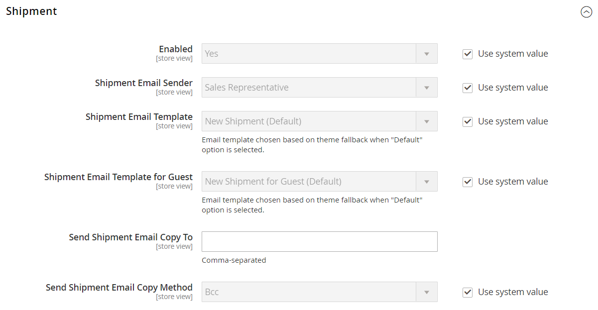
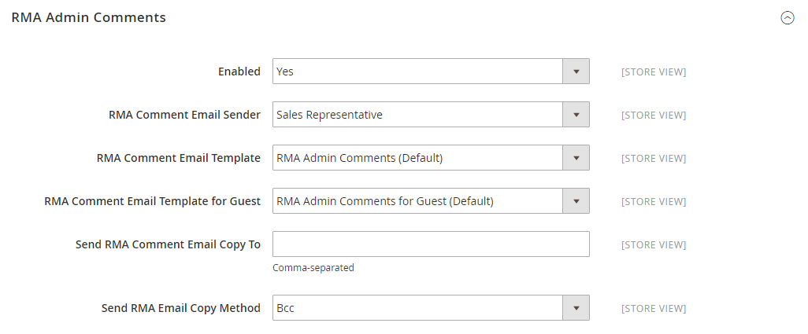

# [!UICONTROL Sales] > [!UICONTROL Sales Emails]

{{config}}

## [!UICONTROL General Settings]

<!-- zoom -->

<!-- [General Settings](https://experienceleague.adobe.com/es/docs/commerce-admin/systems/communications/email-communications) -->

| Campo | [Ámbito](../../getting-started/websites-stores-views.md#scope-settings) | Descripción |
|--- |--- |--- |
| [!UICONTROL Asynchronous sending] | Global | Determina si los correos electrónicos de ventas se envían de forma asíncrona. Se recomienda habilitar el envío asincrónico. Opciones:  **`Disable`**- (predeterminado) Los mensajes de correo electrónico de ventas se envían cuando se activa un evento. **`Enable`** - (Recomendado) Los correos electrónicos de ventas se envían a intervalos predeterminados y regulares. |

{style="table-layout:auto"}

## [!UICONTROL Order]

<!-- zoom -->

<!-- [Order](https://experienceleague.adobe.com/es/docs/commerce-admin/stores-sales/order-management/orders/orders) -->

| Campo | [Ámbito](../../getting-started/websites-stores-views.md#scope-settings) | Descripción |
|--- |--- |--- |
| [!UICONTROL Enabled] | Vista de tienda | Cuando está activada, envía un correo electrónico transaccional por cada pedido realizado. Opciones: `Yes` / `No` |
| [!UICONTROL New Order Confirmation Email Sender] | Vista de tienda | Identifica el contacto de tienda que aparece como el remitente del mensaje. Remitente predeterminado: `Sales Representative` |
| [!UICONTROL New Order Confirmation Template] | Vista de tienda | Identifica la plantilla que se envía para confirmar los nuevos pedidos realizados por los clientes. Plantilla predeterminada: `New Order` |
| [!UICONTROL New Order Confirmation Template for Guest] | Vista de tienda | Identifica la plantilla que se envía para confirmar los nuevos pedidos realizados por los invitados. Plantilla predeterminada: `New Order for Guest` |
| [!UICONTROL Send Order Email Copy To] | Vista de tienda | Proporciona la dirección de correo electrónico de cualquier persona que desee recibir una copia de un correo electrónico de pedido. Separe las direcciones con comas. |
| [!UICONTROL Send Order Email Copy Method] | Vista de tienda | Indica el método de correo electrónico utilizado para enviar la copia. Las opciones incluyen:  **`Bcc`**: envía una copia de cortesía oculta incluyendo el destinatario en el encabezado del mismo correo electrónico que se envía al cliente. El destinatario CCO no es visible para el cliente. **`Separate Email`** - Envía la copia como un correo electrónico independiente. |

{style="table-layout:auto"}

## [!UICONTROL Order Comments]

<!-- zoom -->

<!-- [Order Comments](https://experienceleague.adobe.com/es/docs/commerce-admin/stores-sales/order-management/orders/order-processing#process-an-order) -->

| Campo | [Ámbito](../../getting-started/websites-stores-views.md#scope-settings) | Descripción |
|--- |--- |--- |
| [!UICONTROL Enabled] | Vista de tienda | Cuando está activado, envía un correo electrónico transaccional por cada comentario del pedido. Opciones: `Yes` / `No` |
| [!UICONTROL Order Comment Email Sender] | Vista de tienda | Identifica el contacto de tienda que aparece como el remitente del mensaje. Remitente predeterminado: `Sales Representative` |
| [!UICONTROL Order Comment Email Template] | Vista de tienda | Identifica la plantilla que se envía cuando se agrega un comentario a un pedido de cliente. Plantilla predeterminada: `Order Update` |
| [!UICONTROL New Order Confirmation Template for Guest] | Vista de tienda | Identifica la plantilla que se envía cuando se agrega un comentario a un pedido de invitado. Plantilla predeterminada: `Order Update for Guest` |
| [!UICONTROL Send Order Email Copy To|Store View] | Proporciona la dirección de correo electrónico de cualquier persona que desee recibir una copia de un correo electrónico de comentario de pedido. Separe las direcciones con comas. |
| [!UICONTROL Send Order Email Copy Method] | Vista de tienda | Indica el método utilizado para enviar la copia. Las opciones incluyen:  **`Bcc`**: envía una copia de cortesía oculta incluyendo el destinatario en el encabezado del mismo correo electrónico que se envía al cliente. El destinatario CCO no es visible para el cliente. **`Separate Email`** - Envía la copia como un correo electrónico independiente. |

{style="table-layout:auto"}

## [!UICONTROL Invoice]

<!-- zoom -->

<!-- [Invoice](https://experienceleague.adobe.com/es/docs/commerce-admin/stores-sales/order-management/invoices) -->

| Campo | [Ámbito](../../getting-started/websites-stores-views.md#scope-settings) | Descripción |
|--- |--- |--- |
| [!UICONTROL Enabled] | Vista de tienda | Cuando está activada, envía un correo electrónico transaccional por cada factura generada. Opciones: `Yes` / `No` |
| [!UICONTROL Invoice Email Sender] | Vista de tienda | Identifica el contacto de tienda que aparece como el remitente del mensaje. Remitente predeterminado: `Sales Representative` |
| [!UICONTROL Invoice Email Template] | Vista de tienda | Identifica la plantilla que se envía cuando se genera una factura para un cliente. Plantilla predeterminada: `New Invoice` |
| [!UICONTROL Invoice Email Template for Guest] | Vista de tienda | Identifica la plantilla que se envía cuando se genera una factura para un invitado. Plantilla predeterminada: `New Invoice for Guest` |
| [!UICONTROL Send Invoice Email Copy To] | Vista de tienda | Proporciona la dirección de correo electrónico de cualquier persona que desee recibir una copia de un correo electrónico de factura. Separe las direcciones con comas. |
| [!UICONTROL Send Invoice Email Copy Method] | Vista de tienda | Indica el método utilizado para enviar la copia. Las opciones incluyen:  **`Bcc`**: envía una copia de cortesía oculta incluyendo el destinatario en el encabezado del mismo correo electrónico que se envía al cliente. El destinatario CCO no es visible para el cliente. **`Separate Email`** - Envía la copia como un correo electrónico independiente. |

{style="table-layout:auto"}

## [!UICONTROL Invoice Comments]

<!-- zoom -->

<!-- [Invoice Comments](https://experienceleague.adobe.com/es/docs/commerce-admin/stores-sales/order-management/invoices#create-an-invoice) -->

| Campo | [Ámbito](../../getting-started/websites-stores-views.md#scope-settings) | Descripción |
|--- |--- |--- |
| [!UICONTROL Enabled] | Vista de tienda | Cuando está activado, envía un correo electrónico transaccional por cada comentario de la factura. Opciones: `Yes` / `No` |
| [!UICONTROL Invoice Comment Email Sender] | Vista de tienda | Identifica el contacto de tienda que aparece como el remitente del mensaje. Remitente predeterminado: `Sales Representative` |
| [!UICONTROL Invoice Comment Email Template] | Vista de tienda | Identifica la plantilla que se envía cuando se agrega un comentario a una factura de cliente. Plantilla predeterminada: `Invoice Update` |
| [!UICONTROL Invoice Comment Email Template for Guest] | Vista de tienda | Identifica la plantilla que se envía cuando se agrega un comentario a una factura de invitado. Plantilla predeterminada: `Invoice Update for Guest` |
| [!UICONTROL Send Invoice Comment Email Copy To] | Vista de tienda | Proporciona la dirección de correo electrónico de cualquier persona que desee recibir una copia de un correo electrónico de comentario de factura. Separe las direcciones con comas. |
| [!UICONTROL Send Invoice Comments Email Copy Method] | Vista de tienda | Indica el método de correo electrónico utilizado para enviar la copia. Las opciones incluyen:  **`Bcc`**: envía una copia de cortesía oculta incluyendo el destinatario en el encabezado del mismo correo electrónico que se envía al cliente. El destinatario CCO no es visible para el cliente. **`Separate Email`** - Envía la copia como un correo electrónico independiente. |

{style="table-layout:auto"}

## [!UICONTROL Shipment]

<!-- zoom -->

<!-- [Shipment](https://experienceleague.adobe.com/es/docs/commerce-admin/stores-sales/order-management/shipments) -->

| Campo | [Ámbito](../../getting-started/websites-stores-views.md#scope-settings) | Descripción |
|--- |--- |--- |
| [!UICONTROL Enabled] | Vista de tienda | Cuando está activada, envía un correo electrónico transaccional por cada envío generado. Opciones: `Yes` / `No` |
| [!UICONTROL Shipment Email Sender] | Vista de tienda | Identifica el contacto de tienda que aparece como el remitente del mensaje. Remitente predeterminado: `Sales Representative` |
| [!UICONTROL Shipment Email Template] | Vista de tienda | Identifica la plantilla que se envía cuando un cliente genera un envío. Plantilla predeterminada: `New Shipment` |
| [!UICONTROL Shipment Email Template for Guest] | Vista de tienda | Identifica la plantilla que se envía cuando se genera un envío para un invitado. Plantilla predeterminada: `New Shipment for Guest` |
| [!UICONTROL Send Shipment Email Copy To] | Vista de tienda | Proporciona la dirección de correo electrónico de cualquier persona que deba recibir una copia de un correo electrónico de envío. Separe las direcciones con comas. |
| [!UICONTROL Send Shipment Email Copy Method] | Vista de tienda | Indica el método utilizado para enviar la copia. Las opciones incluyen:  **`Bcc`**: envía una copia de cortesía oculta incluyendo el destinatario en el encabezado del mismo correo electrónico que se envía al cliente. El destinatario CCO no es visible para el cliente. **`Separate Email`** - Envía la copia como un correo electrónico independiente. |

{style="table-layout:auto"}

## [!UICONTROL Shipment Comments]

<!-- zoom -->

<!-- [Shipment Comments](https://experienceleague.adobe.com/es/docs/commerce-admin/stores-sales/order-management/shipments) -->

| Campo | [Ámbito](../../getting-started/websites-stores-views.md#scope-settings) | Descripción |
|--- |--- |--- |
| [!UICONTROL Enabled] | Vista de tienda | Cuando está activada, envía un correo electrónico transaccional por cada comentario de envío. Opciones: `Yes` / `No` |
| [!UICONTROL Shipment Comment Email Sender] | Vista de tienda | Identifica el contacto de tienda que aparece como el remitente del mensaje. Remitente predeterminado: `Sales Representative` |
| [!UICONTROL Shipment Comment Email Template] | Vista de tienda | Identifica la plantilla que se envía cuando se agrega un comentario a un envío de cliente. Plantilla predeterminada: `Shipment Update` |
| [!UICONTROL Shipment Comment Email Template for Guest] | Vista de tienda | Identifica la plantilla que se envía cuando se agrega un comentario a un envío de invitado. Plantilla predeterminada: `Shipment Update for Guest` |
| [!UICONTROL Send Shipment Comment Email Copy To] | Vista de tienda | Proporciona la dirección de correo electrónico de cualquier persona que desee recibir una copia de un correo electrónico de comentarios de envío. Separe las direcciones con comas. |
| [!UICONTROL Send Shipment Comments Email Copy Method] | Vista de tienda | Indica el método de correo electrónico utilizado para enviar la copia. Las opciones incluyen:  **`Bcc`**: envía una copia de cortesía oculta incluyendo el destinatario en el encabezado del mismo correo electrónico que se envía al cliente. El destinatario CCO no es visible para el cliente. **`Separate Email`** - Envía la copia como un correo electrónico independiente. |

{style="table-layout:auto"}

## [!UICONTROL Credit Memo]

<!-- zoom -->

<!-- [Credit Memo](https://experienceleague.adobe.com/es/docs/commerce-admin/stores-sales/order-management/credit-memos/credit-memos) -->

| Campo | [Ámbito](../../getting-started/websites-stores-views.md#scope-settings) | Descripción |
|--- |--- |--- |
| [!UICONTROL Enabled] | Vista de tienda | Activa el correo electrónico transaccional para cada nota de crédito generada. Opciones: `Yes` / `No` |
| [!UICONTROL Credit Memo Email Sender] | Vista de tienda | Identifica el contacto de tienda que aparece como el remitente del mensaje. Remitente predeterminado: `Sales Representative` |
| [!UICONTROL Credit Memo Email Template] | Vista de tienda | Identifica la plantilla que se envía cuando se genera un abono para un cliente. Plantilla predeterminada: `New Credit Memo` |
| [!UICONTROL Credit Memo Email Template for Guest] | Vista de tienda | Identifica la plantilla que se envía cuando se genera un abono para un invitado. Plantilla predeterminada: `New Credit Memo for Guest` |
| [!UICONTROL Send Credit Memo Email Copy To] | Vista de tienda | Proporciona la dirección de correo electrónico de cualquier persona que deba recibir una copia de un correo electrónico de nota de crédito. Separe las direcciones con comas. |
| [!UICONTROL Send Credit Memo Email Copy Method] | Vista de tienda | Indica el método utilizado para enviar la copia. Las opciones incluyen:  **`Bcc`**: envía una copia de cortesía oculta incluyendo el destinatario en el encabezado del mismo correo electrónico que se envía al cliente. El destinatario CCO no es visible para el cliente. **`Separate Email`** - Envía la copia como un correo electrónico independiente. |

{style="table-layout:auto"}

## [!UICONTROL Credit Memo Comments]

<!-- zoom -->

<!-- [Credit Memo Comments](https://experienceleague.adobe.com/es/docs/commerce-admin/stores-sales/order-management/credit-memos/credit-memo-create) -->

| Campo | [Ámbito](../../getting-started/websites-stores-views.md#scope-settings) | Descripción |
|--- |--- |--- |
| [!UICONTROL Enabled] | Vista de tienda | Cuando está habilitado, envía un correo electrónico transaccional por cada comentario de nota de crédito. Opciones: `Yes` / `No` |
| [!UICONTROL Credit Memo Comment Email Sender] | Vista de tienda | Identifica el contacto de tienda que aparece como el remitente del mensaje. Remitente predeterminado: `Sales Representative` |
| [!UICONTROL Credit Memo Comment Email Template] | Vista de tienda | Identifica la plantilla que se envía cuando se agrega un comentario a una nota de crédito de cliente. Plantilla predeterminada: `Credit Memo Update` |
| [!UICONTROL Credit Memo Comment Email Template for Guest] | Vista de tienda | Identifica la plantilla que se envía cuando se agrega un comentario a un abono de invitado. Plantilla predeterminada: `Credit Memo Update for Guest` |
| [!UICONTROL Send Credit Memo Comment Email Copy To] | Vista de tienda | Especifica la dirección de correo electrónico de la persona que va a recibir una copia de un correo electrónico de comentario de abono. Separe las direcciones con comas. |
| [!UICONTROL Send Credit Memo Comments Email Copy Method] | Vista de tienda | Indica el método de correo electrónico utilizado para enviar la copia. Las opciones incluyen:  **`Bcc`**: envía una copia de cortesía oculta incluyendo el destinatario en el encabezado del mismo correo electrónico que se envía al cliente. El destinatario CCO no es visible para el cliente. **`Separate Email`** - Envía la copia como un correo electrónico independiente. |

{style="table-layout:auto"}

## [!UICONTROL Order Ready For Pickup in Store]

<!-- zoom -->

<!-- [Order Ready For Pickup in Store](https://experienceleague.adobe.com/es/docs/commerce-admin/stores-sales/delivery/basic-methods/shipping-in-store-delivery) -->

| Campo | [Ámbito](../../getting-started/websites-stores-views.md#scope-settings) | Descripción |
|--- |--- |--- |
| [!UICONTROL Enabled] | Vista de tienda | Cuando está activada, envía un correo electrónico transaccional cuando un pedido está listo para su recogida en la tienda. Opciones: `Yes` / `No` |
| [!UICONTROL Order Ready For Pickup Email Sender] | Vista de tienda | Identifica el contacto de tienda que aparece como el remitente del mensaje. Remitente predeterminado: `General Contact` |
| [!UICONTROL Order Ready For Pickup Email Template] | Vista de tienda | Identifica la plantilla que se utiliza para el correo electrónico transaccional para cada pedido que está listo para recogerse en el almacén para un cliente registrado. Plantilla predeterminada: `Order is Ready for Pickup` |
| [!UICONTROL Order Ready For Pickup Email Template for Guest] | Vista de tienda | Identifica la plantilla que se utiliza para el correo electrónico transaccional para cada pedido que está listo para recogerse en la tienda para un invitado. Plantilla predeterminada: `Order is Ready for Pickup for Guest` |
| Enviar Copia Del Pedido Listo Para Su Recogida Por Correo Electrónico A | Vista de tienda | Especifica la dirección de correo electrónico de cualquier persona que reciba una copia de un correo electrónico de _Pedido listo para recibir_. Separe las direcciones con comas. |
| [!UICONTROL Send Order Ready For Pickup Email Copy Method] | Vista de tienda | Indica el método de correo electrónico utilizado para enviar la copia. Opciones:  **`Bcc`**: envía una copia de cortesía oculta incluyendo el destinatario en el encabezado del mismo correo electrónico que se envía al cliente. El destinatario CCO no es visible para el cliente. **`Separate Email`** - Envía la copia como un correo electrónico independiente. |

{style="table-layout:auto"}

## [!UICONTROL Purchase Order Approval]

{{b2b-feature}}

<!-- zoom -->

| Campo | [Ámbito](../../getting-started/websites-stores-views.md#scope-settings) | Descripción |
|--- |--- |--- |
| [!UICONTROL Enabled] | Vista de tienda | Cuando está activada, envía correos electrónicos durante el proceso de pedido de compra. Opciones: `Yes` / `No` |
| [!UICONTROL Created and requires Approval Purchase Order (to Buyer)] | Vista de tienda | Envía una confirmación por correo electrónico al creador del pedido. |
| [!UICONTROL Created and Automatically approved Purchase Order (to Buyer)] | Vista de tienda | Envía una confirmación por correo electrónico al creador del pedido. |
| [!UICONTROL Approved Purchase Order (to Buyer)] | Vista de tienda | Envía un mensaje de correo electrónico al creador al aprobar el pedido de compra. |
| [!UICONTROL Rejected Purchase Order (to Buyer)] | Vista de tienda | Envía un mensaje de correo electrónico al creador cuando se rechaza el pedido de compra. |
| [!UICONTROL Comment added to Purchase Order] | Vista de tienda | Envía un mensaje de correo electrónico al creador cuando se añade un comentario a la OC. |
| [!UICONTROL Error creating Order from Purchase Order (to Buyer)] | Vista de tienda | Notifica al creador que se ha producido un error al convertir un pedido de compra en un pedido. |
| [!UICONTROL Purchase Order required Approval (to Approver)] | Vista de tienda | Envía un mensaje de correo electrónico para notificar al aprobador que el pedido de compra requiere su aprobación. |

{style="table-layout:auto"}

## [!UICONTROL Quote]

{{b2b-feature}}

<!-- zoom -->

<!-- [Quotes](https://experienceleague.adobe.com/es/docs/commerce-admin/b2b/quotes/account-dashboard-my-quotes) -->

| Campo | [Ámbito](../../getting-started/websites-stores-views.md#scope-settings) | Descripción |
|--- |--- |--- |
| [!UICONTROL Enabled] | Vista de tienda | Permite enviar mensajes de correo electrónico de presupuesto desde la vista de tienda actual. Opciones: `Yes` / `No` |
| [!UICONTROL Updated Quote Template (to Buyer)] | Vista de tienda | Determina la plantilla de correo electrónico que se utiliza para enviar una notificación al comprador cuando hay disponible un presupuesto actualizado. Plantilla predeterminada: `Updated Quote` |
| [!UICONTROL Declined Quote Template (to Buyer)] | Vista de tienda | Determina la plantilla de correo electrónico que se utiliza para la notificación enviada al comprador cuando se rechaza una oferta. Plantilla predeterminada: `Declined Quote` |
| [!UICONTROL New Quote Template (to Seller)] | Vista de tienda | Determina la plantilla de correo electrónico que se utiliza para la notificación enviada al vendedor cuando se recibe una solicitud de un nuevo presupuesto. Plantilla predeterminada: `New Quote` |
| [!UICONTROL Updated Quote Template (to Seller)] | Vista de tienda | Determina la plantilla de correo electrónico que se utiliza para enviar una notificación al vendedor cuando se recibe una oferta actualizada. Plantilla predeterminada: `Updated Quote` |
| [!UICONTROL Quote Expiration (in 48 hrs)] | Vista de tienda | Especifica la plantilla de correo electrónico que se utiliza para el aviso de caducidad que se envía 48 horas antes de que caduque la oferta. Plantilla predeterminada: `Expiration Warning` |
| [!UICONTROL Quote Expiration (in 24 hrs)] | Vista de tienda | Especifica la plantilla de correo electrónico que se utiliza para el aviso de caducidad que se envía 24 horas antes de que caduque la oferta. Plantilla predeterminada: `Expiration Warning 1` |
| [!UICONTROL Expiration Date Reset] | Vista de tienda | Especifica la plantilla de correo electrónico que se utiliza para el aviso que se envía cuando cambia la fecha de caducidad. Plantilla predeterminada: `Expiration Date Reset` |
| [!UICONTROL Send Quote Email Copy To] | Vista de tienda | Especifica la dirección de correo electrónico de cada persona que va a recibir una copia del correo electrónico de oferta. Separe las direcciones con comas. |
| [!UICONTROL Send Quote Email Copy Method] | Vista de tienda | Indica el método de correo electrónico utilizado para enviar la copia. Las opciones incluyen:  **`Bcc`**: envía una copia de cortesía oculta incluyendo el destinatario en el encabezado del mismo correo electrónico que se envía al cliente. El destinatario CCO no es visible para el cliente. **`Separate Email`** - Envía la copia como un correo electrónico independiente. |

{style="table-layout:auto"}

## [!UICONTROL RMA]

{{ee-feature}}

<!-- zoom -->

<!-- [RMA](https://experienceleague.adobe.com/es/docs/commerce-admin/stores-sales/order-management/returns/returns) -->

| Campo | [Ámbito](../../getting-started/websites-stores-views.md#scope-settings) | Descripción |
|--- |--- |--- |
| [!UICONTROL Enabled] | Vista de tienda | Activa la notificación por correo electrónico para cada RMA generada. Opciones: `Yes` / `No` |
| [!UICONTROL RMA Email Sender] | Vista de tienda | Identifica al [contacto de tienda](../../getting-started/store-details.md#store-email-addresses) que aparece como el remitente del mensaje. Valor predeterminado: `Sales Representative` |
| [!UICONTROL RMA Email Template] | Vista de tienda | Determina la [plantilla de correo electrónico](../../systems/email-templates.md) que se usa para la notificación enviada cuando se genera una autorización de devolución de material para un cliente. Plantilla predeterminada: `New RMA` |
| [!UICONTROL RMA Email Template for Guest] | Vista de tienda | Determina la plantilla que se envía cuando se genera una autorización de devolución de material para un invitado. Plantilla predeterminada: `New RMA for Guest` |
| [!UICONTROL Send RMA Email Copy To] | Vista de tienda | Proporciona la dirección de correo electrónico de cualquier persona que deba recibir una copia de un correo electrónico de RMA. Separe las direcciones con comas. |
| [!UICONTROL Send RMA  Email Copy Method] | Vista de tienda | Indica el método de correo electrónico utilizado para enviar la copia. Las opciones incluyen:  **`Bcc`**: envía una copia de cortesía oculta incluyendo el destinatario en el encabezado del mismo correo electrónico que se envía al cliente. El destinatario CCO no es visible para el cliente. **`Separate Email`** - Envía la copia como un correo electrónico independiente. |

{style="table-layout:auto"}

## [!UICONTROL RMA Authorization]

{{ee-feature}}

<!-- zoom -->

<!-- [RMA Authorization](https://experienceleague.adobe.com/es/docs/commerce-admin/stores-sales/order-management/returns/rma-configure) -->

| Campo | [Ámbito](../../getting-started/websites-stores-views.md#scope-settings) | Descripción |
|--- |--- |--- |
| [!UICONTROL Enabled] | Vista de tienda | Cuando está activada, envía una notificación por correo electrónico por cada autorización de RMA. Opciones: `Yes` / `No` |
| [!UICONTROL RMA Authorization Email Sender] | Vista de tienda | Identifica al [contacto de tienda](../../getting-started/store-details.md#store-email-addresses) que aparece como remitente del mensaje. Valor predeterminado: `Sales Representative` |
| [!UICONTROL RMA Authorization Email Template] | Vista de tienda | Determina la [plantilla de correo electrónico](../../systems/email-templates.md) que se usa cuando se envía una notificación de autorización de RMA. Plantilla predeterminada: `RMA Authorization` |
| [!UICONTROL RMA Authorization Email Template for Guest] | Vista de tienda | Determina la plantilla que se utiliza cuando se envía una notificación de autorización de RMA a un invitado. Plantilla predeterminada: `RMA Authorization for Guest` |
| [!UICONTROL Send RMA Authorization Email Copy To] | Vista de tienda | Proporciona la dirección de correo electrónico de quien desee recibir una copia de un correo electrónico de autorización de RMA. Separe las direcciones con comas. |
| [!UICONTROL Send RMA Authorization Email Copy Method] | Vista de tienda | Indica el método de correo electrónico utilizado para enviar la copia. Las opciones incluyen:  **`Bcc`**: envía una copia de cortesía oculta incluyendo el destinatario en el encabezado del mismo correo electrónico que se envía al cliente. El destinatario CCO no es visible para el cliente. **`Separate Email`** - Envía la copia como un correo electrónico independiente. |

{style="table-layout:auto"}

## [!UICONTROL RMA Admin Comments]

{{ee-feature}}

<!-- zoom -->

| Campo | [Ámbito](../../getting-started/websites-stores-views.md#scope-settings) | Descripción |
|--- |--- |--- |
| [!UICONTROL Enabled] | Vista de tienda | Cuando está activada, envía una notificación por correo electrónico por cada comentario del administrador de RMA. Opciones: `Yes` / `No` |
| [!UICONTROL RMA Comment Email Sender] | Vista de tienda | Identifica al [contacto de tienda](../../getting-started/store-details.md#store-email-addresses) que aparece como remitente del mensaje. Valor predeterminado: `Sales Representative` |
| [!UICONTROL RMA Comment Email Template] | Vista de tienda | Determina la [plantilla de correo electrónico](../../systems/email-templates.md) que se usa cuando un administrador agrega un comentario a una autorización de devolución de material para un cliente. Plantilla predeterminada: `RMA Admin Comments` |
| [!UICONTROL RMA Comment Email Template for Guest] | Vista de tienda | Determina la plantilla que se utiliza cuando un administrador agrega un comentario a una autorización de devolución de material para un invitado. Plantilla predeterminada: `RMA Admin Comments for Guest` |
| [!UICONTROL Send RMA Comment Email Copy To] | Vista de tienda | Proporciona la dirección de correo electrónico de cualquier persona que desee recibir una copia de la notificación. Separe las direcciones con comas. |
| [!UICONTROL Send RMA Comments Email Copy Method] | Vista de tienda | Indica el método de correo electrónico utilizado para enviar la copia. Las opciones incluyen:  **`Bcc`**: envía una copia de cortesía oculta incluyendo el destinatario en el encabezado del mismo correo electrónico que se envía al cliente. El destinatario CCO no es visible para el cliente. **`Separate Email`** - Envía la copia como un correo electrónico independiente. |

{style="table-layout:auto"}

## [!UICONTROL RMA Customer Comments]

{{ee-feature}}

<!-- zoom -->

<!-- [RMA Customer Comments](https://experienceleague.adobe.com/es/docs/commerce-admin/stores-sales/order-management/returns/returns) -->

| Campo | [Ámbito](../../getting-started/websites-stores-views.md#scope-settings) | Descripción |
|--- |--- |--- |
| [!UICONTROL Enabled] | Vista de tienda | Cuando está activada, envía una notificación por correo electrónico por cada comentario del cliente de RMA. Opciones: `Yes` / `No` |
| [!UICONTROL RMA Comment Email Sender] | Vista de tienda | Identifica al [contacto de tienda](../../getting-started/store-details.md#store-email-addresses) que aparece como remitente del mensaje. Valor predeterminado: `Customer Support` |
| [!UICONTROL RMA Comment Email Recipient] | Vista de tienda | Identifica al contacto de tienda que recibe el correo electrónico de comentarios del cliente. Valor predeterminado: `Sales Representative` |
| [!UICONTROL RMA Comment Email Template] | Vista de tienda | Determina la [plantilla de correo electrónico](../../systems/email-templates.md) que se usa cuando un cliente agrega un comentario a una autorización de devolución de material. Plantilla predeterminada: `RMA Admin Comments` |
| [!UICONTROL Send RMA Comment Email Copy To] | Vista de tienda | Proporciona la dirección de correo electrónico de cualquier persona que desee recibir una copia de la notificación. Separe las direcciones con comas. |
| [!UICONTROL Send RMA Comments Email Copy Method] | Vista de tienda | Indica el método de correo electrónico utilizado para enviar la copia. Las opciones incluyen:  **`Bcc`**: envía una copia de cortesía oculta incluyendo el destinatario en el encabezado del mismo correo electrónico que se envía al cliente. El destinatario CCO no es visible para el cliente. **`Separate Email`** - Envía la copia como un correo electrónico independiente. |

{style="table-layout:auto"}
