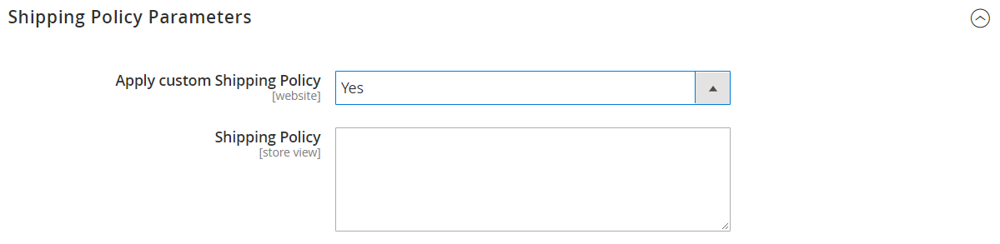

# [!UICONTROL Sales] > [!UICONTROL Shipping Settings]

{{config}}

Para obtener más información sobre cómo cambiar esta configuración, consulte [Configuración de envío](../../stores-purchase/shipping-settings.md) en la _Guía de tiendas y experiencia de compra_.

## [!UICONTROL Origin]

<!-- zoom -->

| Campo | [Ámbito](../../getting-started/websites-stores-views.md#scope-settings) | Descripción |
|--- |--- |--- |
| [!UICONTROL Country] | Sitio web | El país de origen. |
| [!UICONTROL Region/State] | Sitio web | La región o estado del punto de origen. |
| [!UICONTROL ZIP/Postal Code] | Sitio web | El código postal del punto de origen. |
| [!UICONTROL City] | Sitio web | La ciudad del punto de origen. |
| [!UICONTROL Street Address] | Sitio web | La dirección de la calle del punto de origen. |
| [!UICONTROL Street Address Line 2] | Sitio web | Una línea adicional para la dirección de calle del punto de origen, si es necesario. |

{style="table-layout:auto"}

## [!UICONTROL Shipping Policy Parameters]

<!-- zoom -->

| Campo | [Ámbito](../../getting-started/websites-stores-views.md#scope-settings) | Descripción |
|--- |--- |--- |
| [!UICONTROL Apply Custom Shipping Policy] | Sitio web | Determina si la política de envío aparece durante el cierre de compra. Opciones: `Yes` / `No` |
| [!UICONTROL Shipping Policy] | Vista de tienda | Contiene la política de envío como texto. |

{style="table-layout:auto"}

## [!UICONTROL Shipment Tracking URLs]

[!BADGE Solo SaaS]{type=Positive url="https://experienceleague.adobe.com/es/docs/commerce/user-guides/product-solutions" tooltip="Solo se aplica a proyectos de Adobe Commerce as a Cloud Service (infraestructura de SaaS administrada por Adobe)."}

<!-- zoom -->

| Campo | [Ámbito](../../getting-started/websites-stores-views.md#scope-settings) | Descripción |
|--- |--- |--- |
| [!UICONTROL Enable Custom Tracking URLs] | Vista de tienda | Determina si los números de seguimiento de envío enviados en correos electrónicos de comprador son vínculos o texto sin formato. El valor predeterminado de `No` indica que los números son de texto sin formato. Opciones: `Yes` / `No` |
| [!UICONTROL USPS Tracking URL] | Vista de tienda | La plantilla URL para los envíos del servicio postal de Estados Unidos. |
| [!UICONTROL UPS Tracking URL] | Vista de tienda | La plantilla URL para envíos de United Parcel Service. |
| [!UICONTROL FedEx Tracking URL] | Vista de tienda | La plantilla URL para envíos de Federal Express. |
| [!UICONTROL DHL Tracking URL] | Vista de tienda | La plantilla URL para envíos de DHL Express. |

{style="table-layout:auto"}
