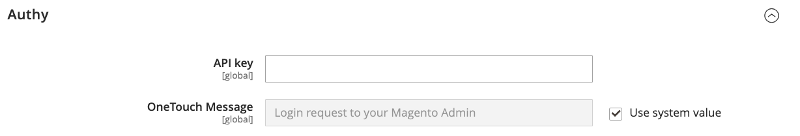
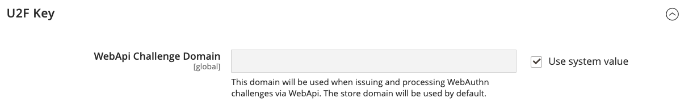

# [!UICONTROL Security] > [!UICONTROL 2FA]

>[!NOTE]
>
>Las tiendas que han habilitado la autenticación de Adobe Identity Management Services (IMS) tienen deshabilitada la autenticación de doble factor (2FA) nativa de Adobe Commerce y del Magento Open Source. Los usuarios administradores que han iniciado sesión en su instancia de Adobe Commerce con sus credenciales de Adobe no necesitan volver a autenticarse en muchas tareas de administración. La autenticación la gestiona Adobe IMS cuando el usuario administrador inicia sesión en su sesión actual. Consulte [Información general sobre la integración de Adobe Commerce con Adobe IMS](https://experienceleague.adobe.com/docs/commerce-admin/start/admin/ims/adobe-ims-integration-overview.html).

{{config}}

Para obtener más información sobre cómo cambiar esta configuración, consulte [Autenticación de doble factor (2FA)](../../systems/security-two-factor-authentication.md) en el _Guía de sistemas de administración_.

## [!UICONTROL General]

<!-- zoom -->

| Campo | [Ámbito](../../getting-started/websites-stores-views.md#scope-settings) | Descripción |
|--- |--- |--- |
| [!UICONTROL Providers to use] | Global | Indica los métodos de autenticación de doble factor que necesita. Si selecciona más de un proveedor, cada usuario deberá configurar cada método 2FA la próxima vez que inicie sesión. |
| [!UICONTROL Configuration Email URL for Web API] | Global | Para implementaciones personalizadas, la URL de un vínculo de configuración de correo electrónico alternativo que se envía a _Administrador_ usuarios al primer inicio de sesión. En la plantilla de correo electrónico, utilice el marcador de posición `:tfat` para indicar dónde se inserta el token. |

{style="table-layout:auto"}

## [!UICONTROL Google]

<!-- zoom -->

| Campo | [Ámbito](../../getting-started/websites-stores-views.md#scope-settings) | Descripción |
|--- |--- |--- |
| [!UICONTROL OTP Window] | Global | Duración en segundos de cada contraseña de un solo uso (OTP) generada por Google Authenticator. Predeterminado: `30` |

{style="table-layout:auto"}

## [!UICONTROL Duo Security]

<!-- zoom -->

| Campo | [Ámbito](../../getting-started/websites-stores-views.md#scope-settings) | Descripción |
|--- |--- |--- |
| [!UICONTROL Integration Key] | Global | La clave de integración de su [!DNL Duo Security] cuenta. |
| [!UICONTROL Secret Key] | Global | La clave secreta de su [!DNL Duo Security] cuenta. |
| [!UICONTROL API Hostname] | Global | El nombre de host de API de su [!DNL Duo Security] cuenta. |

{style="table-layout:auto"}

## [!UICONTROL Authy]

<!-- zoom -->

| Campo | [Ámbito](../../getting-started/websites-stores-views.md#scope-settings) | Descripción |
|--- |--- |--- |
| [!UICONTROL API Key] | Global | La clave de API de su [!DNL Authy] cuenta. |
| [!UICONTROL OneTouch Message] | Global | El mensaje que aparece en la [!DNL Authy] autenticador al iniciar sesión. Predeterminado: `Login request to your Magento Admin` |

{style="table-layout:auto"}

## [!UICONTROL U2F Key]

<!-- zoom -->

| Campo | [Ámbito](../../getting-started/websites-stores-views.md#scope-settings) | Descripción |
|--- |--- |--- |
| [!UICONTROL WebApi Challenge Domain] | Global | El dominio que se utiliza para emitir y procesar [!DNL WebAuthn] retos para las implementaciones de WebAPI personalizadas. |

{style="table-layout:auto"}
