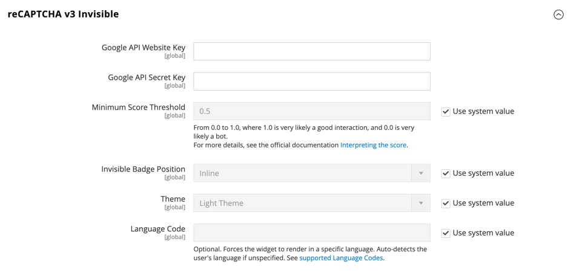

# [!UICONTROL Security] > [!UICONTROL Google reCAPTCHA Admin Panel]

>[!IMPORTANT]
>
>Para poder configurar Google reCAPTCHA, debe asegurarse de que el archivo `PHP.ini` incluya la siguiente configuración: `allow_url_fopen = 1`. Esto puede requerir la asistencia del desarrollador. Consulte [Configuración de PHP requerida](https://experienceleague.adobe.com/docs/commerce-operations/installation-guide/prerequisites/php-settings.html) en la _Guía de instalación_.

{{config}}

Para obtener más información sobre cómo cambiar esta configuración, consulte [Google reCAPTCHA](../../systems/security-google-recaptcha.md) en la _Guía de sistemas de administración_.

## [!UICONTROL reCAPTCHA v2 ("I am not a robot")]

<!-- zoom -->

| Campo | [Ámbito](../../getting-started/websites-stores-views.md#scope-settings) | Descripción |
|--|--|--|
| [!UICONTROL Google API Website Key] | Global | Clave del sitio web que se crea al registrar la cuenta de Google reCAPTCHA. |
| [!UICONTROL Google API Secret Key] | Global | La clave secreta asociada a su cuenta de Google reCAPTCHA. |
| [!UICONTROL Size] | Global | El tamaño del cuadro reCAPTCHA de Google que aparece durante el inicio de sesión. Opciones: `Normal` (predeterminado) / `Compact` |
| [!UICONTROL Theme] | Global | Determina el estilo del cuadro reCAPTCHA de Google. Opciones: `Light Theme` (predeterminado) / `Dark Theme` |
| [!UICONTROL Language Code] | Global | Un [código de dos caracteres](https://developers.google.com/recaptcha/docs/language) que especifica el idioma que se usa para el texto y los mensajes de Google reCAPTCHA. |

{style="table-layout:auto"}

## [!UICONTROL reCAPTCHA v2 Invisible]

<!-- zoom -->

| Campo | [Ámbito](../../getting-started/websites-stores-views.md#scope-settings) | Descripción |
|--|--|--|
| [!UICONTROL Google API Website Key] | Global | Clave del sitio web que se crea al registrar la cuenta de Google reCAPTCHA. |
| [!UICONTROL Google API Secret Key] | Global | La clave secreta asociada a su cuenta de Google reCAPTCHA. |
| [!UICONTROL Invisible Badge Position] | Global | La posición del distintivo reCAPTCHA invisible en cada página. Opciones: `Inline` / `Bottom Right` / `Bottom Left` |
| [!UICONTROL Theme] | Global | Determina el estilo del cuadro reCAPTCHA de Google. Opciones: `Light Theme` (predeterminado) / `Dark Theme` |
| [!UICONTROL Language Code] | Global | Un [código de dos caracteres](https://developers.google.com/recaptcha/docs/language) que especifica el idioma que se usa para el texto y los mensajes de Google reCAPTCHA. |

{style="table-layout:auto"}

## [!UICONTROL reCAPTCHA v3 Invisible]

<!-- zoom -->

| Campo | [Ámbito](../../getting-started/websites-stores-views.md#scope-settings) | Descripción |
|--|--|--|
| [!UICONTROL Google API Website Key] | Global | Clave del sitio web que se crea al registrar la cuenta de Google reCAPTCHA. |
| [!UICONTROL Google API Secret Key] | Global | La clave secreta asociada a su cuenta de Google reCAPTCHA. |
| [!UICONTROL Minimum Score Threshold] | Global | La puntuación mínima que identifica una interacción de usuario como un riesgo potencial, donde 1,0 es una interacción de usuario típica y 0,0 es probablemente un bot. Predeterminado: `0.5` |
| [!UICONTROL Invisible Badge Position] | Global | La posición del distintivo reCAPTCHA invisible en cada página. Opciones: `Inline` / `Bottom Right` / `Bottom Left` |
| [!UICONTROL Theme] | Global | Determina el estilo del cuadro reCAPTCHA de Google. Opciones: `Light Theme` (predeterminado) / `Dark Theme` |
| [!UICONTROL Language Code] | Global | Un [código de dos caracteres](https://developers.google.com/recaptcha/docs/language) que especifica el idioma que se usa para el texto y los mensajes de Google reCAPTCHA. |

{style="table-layout:auto"}

## [!UICONTROL reCAPTCHA Failure Messages]

<!-- zoom -->

| Campo | [Ámbito](../../getting-started/websites-stores-views.md#scope-settings) | Descripción |
|--|--|--|
| [!UICONTROL reCAPTCHA Validation Failure Message] | Global | El mensaje que se muestra en el Administrador si la verificación falla. Texto predeterminado: `reCAPTCHA verification failed.` |
| [!UICONTROL reCAPTCHA Technical Failure Message] | Global | El mensaje que se muestra en el Administrador si reCAPTCHA no devuelve un resultado de verificación. Texto predeterminado: `Something went wrong with reCAPTCHA. Please contact the store owner.` |

{style="table-layout:auto"}

## [!UICONTROL Admin Panel]

<!-- zoom -->

>[!NOTE]
>
>El tipo de reCAPTCHA que elija debe coincidir con el tipo asociado a la clave de API de su cuenta de Google reCAPTCHA.

>[!WARNING]
>
>Cuando se utiliza la versión 3 de reCAPTCHA, un usuario auténtico con una puntuación baja no puede continuar. Para la versión 2, un usuario auténtico con una puntuación baja recibe un desafío. Considere detenidamente si los usuarios genuinos con una puntuación baja deben tener la oportunidad de resolver un desafío (versión 2) o de ser bloqueados (versión 3).

| Campo | [Ámbito](../../getting-started/websites-stores-views.md#scope-settings) | Descripción |
|--|--|--|
| [!UICONTROL Enable for Login] | Global | Determina el tipo de reCAPTCHA habilitado para [inicio de sesión de administrador](https://experienceleague.adobe.com/docs/commerce-admin/start/admin/admin-signin.html). Opciones:  **`No`**- (predeterminado) No valida el inicio de sesión del administrador. **`reCAPTCHA v2 ("I am not a robot")`** - Requiere que el usuario seleccione la casilla de verificación _No soy un robot_. **`Invisible reCAPTCHA v2`**- Valida el comportamiento del usuario en segundo plano sin requerir interacciones basadas en la puntuación. **`Invisible reCAPTCHA v3`** : (recomendado) valida el comportamiento del usuario en segundo plano en función de la puntuación de interacción. |
| [!UICONTROL Enable for Forgot Password] | Global | Determina el tipo de reCAPTCHA que está habilitado para solicitar un [restablecimiento de contraseña de administrador](https://experienceleague.adobe.com/docs/commerce-admin/start/admin/admin-signin.html#reset-your-password). Opciones:  **`No`**- (predeterminado) No valida la solicitud de restablecimiento de contraseña. **`reCAPTCHA v2 ("I am not a robot")`** - Requiere que el usuario seleccione la casilla de verificación _No soy un robot_. **`Invisible reCAPTCHA v2`**- Valida el comportamiento del usuario en segundo plano sin requerir interacciones basadas en la puntuación. **`Invisible reCaptcha v3`** : (recomendado) valida el comportamiento del usuario en segundo plano en función de la puntuación de interacción. |

{style="table-layout:auto"}
