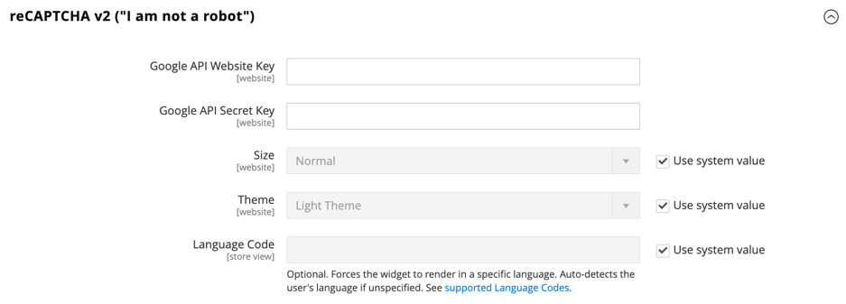

# [!UICONTROL Security] > [!UICONTROL Google reCAPTCHA Storefront]

>[!IMPORTANT]
>
>Para poder configurar Google reCAPTCHA, debe asegurarse de que el archivo `PHP.ini` incluya la siguiente configuración: `allow_url_fopen = 1`. Esto puede requerir la asistencia del desarrollador. Consulte [Configuración de PHP](https://experienceleague.adobe.com/docs/commerce-operations/installation-guide/prerequisites/php-settings.html?lang=es) en la _Guía de instalación_.

{{config}}

Para obtener más información acerca del uso de Google reCAPTCHA para proteger su tienda, consulte Google [reCAPTCHA](../../systems/security-google-recaptcha.md) en la _Guía de sistemas de administración_.

## [!UICONTROL reCAPTCHA v2 ("I am not a robot")]

<!-- zoom -->

| Campo | [Ámbito](../../getting-started/websites-stores-views.md#scope-settings) | Descripción |
|--|--|--|
| [!UICONTROL Google API Website Key] | Sitio web | Clave del sitio web que se crea al registrar la cuenta de Google reCAPTCHA. |
| [!UICONTROL Google API Secret Key] | Sitio web | La clave secreta asociada a su cuenta de Google reCAPTCHA. |
| [!UICONTROL Size] | Sitio web | El tamaño del cuadro reCAPTCHA de Google que aparece cuando un cliente inicia sesión en su cuenta. Opciones: `Normal` (predeterminado) / `Compact` |
| [!UICONTROL Theme] | Sitio web | Determina el estilo del cuadro reCAPTCHA de Google. Opciones: `Light Theme` (predeterminado) / `Dark Theme` |
| [!UICONTROL Language Code] | Vista de tienda | El [código de dos caracteres](https://developers.google.com/recaptcha/docs/language) que especifica el idioma que se usa para el texto y los mensajes de Google reCAPTCHA. |

{style="table-layout:auto"}

## [!UICONTROL reCAPTCHA v2 Invisible]

<!-- zoom -->

| Campo | [Ámbito](../../getting-started/websites-stores-views.md#scope-settings) | Descripción |
|--|--|--|
| [!UICONTROL Google API Website Key] | Sitio web | Clave del sitio web que se crea al registrar la cuenta de Google reCAPTCHA. |
| [!UICONTROL Google API Secret Key] | Sitio web | La clave secreta asociada a su cuenta de Google reCAPTCHA. |
| [!UICONTROL Invisible Badge Position] | Sitio web | La posición del distintivo reCAPTCHA invisible en cada página. Opciones: `Inline` / `Bottom Right` / `Bottom Left` |
| [!UICONTROL Theme] | Global | Determina el estilo del cuadro reCAPTCHA de Google. Opciones: `Light Theme` (predeterminado) / `Dark Theme` |
| [!UICONTROL Language Code] | Vista de tienda | Un [código de dos caracteres](https://developers.google.com/recaptcha/docs/language) que especifica el idioma que se usa para el texto y los mensajes de Google reCAPTCHA. |

{style="table-layout:auto"}

## [!UICONTROL reCAPTCHA v3 Invisible]

<!-- zoom -->

| Campo | [Ámbito](../../getting-started/websites-stores-views.md#scope-settings) | Descripción |
|--|--|--|
| [!UICONTROL Google API Website Key] | Sitio web | Clave del sitio web que se crea al registrar la cuenta de Google reCAPTCHA. |
| [!UICONTROL Google API Secret Key] | Sitio web | La clave secreta asociada a su cuenta de Google reCAPTCHA. |
| [!UICONTROL Minimum Score Threshold] | Global | La puntuación mínima que identifica una interacción de usuario como un riesgo potencial, donde 1,0 es una interacción de usuario típica y 0,0 es probablemente un bot. Predeterminado: `0.5` |
| [!UICONTROL Invisible Badge Position] | Sitio web | La posición del distintivo reCAPTCHA invisible en cada página. Opciones: `Inline` / `Bottom Right` / `Bottom Left` |
| [!UICONTROL Theme] | Sitio web | Determina el estilo del cuadro reCAPTCHA de Google. Opciones: `Light Theme` (predeterminado) / `Dark Theme` |
| [!UICONTROL Language Code] | Vista de tienda | Un [código de dos caracteres](https://developers.google.com/recaptcha/docs/language) que especifica el idioma que se usa para el texto y los mensajes de Google reCAPTCHA. |

{style="table-layout:auto"}

## [!UICONTROL reCAPTCHA Enterprise]

[!BADGE Solo SaaS]{type=Positive url="https://experienceleague.adobe.com/es/docs/commerce/user-guides/product-solutions" tooltip="Solo se aplica a proyectos de Adobe Commerce as a Cloud Service (infraestructura de SaaS administrada por Adobe)."}

[!BADGE espacio aislado]{type=Caution tooltip="Actualmente, los elementos enumerados solo están disponibles en entornos de espacio aislado. Adobe hace que las nuevas versiones estén disponibles primero en entornos de espacio aislado para que pueda probar los próximos cambios antes de que el lanzamiento esté disponible en entornos de producción."}

<!-- zoom -->

| Campo | [Ámbito](../../getting-started/websites-stores-views.md#scope-settings) | Descripción |
|--|--|--|
| [!UICONTROL Site Key] | Sitio web | Clave de sitio que se crea al registrar la cuenta de Google reCAPTCHA Enterprise. |
| [!UICONTROL Google Cloud Project ID] | Sitio web | El identificador de proyecto se muestra en la sección **Información del proyecto** del tablero del proyecto. |
| [!UICONTROL Service Account JSON] | Sitio web | Descargue la clave de cuenta de servicio de la consola de Google Cloud y pegue su contenido en este campo. |
| [!UICONTROL Minimum Score Threshold] | Sitio web | La puntuación mínima que identifica una interacción de usuario como un riesgo potencial, donde 1,0 es una interacción de usuario típica y 0,0 es probablemente un bot. Predeterminado: `0.5` |
| [!UICONTROL Badge Position] | Sitio web | La posición del distintivo reCAPTCHA invisible en cada página. Opciones: `Inline` / `Bottom Right` / `Bottom Left` |
| [!UICONTROL Theme] | Sitio web | Determina el estilo del cuadro reCAPTCHA de Google. Opciones: `Light Theme` (predeterminado) / `Dark Theme` |
| [!UICONTROL Language Code] | Vista de tienda | Un [código de dos caracteres](https://developers.google.com/recaptcha/docs/language) que especifica el idioma que se usa para el texto y los mensajes de Google reCAPTCHA. Deje el campo en blanco para utilizar el idioma predeterminado del explorador del usuario. |
| [!UICONTROL Validation Failure Message] | Vista de tienda | Mensaje que se muestra cuando falla la validación. |

{style="table-layout:auto"}

## [!UICONTROL reCAPTCHA Failure Messages]

<!-- zoom -->

| Campo | [Ámbito](../../getting-started/websites-stores-views.md#scope-settings) | Descripción |
|--|--|--|
| [!UICONTROL reCAPTCHA Validation Failure Message] | Vista de tienda | El mensaje que se muestra en la tienda si la verificación falla. Texto predeterminado: `reCAPTCHA verification failed.` |
| [!UICONTROL reCAPTCHA Technical Failure Message] | Vista de tienda | El mensaje que se muestra en la tienda si reCAPTCHA no devuelve un resultado de verificación. Texto predeterminado: `Something went wrong with reCAPTCHA. Please contact the store owner.` |

{style="table-layout:auto"}

## [!UICONTROL Storefront]

<!-- zoom -->

>[!NOTE]
>
>El tipo de reCAPTCHA que elija debe coincidir con el tipo asociado a la clave de API de su cuenta de Google reCAPTCHA.

>[!WARNING]
>
>Cuando se utiliza la versión 3 de reCAPTCHA, un usuario auténtico con una puntuación baja no puede continuar. Para la versión 2, un usuario auténtico con una puntuación baja recibe un desafío. Considere detenidamente si los usuarios genuinos con una puntuación baja deben tener la oportunidad de resolver un desafío (versión 2) o de ser bloqueados (versión 3).

| Campo | [Ámbito](../../getting-started/websites-stores-views.md#scope-settings) | Descripción |
|--|--|--|
| [!UICONTROL Enable for Customer Login] | Sitio web | Especifica el tipo de reCAPTCHA que se usa cuando los clientes [inician sesión](../../customers/customer-sign-in.md) en sus cuentas. Opciones:  **`No`**- (predeterminado) No valida la solicitud de inicio de sesión. **`reCAPTCHA v2 ("I am not a robot")`** - Requiere que el usuario seleccione la casilla de verificación _No soy un robot_. **`Invisible reCAPTCHA v2`**: valida el comportamiento del usuario en segundo plano sin requerir interacciones en función de la puntuación. **`Invisible reCAPTCHA v3`** - (Recomendado) Valida el comportamiento del usuario en segundo plano según la puntuación de interacción. |
| [!UICONTROL Enable for Forgot Password] | Sitio web | Especifica el tipo de reCAPTCHA que se usa cuando los clientes solicitan un [restablecimiento de contraseña](../../customers/password-reset.md). Opciones:  **`No`**- (predeterminado) No valida la solicitud de restablecimiento de contraseña. **`reCAPTCHA v2 ("I am not a robot")`** - Requiere que el usuario seleccione la casilla de verificación _No soy un robot_. **`Invisible reCAPTCHA v2`**: valida el comportamiento del usuario en segundo plano sin requerir interacciones en función de la puntuación. **`Invisible reCAPTCHA v3`** - (Recomendado) Valida el comportamiento del usuario en segundo plano según la puntuación de interacción. |
| [!UICONTROL Enable for Create New Customer Account] | Sitio web | Especifica el tipo de reCAPTCHA que se usa cuando el cliente se suscribe a [una nueva cuenta](../../customers/account-create.md). Opciones:  **`No`**- (predeterminado) No valida la solicitud de cuenta. **`reCAPTCHA v2 ("I am not a robot")`** - Requiere que el usuario seleccione la casilla de verificación _No soy un robot_. **`Invisible reCAPTCHA v2`**: valida el comportamiento del usuario en segundo plano sin requerir interacciones en función de la puntuación. **`Invisible reCAPTCHA v3`** - (Recomendado) Valida el comportamiento del usuario en segundo plano según la puntuación de interacción. |
| [!UICONTROL Enable for Edit Customer Account] | Sitio web | Especifica el tipo de reCAPTCHA que se usa cuando el cliente cambia su [información de cuenta](../../customers/account-dashboard-account-information.md). Opciones:  **`No`**- (predeterminado) No valida la solicitud de cuenta. **`reCAPTCHA v2 ("I am not a robot")`** - Requiere que el usuario seleccione la casilla de verificación _No soy un robot_. **`Invisible reCAPTCHA v2`**: valida el comportamiento del usuario en segundo plano sin requerir interacciones en función de la puntuación. **`Invisible reCAPTCHA v3`** - (Recomendado) Valida el comportamiento del usuario en segundo plano según la puntuación de interacción. |
| [!UICONTROL Enable for Create New Company Account] | Sitio web |  (disponible solo con Adobe Commerce B2B) Especifica el tipo de reCAPTCHA que se usa cuando se crea una nueva [cuenta de empresa](../../b2b/account-company-create.md). Opciones:  **`No`**- (predeterminado) No valida la solicitud de cuenta. **`reCAPTCHA v2 ("I am not a robot")`** - Requiere que el usuario seleccione la casilla de verificación _No soy un robot_. **`Invisible reCAPTCHA v2`**: valida el comportamiento del usuario en segundo plano sin requerir interacciones en función de la puntuación. **`Invisible reCAPTCHA v3`** - (Recomendado) Valida el comportamiento del usuario en segundo plano según la puntuación de interacción. |
| [!UICONTROL Enable for Contact Us] | Sitio web | Especifica el tipo de reCAPTCHA que se usa para enviar un mensaje desde la página [Contáctenos](../../getting-started/store-details.md#contact-us-form) de su tienda. Opciones:  **`No`**- (predeterminado) No valida la solicitud de mensaje. **`reCAPTCHA v2 ("I am not a robot")`** - Requiere que el usuario seleccione la casilla de verificación _No soy un robot_. **`Invisible reCAPTCHA v2`**: valida el comportamiento del usuario en segundo plano sin requerir interacciones en función de la puntuación. **`Invisible reCAPTCHA v3`** - (Recomendado) Valida el comportamiento del usuario en segundo plano según la puntuación de interacción. |
| [!UICONTROL Enable for Product Review] | Sitio web | Especifica el tipo de reCAPTCHA que se usa cuando los clientes envían una [revisión del producto](../../merchandising-promotions/product-reviews.md). Opciones:  **`No`**- (predeterminado) No valida la solicitud de revisión del producto. **`reCAPTCHA v2 ("I am not a robot")`** - Requiere que el usuario seleccione la casilla de verificación _No soy un robot_. **`Invisible reCAPTCHA v2`**: valida el comportamiento del usuario en segundo plano sin requerir interacciones en función de la puntuación. **`Invisible reCAPTCHA v3`** - (Recomendado) Valida el comportamiento del usuario en segundo plano según la puntuación de interacción. |
| [!UICONTROL Enable for Newsletter Subscription] | Sitio web | Especifica el tipo de reCAPTCHA invisible que se usa cuando los clientes se suscriben a [newsletter](../../merchandising-promotions/newsletter-subscribers.md). Opciones:  **`No`**- (predeterminado) No valida la solicitud de suscripción al boletín informativo. **`reCAPTCHA v2 ("I am not a robot")`** - Requiere que el usuario seleccione la casilla de verificación _No soy un robot_. **`Invisible reCAPTCHA v2`**: valida el comportamiento del usuario en segundo plano sin requerir interacciones en función de la puntuación. **`Invisible reCAPTCHA v3`** - (Recomendado) Valida el comportamiento del usuario en segundo plano según la puntuación de interacción. |
| [!UICONTROL Enable for Gift Card] | Sitio web |  (solo Adobe Commerce) Especifica el tipo de reCAPTCHA que se usa cuando los clientes escriben un código de [tarjeta regalo](../../catalog/product-gift-card-create.md). Opciones:  **`No`**- (predeterminado) No valida el envío del código de la tarjeta regalo. **`reCAPTCHA v2 ("I am not a robot")`** - Requiere que el usuario seleccione la casilla de verificación _No soy un robot_. **`Invisible reCAPTCHA v2`**: valida el comportamiento del usuario en segundo plano sin requerir interacciones en función de la puntuación. **`Invisible reCAPTCHA v3`** - (Recomendado) Valida el comportamiento del usuario en segundo plano según la puntuación de interacción. |
| [!UICONTROL Enable for Invitation Create Account] | Sitio web | Especifica el tipo de reCAPTCHA que se usa cuando los clientes envían un código de [invitación](../../merchandising-promotions/invitations.md) de creación de cuenta. Opciones:  **`No`**- (predeterminado) No valida el envío del correo electrónico de invitación. **`reCAPTCHA v2 ("I am not a robot")`** - Requiere que el usuario seleccione la casilla de verificación _No soy un robot_. **`Invisible reCAPTCHA v2`**: valida el comportamiento del usuario en segundo plano sin requerir interacciones en función de la puntuación. **`Invisible reCAPTCHA v3`** - (Recomendado) Valida el comportamiento del usuario en segundo plano según la puntuación de interacción. |
| [!UICONTROL Enable for Send to Friend] | Sitio web | Especifica el tipo de reCAPTCHA que se usa cuando los clientes [comparten un producto](../../stores-purchase/email-a-friend.md) con un amigo. Opciones:  **`No`**- (predeterminado) No valida el envío de correo electrónico. **`reCAPTCHA v2 ("I am not a robot")`** - Requiere que el usuario seleccione la casilla de verificación _No soy un robot_. **`Invisible reCAPTCHA v2`**: valida el comportamiento del usuario en segundo plano sin requerir interacciones en función de la puntuación. **`Invisible reCAPTCHA v3`** - (Recomendado) Valida el comportamiento del usuario en segundo plano según la puntuación de interacción. |
| [!UICONTROL Enable for Wishlist Sharing] | Sitio web | Especifica el tipo de reCAPTCHA que se usa cuando los clientes [comparten una lista de deseos](../../stores-purchase/wishlist-storefront.md#share-the-wish-list). Opciones:  **`No`**- (predeterminado) No valida el envío de mensaje y correo electrónico. **`reCAPTCHA v2 ("I am not a robot")`** - Requiere que el usuario seleccione la casilla de verificación _No soy un robot_. **`Invisible reCAPTCHA v2`**: valida el comportamiento del usuario en segundo plano sin requerir interacciones en función de la puntuación. **`Invisible reCAPTCHA v3`** - (Recomendado) Valida el comportamiento del usuario en segundo plano según la puntuación de interacción. |
| [!UICONTROL Enable for Coupon Codes] | Sitio web | Especifica el tipo de reCAPTCHA que se usa cuando los clientes escriben un [código de cupón](../../merchandising-promotions/price-rules-cart-coupon.md). Opciones:  **`No`**- (predeterminado) No valida el envío del código de cupón. **`reCAPTCHA v2 ("I am not a robot")`** - Requiere que el usuario seleccione la casilla de verificación _No soy un robot_. **`Invisible reCAPTCHA v2`**: valida el comportamiento del usuario en segundo plano sin requerir interacciones en función de la puntuación. **`Invisible reCAPTCHA v3`** - (Recomendado) Valida el comportamiento del usuario en segundo plano según la puntuación de interacción. |
| [!UICONTROL Enable for PayPal Payflow Pro payment form] | Sitio web | Especifica el tipo de reCAPTCHA que se usa cuando los clientes pagan una compra con [PayPal Payflow Pro](../../stores-purchase/paypal-payflow-pro.md). Opciones:  **`No`**- (predeterminado) No valida la solicitud de restablecimiento de contraseña. **`reCAPTCHA v2 ("I am not a robot")`** - Requiere que el usuario seleccione la casilla de verificación _No soy un robot_. **`Invisible reCAPTCHA v2`**: valida el comportamiento del usuario en segundo plano sin requerir interacciones en función de la puntuación. **`Invisible reCAPTCHA v3`** - (Recomendado) Valida el comportamiento del usuario en segundo plano según la puntuación de interacción. |

{style="table-layout:auto"}
