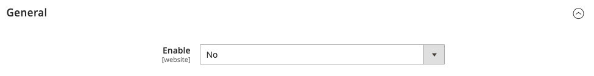
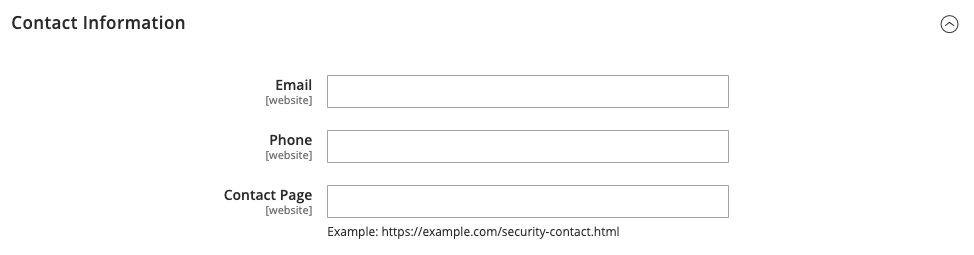

# [!UICONTROL Security] > [!UICONTROL Security.txt]

Para obtener más información sobre cómo cambiar esta configuración, consulte [Informes de problemas de seguridad](../../systems/security-issue-reporting.md).

{{config}}

## [!UICONTROL General]

<!-- zoom -->

| Campo | [Ámbito](../../getting-started/websites-stores-views.md#scope-settings) | Descripción |
|--- |--- |--- |
| [!UICONTROL Enable] | Sitio web | Cuando se habilita, se guarda un archivo de `security.txt` que contiene información necesaria para que los investigadores de seguridad le informen de posibles vulnerabilidades. Opciones: **`Yes`**- Crea el archivo `security.txt` basándose en la información especificada en las secciones _Información de contacto_ y _Otra información_. **`No`** - (predeterminado) No crea el archivo `security.txt`. |

{style="table-layout:auto"}

## [!UICONTROL Contact information]

<!-- zoom -->

| Campo | [Ámbito](../../getting-started/websites-stores-views.md#scope-settings) | Descripción |
|--- |--- |--- |
| [!UICONTROL Email] | Sitio web | Dirección de correo electrónico a la que se pueden enviar los informes de seguridad. |
| [!UICONTROL Phone] | Sitio web | Un número de teléfono que puede utilizarse para informar sobre problemas de seguridad. |
| [!UICONTROL Contact Page] | Sitio web | Dirección URL de una página del sitio que enumera contactos de seguridad o la página _Contáctenos_. Ejemplos:  `https://mystore.com/security-contact.html` `https://mystore.com/contact/` |

{style="table-layout:auto"}

## [!UICONTROL Other information]

<!-- zoom -->

| Campo | [Ámbito](../../getting-started/websites-stores-views.md#scope-settings) | Descripción |
|--- |--- |--- |
| [!UICONTROL Encryption] | Sitio web | Dirección URL que señala a la ubicación de una clave de cifrado que los investigadores de seguridad pueden utilizar para enviar comunicaciones cifradas. _&#x200B;**No escriba la clave de cifrado en este campo.**&#x200B;_   Es responsabilidad del investigador verificar que la clave proviene de una fuente de confianza. Los investigadores no deben suponer que la clave es la misma que se utiliza para generar la firma digital. Ejemplo: Clave OpenPGP del servidor web: `https://mystore.com/pgp-key.txt` |
| [!UICONTROL Acknowledgments] | Sitio web | Dirección URL que apunta a una página de su almacén en la que se reconoce a los investigadores de seguridad, como `https://mystore.com/hall-of-fame.html`. Para evitar ataques futuros, incluya solo una descripción general sin revelar información específica sobre problemas de vulnerabilidad. Ejemplo: Queremos agradecer a los siguientes investigadores: (aaaa/mm/dd) Justin Thyme - Inyección SQL |
| [!UICONTROL Preferred Languages] | Sitio web | Especifica al menos un idioma preferido para los informes de seguridad. Separe los [códigos de idioma](https://en.wikipedia.org/wiki/List_of_ISO_639-1_codes) de varios caracteres con una coma. Todos los idiomas especificados tienen la misma prioridad. Por ejemplo, para especificar inglés, español y francés, escriba `en, es, fr`. |
| [!UICONTROL Hiring] | Sitio web | La dirección URL de una página del sitio que enumera las posiciones de trabajo relacionadas con la seguridad. Ejemplo: `https://mystore.com/jobs.html` |
| [!UICONTROL Policy] | Sitio web | Dirección URL de la página que describe las prácticas de informes de vulnerabilidades y políticas de seguridad. Ejemplo: `https://mystore.com/security-reporting.html` Predeterminado: `https://mystore.com/security` |
| [!UICONTROL Signature] | Sitio web | Un vínculo al archivo de firma digital. La firma digital debe generarse desde la línea de comandos y guardarse en la carpeta `.well-known` del servidor. Para obtener más información, consulte [Security.txt](https://github.com/magento/security-package/blob/1.0-develop/Securitytxt/README.md) en GitHub. Ejemplo: `https://mystore.com/.well-known/security.txt.sig` |

{style="table-layout:auto"}
