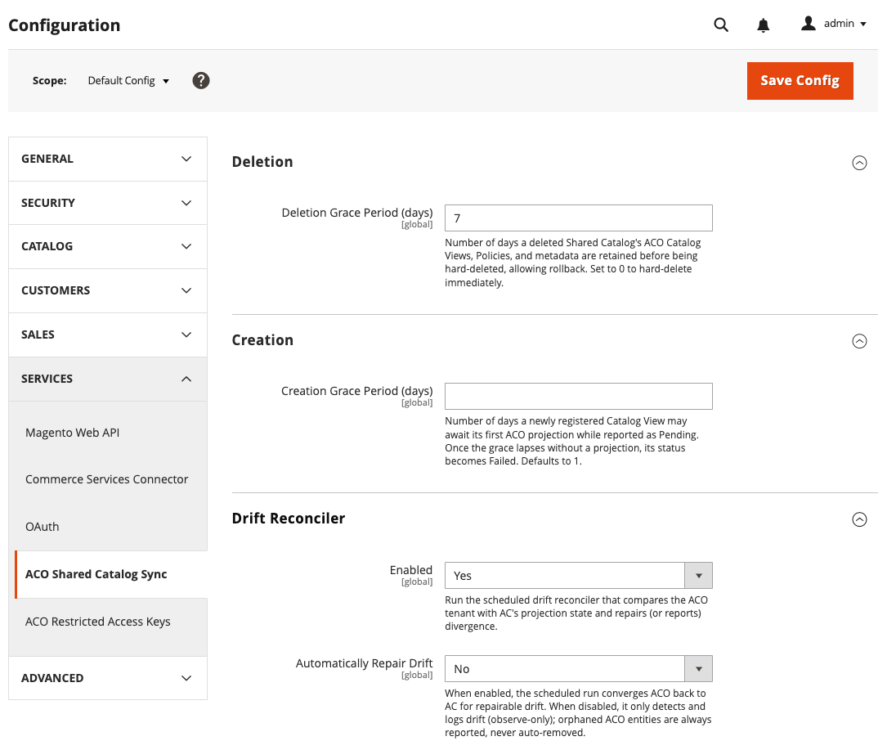

# [!UICONTROL Services] > [!UICONTROL ACO Catalog View Sync]

Utilice esta configuración para controlar cómo [!DNL Adobe Commerce Optimizer Connector for B2B] sincroniza las configuraciones de catálogo compartido B2B (vista de catálogo, directiva, libro de precios y clave) en [!DNL Adobe Commerce Optimizer] y cómo resuelve las diferencias de configuración entre los dos sistemas. Consulte [Supervisión del estado de sincronización de la vista de catálogo](../../systems/catalog-view-sync-status.md) para supervisar los resultados de esta configuración.

{{config}}

## [!UICONTROL Deletion]

<!-- zoom -->

| Campo | [Ámbito](../../getting-started/websites-stores-views.md#scope-settings) | Descripción |
| --- | --- | --- |
| [!UICONTROL Deletion Grace Period (days)] | Global | Período de retención de datos del catálogo compartido. Especifica el número de días que se conservan las vistas de catálogo, las directivas y los metadatos de un catálogo compartido eliminado antes de eliminarse de forma rígida. El valor predeterminado es de 7 días. Se debe establecer en `0` para su eliminación inmediata. |

{style="table-layout:auto"}

## [!UICONTROL Creation]

| Campo | [Ámbito](../../getting-started/websites-stores-views.md#scope-settings) | Descripción |
| --- | --- | --- |
| [!UICONTROL Creation Grace Period (days)] | Global | Número de días que una vista de catálogo recién registrada puede esperar a que [!DNL Adobe Commerce Optimizer Connector for B2B] complete su primera sincronización de las configuraciones de vista de catálogo, directiva, libro de precios y clave, mientras que su estado se comunica como [!UICONTROL Pending]. Si el período de gracia transcurre sin que la sincronización se haya realizado correctamente, el estado cambia a [!UICONTROL Failed]. Valor predeterminado: `1` |

{style="table-layout:auto"}

## [!UICONTROL Drift Reconciler]

| Campo | [Ámbito](../../getting-started/websites-stores-views.md#scope-settings) | Descripción |
| --- | --- | --- |
| [!UICONTROL Enabled] | Global | Ejecuta el reconciliador de deriva programado para detectar e informar de las diferencias entre la vista de catálogo proyectada desde [!DNL Adobe Commerce] y la configuración de la vista de catálogo en [!DNL Adobe Commerce Optimizer]. Si `automatically repair drift` está habilitado, también intentará corregir cualquier discrepancia reparable. |
| [!UICONTROL Automatically Repair Drift] | Global | Cuando se establece en `Yes`, el reconciliador de deriva programado actualiza la configuración de [!DNL Adobe Commerce Optimizer] para que coincida con [!DNL Adobe Commerce] y vuelve a sincronizar la configuración. Cuando se establece en `No`, la ejecución solo detecta e informa de la deriva. Siempre se informa de las entidades huérfanas [!DNL Adobe Commerce Optimizer], nunca se eliminan automáticamente. |

{style="table-layout:auto"}

>[!MORELIKETHIS]
>
> - [Vista de catálogo ACO](./aco-catalog-view.md): configure tokens de acceso para lecturas de tienda de una vista de catálogo
> - [Supervisión del estado de sincronización de la vista de catálogo](../../systems/catalog-view-sync-status.md): supervise el estado de sincronización y concilie la desviación con esta configuración
> - [Administración de claves de acceso restringido](../../systems/restricted-access-keys.md): administre las claves de acceso asignadas a las vistas de catálogo sincronizadas
