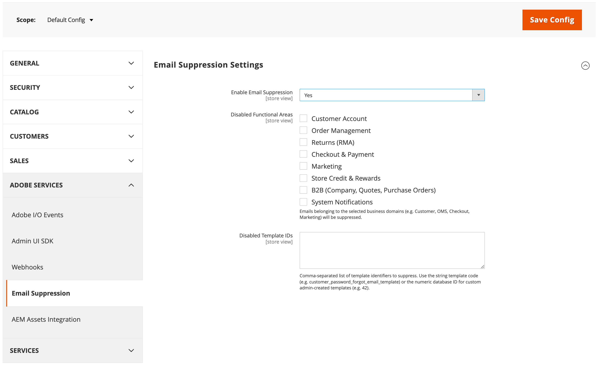

# [!UICONTROL Adobe Services] > [!UICONTROL Email Suppression]

{{config}}

[!UICONTROL Email Suppression] permite a los administradores desactivar categorías específicas de correo electrónico automatizado del sistema sin afectar al resto del correo electrónico de la tienda ni requerir la participación del desarrollador. Utilice esta función para detener temporal o permanentemente determinadas notificaciones como, por ejemplo, pedidos de correo electrónico durante una migración de datos o correos electrónicos de marketing.

>[!IMPORTANT]
>
>Esta función nunca suprime las notificaciones de administración relacionadas con la seguridad, como los códigos de autenticación de doble factor y los correos electrónicos de restablecimiento de contraseña de administrador.

La configuración de esta página se aplica a cada [vista de tienda](../../getting-started/websites-stores-views.md#scope-settings) para que puedas suprimir distintas categorías de correo electrónico en las distintas tiendas.

>[!NOTE]
>
>Si desactiva la supresión inmediatamente se restaura la entrega de correo electrónico normal, pero los correos electrónicos enviados durante el periodo de supresión no se ponen en cola.

## [!UICONTROL Email Suppression]

<!-- zoom -->

| Campo | [Ámbito](../../getting-started/websites-stores-views.md#scope-settings) | Descripción |
|--- |--- |--- |
| [!UICONTROL Enable Email Suppression] | Vista de tienda | Interruptor maestro de encendido/apagado para la función. Cuando se establece en `No` (predeterminado), se omite cualquier otra configuración de esta página y todos los correos electrónicos se envían normalmente. |
| [!UICONTROL Disabled Functional Areas] | Vista de tienda | Seleccione una o varias categorías de negocio cuyos correos electrónicos se hayan suprimido. Ver [Categorías de negocios](#business-categories) para ver lo que incluye cada categoría. |
| [!UICONTROL Disabled Template IDs] | Vista de tienda | Lista opcional separada por comas de plantillas de correo electrónico específicas para suprimir individualmente, independientemente de la categoría. Utilice el código de plantilla (por ejemplo, `customer_password_forgot_email_template`) o el identificador numérico de plantilla para una plantilla personalizada que haya creado en el Administrador. |

{style="table-layout:auto"}

### Categorías empresariales {#business-categories}

| Categoría | Correos electrónicos habituales incluidos |
|--- |--- |
| Cuenta del cliente | Creación de cuenta, restablecimiento de contraseña, cambios de información de cuenta. |
| Order Management | Confirmación de pedido, factura, envío, nota de abono, cancelación de pedido. |
| Devuelve (RMA) | Devolver notificaciones de autorización de mercancías. |
| Pago y envío | Correos electrónicos de pago y pago por vínculo. |
| Marketing | Boletines, alertas de productos, compartir listas de deseos, enviar por correo electrónico a un amigo, recordatorios, invitaciones, registro de regalos. |
| Crédito y recompensas de la tienda | Tarjetas de regalo, puntos de recompensa, cambios de saldo de crédito de tienda. |
| B2B | Notificaciones de empresa, presupuesto negociable y pedido de compra. |
| Notificaciones del sistema | Notificaciones operativas como importación programada, exportación y correos electrónicos de formularios de contacto. |

{style="table-layout:auto"}
