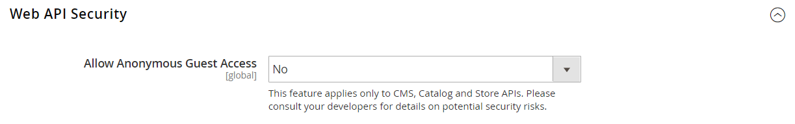

# [!UICONTROL Services] > [!UICONTROL Magento Web API]

{{config}}

<!-- [X-ref](../systems/integrations.md) -->

## [!UICONTROL SOAP Settings]

<!-- zoom -->

| Campo | [Ámbito](../../getting-started/websites-stores-views.md#scope-settings) | Descripción |
|--- |--- |--- |
| [!UICONTROL Default Response Charset] | Vista de tienda | Determina el conjunto de caracteres predeterminado. Si está vacío, se utiliza UTF-8. |

{style="table-layout:auto"}

## [!UICONTROL GraphQl Input Limits]

<!-- zoom -->

| Campo | [Ámbito](../../getting-started/websites-stores-views.md#scope-settings) | Descripción |
|--- |--- |--- |
| [!UICONTROL Enable Input Limits] | Vista de tienda | Determina si los límites de entrada están habilitados para las llamadas de GraphQL. Valor predeterminado: `No`. |
| [!UICONTROL Maximum Page Size] | Vista de tienda | Establece el número máximo de elementos permitidos en un resultado de búsqueda paginada en la respuesta de GraphQL. Esta opción no está disponible cuando _Habilitar límites de entrada_ = `No`. |

{style="table-layout:auto"}

## [!UICONTROL Web Api Input Limits]

<!-- zoom -->

| Campo | [Ámbito](../../getting-started/websites-stores-views.md#scope-settings) | Descripción |
|--- |--- |--- |
| [!UICONTROL Enable Input Limits] | Vista de tienda | Determina si los límites de entrada están habilitados para las llamadas a la API web. Valor predeterminado: `No`. |
| Límite de lista de entrada | Vista de tienda | Establece el número máximo de elementos permitidos en una propiedad de matriz de entidades en la solicitud de API web. Esta opción no está disponible cuando _Habilitar límites de entrada_ = `No`. |
| [!UICONTROL Maximum Page Size] | Vista de tienda | Establece el número máximo de elementos permitidos en un resultado de búsqueda paginada en la respuesta de la API web. Esta opción no está disponible cuando _Habilitar límites de entrada_ = `No`. |
| [!UICONTROL Default Page Size] | Vista de tienda | Establece el número predeterminado de elementos en un resultado de búsqueda paginada en la respuesta de la API web. |

{style="table-layout:auto"}

## [!UICONTROL Web API Security]

<!-- zoom -->

| Campo | [Ámbito](../../getting-started/websites-stores-views.md#scope-settings) | Descripción |
|--- |--- |--- |
| [!UICONTROL Allow Anonymous Guest Access] | Global | Determina si los invitados pueden acceder de forma anónima a CMS, catálogos y recursos de tienda desde las API de SOAP y REST. De forma predeterminada, no se permite el acceso anónimo de invitados. Opciones: `Yes` / `No` |

{style="table-layout:auto"}

## [!UICONTROL JWT Authentication]

<!-- zoom -->

| Campo | [Ámbito](../../getting-started/websites-stores-views.md#scope-settings) | Descripción |
|--- |--- |--- |
| [!UICONTROL Algorithm to sign/encrypt JWTs used for authentication] | Global | Especifica el tipo de algoritmo JWS o JWE utilizado para el cifrado de JWT (token web JSON) |
| [!UICONTROL Content encryption algorithm for JWEs] | Global | Especifica el tipo de algoritmo de cifrado de contenido utilizado para el cifrado JWT cuando se selecciona el algoritmo JWE. Esta opción se ignora para los algoritmos JWS. |
| [!UICONTROL Customer JWT Expires In] | Global | Establece el tiempo (en minutos) antes de que caduque un token de portador JWT del cliente. El token de portador JWT del cliente caduca en 30 minutos si este campo está vacío o tiene un valor negativo. Valor predeterminado: `60` |
| [!UICONTROL Admin User JWT Expires In] | Global | Establece el tiempo (en minutos) antes de que caduque el token de portador de JWT de administrador. El token de portador JWT de administrador caduca en 30 minutos si este campo está vacío o tiene un valor negativo. Valor predeterminado: `60` |

{style="table-layout:auto"}
