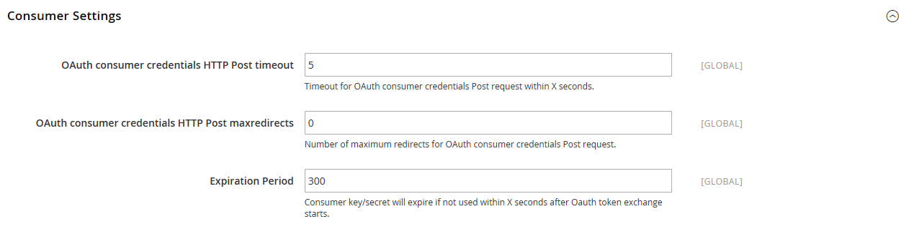

# [!UICONTROL Services] > [!UICONTROL OAuth]

{{config}}

## [!UICONTROL Access Token Expiration]

<!-- zoom -->

| Campo | [Ámbito](../../getting-started/websites-stores-views.md#scope-settings) | Descripción |
|--- |--- |--- |
| [!UICONTROL Customer Token Lifetime (hours]) | Global | Determina el tiempo en horas antes de que caduque un token de API de cliente. El token de cliente nunca caduca si el campo está vacío. Valor predeterminado: `1` |
| [!UICONTROL Admin Token Lifetime (hours)] | Global | Determina el tiempo en horas antes de que caduque un token de API de administrador. El token de administrador nunca caduca si el campo está vacío. Valor predeterminado: `4` |

{:style=&quot;table-layout:auto&quot;}

>[!NOTE]
>
>Los algoritmos de cifrado y duración del token de API de cliente y administrador están controlados por [Autenticación JWT](magento-web-api.md#jwt-authentication) opciones de configuración.

## [!UICONTROL Cleanup Settings]

<!-- zoom -->

| Campo | [Ámbito](../../getting-started/websites-stores-views.md#scope-settings) | Descripción |
|--- |--- |--- |
| [!UICONTROL Cleanup Probability] | Global | Especifica el número de solicitudes de OAuth antes de iniciar la limpieza. No introducir `0` para deshabilitar la limpieza. |
| [!UICONTROL Enable WSDL Cache] | Global | Determina la antigüedad de las entradas en minutos antes de que se limpien. |

{:style=&quot;table-layout:auto&quot;}

## [!UICONTROL Consumer Settings]

<!-- zoom -->

| Campo | [Ámbito](../../getting-started/websites-stores-views.md#scope-settings) | Descripción |
|--- |--- |--- |
| [!UICONTROL OAuth consumer credentials HTTP Post timeout] | Global | Especifica el número de segundos que tarda el sistema en agotar el tiempo de espera cuando los clientes registran sus credenciales. |
| [!UICONTROL OAuth consumer credentials HTTP Post maxredirects] | Global | Especifica el número máximo de redirecciones relacionadas con un registro de credenciales de consumidor. |
| [!UICONTROL Expiration Period] | Global | Determina el número de segundos antes de que caduque una clave o secreto no utilizado después de que comience el intercambio de tokens de OAuth. |

{:style=&quot;table-layout:auto&quot;}

## [!UICONTROL Authentication Locks]

<!-- zoom -->

| Campo | [Ámbito](../../getting-started/websites-stores-views.md#scope-settings) | Descripción |
|--- |--- |--- |
| [!UICONTROL Maximum Login Failures to Lock Out Account] | Global | Especifica el número máximo de errores de autenticación para bloquear la cuenta. |
| [!UICONTROL Lockout Time (seconds)] | Global | Especifica el período de tiempo en segundos tras el cual se desbloquea la cuenta. |

{:style=&quot;table-layout:auto&quot;}
