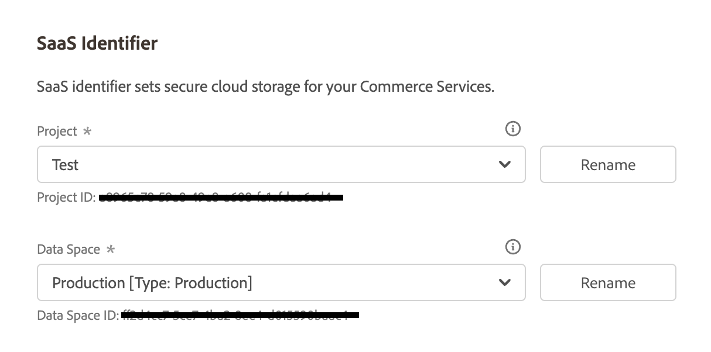

# [!UICONTROL Services] > [!UICONTROL Commerce Services Connector]

Para obtener información sobre cómo conectar su tienda a los servicios de Adobe Commerce, consulte [Servicios de Commerce](https://experienceleague.adobe.com/docs/commerce-merchant-services/user-guides/integration-services/saas.html).

{{config}}

## [!UICONTROL Sandbox API Keys]

<!-- zoom -->

| Campo | [Ámbito](../../getting-started/websites-stores-views.md#scope-settings) | Descripción |
|--- |--- |--- |
| [!UICONTROL Sandbox public API key] | Global | Clave de API que identifica al autor y sus derechos, si los hay. |
| [!UICONTROL Sandbox private API key] | Global | Una clave privada asociada a la clave de API. |

{:style=&quot;table-layout:auto&quot;}

## [!UICONTROL Production Keys]

<!-- zoom -->

| Campo | [Ámbito](../../getting-started/websites-stores-views.md#scope-settings) | Descripción |
|--- |--- |--- |
| [!UICONTROL Production public API key] | Global | Clave de API que identifica al autor y sus derechos, si los hay. |
| [!UICONTROL Production private API key] | Global | Una clave privada asociada a la clave de API. |

{:style=&quot;table-layout:auto&quot;}

## [!UICONTROL SaaS Identifier]

<!-- zoom -->

| Campo | [Ámbito](../../getting-started/websites-stores-views.md#scope-settings) | Descripción |
|--- |--- |--- |
| [!UICONTROL Project] | Global | Nombre del proyecto de SaaS que agrupa todos los espacios de datos de SaaS. A _Crear proyecto_ aparece si no existen proyectos SaaS. |
| [!UICONTROL Data Space] | Global | Muestra los espacios de datos SaaS del proyecto SaaS especificado. El número de espacios de datos SaaS depende de su [Licencia comercial](https://experienceleague.adobe.com/docs/commerce-merchant-services/user-guides/integration-services/saas.html): Adobe Commerce: un espacio de datos de producción, dos espacios de datos de prueba; Magento Open Source: un espacio de datos de producción, sin espacios de datos de prueba |

{:style=&quot;table-layout:auto&quot;}

## [!UICONTROL IMS Organization]

<!-- zoom -->

| Campo | Descripción |
|--- |--- |
| [!UICONTROL Sign in using Adobe ID] | Su Adobe ID suele ser la dirección de correo electrónico que utilizó por primera vez al iniciar su suscripción o al adquirir una aplicación o servicio de Adobe. Su Adobe ID es la clave que necesita para acceder a su cuenta de Adobe. |

{:style=&quot;table-layout:auto&quot;}
