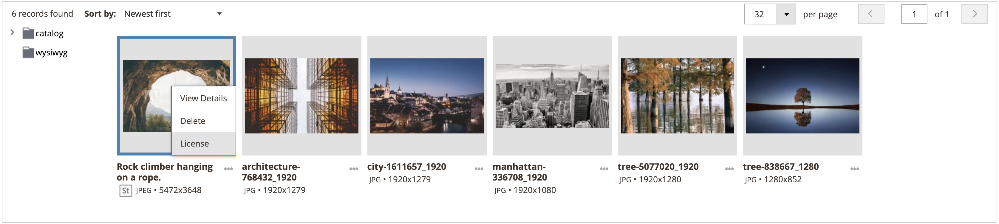

# Licencia de una imagen de Adobe Stock

Los recursos de Adobe Stock que desee utilizar para sus tiendas de producción de Adobe Commerce y Magento Open Source deben tener licencia. Esta licencia garantiza que tenga acceso legal a la imagen y que elimine la marca de agua de Adobe Stock que está presente en todas las [previsualizaciones de imagen](./adobe-stock-save-preview.md). Para obtener una licencia de imágenes o guardar imágenes con licencia, debe iniciar sesión en su cuenta de Adobe.

El nuevo [[!DNL Media Gallery]](media-gallery.md) proporciona una integración directa con Adobe Stock, lo que facilita la licencia de las imágenes directamente desde la página de la galería.

>[!BEGINSHADEBOX]

**Requisitos previos**

La característica de licencias de Adobe Stock solo está disponible si [Adobe Stock Integration](./adobe-stock.md) está instalado y configurado. Para autorizar [imágenes de Adobe Stock](https://stock.adobe.com) se necesita un plan Adobe Stock de pago y una [cuenta de Adobe](https://helpx.adobe.com/manage-account/using/access-adobe-id-account.html).

>[!ENDSHADEBOX]

## Otorgar licencia a una imagen del nuevo [!DNL Media Gallery]

1. En la barra lateral _Admin_, vaya a **[!UICONTROL Content]** > _[!UICONTROL Media]_>**[!UICONTROL Media Gallery]**.

1. Siga los pasos de [Uso de imágenes de Adobe Stock](./adobe-stock-manage.md) para iniciar sesión y guardar imágenes de vista previa en el [almacenamiento de medios](./media-storage.md).

   {width="600" zoomable="yes"}

1. Haga clic en los tres puntos situados debajo de la imagen ({width="10" zoomable="no"}) y, a continuación, haga clic en **[!UICONTROL License]**.

   {width="600" zoomable="yes"}

   >[!NOTE]
   >
   >Si no ha iniciado sesión, aparecerá el formulario de inicio de sesión. Para obtener más información sobre el inicio de sesión, consulte [Uso de imágenes de Adobe Stock](./adobe-stock-manage.md).

1. En el cuadro de diálogo de confirmación de licencia, haga clic en **[!UICONTROL Confirm]** para obtener la licencia de la imagen.

   {width="350" zoomable="yes"}

   >[!NOTE]
   >
   >Debe tener [créditos de Adobe Stock](https://helpx.adobe.com/stock/help/credit-packs.html) disponibles en su cuenta para autorizar la imagen.

## Otorgar licencia a una imagen desde el almacenamiento de medios estándar

1. [Acceder a la cuadrícula de búsqueda de Adobe Stock][adobe-stock-manage.md].

1. Para [ver los detalles de la imagen][adobe-stock-manage.md#view-image-details], haga clic en una imagen de la cuadrícula de búsqueda en orden.

1. Según el estado de licencia actual de la imagen, realice una de las siguientes acciones:

   - Si la imagen ya tiene licencia, haga clic en **[!UICONTROL Save]**.

   - Si la imagen tiene licencia para _not_, haga clic en **[!UICONTROL License and Save]**.

     >[!NOTE]
     >
     >Debe tener [créditos de Adobe Stock](https://helpx.adobe.com/stock/help/credit-packs.html) disponibles en su cuenta para autorizar la imagen.

   Esta acción muestra una solicitud para que especifique un nombre de archivo que se use para guardar la imagen en el [almacenamiento de medios](./media-storage.md). Se proporciona un nombre de archivo predeterminado, pero puede personalizarlo según sus preferencias.

   {width="550" zoomable="yes"}

1. Haga clic en **[!UICONTROL Confirm]**.

   La página redirige al almacenamiento de medios y se muestra la previsualización guardada.
