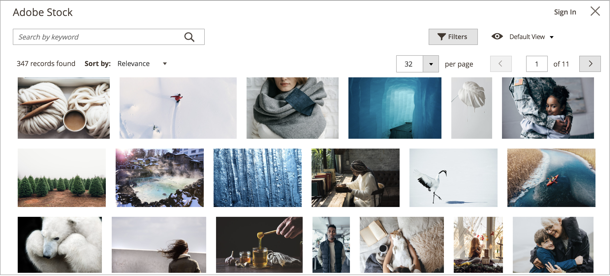

# Integración de Adobe Stock

Para obtener acceso a innumerables recursos multimedia para usar en tu tienda, integra [Adobe Stock](https://stock.adobe.com) con [!UICONTROL Commerce].

{width="700" zoomable="yes"}

El servicio Adobe Stock proporciona a las empresas acceso a millones de fotos, vectores, ilustraciones, vídeos, plantillas y recursos 3D de alta calidad, depurados y libres de derechos para todos sus proyectos creativos. Los usuarios de [!DNL Commerce] pueden buscar, previsualizar y obtener licencias de recursos de Adobe Stock rápidamente. Los usuarios también pueden guardarlos en [almacenamiento de medios](./media-storage.md), sin salir del área de trabajo de administración.

## Requisitos previos

Esta integración requiere:

- Una cuenta de [Adobe Developer](https://developer.adobe.com/console/home)
- Adobe Commerce o Magento Open Source, 2.3.4 o posterior

Para obtener licencias de imágenes de Adobe Stock se requiere:

- Una [cuenta de Adobe](https://helpx.adobe.com/es/manage-account/using/access-adobe-id-account.html)
- Un plan [Adobe Stock](https://stock.adobe.com) de pago asociado con la cuenta

## Integrar [!DNL Commerce] y Adobe Stock

La configuración de la integración de Adobe Stock para Adobe Commerce es un proceso de dos pasos:

1. [Crear una integración adobe.developer](#create-an-adobe-developer-integration) para generar una clave de API
1. [Configuración de la integración de Adobe Stock en el administrador de Commerce](#configure-the-adobe-stock-integration)

### Creación de una integración de Adobe Developer

1. Vaya a [Adobe Developer Console](https://developer.adobe.com/console/home).

1. En _[!UICONTROL Quick Start]_, haga clic en **[!UICONTROL Create new project]**.

1. En el bloque _[!UICONTROL Project overview]_, haga clic en **[!UICONTROL Add API]**.

1. Seleccione **[!UICONTROL Adobe Stock]** de la lista de integraciones y haga clic en **[!UICONTROL Next]**.

1. Seleccione OAuth 2.0 **[!UICONTROL Web App]**.

1. Especifique **[!UICONTROL redirect URI]**.

   El URI de redirección predeterminado tiene el formato `${HOST}/${ADMIN_URI}/adobe_ims/oauth/callback/`, como `https://store.myshop.com/admin_hgkq1l/adobe_ims/oauth/callback/`, donde:

   - `${HOST}` es su [!DNL Commerce] nombre de dominio completo (por ejemplo, `https://store.myshop.com`).
   - `${ADMIN_URI}` es su URI de administrador [!DNL Commerce] (como `admin_hgkq1l`), que se puede recuperar ejecutando `magento info:adminuri`.

1. Especifique **[!UICONTROL Redirect URI pattern]**, que es el mismo que el URI de redireccionamiento, con dos diferencias:

   - Cualquier punto (`.`) debe ser de escape con dos barras invertidas (`\\`).
   - Agregar `.*` al final del patrón.

   Utilizando el ejemplo del URI de redireccionamiento predeterminado anterior, el patrón sería `https://store\\.myshop\\.com/admin_hgkq1l/adobe_ims/oauth/callback/.*`

1. Haga clic en **[!UICONTROL Next]**.

1. Revise los ámbitos disponibles y haga clic en **[!UICONTROL Save configured API]**.

1. En la página siguiente, copie su **[!UICONTROL Client ID]** (clave de API) y **[!UICONTROL Client secret]**.

   Esta información se utiliza en los pasos de la siguiente sección.

### Configuración de la integración de Adobe Stock

Para establecer la configuración del sistema en su administrador de [!DNL Commerce], use la _clave de API_ y el _secreto de cliente_ generados en la [sección anterior](#create-an-adobeio-integration).

1. En la barra lateral _Admin_, vaya a **[!UICONTROL Stores]** > _[!UICONTROL Settings]_>**[!UICONTROL Configuration]**.

1. En el panel izquierdo, expanda **[!UICONTROL Advanced]** y elija **[!UICONTROL System]**.

1. Expanda  **[!UICONTROL Adobe Stock Integration]** y haga lo siguiente:

   - Establezca **[!UICONTROL Enabled Adobe Stock]** en `Yes`.

   - Escriba su **[!UICONTROL API Key (Client ID)]**.

   - Escriba su **[!UICONTROL Client Secret]**.

   - Haga clic en **[!UICONTROL Test Connection]** para validar las claves.

   {width="600" zoomable="yes"}

   Asigne unos segundos a la validación. Si sus credenciales son válidas, debería ver una _conexión correcta verde._ Mensaje.

1. Una vez finalizado, haga clic en **[!UICONTROL Save Config]**.
