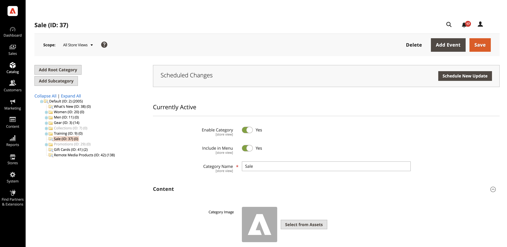

# Uso de AEM Assets

<!--In ACAP-844, this topic was linked to from the Commerce Admin products images and videos when the Assets integration is enabled. If the URL to the topic changes, be sure to add a redirect.-->

## Actualizar un recurso

Después de editar un recurso en AEM Assets, envíe las actualizaciones a Commerce aprobando y reprocesando el recurso. Solo se envían a la instancia de Commerce los recursos aprobados. El reprocesamiento del recurso garantiza que los cambios finales y las actualizaciones de metadatos se capturen antes de que el recurso se envíe a Adobe Commerce.

Para obtener más información, consulte la siguiente documentación de AEM Assets.

- [Reprocesando recursos digitales](https://experienceleague.adobe.com/es/docs/experience-manager-cloud-service/content/assets/manage/reprocessing)

- [Aprobar un recurso](https://experienceleague.adobe.com/es/docs/experience-manager-cloud-service/content/assets/dynamicmedia/dynamic-media-open-apis/approve-assets)

## Añadir recursos al contenido de las categorías

Puede añadir recursos al contenido de las categorías del catálogo una vez que haya activado y configurado la integración de AEM Assets:

1. En la barra lateral _Admin_, vaya a **[!UICONTROL Catalog]** > **[!UICONTROL Categories]**.

1. Expanda  en la sección **[!UICONTROL Content]**.

   {width="600" zoomable="yes"}

1. Para mostrar un(a) **[!UICONTROL Category Image]** en la parte superior de la página, haga clic en **[!UICONTROL Select from Assets]** para usar una imagen de la carpeta AEM Assets.

1. Haga clic en **[!UICONTROL Save]** y continúe.

   Para obtener más información sobre cómo crear una categoría, vea [Completar el contenido de la categoría](../catalog/category-create.md#step-3-complete-the-category-content).
