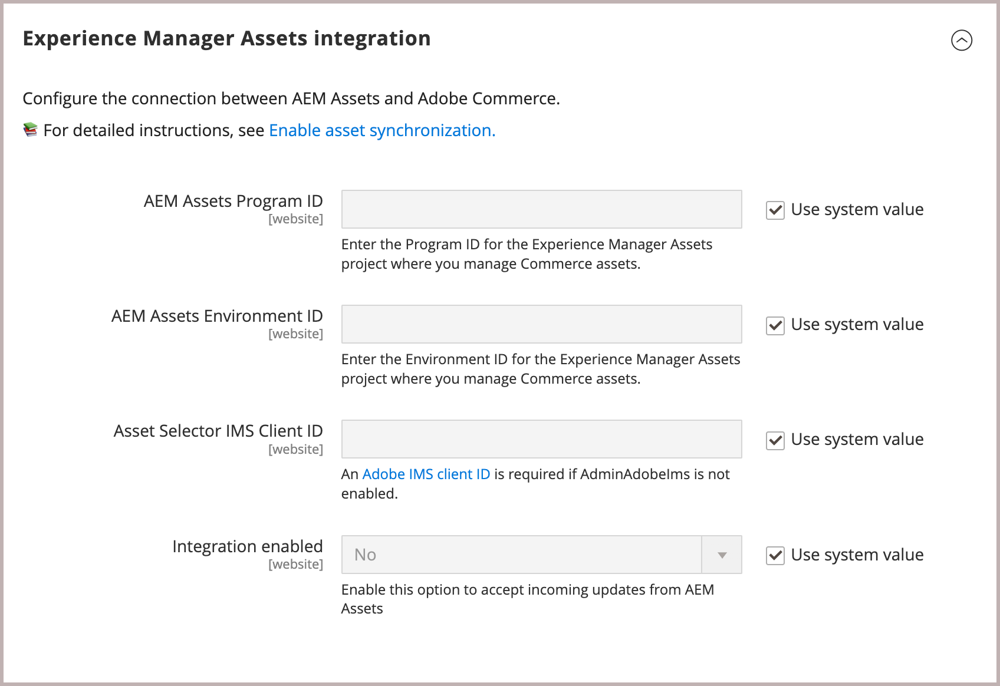

# Habilitar sincronización de recursos

>[!BEGINSHADEBOX]

**Requisitos previos**

- [AEM Configuración de Experience Manager Assets para administrar recursos de Commerce](#aem-assets-configure-aem)
- [Instale y configure la integración de AEM Assets para Commerce](#aem-assets-configure-commerce.md) para agregar la extensión y generar las credenciales y conexiones necesarias para usar la extensión.

>[!ENDSHADEBOX]

AEM Durante este proceso de habilitación, puede registrar su ID de inquilino proporcionando el ID de programa y entorno para su entorno de creación de la. Estos ID identifican el proyecto de AEM Assets al que se está conectando y proporcionan las credenciales para habilitar la comunicación y los flujos de trabajo entre Commerce y AEM Assets.

AEM Después de identificar el proyecto de recursos de la, seleccione la regla coincidente que se utilizará para sincronizar recursos entre Adobe Commerce y AEM Assets.

La integración de AEM Assets para Commerce admite dos reglas coincidentes para sincronizar recursos entre Adobe Commerce y AEM Assets.

- **Coincidencia por SKU del producto**: esta es la regla de coincidencia predeterminada que coincide con los recursos basados en la unidad de mantenimiento de existencias (SKU) del producto. El SKU es un identificador único para cada producto. Esta regla hace coincidir el SKU de los metadatos del recurso con el SKU del producto de Commerce para garantizar que los recursos están asociados con los productos correctos.

- **Coincidencia personalizada**: esta regla de coincidencia es para escenarios más complejos o requisitos empresariales específicos que requieren una lógica de coincidencia personalizada. Para utilizar esta regla, debe tener implementado en Adobe Developer App Builder un código personalizado que defina cómo se relacionan los recursos con los productos. Próximamente más detalles...

Para la incorporación inicial, use la regla predeterminada `Match by product sku`. Si es necesario, puede cambiar la regla coincidente más adelante.

## Habilitar la integración

1. Obtenga el ID de proyecto y entorno para su [entorno de creación de AEM Assets](https://experienceleague.adobe.com/en/docs/experience-manager-cloud-service/content/sites/authoring/quick-start).

   1. Abra la consola AEM Sites y seleccione **[!UICONTROL Assets]**.

   1. Copie y guarde los identificadores de proyecto y entorno desde la dirección URL:  `https://author-p[Program ID]-e[EnvironmentID].adobeaemcloud.com/`|

1. En el Administrador de Commerce, abra la configuración de integración de AEM Assets.

   1. Seleccione **[!UICONTROL Store]** > Configuración > **[!UICONTROL CATALOG]** > **[!UICONTROL Catalog]**.

   1. Expandir **[!UICONTROL Experience Manager Assets integration]**.

      {width="600" zoomable="yes"}

1. Identifique el proyecto de Experience Manager Assets al que se va a conectar especificando **[!UICONTROL Program ID]** y **[!UICONTROL Environment ID]**.

1. Agregue las credenciales de OAUTH para autenticar las solicitudes de API entre Adobe Commerce y el servicio ARES seleccionando **[[!UICONTROL Commerce integration]](aem-assets-configure-commerce.md#add-the-integration-to-the-commerce-environment)**, por ejemplo `Assets integration`.

1. Permitir que Commerce acepte actualizaciones entrantes de AEM Assets estableciendo **[!UICONTROL Enable integration]** en `Yes`.

   Después de habilitar la integración, puede configurar la regla de coincidencia de recursos.

   {width="600" zoomable="yes"}

1. Defina la regla de coincidencia para la sincronización de recursos.

   1. Seleccione **[!UICONTROL Match by product SKU]**.

   1. Agregue el [nombre del campo de metadatos AEM Assets](aem-assets-configure-aem.md#configure-metadata) definido para las SKU de productos Commerce en el campo **[!UICONTROL Match by product SKU attribute name]**, `commerce:skus` por ejemplo.

1. Aplique la configuración e inicie el proceso de sincronización seleccionando **[!UICONTROL Save Config]**.
