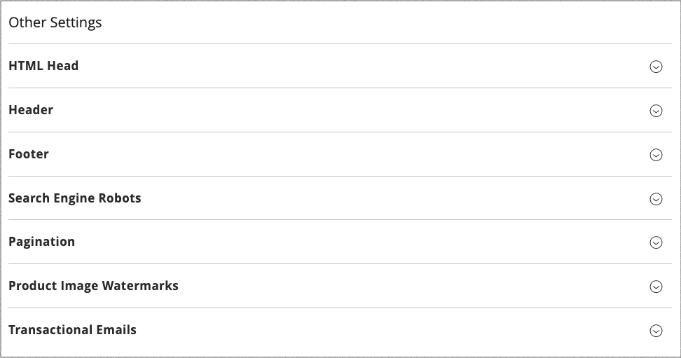

# Configuración de diseño

La configuración de diseño facilita la edición de las reglas y los ajustes de configuración relacionados con el diseño al mostrar los ajustes en una sola página.

{width="700" zoomable="yes"}

## Cambio de la configuración de diseño

1. En la barra lateral _Admin_, vaya a **[!UICONTROL Content]** > _[!UICONTROL Design]_>**[!UICONTROL Configuration]**.

1. Busque la vista de tienda que desea configurar y haga clic en **[!UICONTROL Edit]** en la columna _[!UICONTROL Action]_.

   La página muestra la configuración de diseño actual para la vista de tienda.

1. Para cambiar el tema predeterminado, establezca **[!UICONTROL Applied Theme]** en el tema que desee aplicar a la vista.

   Si no se especifica ninguna temática, se utiliza la predeterminada del sistema. Algunas extensiones de terceros modifican el tema predeterminado del sistema.

1. [!BADGE Solo PaaS]{type=Informative url="https://experienceleague.adobe.com/es/docs/commerce/user-guides/product-solutions" tooltip="Se aplica solo a proyectos de Adobe Commerce en la nube (infraestructura PaaS administrada por Adobe) y a proyectos locales."} Si el tema se va a usar solamente para un dispositivo específico, establezca **[!UICONTROL User Agent Rules]**.

   {width="400" zoomable="yes"}

   Para cada tipo de dispositivo en el que desee especificar una temática:

   - Haga clic en **[!UICONTROL Add New User Agent Rule]**.

   - Para **[!UICONTROL Search String]**, ingrese el identificador de explorador del dispositivo específico.

     Una cadena de búsqueda puede ser una expresión normal o una expresión regular compatible con Perl (PCRE) (consulte [Agente de usuario](https://en.wikipedia.org/wiki/User_agent) para obtener más información). La siguiente cadena de búsqueda identifica a Firefox:

         /^mozilla/i
     
   - Para **[!UICONTROL Theme Name]**, elija el tema que se usará para el dispositivo especificado.

   >[!NOTE]
   >
   >Puede agregar tantas reglas para los dispositivos que desee designar. Las cadenas de búsqueda coinciden en el orden en que se escriben.

1. En _[!UICONTROL Other Settings]_, expanda cada sección y siga las instrucciones de los temas vinculados para editar la configuración según sea necesario.

   - [!BADGE Solo PaaS]{type=Informative url="https://experienceleague.adobe.com/es/docs/commerce/user-guides/product-solutions" tooltip="Se aplica solo a proyectos de Adobe Commerce en la nube (infraestructura PaaS administrada por Adobe) y a proyectos locales."} [[!UICONTROL Pagination]](../catalog/navigation-product-listings.md#pagination-controls)
   - [!BADGE Solo PaaS]{type=Informative url="https://experienceleague.adobe.com/es/docs/commerce/user-guides/product-solutions" tooltip="Se aplica solo a proyectos de Adobe Commerce en la nube (infraestructura PaaS administrada por Adobe) y a proyectos locales."} [[!UICONTROL HTML Head]](page-setup.md#html-head)
   - [!BADGE Solo PaaS]{type=Informative url="https://experienceleague.adobe.com/es/docs/commerce/user-guides/product-solutions" tooltip="Se aplica solo a proyectos de Adobe Commerce en la nube (infraestructura PaaS administrada por Adobe) y a proyectos locales."} [[!UICONTROL Header]](page-setup.md#header)
   - [!BADGE Solo PaaS]{type=Informative url="https://experienceleague.adobe.com/es/docs/commerce/user-guides/product-solutions" tooltip="Se aplica solo a proyectos de Adobe Commerce en la nube (infraestructura PaaS administrada por Adobe) y a proyectos locales."} [[!UICONTROL Footer]](page-setup.md#footer)
   - [!BADGE Solo PaaS]{type=Informative url="https://experienceleague.adobe.com/es/docs/commerce/user-guides/product-solutions" tooltip="Se aplica solo a proyectos de Adobe Commerce en la nube (infraestructura PaaS administrada por Adobe) y a proyectos locales."} [[!UICONTROL Search Engine Robots]](../merchandising-promotions/seo-overview.md#search-engine-robots)
   - [[!UICONTROL Product Image Watermarks]](../catalog/product-image.md#watermarks)
   - [[!UICONTROL Transactional Emails]](../systems/email-templates.md#configure-email-templates)

   {width="500" zoomable="yes"}

1. Una vez finalizado, haga clic en **[!UICONTROL Save Configuration]**.
