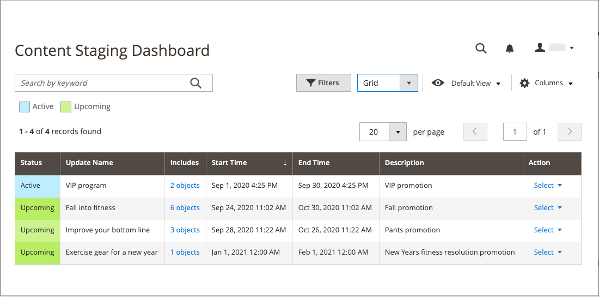

# Panel de ensayo de contenido

{{ee-feature}}

El [!UICONTROL Content Staging] El panel proporciona una descripción general de todas las campañas activas y futuras. El formato del tablero se puede cambiar de una cuadrícula a una cronología. También puede utilizar filtros para buscar campañas, personalizar el diseño de la columna y guardar diferentes vistas de la cuadrícula. Para obtener más información sobre los controles del espacio de trabajo, vea [Admin Workspace](../getting-started/admin-workspace.md).

{width="600" zoomable="yes"}

## Ver el panel de ensayo

1. En el _Administrador_ barra lateral, vaya a  **[!UICONTROL Content]** > _[!UICONTROL Content Staging]_>**[!UICONTROL Dashboard]**.

1. Para cambiar el formato del tablero, defina la variable **[!UICONTROL View As]** control a `list`, `Grid`, o `Timeline`.

   {width="600" zoomable="yes"}

   Cuando se muestra la cronología, se puede utilizar el control deslizante de la esquina inferior derecha para ajustar la vista de una a cuatro semanas. Cada columna representa un día.

1. Si se muestra la cronología, arrastre el control deslizante hasta la `4w` situado en el extremo derecho para ver un intervalo de tiempo más largo.

   {width="600" zoomable="yes"}

1. Para mostrar información general sobre la campaña, haga clic en cualquier elemento de la página.

   - Para abrir la campaña, haga clic en **[!UICONTROL View/Edit]**.

   - Para ver el aspecto de la campaña para los clientes de la tienda ese día, haga clic en **[!UICONTROL Preview]**.

   {width="600" zoomable="yes"}

## Descripciones de columnas del panel de ensayo

| Columna | Descripción |
|--- |--- |
| [!UICONTROL Status] | Estado de la campaña. `Active` o `Upcoming`. |
| [!UICONTROL Update Name] | Nombre de la campaña. |
| [!UICONTROL Includes] | Define cuántos objetos se incluyen en la campaña. |
| [!UICONTROL Start Time] | La fecha en la que comienza la campaña. |
| [!UICONTROL End Time] | La fecha en la que finaliza la campaña. |
| [!UICONTROL Description] | Descripción adicional de cada campaña. |
| [!UICONTROL Action] | Las acciones que se pueden aplicar a un registro individual incluyen: **[!UICONTROL View/Edit]**: abre la campaña en modo de edición. **[!UICONTROL Preview]** - Muestra la campaña en modo de vista previa. |

{style="table-layout:auto"}

## Edición de una campaña

Los objetos de campaña existentes se pueden editar desde el panel de ensayo, excepto para las campañas de reglas de precios que no tienen fechas de finalización.

>[!NOTE]
>
>Si una campaña que incluye una regla de precio se crea inicialmente sin una fecha de finalización, la campaña no se puede editar más adelante para incluir una fecha de finalización. En tal caso, es necesario crear una campaña duplicada e introducir la fecha de finalización que sea necesaria.

{width="600" zoomable="yes"}

La campaña de este ejemplo incluye dos categorías y tres productos individuales.

Siga los pasos a continuación para editar cualquiera de los objetos de esta campaña.

1. En el _Administrador_ barra lateral, vaya a  **[!UICONTROL Content]** > _[!UICONTROL Content Staging]_>**[!UICONTROL Dashboard]**.

1. Busque la campaña en la lista mostrada o la cronología y ábrala para acceder a los detalles:

   - Para ver una lista, haga clic en **[!UICONTROL Select]** y luego **[!UICONTROL View/Edit]** en el _[!UICONTROL Action]_columna.
   - Para mostrar una cronología, haga clic una vez para mostrar el resumen y, a continuación, haga clic en **[!UICONTROL View/Edit]**.

1. Actualice cualquiera de los ajustes de la _[!UICONTROL General]_según sea necesario.

1. Expandir  cualquier sección que contenga un elemento que se va a editar.

   {width="600" zoomable="yes"}

1. Haga clic **[!UICONTROL Save]**.
