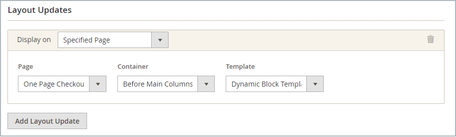

# Añadir un bloque dinámico giratorio

{{ee-feature}}

Para presentar una presentación con diapositivas de contenido interactivo, puede agregar varias [bloques dinámicos](dynamic-blocks.md) a un rotador. El [widget](widgets.md) La herramienta se utiliza para colocar el rotador en un lugar específico en una sola página o en varias páginas de la tienda.

{width="700" zoomable="yes"}

## Paso 1: Crear bloques dinámicos individuales

Hasta [creación de bloques dinámicos](dynamic-blocks.md) que desee colocar en el rotador, siga estas instrucciones:

## Paso 2: Agregar un widget de rotador de bloque dinámico

1. En el _Administrador_ barra lateral, vaya a **[!UICONTROL Content]** > _[!UICONTROL Elements]_>**[!UICONTROL Widgets]**.

1. En la esquina superior derecha, haga clic en **[!UICONTROL Add Widget]**.

1. En _Configuración_, configurado **[!UICONTROL Type]** hasta `Dynamic Blocks Rotator`.

1. Seleccionar el actual **[!UICONTROL Design Theme]** de la tienda.

   Esta configuración identifica el paquete actual o [tema](themes.md) que determina el diseño de página de la tienda.

1. Haga clic **[!UICONTROL Continue]**.

   {width="600" zoomable="yes"}

## Paso 3: Completar las opciones

1. En _Propiedades de tienda_, establezca las opciones:

   - Introduzca una **[!UICONTROL Title]** para el rotador.

   - En el **[!UICONTROL Assign to Store Views]** , seleccione la [vistas de tienda](../getting-started/websites-stores-views.md) donde el rotador está disponible.

   - (Opcional) Introduzca una **[!UICONTROL Sort Order]** número para determinar la posición del rotador en el contenedor de destino. Es relativa a otros widgets que podrían asignarse al mismo contenedor.

   {width="600" zoomable="yes"}

1. En _Opciones de diseño_, haga clic en **[!UICONTROL Add Layout Update]** y haga lo siguiente:

   - Establecer **[!UICONTROL Display on]** a la página, o tipo de página, en la que va a aparecer el rotador.

      - `Categories` - Muestra el rotador en [anclaje](../catalog/navigation-layered.md) o páginas de categorías que no sean de anclaje. Opciones: Categorías de anclaje / Categorías no de anclaje
      - `Products` - Muestra el rotador en una página de producto específica o en todas las páginas de producto. Opciones: Todos los tipos de productos / [Producto sencillo](../catalog/product-create-simple.md) /  [Producto virtual](../catalog/product-create-virtual.md) / [Producto agrupado](../catalog/product-create-bundle.md) / [Producto descargable](../catalog/product-create-downloadable.md) / [Tarjeta regalo](../catalog/product-gift-card-create.md) / [Producto configurable](../catalog/product-create-configurable.md) / [Producto agrupado](../catalog/product-create-grouped.md)
      - `Generic Pages` : Muestra el rotador en todas las páginas, en una página específica o solo en páginas con un diseño determinado. Opciones: `All Pages` / `Specified Page` / `Page Layouts`

     En el ejemplo, el rotador debe colocarse sobre una `Specified Page`.

   - Seleccione el específico **[!UICONTROL Page]** donde debe aparecer el rotador.

   - Establecer **[!UICONTROL Container]** a la parte del [diseño de página](page-layout.md#standard-page-layouts) donde debe aparecer el rotador.

     Si se asignan otros widgets al mismo contenedor, aparecerán en secuencia según el criterio de ordenación.

   - Aceptar `Dynamic Block Template` como valor predeterminado **[!UICONTROL Template]**.

     Esta configuración determina la plantilla que se utiliza para dar formato al rotador, en función de si el rotador se va a colocar solo o dentro de texto existente.

     {width="600" zoomable="yes"}

   - Haga clic **[!UICONTROL Save and Continue Edit]**.

1. En el panel izquierdo, elija **[!UICONTROL Widget Options]**.

1. Para el **[!UICONTROL Dynamic Blocks to Display]**, aceptar `Specified Dynamic Blocks`.

   Este ajuste determina el tipo de bloques dinámicos que se incluyen en el rotador.

   - `Specified Dynamic Blocks` : incluye solo bloques dinámicos específicos.
   - `Cart Price Rule Related` : incluye solo bloques dinámicos asociados a una regla de precio del carro de compras.
   - `Catalog Price Rule Related` : incluye solo bloques dinámicos asociados a la regla de precio del catálogo.

1. Hasta **[!UICONTROL Restrict the Dynamic Block Types]** que se puede utilizar con el widget, seleccione `Content Area`.

   Esta configuración limita el banner a una parte específica del diseño de página.

   - `Content Area` : coloca el bloque dinámico en el área de contenido principal de la página.
   - `Footer` : coloca el bloque dinámico en el pie de página.
   - `Header` : coloca el bloque dinámico en el encabezado de la página.
   - `Left Column` : coloca el bloque dinámico en la columna izquierda del diseño de página, si está disponible.
   - `Right Column` : coloca el bloque dinámico en la columna derecha del diseño de página, si está disponible.

1. Establecer **[!UICONTROL Rotation Mode]** a uno de los siguientes:

   - `Display all instead of rotating` - Muestra una pila de bloques dinámicos, donde todos son visibles.
   - `One at a time, Random` - Muestra los bloques dinámicos especificados en un orden aleatorio. Cuando se actualiza la página, aparece un bloque dinámico diferente (y aleatorio).
   - `One at the time, Series` - Muestra los bloques dinámicos especificados en la secuencia en que se agregaron. Cuando se actualiza la página, aparece el siguiente bloque dinámico de la secuencia.
   - `One at the time, Shuffle` - Muestra un bloque dinámico a la vez en orden aleatorio. Esta opción es similar a la `One at a time, Random` , excepto que no se repite el mismo bloque dinámico.

     {width="600" zoomable="yes"}

1. En el **[!UICONTROL Specify Dynamic Blocks]** , seleccione la casilla de verificación de cada bloque dinámico que desee incluir en el rotador.

1. Cuando termine, haga clic en **[!UICONTROL Save]**.
