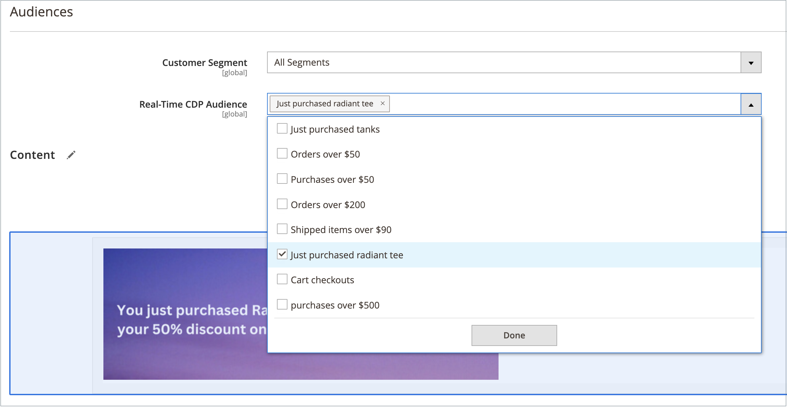

# Bloques dinámicos

{{ee-feature}}

Crear contenido enriquecido e interactivo que se basa en la lógica de [reglas de precios](../merchandising-promotions/introduction.md#price-rules) y [segmentos del cliente](../customers/customer-segments.md). Existente [bloques dinámicos](../page-builder/dynamic-block.md) se puede añadir directamente a [!DNL Page Builder] [stage](../page-builder/workspace.md). Para ver un ejemplo detallado y paso a paso sobre el uso de bloques dinámicos, consulte [Tutorial 2: Bloques](../page-builder/2-blocks.md).

>[!NOTE]
>
>El _[!UICONTROL Banner]_en la opción [[!UICONTROL Content] menú](content-menu.md) quedó obsoleto en 2.3.1 y se eliminó en 2.4.0. Su funcionalidad se ha sustituido por Bloques dinámicos.

![[!DNL Page Builder] - bloque dinámico con regla de precios y segmento de cliente](../page-builder/assets/pb-tutorial2-dynamic-block-storefront.png){width="600" zoomable="yes"}

## Paso 1: Crear un bloque dinámico

1. En el _Administrador_ barra lateral, vaya a **[!UICONTROL Content]** > _[!UICONTROL Elements]_>**[!UICONTROL Dynamic Blocks]**.

   {width="600" zoomable="yes"}

1. En la esquina superior derecha, haga clic en **[!UICONTROL Add Dynamic Block]**.

   {width="600" zoomable="yes"}

1. Si procede, establezca **[!UICONTROL Store View]** a una vista de tienda específica en la que aparecerá el bloque dinámico.

1. Para activar el bloque dinámico, establezca **[!UICONTROL Enable Dynamic Block]** hasta `Yes`.

1. Para referencia interna, escriba un **[!UICONTROL Dynamic Block Name]**.

1. Establecer **[!UICONTROL Dynamic Block Type]** vaya al área de la página donde desea que aparezca el bloque dinámico y haga clic en **[!UICONTROL Done]**.

   {width="500" zoomable="yes"}

1. En el **[!UICONTROL Customer Segment]** , seleccione la casilla de verificación de cada segmento que desee que vea el bloque dinámico y haga clic en **[!UICONTROL Done]** para guardar la configuración.

   {width="500" zoomable="yes"}

   >[!NOTE]
   >
   >- Si no se crea ningún segmento, el bloque dinámico es visible para todos.
   >- Si el cliente no pertenece a ningún segmento y el bloque dinámico se crea para todos los segmentos, se muestra el contenido del bloque dinámico.
   >- Si se eliminan todos los segmentos de clientes asignados a un bloque dinámico, su contenido será visible para todos.

### Uso de audiencias de Real-Time CDP en bloques dinámicos

Si usted [instalado](../customers/audience-activation.md#install-the-extension) y [configurado](../customers/audience-activation.md#configure-the-extension) el [!DNL Audience Activation] extensión, verá una sección llamada **[!UICONTROL Audiences]**.

{width="600" zoomable="yes"}

En el **[!UICONTROL Real-Time CDP Audience]** , seleccione la casilla de cada audiencia en la que desee ver el bloque dinámico y haga clic en **[!UICONTROL Done]** para guardar la configuración.

## Paso 2: Completar el contenido

Utilice el [!DNL Page Builder] [workspace](../page-builder/workspace.md) para completar el contenido.

![[!DNL Page Builder] - espacio de trabajo de bloque dinámico](../page-builder/assets/pb-dynamic-block-workspace.png){width="600" zoomable="yes"}

## Paso 3: Elegir una promoción relacionada

1. Desplazarse hacia abajo y expandir  **[!UICONTROL Related Promotions]**.

1. Haga clic en el tipo de promoción que desee asociar al bloque dinámico:

   - **[!UICONTROL Add Cart Price Rules]** (consulte [Reglas de precio de carrito](../merchandising-promotions/price-rules-cart.md))

   - **[!UICONTROL Add Catalog Price Rules]** (consulte [Reglas de precio de catálogo](../merchandising-promotions/price-rules-catalog.md))

   >[!NOTE]
   >
   >Las reglas de precios de catálogo no son compatibles con las audiencias de Real-Time CDP.

1. En la lista de reglas disponibles, seleccione la casilla de cada regla que desee utilizar y haga clic en **[!UICONTROL Add Selected]**.

1. Una vez completado el bloque dinámico, haga clic en **[!UICONTROL Save]**.

## Paso 4: Añadir el bloque dinámico a una página

1. Abra la página donde desee que aparezca el bloque dinámico.

1. Utilice el [[!UICONTROL Add Dynamic Block]](../page-builder/dynamic-block.md) tipo de contenido para añadir el bloque dinámico al escenario.

## Descripciones de campos y herramientas

| Campo | Descripción |
|--- |--- |
| [!UICONTROL Store View] | Especifica las vistas de almacén en las que el bloque dinámico va a estar disponible. |
| [!UICONTROL Enable Dynamic Block] | Activa o desactiva el bloque dinámico. Opciones: Sí / No |
| [!UICONTROL Dynamic Block Name] | Un nombre descriptivo que identifica el bloque dinámico en el Admin. |
| [!UICONTROL Dynamic Block Type] | Identifica el lugar en la [diseño de página estándar](layout-updates.md) donde se coloca el bloque dinámico. Opciones:  **[!UICONTROL Content Area]**- Coloca el bloque dinámico en el principal [área de contenido](layout-updates.md) de la página. **[!UICONTROL Footer]** : coloca el bloque dinámico en la página [pie de página](page-setup.md#footer).  **[!UICONTROL Header]**: coloca el bloque dinámico en la página [encabezado](page-setup.md#header). **[!UICONTROL Left Column]** : coloca el bloque dinámico en la variable [barra lateral izquierda](page-layout.md#standard-page-layouts) de un diseño de dos o tres columnas.  **[!UICONTROL Right Column]**: coloca el bloque dinámico en la variable [barra lateral derecha](page-layout.md#standard-page-layouts) de un diseño de dos o tres columnas. |
| Segmento de cliente | Asocia un segmento de cliente con el bloque dinámico para determinar qué clientes pueden verlo. |
| Audiencia de Real-Time CDP | Asocia un [Audiencia de Real-Time CDP](../customers/audience-activation.md) con el bloque dinámico para determinar qué clientes pueden verlo. |

{style="table-layout:auto"}

### Contenido

| Campo | Descripción |
|--- |--- |
| [!UICONTROL Layout] | Agregue filas, columnas o pestañas al escenario. |
| [!UICONTROL Elements] | Agregue texto, encabezados, botones, divisores y código de HTML a cualquier contenedor de diseño del escenario. |
| [!UICONTROL Media] | Agregue imágenes, vídeos, titulares, controles deslizantes y mapas de Google a cualquier contenedor de diseño existente en el escenario. |
| [!UICONTROL Add Content] | Añada bloques existentes, bloques dinámicos y productos al escenario. |

{style="table-layout:auto"}

### Promociones relacionadas

| Campo | Descripción |
|--- |--- |
| [!UICONTROL Related Cart Price Rule] | **[!UICONTROL Add Cart Price Rules]** - Asociar un existente [regla de precios de carrito](../merchandising-promotions/price-rules-cart.md) con el bloque dinámico como promoción. |
| [!UICONTROL Related Catalog Price Rule] | **[!UICONTROL Add Catalog Price Rules]** - Asociar un existente [regla de precios de catálogo](../merchandising-promotions/price-rules-catalog.md) con el bloque dinámico como promoción. |

{style="table-layout:auto"}
