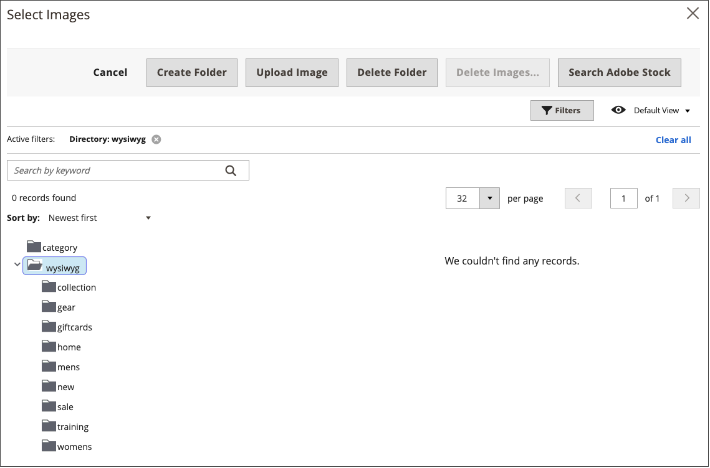

# Insertar una imagen en el editor

Desde el editor, puede insertar una imagen utilizando tres tipos de origen:

- Añada una imagen que se haya cargado al [almacenamiento de medios](media-storage.md)
- Vínculo a una imagen que reside en otro servidor
- Uso de la integración de Adobe Stock para buscar y utilizar recursos de Adobe Stock

{width="650" zoomable="yes"}

1. Abra una página, un bloque o un bloque dinámico en modo de edición.

1. Vaya a la _[!UICONTROL Content]_y haga clic en cualquier elemento que admita el editor.

1. Coloque el cursor donde desee que aparezca la imagen.

1. En la barra de herramientas del editor, haga clic en _Insertar imagen_ icono.

   {width="700" zoomable="yes"}

   Esta acción abre el _[!UICONTROL Insert/edit image]_diálogo.

1. Para **Origen**, haga clic en _Buscar_ y utilice el método que coincida con la ubicación del recurso de imagen que desea utilizar:

   {width="250" zoomable="yes"}

   - **Cargar una nueva imagen**: utilice este método para cargar un nuevo archivo de imagen.

      - Seleccione la carpeta del árbol en la que desea añadir el nuevo archivo de imagen.

      - Haga clic **[!UICONTROL Choose Files]**.

      - Busque y elija el archivo de imagen.

      - Haga clic en la miniatura del nuevo archivo y seleccione **[!UICONTROL Add Selected]**.

   - **Seleccionar un recurso existente**: utilice este método para seleccionar un recurso de imagen existente del almacenamiento/galería de medios.

      - Utilice el árbol para desplazarse a la imagen.

      - Haga clic en la miniatura y en **[!UICONTROL Add Selected]**.

   - **Busque y seleccione una imagen de Adobe Stock**: utilice este método para buscar una imagen de Adobe Stock.

     >[!NOTE]
     >
     >Este método requiere un [Integración de Adobe Stock](adobe-stock.md) configurado para el administrador.

      - Clic **[!UICONTROL Search Adobe Stock]** y busque una imagen.

      - Guarde la vista previa o la imagen con licencia en la galería.

        Consulte [Uso de imágenes de Adobe Stock](adobe-stock-manage.md) para obtener más información sobre cómo trabajar con [Adobe Stock](https://stock.adobe.com) recursos.

      - Seleccione la miniatura del recurso en la galería y haga clic en **[!UICONTROL Add Selected]**.

1. Para **[!UICONTROL Image Description]**, introduzca una breve descripción de la imagen.

1. Introduzca la anchura y la altura **[!UICONTROL Dimensions]**, en píxeles, para representar la imagen en la página.

   Guarde el **[!UICONTROL Constrain proportions]** casilla de verificación seleccionada para mantener automáticamente la proporción de aspecto de la imagen.

1. Clic **[!UICONTROL Insert]** para completar el proceso.
