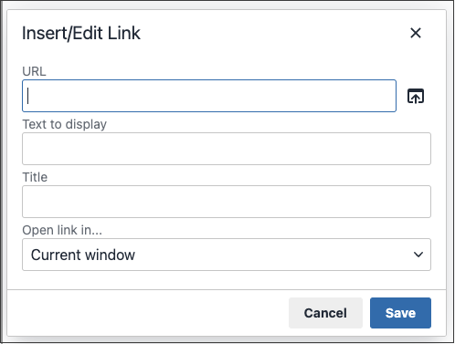

# Inserción de un vínculo en el editor

Una manera fácil de insertar un vínculo es usar el botón _Vínculo_ de la barra de herramientas de [editor](editor.md). No requiere ningún conocimiento de HTML y el resultado es el mismo.

1. Seleccione el texto en el que desea crear el vínculo.

1. Haga clic en el icono _Insertar/editar vínculo_ en la barra de herramientas del editor.

   {width="700" zoomable="yes"}

   Esta acción abre el diálogo _[!UICONTROL Insert link]_.

   {width="250" zoomable="yes"}

1. Para **[!UICONTROL Url]**, escriba una de las siguientes opciones:

   - La clave URL de una página de su tienda.

   - Dirección URL completa de una página externa que se va a vincular.

1. Si es necesario, modifique **[!UICONTROL Text to display]**.

   El valor predeterminado es el texto seleccionado para el vínculo. Puede cambiarlo en el cuadro de texto.

1. Para **[!UICONTROL Title]**, escriba el texto de información de objeto que aparecerá cuando alguien pase el ratón sobre el vínculo.

1. Establezca **[!UICONTROL Target]** en una de las siguientes opciones:

   - `Open link in the same window`

   - `Open in a new window`

1. Para crear el vínculo, haga clic en **[!UICONTROL OK]**.
