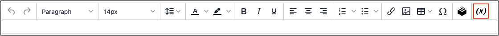

# Inserción de una variable en el editor

Su tienda incluye muchos elementos predefinidos [variables](../systems/variables-predefined.md) que se puede incorporar al contenido de la página y otras comunicaciones. Además, puede incluir los suyos propios [variables personalizadas](../systems/variables-custom.md) que son específicos para sus necesidades.

1. Abra una página, un bloque o un bloque dinámico en modo de edición.

1. Vaya a la _[!UICONTROL Content]_y haga clic en cualquier elemento que admita el editor.

1. Coloque el cursor donde desee que aparezca la variable y haga clic en _Insertar variable_ icono.

   {width="700" zoomable="yes"}

   Si no tiene [!UICONTROL Page Builder] activada y prefiere trabajar con el código de HTML, haga clic en **[!UICONTROL Show / Hide Editor]**. Coloque el punto de inserción en el texto donde desee que aparezca la variable. A continuación, haga clic en **[!UICONTROL Insert Variable]**.

1. En la lista de variables disponibles, elija la que desee y haga clic en **[!UICONTROL Insert Variable]**.

   {width="600" zoomable="yes"}

1. Cuando haya completado las ediciones de contenido, haga clic en **[!UICONTROL Save]**.
