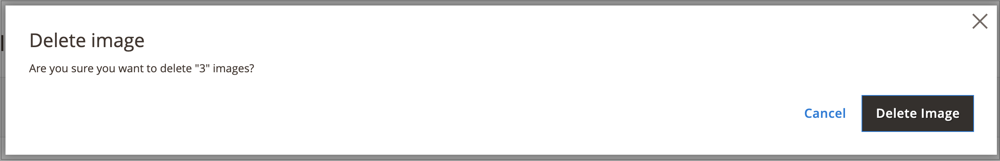
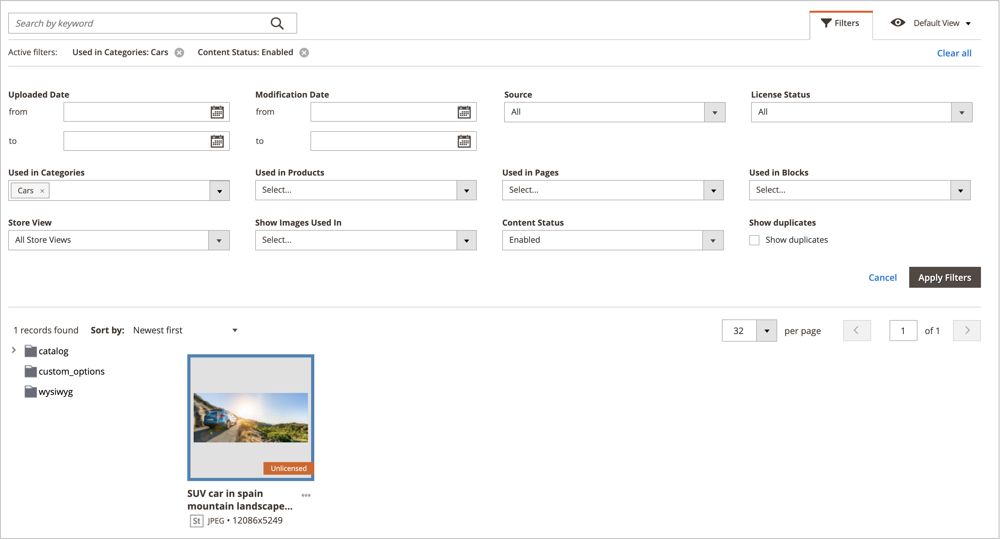

# Administración de recursos de Media Gallery

La nueva [Galería multimedia](media-gallery.md) proporciona herramientas para administrar los archivos multimedia cargados y los recursos que adquiera mediante una [integración de Adobe Stock](adobe-stock.md). Si ha guardado una [vista previa de imagen](adobe-stock-save-preview.md) de Adobe Stock, también puede [autorizar](adobe-stock-license-image.md) la imagen en la nueva Galería multimedia.

## Cargar un recurso

1. En la barra lateral _Admin_, vaya a **[!UICONTROL Content]** > _[!UICONTROL Media]_>**[!UICONTROL Media Gallery]**.

1. Haga clic en **[!UICONTROL Upload Image]**.

1. Seleccione el archivo que desea cargar.

   El recurso seleccionado se carga automáticamente en la carpeta seleccionada (o en la raíz de almacenamiento si no hay ninguna carpeta seleccionada).

## Ver detalles del recurso

1. En la barra lateral _Admin_, vaya a **[!UICONTROL Content]** > _[!UICONTROL Media]_>**[!UICONTROL Media Gallery]**.

1. Haga clic en los tres puntos situados debajo del recurso ({width="10" zoomable="no"}) y, a continuación, haga clic en **[!UICONTROL View Details]**.

   {width="600" zoomable="yes"}

   Los detalles del recurso se muestran en un panel de diapositivas. Incluyen la información sobre dónde se está utilizando el recurso:

   - **[!UICONTROL Categories]**
   - **[!UICONTROL Products]**
   - **[!UICONTROL Pages]**
   - **[!UICONTROL Blocks]**

   {width="600" zoomable="yes"}

   Para ver los detalles, haga clic en los vínculos **[!UICONTROL Used In]** La cuadrícula del siguiente ejemplo muestra todas las categorías en las que se utiliza un recurso específico.

   {width="600" zoomable="yes"}

   También es posible eliminar el recurso de la sección _Ver detalles_.

## Editar un recurso

1. En la barra lateral _Admin_, vaya a **[!UICONTROL Content]** > _[!UICONTROL Media]_>**[!UICONTROL Media Gallery]**.

1. Haga clic en los tres puntos situados debajo del recurso ({width="10" zoomable="no"}) y, a continuación, haga clic en **[!UICONTROL Edit]**.

   {width="600" zoomable="yes"}

1. Si es necesario, cambie uno de los siguientes valores de metadatos:

   - **[!UICONTROL Title]**
   - **[!UICONTROL Description]**
   - **[!UICONTROL Tags/Keywords]**

   Estos datos se guardan en la base de datos y en los propios metadatos del archivo. Actualmente, se admiten los formatos XMP y IPTC.

   Puede descargar la imagen con los metadatos actualizados.

## Usar un recurso

Assets se puede usar ampliamente en todo el administrador, como [agregar o editar una página](page-add.md), [crear o editar una categoría](../catalog/category-create.md) o [insertar imágenes desde el editor de contenido](editor-insert-image.md).

1. Acceda a la nueva Galería de medios desde un área que le permita utilizar recursos multimedia.

1. Seleccione el recurso y haga clic en **[!UICONTROL Add Selected]**.

{{$include /help/_includes/image-optimization-animated-gif-note.md}}

## Eliminar recursos

1. En la barra lateral _Admin_, vaya a **[!UICONTROL Content]** > _[!UICONTROL Media]_>**[!UICONTROL Media Gallery]**.

1. Haga clic en **[!UICONTROL Delete Images...]** y seleccione la casilla de verificación de cada recurso que desee eliminar.

1. En el diálogo de confirmación, haga clic en **[!UICONTROL Delete Image]**.

   {width="500" zoomable="yes"}

## Búsqueda de recursos

1. En la barra lateral _Admin_, vaya a **[!UICONTROL Content]** > _[!UICONTROL Media]_>**[!UICONTROL Media Gallery]**.

1. Use la entrada **[!UICONTROL Search by keywords]** para buscar imágenes por palabras clave o etiquetas.

   La búsqueda del ejemplo siguiente encuentra recursos que contienen una etiqueta específica (`mountain`).

   {width="600" zoomable="yes"}

>[!NOTE]
>
>Para obtener información sobre cómo actualizar las etiquetas de imagen, consulte la sección _[Editar un recurso](#edit-an-asset)_.

## Filtrar recursos

>[!NOTE]
>
>La funcionalidad _Utilizada en_ requiere que [!UICONTROL Media Gallery Image Optimization] esté habilitado en la [configuración](media-gallery-image-optimization.md).

1. En la barra lateral _Admin_, vaya a **[!UICONTROL Content]** > _[!UICONTROL Media]_>**[!UICONTROL Media Gallery]**.

1. Haga clic en la ficha **[!UICONTROL Filters]**.

   {width="600" zoomable="yes"}

1. Defina las opciones de filtrado.

   Puede filtrar los recursos según el uso de las entidades:

   - **[!UICONTROL Used in Categories]**
   - **[!UICONTROL Used in Products]**
   - **[!UICONTROL Used in Pages]**
   - **[!UICONTROL Used in Blocks]**

   También puede filtrar los recursos por **[!UICONTROL Store View]**, **[!UICONTROL License Status]** y **[!UICONTROL Content Status]**. Establezca un intervalo de fechas para **[!UICONTROL Uploaded Date]** o **[!UICONTROL Modification Date]** a fin de filtrar los recursos según las fechas del archivo.

1. Haga clic **[!UICONTROL Apply Filters]** para ver los resultados.

   El filtrado del ejemplo siguiente encuentra recursos que se utilizan en una categoría específica (`cars`) y que están habilitados.

   {width="600" zoomable="yes"}

## Buscar duplicados de imagen

1. Haga clic en la ficha **[!UICONTROL Filters]** y seleccione la casilla de verificación **[!UICONTROL Show duplicates]**.

1. Para ver los resultados, haga clic en **[!UICONTROL Apply Filters]**.

<!-- Last updated from includes: 2024-01-30 15:43:39 -->
