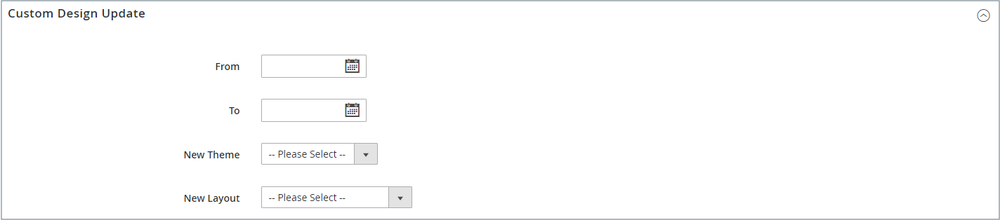
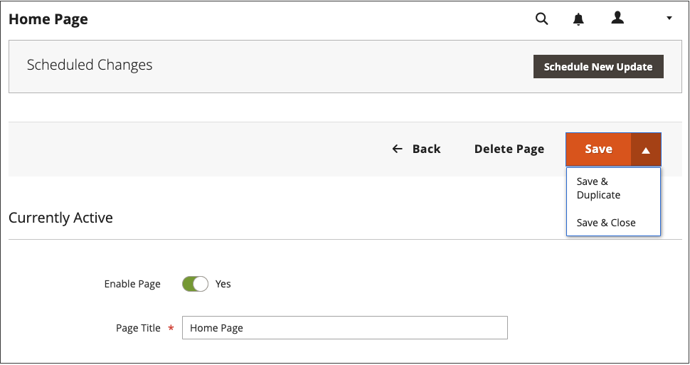

# Adición y eliminación de páginas

El proceso de añadir una página de contenido a la tienda es esencialmente el mismo para cualquier tipo de página que desee crear. Puede incluir texto, imágenes, bloques de contenido, variables y widgets. La mayoría de las páginas de contenido están diseñadas para su lectura por los motores de búsqueda primero y por las personas en segundo lugar. Tenga en cuenta las necesidades de cada una de estas dos audiencias diferentes al elegir el título de página, la dirección URL y al maquetar los metadatos, y el contenido. Una vez completada la página, se puede agregar a la navegación de la tienda, vincular a otras páginas, vincular desde el pie de página de la tienda o utilizar como nuevo [página principal](page-home-new.md).

{width="700" zoomable="yes"}

## Agregar una página

Las siguientes instrucciones le guían a través de cada paso para crear una página básica. Algunas funciones avanzadas se omiten, pero se tratan en otros temas.

### Paso 1: Crear la página

1. En el _Administrador_ barra lateral, vaya a **[!UICONTROL Content]** > _[!UICONTROL Elements]_>**[!UICONTROL Pages]**.

1. Haga clic **[!UICONTROL Add New Page]**.

   {width="600" zoomable="yes"}

1. Si no desea publicar la página inmediatamente, establezca **[!UICONTROL Enable Page]** hasta `No`.

1. Introduzca el **[!UICONTROL Page Title]**.

   El título de la página aparece en la [ruta](../catalog/navigation-breadcrumb-trail.md) navegación.

### Paso 2: Completar el contenido

En función de su [Configuración avanzada de herramientas de contenido](../configuration-reference/general/content-management.md), agregue el contenido de la página.

#### Uso de las herramientas de contenido de Page Builder

1. Expandir  **[!UICONTROL Content]**.

   {width="600" zoomable="yes"}

1. En el **[!UICONTROL Content Heading]** , escriba el título que desea que aparezca en la parte superior de la página.

   Si está activada, la variable [Page Builder](../page-builder/introduction.md) El escenario y el panel aparecen debajo del encabezado de contenido. Para obtener más información, consulte [Workspace](../page-builder/workspace.md). If _Page Builder_ no está activada, el editor se abre en modo WYSIWYG con la barra de herramientas en la parte superior.

1. Complete el contenido y dé formato al texto según sea necesario.

#### Uso de la barra de herramientas del editor

1. Expandir  **[!UICONTROL Content]**.

   {width="600" zoomable="yes"}

1. En el **[!UICONTROL Content Heading]** , escriba el título que desea que aparezca en la parte superior de la página.

1. Complete el contenido y dé formato al texto según sea necesario.

   Puede añadir [imágenes](media-storage.md), [variables](../systems/variables-predefined.md), y [widgets](widgets.md) según sea necesario. Para obtener más información, consulte [Uso del editor](editor.md).

### Paso 3: Completar la información de SEO

1. Expandir  **[!UICONTROL Search Engine Optimization]**.

   {width="600" zoomable="yes"}

1. Acepte el valor predeterminado o introduzca otro **[!UICONTROL URL Key]** que consta de todos los caracteres en minúsculas, con guiones en lugar de espacios.

   La clave URL predeterminada se creó al guardar la página y se basa en el encabezado de contenido.

1. Introduzca una **[!UICONTROL Meta Title]** para la página.

   El metatítulo debe contener menos de 70 caracteres y aparece en la barra de título y en la pestaña del explorador.

1. Introduzca su elección de alto valor **[!UICONTROL Meta Keywords]** que los motores de búsqueda pueden utilizar para indexar la página.

   Separe las palabras con comas. Algunos motores de búsqueda omiten las metapalabras clave, pero otros las utilizan.

1. Para **[!UICONTROL Meta Description]**, introduzca una breve descripción de la página para los listados de resultados de búsqueda.

   Lo ideal es que la descripción tenga entre 150 y 160 caracteres de longitud, con un límite máximo de 255.

1. Haga clic **[!UICONTROL Save]**.

### Paso 4: Especificar el ámbito de la página

1. Expandir  **[!UICONTROL Page in Websites]**.

   {width="600" zoomable="yes"}

1. En el **[!UICONTROL Store View]** , seleccione cada vista donde la página vaya a estar disponible.

   Si la instalación tiene varios sitios web, seleccione cada sitio web y la vista de tienda donde la página vaya a estar disponible.

### Paso 5: Identificar la página principal (si corresponde)

{{ee-feature}}

1. Expandir  **[!UICONTROL Hierarchy]**.

   {width="600" zoomable="yes"}

1. Si esta página es un elemento secundario de otra página, active la casilla de verificación del **[!UICONTROL Parent page]**.

### Paso 6: introducir cambios de diseño (opcional)

1. Para cambiar el diseño de la página, expanda  **[!UICONTROL Design]**.

   {width="600" zoomable="yes"}

1. Para cambiar el diseño de columna de la página, establezca **[!UICONTROL Layout]** a uno de los siguientes:

   - `Empty`
   - `1 column`
   - `2 columns with left bar`
   - `2 columns with right bar`
   - `3 columns`
   - `Page -- Full Width` (Requiere [Page Builder](../page-builder/introduction.md))
   - `Category -- Full Width` (Requiere Page Builder)
   - `Product -- Full Width` (Requiere Page Builder)

1. Para aplicar una **[!UICONTROL Custom Layout Update]**, elija el nombre del archivo en la lista.

   Para obtener más información, consulte [Actualizaciones de diseño](layout-updates.md).

1. Para cambiar la temática de la página, establezca **[!UICONTROL New Theme]** a uno de los siguientes:

   - `Magento Black`
   - `Magento Luma`

1.  (Solo Magento Open Source) Para programar un cambio de diseño, expanda  **[!UICONTROL Custom Design Update]** y haga lo siguiente:

   {width="600" zoomable="yes"}

   - Utilizar el calendario () para elegir el **[!UICONTROL From]** y **[!UICONTROL To]** fechas para que el cambio surta efecto.

   - Para aplicar una temática diferente a la página, seleccione el nombre de la **[!UICONTROL New Theme]**.

   - Para cambiar el diseño de columna de la página, elija la **[!UICONTROL Layout]** que desee aplicar.

### Paso 7: Previsualizar la página

1. Haga clic en **[!UICONTROL Save]** flecha y elija **[!UICONTROL Save & Close]** para volver a la cuadrícula Páginas.

1. Busque la página en la cuadrícula y seleccione **[!UICONTROL View]** en el _[!UICONTROL Action]_columna.

1. Para volver a la cuadrícula, haga clic en **[!UICONTROL Back]** en la esquina superior izquierda de la ventana del explorador.

### Paso 8: Publicar la página

1. Seleccionar **[!UICONTROL Edit]** en el _[!UICONTROL Action]_de la cuadrícula.

1. Establecer **[!UICONTROL Enable Page]** hasta `Yes`.

1. Haga clic en **[!UICONTROL Save]** flecha y elija **[!UICONTROL Save & Close]**.

## Duplicación de una página

Cualquier página de contenido puede utilizarse como plantilla y guardarse como duplicado. Puede utilizar esta técnica que ahorra tiempo para crear un diseño coherente para las páginas de contenido de todo el sitio. La página duplicada conserva el Título de página del original, pero se deben actualizar los campos Clave de URL y Estado.

{width="600" zoomable="yes"}

1. En el _Administrador_ barra lateral, vaya a **[!UICONTROL Content]** > _[!UICONTROL Elements]_>**[!UICONTROL Pages]**.

1. En la cuadrícula, busque la página que desee duplicar y haga clic en **[!UICONTROL Edit]** en el _[!UICONTROL Action]_columna.

1. Haga clic en **[!UICONTROL Save]** flecha y elija **[!UICONTROL Save & Duplicate]**.

1. Cuando vea los mensajes de que la página se ha guardado y duplicado, haga clic en **[!UICONTROL Back]** en la barra de botones superior para volver a la cuadrícula.

1. Busque la página duplicada en la cuadrícula y tome nota de lo siguiente:

   - El Título de página es el mismo que el original.
   - Se asigna una clave URL única, pero temporal.
   - El estado de la página es `Disabled`.

1. Abra la página duplicada en _Editar_ y haga lo siguiente:

   - Si desea publicar la página inmediatamente, establezca **[!UICONTROL Enable Page]** hasta `Yes`.

   - Actualice el **[!UICONTROL Page Title]**, según sea necesario.

   - Expandir  el **[!UICONTROL Search Engine Optimization]** e introduzca la sección única **[!UICONTROL URL Key]** que desee utilizar para la página duplicada.

     {width="600" zoomable="yes"}

   - Actualice el contenido restante de la página, según sea necesario.

1. Haga clic en **[!UICONTROL Save]** flecha y elija **[!UICONTROL Save & Close]**.

   La página duplicada de la cuadrícula refleja los cambios.

## Menú Guardar

| Comando | Descripción |
|--- |--- |
| [!UICONTROL Save] | Guarde la página actual y continúe trabajando. |
| [!UICONTROL Save & New] | Guarde y cierre la página actual y empiece una nueva página. |
| [!UICONTROL Save & Duplicate] | Guarde y cierre la página actual y abra una nueva copia duplicada. |
| [!UICONTROL Save & Close] | Guarde y cierre la página actual y vuelva a la cuadrícula Páginas. |

{style="table-layout:auto"}

## Eliminación de una página

Existen dos formas de eliminar una página creada. Puede eliminarlo de la _[!UICONTROL Pages]_o desde el_[!UICONTROL Edit]_ página.

### Método 1: Quitar una página de la cuadrícula Páginas

1. En el _Administrador_ barra lateral, vaya a **[!UICONTROL Content]** > _[!UICONTROL Elements]_>**[!UICONTROL Pages]**.

1. Busque las páginas que utilizan filtros encima de la cuadrícula y marque la casilla de verificación de una o varias páginas que desee eliminar.

1. En la esquina superior izquierda de la lista, establezca **[!UICONTROL Actions]** hasta `Delete`.

1. Para confirmar la acción, haga clic en **[!UICONTROL OK]**.

### Método 2: Eliminar una página de la página de edición

1. En el _Administrador_ barra lateral, vaya a **[!UICONTROL Content]** > _[!UICONTROL Elements]_>**[!UICONTROL Pages]**.

1. Busque la página que desea eliminar.

1. En el _[!UICONTROL Actions]_para la entidad de página, haga clic en **[!UICONTROL Select]**y elija **[!UICONTROL Edit]**.

1. En la barra de botones, haga clic en **[!UICONTROL Delete Page]**.

1. Para confirmar la acción, haga clic en **[!UICONTROL OK]**.
