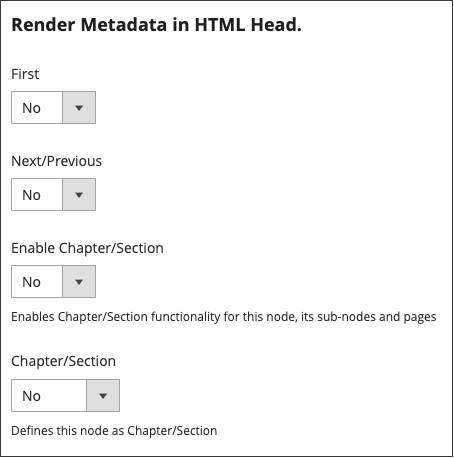

# Jerarquía de páginas

{{ee-feature}}

El sistema de jerarquía de páginas de almacenamiento le permite organizar las páginas de contenido y agregar paginación, navegación y menús. La página Política de privacidad de los datos de ejemplo es un ejemplo de una página con un menú a la izquierda. Si publica una gran cantidad de contenido regularmente, puede utilizar una jerarquía de páginas para organizar el contenido y facilitar la búsqueda de artículos de interés.

El sistema de jerarquía de páginas utiliza nodos para identificar fragmentos de contenido relacionados y organizar las páginas de contenido en relaciones principales/secundarias. Un nodo principal es como una carpeta que puede contener nodos y páginas secundarios. La posición relativa de cada nodo y página en la jerarquía se muestra como una _árbol_ estructura. Un nodo puede contener otros nodos y páginas de contenido, y una sola página de contenido puede asociarse con varios nodos y otras páginas de contenido en una relación principal/secundario o de vecino.

{width="600" zoomable="yes"}

## Configurar jerarquía de páginas

Los ajustes de configuración activan el sistema de jerarquía de páginas y los metadatos, y determinan el diseño de menú predeterminado.

{width="600" zoomable="yes"}

1. En el _Administrador_ barra lateral, vaya a **[!UICONTROL Stores]** > _[!UICONTROL Settings]_>**[!UICONTROL Configuration]**.

1. En el panel izquierdo, debajo de _[!UICONTROL General]_, elija **[!UICONTROL Content Management]**.

1. Expandir  **[!UICONTROL CMS Page Hierarchy]**  y realice los cambios que sean necesarios.

1. Cuando termine, haga clic en **[!UICONTROL Save Config]**.

| Campo | Descripción |
|--- |--- |
| [!UICONTROL Enable Hierarchy Functionality] | Activa el uso de la jerarquía de páginas para las páginas de contenido. Opciones: `Yes` / `No` |
| [!UICONTROL Enable Hierarchy Metadata] | Cuando esta opción está habilitada, puede asociar metadatos con páginas de la jerarquía. Opciones: `Yes` / `No` |
| [!UICONTROL Default Layout for Hierarchy Menu] | Determina el estilo de menú predeterminado. Opciones: `Content` / `Left Column` / `Right Column` |

{style="table-layout:auto"}

## Adición de un nodo de jerarquía

En el siguiente ejemplo se muestra cómo crear un nodo con navegación sencilla a páginas de contenido relacionadas. Aunque un nodo no tiene una página de contenido asociada, tiene una clave URL a la que se puede hacer referencia en cualquier otra parte del sitio.

Por ejemplo, puede crear un nodo llamado _Comunicados de prensa_ que tiene navegación a comunicados de prensa individuales. A continuación, puede incluir el vínculo en su _Acerca de nosotros_ al nodo. O puede crear un nodo para una colección de números anteriores de la newsletter.

Para vincular a un nodo, utilice el [Widget](widgets.md) herramienta para crear un vínculo de nodo de jerarquía de CMS y colocar el widget en un bloque de contenido o página.

{width="600" zoomable="yes"}

### Paso 1: Crear un nodo

1. En el _Administrador_ barra lateral, vaya a **[!UICONTROL Content]** > _[!UICONTROL Elements]_>**[!UICONTROL Hierarchy]**.

   {width="600" zoomable="yes"}

1. Sobre la cuadrícula, haga clic en **[!UICONTROL Add Node...]**.

1. En _[!UICONTROL Page Properties]_, introduzca un **[!UICONTROL Title]**para el nodo y un adecuado **[!UICONTROL URL Key]**.

   La clave URL proporciona una dirección web única para el nodo. Debe tener todos los caracteres en minúsculas, con guiones para separar las palabras, en lugar de los espacios.

   {width="500" zoomable="yes"}

1. Haga clic **[!UICONTROL Save]**.

   El nodo aparece como una carpeta en el árbol a la izquierda de la página.

### Paso 2: Agregar páginas al nodo

1. En el árbol de jerarquía, haga clic en para seleccionar el nodo.

1. Haga clic **[!UICONTROL Add Selected Pages(s) to Tree]**.

   Puede desplazarse hacia arriba para ver que cada página seleccionada aparece en el árbol debajo de la carpeta del nodo.

### Paso 3: Definición de la estructura

1. Si es necesario, arrastre las páginas a su posición para reflejar el orden en que aparecerán en el menú.

   {width="500" zoomable="yes"}

1. Haga clic en el nodo en la parte superior de la jerarquía.

   El _[!UICONTROL Page Properties]_ahora muestra información sobre el nodo.

1. En **[!UICONTROL Render Metadata in HTML Head]**, haga lo siguiente:

   {width="400" zoomable="yes"}

   - Para identificar el nodo como la parte superior de la jerarquía, establezca **[!UICONTROL First]** hasta `Yes`.

   - Para mostrar un control de paginación, establezca **[!UICONTROL Next/Previous]** hasta `Yes`.

   - Para organizar las páginas en la jerarquía como un libro, establezca **[!UICONTROL Enable Chapter/Section]** hasta `Yes`.

     Si no desea incluir el nodo como parte del libro, deje el valor predeterminado `No`.

   - Para asignar el nodo a una parte específica del libro, establezca **[!UICONTROL Chapter/Section]** a uno de los siguientes:

      - `No` - No define el nodo como capítulo/sección.
      - `Chapter` : asigna el nodo actual como un capítulo.
      - `Section` : asigna el nodo actual como una sección.
      - `Both` : asigna el nodo actual como capítulo y sección.

### Paso 4: Añadir controles de paginación

1. En _Opciones de paginación para páginas anidadas_, configurado **[!UICONTROL Enable Pagination]** hasta `Yes`.

1. Para **[!UICONTROL Frame]**, introduzca el número de vínculos de página que desea incluir en el control de paginación.

   Si hay más páginas en la jerarquía que se pueden incluir en el control de paginación.

1. Para **[!UICONTROL Frame Skip]**, introduzca el número de páginas que desea saltar (o volver) para el siguiente conjunto de vínculos de paginación.

### Paso 5: Selección del diseño del menú

Si desea que el nodo aparezca en el menú, haga lo siguiente:

1. En _Opciones del menú de navegación de página_, configurado **[!UICONTROL Show in navigation menu]** hasta `Yes`.

   Esta configuración determina si se genera un menú de navegación para la jerarquía de páginas.

   {width="300" zoomable="yes"}

1. Para especificar la ubicación del menú en relación con el contenido, establezca el **[!UICONTROL Menu Layout]**:

   - `Content` - El diseño del menú está en el contenido.
   - `Use Default` : utiliza el estilo de menú especificado en la variable [configuración](../configuration-reference/general/content-management.md).
   - `Left Column` : el menú aparece a la izquierda del contenido.
   - `Right Column` : el menú aparece a la derecha del contenido.

1. Para especificar cuántos detalles se incluyen en el menú, establezca **[!UICONTROL Menu Detalization]** a uno de los siguientes:

   - `Only Children` : solo incluye subpáginas en el menú.
   - `Neighbours and Children` : Incluye subpáginas y otras páginas que se encuentran en el mismo nivel de la jerarquía.

1. Para determinar la profundidad del menú, introduzca la variable **[!UICONTROL Maximal Depth]** para el número máximo de niveles que se van a incluir.

1. Para dar formato al menú, elija una **[!UICONTROL List Type]**:

   - `Unordered` : Las opciones de menú no están numeradas y se pueden formatear con o sin viñetas. Opciones para el tipo de lista sin ordenar: Predeterminado/Círculo/Disco/Cuadrado
   - `Ordered` : las opciones de menú están numeradas y se pueden formatear como números numéricos, alfabéticos o romanos en mayúsculas o minúsculas.

1. Establecer **[!UICONTROL List Style]** a uno de los siguientes:

   - `Circle`
   - `Disc`
   - `Square`

1. Si también desea que el nodo esté visible en el menú de navegación, desplácese hasta _Opciones del menú de navegación principal_ y establecer **[!UICONTROL Show in Navigation menu]** hasta `Yes`.

   {width="250" zoomable="yes"}

1. Haga clic **[!UICONTROL Save]**.
