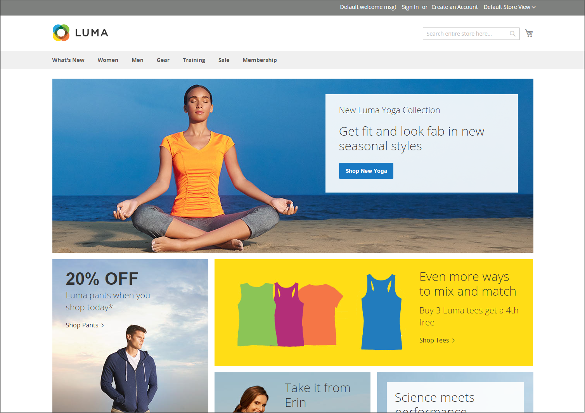

# Ejemplos de diseño de tienda

Las dimensiones de columna están determinadas por la hoja de estilo de la temática. Algunas temáticas aplican un ancho de píxel fijo al diseño de página, mientras que otras utilizan porcentajes para hacer que la página responda al ancho de la ventana o del dispositivo.

La mayoría de las temáticas de escritorio tienen un ancho fijo para la columna principal y toda la actividad se produce dentro de esta área adjunta. Según la resolución de pantalla, hay espacio vacío a cada lado de la columna principal.

## Una columna

El área de contenido de un diseño de una columna abarca el ancho completo de la columna principal. Este diseño se utiliza a menudo para una página de inicio con un titular o un control deslizante grande, o para páginas que no requieren navegación, como una página de inicio de sesión, una página de inicio de sesión, un vídeo o un anuncio de página completa.

{width="700" zoomable="yes"}

## Dos columnas con barra izquierda

El área de contenido de este diseño se divide en dos columnas. La columna de contenido principal flota a la derecha y la barra lateral a la izquierda.

{width="700" zoomable="yes"}

## Dos columnas con barra derecha

Este diseño es una imagen espejo del otro diseño de dos columnas. Esta vez, la barra lateral flotará a la derecha y la columna de contenido principal flotará a la izquierda.

{width="700" zoomable="yes"}

## Tres columnas

Un diseño de tres columnas tiene un área de contenido principal con dos columnas laterales. La barra lateral izquierda y la columna de contenido principal están juntas y flotan como una unidad a la izquierda. La otra barra lateral flota a la derecha.

{width="700" zoomable="yes"}
